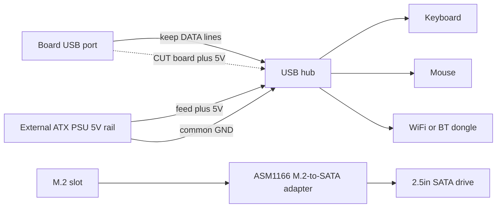

> 🌐 Переклад спільноти. Англійська версія є джерелом істини й може бути новішою. Знайшли помилку? Відкрийте issue: [English](../en/16-usb-peripherals.md) · [issues](https://github.com/lildebil0/awesome-bc250/issues)

# USB, хаби та периферія

> **Коротко** — Плата дає вам **4 задніх USB-порти (2× USB 2.0 + 2× USB 3.0)** і все — жодних внутрішніх роз'ємів за замовчуванням не розведено. WiFi/BT-донгл, SSD через USB, клавіатура, миша й контролер швидко їх з'їдають, тож майже всі додають **USB-хаб**. Підступ: **5 В USB-шина плати слабка** й просідає під навантаженням, тож дешеві хаби з живленням від шини (і навіть напряму підключені флешки) відвалюються. Надійні рішення, за порядком: **хаб із зовнішнім живленням (активний)** або **мод інжекції 5 В** від спільноти — перерізати 5 В, які хаб бере з плати, і подати на нього 5 В з вашого ATX БЖ натомість. ([src](https://t.me/c/2424231195/119741))

Це сторінка про **аксесуари**. Налаштуйте хаб правильно, і решта (аудіо, Ethernet поверх USB, доки) просто працює.

---

## Скільки USB-портів ви насправді отримуєте

За апаратним довідником задній I/O — це **1× DisplayPort, 1× GbE Ethernet, 2× USB 2.0, 2× USB 3.0**. Тобто чотири фізичні USB-порти. ([hardware.md](https://github.com/mothenjoyer69/bc250-documentation/blob/main/README.md))

На практиці саме два **USB 3.0** порти — ті, за які люди б'ються (швидші, використовуються для SSD/доків), і вони розведені **вузько** електрично — один власник описує роз'єм як фактично "x2" і застерігає від навішування сплітера на нього. ⚠ перевіряйте точну ширину лінії. ([src](https://t.me/c/2424231195/75561))

Тіснява реальна, щойно перелічити, що хоче порт: **встромили SSD — один порт пропав; додайте USB WiFi-донгл, джойстик, зовнішній диск — вам потрібен хаб, інакше ризикуєте спалити порт.** ([src](https://t.me/c/2424231195/75558)) Люди регулярно повідомляють "усі USB 3.0 зайняті, клавіатура й миша йдуть через хаб". ([src](https://t.me/c/2424231195/110875))

З коробки **немає розведених роз'ємів USB на передній панелі** — але в корпусі/платі є місце, явно призначене для прокладання кабелю хаба на перед, яке використовують кілька корпусних збірок. ([src](https://t.me/c/2424231195/91322)) · ([src](https://t.me/c/2424231195/100249))

---

## Справжня проблема: 5 В USB-шина слабка

BC-250 генерує **5 В для USB на самій платі** ([src](https://t.me/c/2424231195/57920)), і ця шина не може дати багато. Найчіткіший вимір із чату, на платі, яка не могла розпізнати пристрої:

> "Мій BC-250 [не] видає належних 5 В на USB… працює лише клавіатура; якщо встромити мишу, клавіатура вимикається. ~**4.3 В** лише з клавіатурою, **2.3 В–3.2 В** з клавіатурою + мишею, **5.1 В**, коли обидва вийняті." ([src](https://t.me/c/2424231195/119071))

Саме це просідання напруги пояснює, чому симптоми групуються навколо **навантаження**: флешки й мікрофони, які **відвалюються при прямому підключенні, але працюють нормально через хаб**, клавіатури, що втрачають свої світлодіоди, пристрої, що відвалюються в мить, коли два споживачі тягнуть одночасно. ([src](https://t.me/c/2424231195/53939)) Це та сама чутливість до живлення, яка робить WiFi-донгли вередливими — див. **[10-wifi-bt.md](10-wifi-bt.md)**, де стіки працюють у простої, а потім відвалюються на сплеску завантаження.

> ⚠ Не кожна плата така погана. Один власник живить **WiFi-донгл + дротову клавіатуру + мишу через хаб без живлення + 14″ дисплей + 3.5″ допоміжний екран** від USB плати й повідомляє, що все нормально. ([src](https://t.me/c/2424231195/119231)) Сприймайте власну плату як невідому, поки не навантажите її.

---

## Вибір хаба: з живленням чи без

| Hub type | When it works | Verdict |
|----------|---------------|---------|
| **Без живлення (від шини)** | Легкі навантаження — клавіатура, миша, донгл. Деякі плати тягнуть напрочуд багато так. ([src](https://t.me/c/2424231195/119231)) | Можна спробувати спершу; **чекайте відвалів** у мить, коли додасте диск або стрибне навантаження. |
| **З живленням / активний (зовнішній БЖ на 5 В)** | Будь-що з дисками, кількома донглами або під навантаженням. Постійна рекомендація спільноти для BC-250. ([src](https://t.me/c/2424231195/75558)) · ([src](https://t.me/c/2424231195/119229)) | **Беріть це.** Вирішує просідання без втручання в плату. ([src](https://t.me/c/2424231195/140091)) |
| **Мод інжекції 5 В** (див. нижче) | Коли хочете чисту корпусну збірку, що живиться повністю від ATX БЖ, і не хочете другого блока в розетку. | Найкраща інтеграція, потребує паяння. ([src](https://t.me/c/2424231195/119741)) |

Повторювана порада, коли USB-пристрої когось підводять, проста: **візьміть активний USB-хаб із входом для блока живлення.** ([src](https://t.me/c/2424231195/119229)) Кілька власників дійшли до цього після боротьби з відвалами — "це вирішилося хабом із зовнішнім живленням." ([src](https://t.me/c/2424231195/123789))

> Одне застереження, підняте в чаті: покладання на хаб із зовнішнім живленням може бути **назавжди** — щойно ви вивантажуєте живлення USB назовні, не дивуйтеся, якщо застрягнете з цим хабом надовго. ([src](https://t.me/c/2424231195/123924)) Це нормальний компроміс для десктопної збірки.

---

## Мод інжекції 5 В (змусити звичайний хаб поводитися)

Це елегантне рішення для **корпусної збірки, що вже живиться від ATX/SFX БЖ**: замість купівлі активного хаба з власним блоком у розетку ви берете звичайний хаб і **міняєте, звідки йдуть його 5 В**.

Що зробив один користувач, і це спрацювало ([src](https://t.me/c/2424231195/119741)):

> "Я модифікував звичайний USB-хаб, і це спрацювало. Я **перерізав 5 В, що йшли з материнки, і подав 5 В з БЖ**. Мені не треба було підключати землю, бо я живлю свій BC-250 від того самого ATX БЖ."

Як це працює:

1. Відкрийте хаб; знайдіть доріжку/провід **5 В (VBUS)** на **висхідній** стороні (кабель, що встромляється в плату).
2. **Переріжте ці 5 В**, щоб хаб більше не тягнув живлення зі слабкої шини плати.
3. Подайте на хаб **+5 В з вашого ATX БЖ** (вільна лінія 5 В SATA/Molex).
4. **Земля спільна** автоматично, бо той самий БЖ уже живить плату — додатковий провід землі не потрібен. (Якщо ви колись живитимете хаб від *окремого* джерела, ви **мусите** об'єднати землі.)

Лінії даних залишаються недоторканими — ви лише міняєте джерело живлення. Плата бачить хаб, який більше не навантажує її шину 5 В, а пристрої отримують чисте, рясне живлення від БЖ.



> ⚠ Переріз не тієї доріжки вбиває хаб (дешевий) — але переконайтеся, що ви ріжете **VBUS, а не лінію даних**. Перевірте мультиметром перед паянням.

---

## Мотлох, якого варто уникати

- **Хаби Hoco** — названі ненадійними; один власник **був змушений двічі перепаювати той самий хаб Hoco**. ([src](https://t.me/c/2424231195/74531))
- **"USB 3.0" хаби, які ним не є** — "USB 3.0 хаб/док" за 160 ₽ з AliExpress позначили як **точно не справжній 3.0** за цією ціною. ([src](https://t.me/c/2424231195/8761)) · ([src](https://t.me/c/2424231195/8764))
- **Каскадування хабів** для збільшення кількості портів — піднімалося як ідея ([src](https://t.me/c/2424231195/104653)), але це накладає проблему живлення; одна слабка шина тепер живить два хаби. Використовуйте натомість один добрий хаб із живленням.
- **SATA-сплітери як "хаби"** від M.2-слота — повторювана плутанина. Маючи лише **2 лінії PCIe** на M.2, ви не можете розумно навісити SATA-контролер і чекати, що він розгалузиться; "ті one-SATA-in, many-out хаби — мотлох." ([src](https://t.me/c/2424231195/22539)) Це не USB-тема — просто не плутайте її з розширенням USB.
- ★ **M.2→SATA контролер PH516 (6 портів) — підтверджено НЕ працює.** Порт розпізнається, але диск не приєднується, і **друга людина відтворила** ту саму поломку ([4pda — Strange999](https://4pda.to/forum/index.php?showtopic=1104980)). Беріть натомість рекомендований спільнотою **ASM1166** (див. розділ про сховище) — PH516 є відомим глухим кутом на цій платі.

Хаб із **вбудованим аудіокодеком** — акуратна економія місця для корпусних збірок (один пристрій дає вам зайві порти *і* роз'єм 3.5 мм), і люди їх використовують. ([src](https://t.me/c/2424231195/8751)) Якість звуку різна — це дешевий кодек. ([src](https://t.me/c/2424231195/39708))

---

## Внутрішній роз'єм USB 3.0 (Type-E)

Якщо у вашому корпусі є **передня вилка USB 3.0** (20-контактний роз'єм "Key-A/Type-E"), вам захочеться живити її від USB 3.0 плати. **Нативного 20-контактного роз'єму немає**, тож люди адаптують:

- **Кабель USB 3.1 Type-E → USB 3.0 (Type-A)** з AliExpress — чистий шлях. У чаті ділилися AXONUS 50 см. ([src](https://t.me/c/2424231195/133182)) Також публікували варіант Xiwai Type-E → 20-контактний. ([src](https://t.me/c/2424231195/125127))
- Або **зростіть** стоковий кабель корпусу зі звичайною вилкою USB 3.1 — метод "приростити вужа до їжака", коли жоден адаптер не пасує. ([src](https://t.me/c/2424231195/135957))

**Статус:** **USB 2.0 підтверджено робочим; USB 3.0 ще було не до кінця протестовано** власником, який про це повідомив (тест очікується після збірки в корпусі). Сприймайте 3.0-через-адаптер як ⚠ перевіряйте на вашому залізі. ([src](https://t.me/c/2424231195/136215))

---

## Сховище (M.2-слот і SATA-диски)

Єдиний внутрішній роз'єм сховища плати — це **один M.2-слот**, і він розведений як **PCIe 2.0 ×2** — тож практична стеля — це **~1 ГБ/с** ([src](https://t.me/c/2424231195/66275)) · ([src](https://t.me/c/2424231195/135506)). Швидкий Gen3/Gen4 NVMe *запрацює*, але не зможе досягти своєї заявленої швидкості тут, тож немає сенсу платити за топовий диск. **Звичайний NVMe M.2 SSD — найпростіший завантажувальний диск** — встроміть його в слот і встановіть на нього Linux (див. **[06-linux.md](06-linux.md)** щодо встановлення).

### Підключення 2.5″ SATA HDD/SSD

На платі немає SATA-порту, тож щоб навісити **2.5″ SATA-диск** (чи кілька), ви ставите в M.2-слот **карту-адаптер M.2 → SATA**. Підтверджений вибір спільноти — карта розширення **ASM1166 (M.2 PCIe → SATA)** ([src](https://t.me/c/2424231195/135180)). Інший шлях, яким ідуть люди, — це звичайний **M.2 SATA SSD прямо в плату** — без адаптера, просто M.2-стік протоколу SATA. ([src](https://t.me/c/2424231195/87411))

Це одне з **найпоширеніших питань новачків** — *"це той адаптер, який мені потрібен, щоб підключити жорсткий диск до плати?"* і *"які ще є способи підключити диск?"* ([src](https://t.me/c/2424231195/135164)) · ([src](https://t.me/c/2424231195/135165)) — тож якщо ви це питаєте, ви в гарній компанії.

> ⚠ перевіряйте — карта ASM1166 є рекомендацією спільноти, а не результатом, протестованим багатьма саме на BC-250. Переконайтеся, що ваш обраний адаптер розпізнається й завантажується, перш ніж покладатися на нього. Зауважте також, що **2 лінії PCIe** M.2 не можуть розумно живити *сплітер* one-SATA-in / many-out — див. **Мотлох, якого варто уникати** вище. ([src](https://t.me/c/2424231195/22539))

#### ★ Живлення 2.5″ SATA-диска (плата лише на 12 В)

Карта-адаптер вище опікується **даними**, але 2.5″ SATA-диску також потрібні **5 В живлення** на його роз'ємі SATA-power — а плата BC-250 видає лише **12 В**, без роз'єму SATA-power, щоб під'єднатися. Практичне рішення з однієї збірки: **адаптер USB→SATA-power, що подає 5 В** на диск, із **понижувальним (buck) перетворювачем 12 В→5 В**, що виробляє ці 5 В із 12 В плати ([збірка TMG HD](https://youtu.be/OEO0r01zcfU); ⚠ приблизно — переказано з відео-проходження). Іншими словами: ASM1166 (або M.2 SATA-стік) несе SATA-*дані*; buck-перетворювач + адаптер USB→SATA-power несе SATA-*живлення*. Саможивильний 2.5″ кишеня чи док із живленням обходять усю проблему, приносячи власну шину 5 В.

#### ★ SteamOS "no nvme drive detected" з M.2 SATA-стіком

Якщо ви завантажуєте SteamOS з **M.2 SATA SSD** (напр. **Kingston SNS41**) замість NVMe, потік установлення/відновлення може впасти з **"no nvme drive detected"** — SteamOS вважає, що диск є NVMe-пристроєм (`nvme…`), але SATA-стік розпізнається як `sda`. Рішення — відредагувати скрипт відновлення й указати йому правильне ім'я пристрою ([4pda — pornocrat](https://4pda.to/forum/index.php?showtopic=1104980)):

```bash
# Edit the SteamOS repair script and replace the device name nvme -> sda
nano ~/tools/repair_device.sh
# change every "nvme" reference to "sda", save, then re-run the install/repair
```

Це суто невідповідність іменування пристрою — SATA-стік працює нормально, щойно SteamOS сказати дивитися на `sda`, а не на вузол `nvme`.

### Старіші SATA-диски годяться

Оскільки лінк M.2 і так обмежує все на ~1 ГБ/с, старий **2.5″ SATA HDD/SSD** цілком придатний для **бібліотеки ігор чи старіших ігор** — швидкість, яку ви втратили б, — це швидкість, яку плата не може дати. ([src](https://t.me/c/2424231195/132739)) **USB-NVMe кишеня** — ще один варіант, якщо ви радше залишите M.2-слот вільним, але кишені, що справді роблять NVMe (а не SATA), починаються дорожче — для маленького завантажувального стіка це не вартує того. ([src](https://t.me/c/2424231195/111022))

### Intel Optane 16 ГБ як кеш/swap — ідея спільноти, прохолодний вердикт

Використання маленького модуля **Intel Optane 16 ГБ NVMe** як кеш чи swap-пристрою спливало як ідея, з тверезим вердиктом ([4pda](https://4pda.to/forum/index.php?showtopic=1104980)): модулі **16 ГБ "Optane", що продаються на Ozon, виявилися не справжнім Optane** за власними тестами учасників, **M.2-слот плати повільний** (PCIe 2.0 ×2, ~1 ГБ/с), тож перевага в латентності притуплена, і хоча **swap-файл теоретично можливий**, тут це не явний виграш. Сприймайте це як цікавинку, а не рекомендований апгрейд.

---

## Доки та докстанції

USB-C / Thunderbolt-подібний **док** може діяти як один товстий хаб (USB + Ethernet + іноді відео), і власники їх використовували:

- **USB-C док Wavlink WL-UG69DK1 з подвійним 4K** використовує один учасник. ([src](https://t.me/c/2424231195/68141))
- **Док DisplayLink** працює як **USB-хаб + USB звукова карта**; учасник **не** зміг вивести з нього відео (наткнувся на стіну TPM/BIOS), тож сприймайте *відео* з дока як ненадійне. ([src](https://t.me/c/2424231195/104776))
- Конкретно для зайвих **моніторів** док не обійде власний ліміт виводу GPU — див. **[14-display.md](14-display.md)**, перш ніж розраховувати на нього.

Підсумок: доки годяться як **хаби з живленням** (вони приносять власне джерело, що акуратно обходить проблему 5 В). Не купуйте док, чекаючи, що його **відео**-вивід запрацює.

---

## Контролери та ввід

Геймпади їдуть на тій самій слабкій USB-шині й тій самій історії вередливого Bluetooth, що й усе інше (див. **[10-wifi-bt.md](10-wifi-bt.md)** щодо BT-донглів). Кілька конкретних знахідок:

- **DualSense на Linux через DS5Dongle (Raspberry Pi Pico 2W).** Цей відкритий донгл дає DualSense його **HD-вібрацію + динамік** на Linux і **веб-інтерфейс** для частоти опитування / гучності — але є підступ для ігрового аудіо: тайтли Wine/Proton отримують аудіо контролера лише в **Direct mode** (контролер з'являється як єдина **4-канальна звукова карта**), і **не кожен дистрибутив відкриває цей режим** ([4pda — korotyshev](https://4pda.to/forum/index.php?showtopic=1104980)). Окремо, драйвер ядра **`hid-playstation`** (нативна підтримка DualSense) потребує **Bluetooth ≥ 5.0** на адаптері ([4pda — xDarkman](https://4pda.to/forum/index.php?showtopic=1104980)).
- **GameSir T4 Kaleid + його 2.4 ГГц донгл** — робочий шлях контролера/вводу, що повністю обходить Bluetooth — ввід із відчуттям дроту через 2.4 ГГц USB-приймач замість боротьби зі спарюванням BT ([TiredDadTech](https://youtu.be/zi7sldeRd2w); ⚠ приблизно — переказано з відео).
- **Порт BT-донгла важить: Bluetooth-донгл UGREEN працює лише в порту USB 2.0, а не USB 3.0.** РЧ-шум/електричне розведення портів 3.0 ламає його; перенесіть його в один із двох портів **USB 2.0**, і він працює ([4pda — InfernalWolf666](https://4pda.to/forum/index.php?showtopic=1104980)). (Той самий ефект шуму USB-3.0, що дошкуляє WiFi/BT-стікам — див. [10-wifi-bt.md](10-wifi-bt.md).)

---

## Рекомендована стартова конфігурація

| Tier | Do this | Why |
|------|---------|-----|
| Мінімум | Хаб із живленням від шини для клавіатури/миші/донгла | Безкоштовно, якщо у вас є; годиться для легких навантажень ([src](https://t.me/c/2424231195/119231)) |
| **Рекомендовано** | **USB-хаб із живленням (активний)** з власним блоком на 5 В | Виправляє просідання, без паяння, диски + донгли тримаються ([src](https://t.me/c/2424231195/75558)) |
| Корпусна збірка | Звичайний хаб + **мод інжекції 5 В** від ATX/SFX БЖ | Найчистіша інтеграція, на один блок у розетку менше ([src](https://t.me/c/2424231195/119741)) |

Популярна референсна корпусна збірка — саме така: **Cooler Master MasterBox NR200P + USB-хаб + SFX БЖ** — хаб сприймається як стандартна частина збірки, а не як запізніла думка. ([src](https://t.me/c/2424231195/81149)) Див. **[05-case.md](05-case.md)** щодо корпусної частини; готовий друкований корпус навіть включає компонування HDD + USB-хаб. ([printables](https://www.printables.com/model/1580750-bc250-amd-case-v3-hp-server-psu-hdd-usb-hub))

---

## Джерела

- Мод інжекції 5 В (перерізати 5 В плати, подати з БЖ) — https://t.me/c/2424231195/119741 · питання як зробити — https://t.me/c/2424231195/119795
- Виміряне просідання напруги USB (4.3 В → 2.3 В) — https://t.me/c/2424231195/119071 · плата робить 5 В на платі — https://t.me/c/2424231195/57920
- Бюджет портів / "вам потрібен хаб із живленням, або ризикуєте спалити порт" — https://t.me/c/2424231195/75558 · USB це x2 — https://t.me/c/2424231195/75561 · усі 3.0 зайняті — https://t.me/c/2424231195/110875
- Активний хаб — це рішення — https://t.me/c/2424231195/119229 · https://t.me/c/2424231195/123789 · https://t.me/c/2424231195/140091 · може бути назавжди — https://t.me/c/2424231195/123924
- Хаб без живлення працює на деяких платах — https://t.me/c/2424231195/119231 · пряме підключення відвалюється, хаб виправляє — https://t.me/c/2424231195/53939
- Хаб Hoco ненадійний / перепаяний двічі — https://t.me/c/2424231195/74531 · фейковий дешевий хаб "3.0" — https://t.me/c/2424231195/8761 · https://t.me/c/2424231195/8764
- Плутанина з SATA-сплітером — https://t.me/c/2424231195/22539 · каскадування хабів — https://t.me/c/2424231195/104653
- Сховище: M.2 це PCIe 2.0 ×2 / ~1 ГБ/с — https://t.me/c/2424231195/66275 · поставте M.2 SATA SSD натомість — https://t.me/c/2424231195/135506 · карта ASM1166 M.2→SATA — https://t.me/c/2424231195/135180 · M.2 SATA прямо в плату — https://t.me/c/2424231195/87411 · "який адаптер для підключення диска?" — https://t.me/c/2424231195/135164 · https://t.me/c/2424231195/135165 · старий 2.5″ SATA годиться для бібліотеки ігор — https://t.me/c/2424231195/132739 · USB-NVMe кишені коштують дорожче — https://t.me/c/2424231195/111022
- ★ Живлення 2.5″ SATA-диска (USB→SATA-power + buck 12 В→5 В) на платі лише з 12 В — [збірка TMG HD](https://youtu.be/OEO0r01zcfU) (⚠ приблизно, переказано)
- ★ M.2→SATA PH516 (6 портів) підтверджено НЕ працює, відтворено другою людиною — [4pda — Strange999](https://4pda.to/forum/index.php?showtopic=1104980)
- ★ SteamOS "no nvme drive detected" з M.2 SATA-стіком (Kingston SNS41), рішення = відредагувати `~/tools/repair_device.sh`, перейменувати `nvme`→`sda` — [4pda — pornocrat](https://4pda.to/forum/index.php?showtopic=1104980)
- Intel Optane 16 ГБ як кеш/swap (ті з Ozon не справжній Optane, повільний M.2, swap-файл теоретично) — [4pda](https://4pda.to/forum/index.php?showtopic=1104980)
- DS5Dongle (RPi Pico 2W) для DualSense на Linux — HD-вібрація/динамік/веб-UI, аудіо Wine/Proton лише в Direct mode (єдина 4-кан карта) — [4pda — korotyshev](https://4pda.to/forum/index.php?showtopic=1104980) · `hid-playstation` потребує BT ≥5.0 — [4pda — xDarkman](https://4pda.to/forum/index.php?showtopic=1104980)
- GameSir T4 Kaleid + 2.4 ГГц донгл як рішення контролера/вводу замість Bluetooth — [TiredDadTech](https://youtu.be/zi7sldeRd2w) (⚠ приблизно, переказано)
- BT-донгл UGREEN працює лише в порту USB 2.0, не 3.0 — [4pda — InfernalWolf666](https://4pda.to/forum/index.php?showtopic=1104980)
- Хаб із вбудованим аудіо — https://t.me/c/2424231195/8751 · https://t.me/c/2424231195/39708
- Кабель USB 3.1 Type-E → USB 3.0 (AXONUS) — https://t.me/c/2424231195/133182 · Xiwai Type-E 20-контактний — https://t.me/c/2424231195/125127 · зрощування стокового кабелю — https://t.me/c/2424231195/135957
- USB 2.0 підтверджено, 3.0 на тестування — https://t.me/c/2424231195/136215
- Отвір передньої панелі для хаба — https://t.me/c/2424231195/91322 · https://t.me/c/2424231195/100249
- Доки: док Wavlink — https://t.me/c/2424231195/68141 · док DisplayLink як хаб+аудіо, без відео — https://t.me/c/2424231195/104776
- Корпусна збірка NR200P + USB-хаб + SFX — https://t.me/c/2424231195/81149 · друкований корпус із USB-хабом — https://www.printables.com/model/1580750-bc250-amd-case-v3-hp-server-psu-hdd-usb-hub
- Апаратний довідник (список заднього I/O) — [mothenjoyer69/bc250-documentation `README.md`](https://github.com/mothenjoyer69/bc250-documentation/blob/main/README.md)

> Пов'язане: чутливість WiFi/BT-донгла до живлення → [10-wifi-bt.md](10-wifi-bt.md) · корпуси й прокладання передньої панелі → [05-case.md](05-case.md) · ліміти кількості моніторів → [14-display.md](14-display.md)
