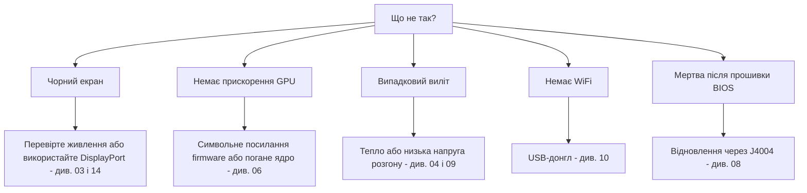

> 🌐 Переклад спільноти. Англійська версія є джерелом істини й може бути новішою. Знайшли помилку? Відкрийте issue: [English](../en/troubleshooting.md) · [issues](https://github.com/lildebil0/awesome-bc250/issues)

# Усунення проблем

> **Коротко** — Режими відмови BC-250 добре відомі: переважно це **живлення**, **тепло**, **ядро/firmware** або **невдала прошивка**. Знайдіть свій симптом нижче, застосуйте фікс і перейдіть за посиланням до повного розділу. За сумніву причина зазвичай у *поганому ядрі*, *відсутньому символьному посиланні firmware amdgpu* або *недостатньому охолодженні*.

Ця сторінка — індекс симптом → причина → фікс, дистильований із повторюваних проблем спільноти. Вона не заміняє розділи — вона швидко вказує на потрібний.

---

## Завантаження / дисплей

| Симптом | Імовірна причина | Фікс |
|---------|--------------|-----|
| Чорний екран / немає POST | Неправильна проводка живлення чи розпіновка | Перевірте проводку та розпіновку 8-pin; використовуйте справжній мідний провід достатнього перерізу → [03 — Блок живлення](../en/03-power-supply.md) |
| Чорний екран / вильоти після того, як працювало | **IOMMU досі ввімкнено** (зламаний на цій платі) | Вимкніть IOMMU у BIOS (elektricM); параметр ядра `iommu=off`/`amd_iommu=off` — ⚠ перевірте → [06 — Linux](../en/06-linux.md) |
| Чорний екран при завантаженні **інсталятора** / live USB | В інсталяторі немає драйвера GPU BC-250; KMS не стартує | Додайте `nomodeset` у GRUB (Fedora: Troubleshooting → Basic Graphics Mode); **приберіть його після встановлення Mesa** ([elektricM](https://github.com/elektricM/amd-bc250-docs/blob/main/docs/troubleshooting/boot.md)) → [06 — Linux](../en/06-linux.md) |
| Чорний екран **після входу** (GRUB + екран входу були в нормі) | Сеанс робочого столу, зазвичай **Wayland** | Виберіть X11 («GNOME on Xorg»/«Plasma X11») при вході або `WaylandEnable=false` ([elektricM](https://github.com/elektricM/amd-bc250-docs/blob/main/docs/troubleshooting/display.md)) → [14 — Дисплей](../en/14-display.md) |
| Завантажується, але немає прискорення GPU (усе на CPU) | Відсутнє символьне посилання firmware amdgpu або погане ядро | Застосуйте символьне посилання `navi10_gpu_info.bin` + параметри ядра; уникайте відомо-поганих ядер (нижче) → [06 — Linux](../en/06-linux.md) |
| `glxinfo` показує **llvmpipe**, ігри 5–10 FPS | Mesa застара або amdgpu не завантажено | Встановіть **Mesa 25.1.3+**, приберіть `nomodeset`, переконайтеся в `Kernel driver in use: amdgpu` ([elektricM](https://github.com/elektricM/amd-bc250-docs/blob/main/docs/troubleshooting/performance.md)) → [06 — Linux](../en/06-linux.md) |
| Працювало, потім зламалося після оновлення ядра | Регресія в тому ядрі | Відкотіться на LTS-ядро; повідомляють, що **6.14.7**, **6.15.0–6.15.6** та **6.17.8–6.17.10** ламають amdgpu (відкат на CPU / вильоти GPU); elektricM рекомендує **6.18.x LTS або 6.17.11+** ⚠ перевірте точні діапазони → [06 — Linux](../en/06-linux.md) |
| Немає звуку по HDMI | Регресія в ядрі 6.17+ | Використовуйте LTS-ядро або виводьте звук через USB/DisplayPort → [06 — Linux](../en/06-linux.md) |
| Працює лише один вихід дисплея | Обмеження драйвера на цій платі | Відоме обмеження для нативного двоекранного режиму; **MST-хаб дає до 2 екранів** (хаб DP 1.4) ([elektricM](https://github.com/elektricM/amd-bc250-docs/blob/main/docs/hardware/display.md)) → [14 — Дисплей](../en/14-display.md) |
| Немає зображення, немає POST, **лише зі встановленим NVMe** | На SSD досі є розділи EFI/відновлення **Windows** | Вийміть SSD, зітріть усі розділи на іншому ПК (`wipefs -a`), перевстановіть ([elektricM](https://github.com/elektricM/amd-bc250-docs/blob/main/docs/troubleshooting/boot.md)) → [06 — Linux](../en/06-linux.md) |
| Зовсім не проходить POST (немає BIOS) | Деякі плати не проходять POST **без батарейки CMOS** | Встановіть свіжу CR2032 і повторіть ([elektricM](https://github.com/elektricM/amd-bc250-docs/blob/main/docs/troubleshooting/boot.md)) → [08 — BIOS](../en/08-bios.md) |
| Завантаження **зависає на ~90 с**, потім продовжується | Збійний сервіс systemd / тайм-аут мережі | `systemctl --failed`; вимкніть застряглий юніт ([elektricM](https://github.com/elektricM/amd-bc250-docs/blob/main/docs/troubleshooting/boot.md)) → [06 — Linux](../en/06-linux.md) |
| Kernel panic «**unable to mount root**» / «No init found» | Неправильне ядро **або** пошкоджений initramfs | Завантажте старіше/LTS-ядро; якщо досі не вдається, зробіть chroot і перегенеруйте initramfs (`dracut -f` / `update-initramfs -u -k all` / `mkinitcpio -P`) ([elektricM](https://github.com/elektricM/amd-bc250-docs/blob/main/docs/troubleshooting/boot.md)) → [06 — Linux](../en/06-linux.md) |
| Вивалюється в `grub>` / `grub rescue>` | GRUB не може знайти свій конфіг/файли завантаження | Задайте `root`/`prefix`, `insmod normal`, завантажтеся; потім перевстановіть GRUB ([elektricM](https://github.com/elektricM/amd-bc250-docs/blob/main/docs/troubleshooting/boot.md)) → [06 — Linux](../en/06-linux.md) |
| Не вдається зайти в BIOS (Del/F2 ігнорується) | Адаптер повільно ініціалізується або клавіатура на USB 3.0 | Натискайте Del одразу; спробуйте порт **USB 2.0** і нативний кабель DP ([elektricM](https://github.com/elektricM/amd-bc250-docs/blob/main/docs/troubleshooting/display.md)) → [08 — BIOS](../en/08-bios.md) |

## Тепло / стабільність

| Симптом | Імовірна причина | Фікс |
|---------|--------------|-----|
| Тротлить / FPS падає під навантаженням | Штатний радіатор не охолоджує на столі | Стоншіть ребра + 120-мм вентилятор/кожух високого статичного тиску; тримайте <80 °C → [04 — Охолодження](../en/04-cooling.md) |
| Випадковий виліт / перезавантаження під навантаженням | Перегрів (>90 °C) **або** надто низька напруга розгону | Спершу покращте охолодження; потім підніміть напругу андервольтингу — стабільність у Furmark ≠ стабільність у грі (іграм потрібно вище) → [04](../en/04-cooling.md) · [09](../en/09-overclock-undervolt.md) |
| Стабільно в Furmark, вильоти в іграх | Напругу виставлено по Furmark, який недонавантажує | Тестуйте з OCCT + реальними іграми; підніміть напругу на ~50 mV → [09 — Розгін](../en/09-overclock-undervolt.md) |
| Два governor'и конфліктують | Запущено oberon-governor *і* smu_oc/cyan-skillfish разом | Запускайте лише один governor; вимкніть решту → [09 — Розгін](../en/09-overclock-undervolt.md) |
| **Уся система** падає при вильоті GPU (не лише застосунок) | APU: CPU+GPU ділять кремній, тож скидання GPU не може відновитися — воно валить систему | Очікувано для цієї архітектури; запобігайте вильотам GPU (стабільна напруга + добре охолодження + добре ядро), а не сподівайтеся на відновлення ([elektricM](https://github.com/elektricM/amd-bc250-docs/blob/main/docs/troubleshooting/stability.md)) → [09 — Розгін](../en/09-overclock-undervolt.md) |
| GPU вилітає → **чорний екран, ніколи не відновлюється**, поки працює governor | Governor продовжує писати в sysfs під час скидання → застрягле коло скидання | Перед схильними до вильотів іграми виконайте `systemctl stop cyan-skillfish-governor-smu`; увімкніть назад після ([elektricM](https://github.com/elektricM/amd-bc250-docs/blob/main/docs/troubleshooting/stability.md)) → [09 — Розгін](../en/09-overclock-undervolt.md) |
| Зависання / білий екран лише при **60–65 °C** | Деякі плати незвично чутливі до температури | Покращте охолодження, переставте радіатор, перенесіть термопасту (PTM7950); кремній різний ([elektricM](https://github.com/elektricM/amd-bc250-docs/blob/main/docs/troubleshooting/stability.md)) → [04 — Охолодження](../en/04-cooling.md) |
| GPU **застряг на 1500 MHz**, не андервольтиться нижче | Мінімальну напругу виставлено **нижче 700 mV** — це жорстка межа, що знову блокує GPU | Тримайте мінімальну напругу **≥ 700 mV** ([elektricM](https://github.com/elektricM/amd-bc250-docs/blob/main/docs/troubleshooting/stability.md)) → [09 — Розгін](../en/09-overclock-undervolt.md) |
| Артефакти / вильоти, які не лікуються підвищенням напруги | **Просідання напруги** під навантаженням (фактична V падає нижче заданої V) | Виставте базову напругу на ~25 mV вище, щоб покрити просідання, або використайте BIOS із правкою loadline/просідання ([elektricM](https://github.com/elektricM/amd-bc250-docs/blob/main/docs/troubleshooting/stability.md)) → [09 — Розгін](../en/09-overclock-undervolt.md) |
| Завантажується, потім вилітає з **помилками ACPI** (чорний/зелений екран) | Особливість чи пошкодження BIOS/ACPI | Скиньте CMOS / скиньте налаштування BIOS до стандартних; спробуйте `acpi=off noapic`; перепрошийте, якщо повторюється ([elektricM](https://github.com/elektricM/amd-bc250-docs/blob/main/docs/troubleshooting/stability.md)) → [08 — BIOS](../en/08-bios.md) |
| Сон/призупинення = **псевдозависання** (чорний екран, схоже на зависле) | Плата не має нормальних станів сну GPU; SMU не підтримує призупинення в Linux | Натисніть кнопку живлення для пробудження (не утримуйте); ще краще — **вимкніть призупинення** і використовуйте гасіння екрана. Простій усе одно лишається ~65–85 Вт ([elektricM](https://github.com/elektricM/amd-bc250-docs/blob/main/docs/troubleshooting/stability.md)) → [09 — Розгін](../en/09-overclock-undervolt.md) |

## Продуктивність

| Симптом | Імовірна причина | Фікс |
|---------|--------------|-----|
| FPS нижчий за очікуваний, GPU не завантажений на максимум | **Упирається в CPU** (Zen 2 — обмежувач у багатьох іграх) | Нормально; знижуйте налаштування, що навантажують CPU, і змиріться — розгін GPU тут не допоможе → [11 — Ігри](../en/11-gaming.md) |
| Активні лише 24 CU, очікувалося 40 | Штатно відкрито менше CU | Застосуйте розблокування 40 CU (`amdgpu.bc250_cc_write_mode=3` + скрипт) → [09 — Розгін](../en/09-overclock-undervolt.md) |
| Steam / FSR / vsync зламані | Втручається «геймерський» форк дистрибутива | Деякі тюнінгові форки їх ламають; звичайна Fedora/Bazzite-bc250 безпечніша → [06 — Linux](../en/06-linux.md) |
| GPU **заблокований на 1500 MHz** незалежно від навантаження | Немає governor'а в просторі користувача (стандартно заблоковано BIOS) | Встановіть GPU-governor (cyan-skillfish-governor-smu), щоб масштабувати частоту ([elektricM](https://github.com/elektricM/amd-bc250-docs/blob/main/docs/troubleshooting/performance.md)) → [09 — Розгін](../en/09-overclock-undervolt.md) |
| Governor працює, але GPU **не перевищує 2000 MHz** | Ядру бракує патча діапазону частот (стандартна межа 1000–2000) | Використайте пропатчене ядро (Bazzite/CachyOS вже пропатчені) або застосуйте `amdgpu-frequency-range.patch` ([elektricM](https://github.com/elektricM/amd-bc250-docs/blob/main/docs/troubleshooting/performance.md)) → [09 — Розгін](../en/09-overclock-undervolt.md) |
| MangoHud показує **655 %** завантаження GPU | amdgpu лишає метрику активності на `0xFFFF`; MangoHud читає 65535/100 | Запустіть cyan-skillfish-governor-smu (гілка smu) — він патчить `gpu_metrics`; правок у MangoHud не треба. Або застосуйте окремий скрипт **`install_gpu_usage_fix.sh`** ([Old Lamer — Частина XV](https://youtu.be/lSipaWjU6D4)) ([elektricM](https://github.com/elektricM/amd-bc250-docs/blob/main/docs/troubleshooting/performance.md)) → [09 — Розгін](../en/09-overclock-undervolt.md) |
| **Безголовий** «GPU нічого не робить» у тесті навантаження | `glmark2 --off-screen` мовчки відкочується на **llvmpipe** (CPU) без дисплея | Тестуйте через `clpeak` / `vkmark` / `llama-bench -ngl 99`; переконайтеся, що SCLK і споживання зростають ([elektricM](https://github.com/elektricM/amd-bc250-docs/blob/main/docs/troubleshooting/performance.md)) → [06 — Linux](../en/06-linux.md) |
| 60+ FPS, але **смикання** / нерівний час кадру | Темп кадрів (компоновник X11 або темп, прив'язаний до звуку) | Запускайте через **gamescope** (`-W 1920 -H 1080 -f`) або вимкніть компоновник / спробуйте Wayland ([elektricM](https://github.com/elektricM/amd-bc250-docs/blob/main/docs/troubleshooting/performance.md)) → [11 — Ігри](../en/11-gaming.md) |
| Гра **вилітає по OOM / артефакти, потім падає** (RDR2, CoH3) | Конфлікт **512 MB dynamic VRAM + ZRAM** або просто **брак RAM** | Перемкніть BIOS на **fixed VRAM** (напр. 10 ГБ RAM / 6 ГБ VRAM); **або** вимкніть systemd ZRAM і використайте **zswap + swapfile Btrfs на 32 ГБ** ([Old Lamer — Частина XIV](https://youtu.be/A6juAoY70aU), рецепт у [06](../en/06-linux.md)/[09](../en/09-overclock-undervolt.md)) ([elektricM](https://github.com/elektricM/amd-bc250-docs/blob/main/docs/troubleshooting/stability.md)) → [08 — BIOS](../en/08-bios.md) |
| Конкретна гра (напр. **RDR2**) рендериться на CPU/llvmpipe | Гра за замовчуванням обирає неправильний графічний адаптер | Виставте адаптером AMD GPU у самій грі; RDR2: запускайте з `-useMaximumSettings` ([elektricM](https://github.com/elektricM/amd-bc250-docs/blob/main/docs/troubleshooting/performance.md)) → [11 — Ігри](../en/11-gaming.md) |

## Мережа

| Симптом | Імовірна причина | Фікс |
|---------|--------------|-----|
| Зовсім немає WiFi | Немає вбудованого WiFi; донглу потрібен драйвер | Використайте перевірений донгл (aic8800d80) + зберіть його драйвер → [10 — WiFi/BT](../en/10-wifi-bt.md) |
| WiFi відвалюється кожні кілька хвилин | Чипсет Realtek + живлення USB під навантаженням | Відоме з деякими донглами RTL882x; перейдіть на aic8800d80 або підтверджену модель → [10 — WiFi/BT](../en/10-wifi-bt.md) |
| Драйвер зник після перезавантаження | Зібрано «голим» `make`, а не запаковано | Використайте шлях RPM/DKMS з репозиторію, щоб він пережив оновлення ядра → [10 — WiFi/BT](../en/10-wifi-bt.md) |
| Провайдер **душить Steam** до повзання | DPI/тротлінг трафіку Steam CDN | Анти-тротлінг-інструменти (на кшталт `zapret`) допомагають — але **read-only ФС Bazzite їх блокує**; використайте змінюваний дистрибутив (Fedora/Arch). Специфіка RU-операторів (Yota, zapret+warp) — у [російській версії](../ru/06-linux.md) → [06 — Linux](../en/06-linux.md) |

## Windows

| Симптом | Імовірна причина | Фікс |
|---------|--------------|-----|
| GPU = Code 43 / немає прискорення | Немає робочого драйвера GPU для Windows (станом на початок 2026) | Очікувано. Використовуйте Linux. Драйвери для Windows — експериментальні в розробці → [07 — Windows](../en/07-windows.md) |

## BIOS / «цеглина»

> ⚠ **Прочитайте [08 — BIOS](../en/08-bios.md) повністю перед будь-якою прошивкою.** Невдала прошивка перетворює плату на «цеглину», а скидання CMOS **не** оживляє мод 1.0/3.00.

| Симптом | Імовірна причина | Фікс |
|---------|--------------|-----|
| Мертва/чорний екран після прошивки BIOS | Поганий образ або неправильні налаштування | Зовнішнє відновлення: під'єднайте CH341A до **роз'єму J4004** (кліпса SOIC-8 на цій платі **не** працює) і перепрошийте відомо-робочий образ → [08 — BIOS](../en/08-bios.md) |
| Програматор не може прочитати чип | Лінії даних на 5 В / обрано не той чип | Використовуйте 3.3 В; прошивайте 16-МБ `BIOS_A1`, ніколи не 512-КБ SuperIO → [08 — BIOS](../en/08-bios.md) |
| Налаштування не зберігаються | Стара версія мода | Використайте мод 5.00, де тайминги RAM/GDDR6 реально застосовуються → [08 — BIOS](../en/08-bios.md) |
| Не завантажується після зміни **таймінгів/частоти RAM** | Нестабільні налаштування пам'яті **пошкодили BIOS** (watchdog P3.00; про це повідомляв російськомовний чат BC-250) | Скидання CMOS може не допомогти — **апаратна перепрошивка** (CH341A / Pi Pico) відомо-робочого образу. Зробіть резервну копію робочого BIOS *до* тюнінгу RAM; налаштовуйте по одному таймінгу за раз (tREF дає найбільше) ([elektricM](https://github.com/elektricM/amd-bc250-docs/blob/main/docs/troubleshooting/stability.md)) → [08 — BIOS](../en/08-bios.md) |
| Налаштування BIOS не зберігаються → чорний екран / мало RAM | CMOS не скинуто після прошивки з USB (може знадобитися 2–3 скидання) | Скиньте CMOS, переналаштуйте, перезавантажтеся **у BIOS**, щоб підтвердити, що 512 MB досі задано; перевірте, що `free -h` показує ~15.5 ГБ ([elektricM](https://github.com/elektricM/amd-bc250-docs/blob/main/docs/troubleshooting/stability.md)) → [08 — BIOS](../en/08-bios.md) |

---

## Досі застрягли?
- Перегляньте **[FAQ](faq.md)**.
- Шукайте в чаті спільноти за темою (посилання **Джерела** в кожному розділі ведуть до реальних обговорень).
- Просячи допомоги, вкажіть **дистрибутив + версію ядра**, **частоти/governor** та **охолодження** — ці три речі пояснюють більшість проблем.

### Джерела для рядків вище
- Гайди з усунення проблем elektricM — [`boot.md`](https://github.com/elektricM/amd-bc250-docs/blob/main/docs/troubleshooting/boot.md) · [`display.md`](https://github.com/elektricM/amd-bc250-docs/blob/main/docs/troubleshooting/display.md) · [`performance.md`](https://github.com/elektricM/amd-bc250-docs/blob/main/docs/troubleshooting/performance.md) · [`stability.md`](https://github.com/elektricM/amd-bc250-docs/blob/main/docs/troubleshooting/stability.md) · [`hardware/display.md`](https://github.com/elektricM/amd-bc250-docs/blob/main/docs/hardware/display.md)
- Old Lamer (YouTube): [Частина XIV — zswap + swap Btrfs на 32 ГБ](https://youtu.be/A6juAoY70aU) · [Частина XV — `install_gpu_usage_fix.sh`](https://youtu.be/lSipaWjU6D4)
- [Гілка BC-250 на 4pda](https://4pda.to/forum/index.php?showtopic=1104980) — тротлінг Steam у RU-провайдерів (Yota, zapret+warp).
- Цитати з чату спільноти по кожному розділу живуть у розділі **Джерела** відповідного зв'язаного розділу.
