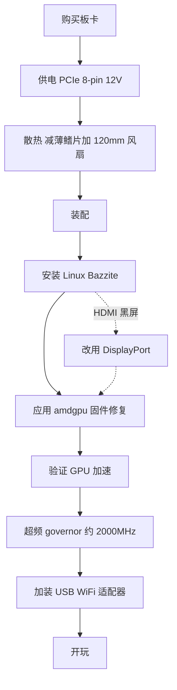

> 🌐 社区翻译。英文版为权威来源，可能更新更及时。发现错误？请提交 issue：[English](../en/00-start-here.md) · https://github.com/lildebil0/awesome-bc250/issues

# 从这里开始 —— 从零到开玩

> **太长不看** —— 你买了（或正打算买）一块 AMD BC-250。它是一块源自 PlayStation 5 的 APU 板卡，带 16 GB GDDR6，可以做成廉价的 Linux 游戏/AI 主机 —— **前提是**你按顺序解决三件事：**供电**、**散热**和 **Linux 驱动**。本页就是从一块装在盒子里的板卡到游戏跑起来的那条直线。照着步骤走；每一步都链接到一整章。

这块板卡是个项目，不是即插即用的 PC。预留一个周末。人们让板卡早早报废的两种方式是**供电接线错误**和**让它过热运行** —— 所以我们先做这两件。

---

## 开始之前 —— 配件与工具

在动手*之前*就把这些准备好，省得在装配途中才发现少了哪件：

- 带 PCIe 8-pin 12 V 输出的 **PSU** → **[03 —— 供电](../en/03-power-supply.md)**
- **120 mm 高静压风扇** + 打印的导风罩 → **[04 —— 散热](../en/04-cooling.md)** / **[05 —— 机箱与 3D 打印](../en/05-case.md)**
- 一个**打印的机箱或支架** → **[05 —— 机箱与 3D 打印](../en/05-case.md)**
- 一个用于 Linux 安装器的 **USB 优盘（≥ 16 GB）**
- 一根 **DisplayPort 线**（或 DP→HDMI 转接 —— 板卡的 HDMI 常常什么都不显示，DisplayPort 最稳妥）
- 一把**螺丝刀**
- 一只**万用表** —— 用磁铁/通断测试 PSU 接线 → **[03 —— 供电](../en/03-power-supply.md)**

---

## 路径



### 0. 弄清你手里是什么
BC-250 是一块服务器/矿机刀片：一颗 APU（Zen 2 CPU + RDNA2 级 GPU，"Cyan Skillfish/Oberon"）、16 GB GDDR6、**被动散热片**，由单路 **12 V PCIe 8-pin** 供电。没有板载 WiFi，没有可用的 Windows GPU 驱动，没有硬件视频编码。→ **[01 —— 什么是 BC-250](../en/01-what-is-bc250.md)**

### 1. 买对东西
弄清楚什么是公道价、盒子里有什么（仅板卡？散热片？PSU？），以及该避开哪些卖家/骗局。→ **[02 —— 购买指南](../en/02-buying.md)**

### 2. 在*首次开机前*搞定供电
板卡通过 PCIe 8-pin 在 12 V 上需要约 235 W（超频后更多）。用一个真正的 PSU（服务器 Flex / Mean Well 砖块电源 / ATX），用**足够线规的纯铜线**正确接好 8-pin，别去猜针脚 —— 这里出错就是一块废板。→ **[03 —— 供电](../en/03-power-supply.md)**

### 3. 在*给它加压前*修好散热
原装散热片是为机柜风洞设计的，**放在桌面上就会降频**。把鳍片减薄，再用一个高静压 120 mm 风扇透过打印的导风罩拧上去（或上一体式水冷）。目标：在 Furmark 中保持 80 °C 以下。→ **[04 —— 散热](../en/04-cooling.md)**

### 4. 装进机箱（可选但很好）
打印一个主机风格的机箱，把板卡、风扇和 PSU 都装上，形成真正的气流。社区 STL 目录在此。→ **[05 —— 机箱与 3D 打印](../en/05-case.md)**

### 5. 装配它
一个最简构建的物理操作顺序：把风扇装到打印的导风罩上 → 把导风罩卡/拧到（已减薄的）散热片鳍片上 → 把板卡安放到机箱/支架里 → 把 PSU 的 8-pin 接到板卡上（针脚要对，**[03 —— 供电](../en/03-power-supply.md)**）→ 接一根 DisplayPort 线到显示器 → 通电并确认它能 **POST**（POST = 加电自检；它能通电并输出视频 —— 你看到画面 / 风扇转起来）。所有鳍片打磨都要在装配*之前*做完（见 **[04 —— 散热](../en/04-cooling.md)**），并保证金属粉尘别落到板卡上。

> 一张标注好的装配照片/示意图是很受欢迎的贡献 —— 仓库目前还没有。

### 6. 安装 Linux + GPU 驱动
这是成败攸关的一步。对新手最简单的：一个为 BC-250 构建的 **Bazzite 镜像**（或 **Fedora 43** —— elektricM 另一个"开箱即用"的推荐；Fedora 42 已停止支持）。然后应用 **amdgpu 固件修复**（`navi10_gpu_info.bin` 符号链接）和内核参数，重新生成 initramfs/grub，并验证 GPU 已加速（`vainfo`、`dmesg`）。→ **[06 —— Linux 驱动与配置](../en/06-linux.md)**

> **两个设置，跳过了会让你痛苦数小时**（elektricM）：在改版 BIOS 里设 **VRAM = 512 MB 动态**并**禁用 IOMMU**（损坏的 IOMMU 会导致显示故障和崩溃），刷完后再**清除 CMOS**。安装时带上 `nomodeset` 启动参数，**驱动装好后移除它**。Mesa **25.1+** 是底线（推荐 25.3.x）。还要**避开内核 6.15.0–6.15.6 和 6.17.8–6.17.10** —— 它们会破坏 GPU 驱动；改用 6.18 LTS / 6.17.11+ / 6.12–6.14 LTS。（[elektricM 快速上手](https://elektricm.github.io/amd-bc250-docs/getting-started/quick-start/)、[快速参考](https://elektricm.github.io/amd-bc250-docs/reference/quick-reference/)）

> 想用 Windows？截至 2026 年初**还没有可用的 Windows GPU 驱动** —— 它是实验性的。用 Linux。→ **[07 —— Windows](../en/07-windows.md)**

### 7. 先验证默频能用，再超频
桌面加速起来之后，安装 **oberon-governor** 并把频率往上推（默频 1500 MHz 偏弱；**2000 MHz ≈ +30 % FPS**）。可选地解锁全部 **40 个 CU** 并降压。在新频率下重新测温。→ **[09 —— 超频与降压](../en/09-overclock-undervolt.md)**

### 8. 联网
没有板载 WiFi —— 加一个**已知好用的 USB 适配器**（aic8800d80 是社区最爱）及其驱动。→ **[10 —— WiFi 与蓝牙](../en/10-wifi-bt.md)**

### 9. 开玩
设定合理预期（往往是 Zen 2 CPU 而非 GPU 成为瓶颈），开启 FSR，并采用社区的逐游戏设置。→ **[11 —— 游戏实测与设置](../en/11-gaming.md)**

### 加分项 —— 跑本地 LLM
16 GB VRAM 在这个价位算很多。在 **Vulkan** 后端上跑 llama.cpp（ROCm 在这块 GPU 上是死路）。→ **[12 —— AI / LLM](../en/12-ai-llm.md)**

### 加分项 —— 模拟
Switch、PS3、PS4、复古、街机 —— 哪些真能跑，怎么跑 → **[15 —— 模拟](../en/15-emulation.md)**

> 首次开机没画面？板卡通过 **DisplayPort** 输出（HDMI 常常黑屏）→ **[14 —— 显示与输出](../en/14-display.md)**。USB 口不够用，或要加硬盘？→ **[16 —— USB、集线器与存储](../en/16-usb-peripherals.md)**

---

## 如果哪里出了问题
黑屏、无加速、随机重启、适配器掉线、BIOS 刷写后变砖 —— 见 **[故障排查](troubleshooting.md)** 和 **[FAQ](faq.md)**。

> 刷改版 BIOS **不是**起步步骤。它可能让板卡变砖，并且需要恢复硬件。只在有意为之时才去碰。→ **[08 —— BIOS 与变砖恢复](../en/08-bios.md)**

---

## 60 秒检查清单

| 步骤 | 完成标志 |
|------|-----------|
| 供电 | PSU 接好 8-pin，针脚正确，纯铜线，板卡能 POST |
| 散热 | 鳍片减薄 + 120 mm 风扇/导风罩；Furmark 中 <80 °C |
| 系统 | Bazzite-bc250 已装，能启动到桌面 |
| GPU | `vainfo`/`dmesg` 显示 amdgpu 已激活，而非 CPU 回退 |
| 超频 | oberon-governor 在运行，约 2000 MHz，在真实游戏中稳定 |
| 网络 | USB 适配器能连接并保持在线 |
| 游戏 | 以你的频率达到预期 FPS |

每一行都打勾时，你就完成了。欢迎加入 BC-250 俱乐部。

---

## 快速参考（速查表）

你最常用到的命令与设置，浓缩自 elektricM 的[快速参考](https://elektricm.github.io/amd-bc250-docs/reference/quick-reference/)。完整细节见 **[06 —— Linux](../en/06-linux.md)** 和 **[09 —— 超频](../en/09-overclock-undervolt.md)**。

**BIOS：** VRAM `512MB` 动态 · IOMMU **Disabled** · UEFI 引导 · 每次 USB 刷写后清除 CMOS。

**验证 GPU 已加速（而非 llvmpipe/CPU）：**
```bash
glxinfo | grep "OpenGL version"          # Mesa 25.1+ expected
vulkaninfo | grep deviceName             # → AMD Radeon Graphics (RADV GFX1013)
cat /sys/class/drm/card0/device/pp_dpm_sclk   # multiple freqs, current marked *
```

**Governor**（没有它频率会卡在 1500 MHz）。我们默认用 `oberon-governor`；elektricM 通过 COPR 提供更新的 SMU 分支 —— 两者都行：
```bash
sudo dnf copr enable filippor/bazzite
sudo dnf install cyan-skillfish-governor-smu          # rpm-ostree install … on Bazzite
sudo systemctl enable --now cyan-skillfish-governor-smu.service
systemctl status cyan-skillfish-governor-smu          # → active (running)
```
> 电压底线 **700 mV** —— 低于它 GPU 会锁定在 1500 MHz。governor 可能瞄准了错误的卡（card0 vs card1）—— 如果调频没生效就核实一下。

**驱动装好后移除 `nomodeset`：**
```bash
# GRUB distros: drop "nomodeset" from /etc/default/grub, then
sudo grub2-mkconfig -o /boot/grub2/grub.cfg && sudo reboot
# Bazzite / Fedora Atomic:
rpm-ostree kargs --delete-if-present="nomodeset" && systemctl reboot
```

**修复部分游戏图形故障的 Steam 启动选项：** `RADV_DEBUG=nohiz %command%`。

**在 RDR2 / Company of Heroes 3 中崩溃？** 把 VRAM 从 `512MB` 动态切换为 **10GB/6GB 固定**（ZRAM 冲突）。（[elektricM 快速参考](https://elektricm.github.io/amd-bc250-docs/reference/quick-reference/)）
