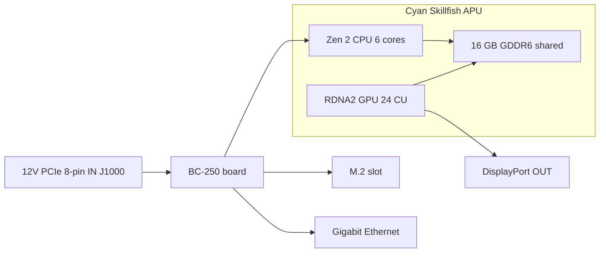

> 🌐 社区翻译。英文版为权威来源，可能更新更及时。发现错误？请提交 issue：[English](../en/01-what-is-bc250.md) · https://github.com/lildebil0/awesome-bc250/issues

# 什么是 BC-250

> **太长不看** —— BC-250 是**一块装在服务器/矿机板卡上的 PlayStation 5 级 APU**。一颗芯片（AMD 代号 **Cyan Skillfish**，是 PS5 那颗 **Oberon/Ariel** 硅片的精简版）集成了**6 核 / 12 线程 Zen 2 CPU** 和**24 计算单元 RDNA 2 GPU**，由**16 GB 焊死的 GDDR6** 供给。它**不是显卡，也不是普通 PC** —— 它**没有你熟悉的 x86 BIOS，没有 PCIe 插槽，没有 24-pin ATX 插头**：它**直接把 12 V 喂进一个 8-pin PCIe 供电接口**，然后启动自己的固件。人们买它，是因为它是一台**极其便宜的 Linux 游戏 / 本地 AI 主机**。人们也对它咬牙切齿，因为**驱动、散热和缺失的硬件视频编码**让它成了一个项目，而不是即插即用的机器。如果你想要零麻烦，这块板卡买错了 —— 现在就退货。如果你喜欢折腾，请继续读。

本页是"我到底买了什么"的参考。供电、散热、系统安装与驱动各有自己的章节（[03](03-power-supply.md) / [04](04-cooling.md) / [06](06-linux.md)）。

---

## 它到底是什么

AMD 把 BC-250 造成了一台**加密货币矿机加速器**（"BC" 代表 blockchain，区块链）。为了压低成本，AMD 复用了**剩余的 PlayStation 5 处理器硅片** —— 和索尼装进主机里的同一族芯片。一块板卡就是一颗 APU 加上它的内存和供电电路；这就是整个产品。

行话，只解释一次：

- **APU**（Accelerated Processing Unit，加速处理单元）—— AMD 给一颗**同时包含 CPU 和 GPU** 的芯片起的名字。没有独立显卡；GPU 就在同一封装内，共享同一份内存。
- **Cyan Skillfish** —— AMD 给这颗 APU 起的工程**代号**。你会在 Linux 里到处看到它：GPU 固件文件就叫 `cyan_skillfish_gpu_info.bin`（[src](https://t.me/c/2424231195/57962) —— 符号链接修复见 [src](https://t.me/c/2424231195/41252)）。工具有时也会用 PS5 的 die 名字 **Oberon** / **Ariel** 来报告它。
- **GDDR6** —— 通常出现在显卡上的高速图形内存。在 BC-250 上它**同时是系统内存和显存**（CPU 和 GPU 共用一个内存池）。没有 DIMM 插槽；这 16 GB 是焊死的，无法升级。
- **RDNA 2** —— GPU 架构的代际（和 PS5、Xbox Series、Radeon RX 6000 系列同族）。

这颗芯片是 PS5 部件的**精简版**，不是完整版。社区置顶了这份对比（[src](https://t.me/c/2424231195/11282)，引自 [TechPowerUp 的 Oberon 条目](https://www.techpowerup.com/gpu-specs/amd-oberon.g936)）：

| | BC-250 | 完整 PS5（Oberon） |
|---|---|---|
| CPU 核心 / 线程 | **6 / 12** | 8 / 16 |
| GPU 计算单元（CU） | **24** | 36 |

一个"计算单元"是一个 GPU 核心块；24 个大致相当于中端笔记本 GPU 的水平，而这正是聊天里报告的游戏性能区间。

BC-250 并不是 AMD 唯一"装在桌面板卡上的剩余主机硅片"。它有两个出自同一思路的近亲：**AMD 4700S 桌面套件**（一个源自 **PlayStation 5** 的 CPU 套件）—— 聊天提醒说它在市场上常被和 BC-250 混在一起标注（[02-buying.md](02-buying.md)）—— 以及 **AMD 4800S 桌面套件**，即源自 **Xbox Series X** 的版本（8 个 Zen 2 核心连着 GDDR6，主机那颗 RDNA 2 GPU 被熔断屏蔽）。两者都是真实的 AMD 产品，和 BC-250 一样，把回收的主机 CPU 配上焊死的 GDDR6（[VideoCardz](https://videocardz.com/newz/amd-4800s-desktop-kit-a-pc-repurposed-apu-from-xbox-series-x-has-been-tested)）。它们是购物时把 BC-250 和它的兄弟们区分开来的有用背景。

人们已经**用越狱 PS5 本身的同样方式在 BC-250 上跑桌面 Linux** —— 完整的 4K HDMI 视频 + 音频、所有 USB 口可用、APU 的 CPU 跑到约 3.2 GHz、GPU 跑到约 2.0 GHz（[src](https://t.me/c/2424231195/122260)）。

---

## 它擅长什么

- **在这个性能档次里进入 Linux 游戏最便宜的途径。** 通过 Steam/Proton（一个在 Linux 上运行 Windows 游戏的兼容层），人们玩 Star Citizen（[src](https://t.me/c/2424231195/38702)），甚至通过一个社区 Vulkan 包装层，在低画质/FSR 下以约 60 FPS 跑像 *Doom: The Dark Ages* 这样的现代大作（[src](https://t.me/c/2424231195/127696)）。逐游戏结果见 [11-gaming.md](11-gaming.md)。
- **一台能干的本地 AI 主机。** 凭借 16 GB GDDR6，它能装下中等规模的语言模型。成员们通过 `llama.cpp`/`jan` 在 **Vulkan** 后端上本地跑 LLM；你要先在 BIOS 里把 12 GB 分配给 GPU（[src](https://t.me/c/2424231195/92421)）。见 [12-ai-llm.md](12-ai-llm.md)。
- **小巧且自成一体。** 它是一块带有显卡式散热片的长条板卡 —— 能塞进小型 DIY/3D 打印机箱，并用一个小电源供电（[build src](https://t.me/c/2424231195/137825)）。

社区对它*为何*能跑起来的共识：因为这颗芯片和 Steam Deck / PS5 硬件如此接近，Valve 和开源 Mesa 图形栈持续改进着完全相同的那套驱动，于是 BC-250 就免费搭了顺风车（[src](https://t.me/c/2424231195/93006)）。

---

## 哪里让人头疼（摆正预期）

这是新手最容易低估的那一半。其中没有一项是致命伤，但全都是实打实的活儿。

- **驱动是个亲力亲为的活儿。** AMD 为这块板卡**不提供官方驱动，也没有公开文档**（[src](https://t.me/c/2424231195/37764)）。一切 —— Linux 图形栈、频率/电压"governor"、BIOS —— 都是社区搭建的。准备好照着配置脚本走，并偶尔动手修东西。从 [06-linux.md](06-linux.md) 开始。
- **散热是人们最容易搞错的第一件事。** 原装散热片是为矿机机柜的强制风道设计的，所以放在桌面上它开箱就过热并降频。你需要改造散热。它有自己的一章 —— 在追求性能**之前**先读 [04-cooling.md](04-cooling.md)。
- **没有硬件视频编码器。** GPU 的视频编码模块（AMD 称之为 **VCN** —— 专门用于压缩视频以供直播/录制的电路）**不可用**。屏幕录制和游戏直播会回退到**软件编码器**，这会占用 CPU。它能用（有人通过 Sunshine/Moonlight 直播），但比正常 GPU 更慢、画质更低（[src](https://t.me/c/2424231195/88026)）。同样地，早期的 Mesa 驱动一度是出了名的**软件渲染**，直到社区把硬件加速搞定（[src](https://t.me/c/2424231195/11243)）。
- **古怪的供电，且默认没有画面。** 它不接受标准的 24-pin ATX 接口 —— 见下一节。许多板卡到手时还需要先做一次 **BIOS 重置**才会 POST（[src](https://t.me/c/2424231195/57930)），而且你通常通过 **DisplayPort** 输出画面（HDMI 需要一个 DP→HDMI 转接，它也能正常传送音频 —— [src](https://t.me/c/2424231195/9148)）。
- **它就是一块给爱折腾者的板卡，没别的。** 正如一位老成员所说：尽管便宜，BC-250"需要一定的技能、精力和脑子"（[src](https://t.me/c/2424231195/73002)）。预算的是时间，不只是钱。
- ⚠ **eGPU 救不了它 —— 社区报告（r/BC250Gaming）。** 那个唯一的 M.2 插槽只有 **PCIe 2.0 ×2**（见下面的硬件卡片），在那点带宽下，挂在 M.2 上的外置 GPU **据报告比板载 RDNA 2 GPU 表现*更差*** —— 慢速链路把它掐死了。如果你想要更强的图形性能，共识是这块板卡不适合干这事。*（社区报告；当作一个警示，而非基准测试。）*

> ⚠ **双色 LED 是什么意思 —— 社区报告（r/BC250Gaming）。** 网卡旁边那颗双色 LED 是一个**矿机时代的利用率指示灯，不是错误灯**：据社区说法，**红 = GPU/RAM *未*处于 100% 利用率，绿 = 满载利用率**。所以一块空闲的桌面板卡亮红灯是正常的，不是故障。*（社区报告；AMD 不为这块板卡提供任何文档，所以确切的颜色映射当作未经证实。）*

> ⚠ **拿取警告，血的教训。** **不要**让任何金属物碰到通电的板卡，而且更换硅脂时务必小心 —— 一位成员因为短路把自己的 BC-250 永久弄坏了（[src](https://t.me/c/2424231195/95998)）。板卡到手时还会因散热片安装而略微**弯曲**；一位成员用纸把板卡垫平、紧贴散热片，解决了无法开机的问题（[src](https://t.me/c/2424231195/117347)）。

---

## 硬件参考卡片

规格是对照社区硬件逆向工程交叉核对的（AMD 不发布数据手册）。内存总线和物理尺寸数据此前未经证实，现在来源于 [elektricM 硬件规格](https://github.com/elektricm/elektricm)（其中将逆向工程归功于 mothenjoyer69 / Segfault / neggles / yeyus）。下面的针脚定义和供电数据出自权威的社区硬件文档。

板卡一览 —— 左边是供电输入，中间是 APU 及其共享内存，右边是 I/O：



### 核心规格

| 规格 | 数值 | 来源 |
|------|-------|--------|
| 类别 | 装在矿机/服务器板卡上的、源自 PlayStation 5 的 APU | [hardware.md](https://github.com/mothenjoyer69/bc250-documentation/blob/main/hardware.md) |
| APU 代号 | **Cyan Skillfish**（PS5 die：Oberon / Ariel） | chat（[src](https://t.me/c/2424231195/57962)） |
| CPU | **6 核 / 12 线程，Zen 2**（6 核已确认） | [hardware.md](https://github.com/mothenjoyer69/bc250-documentation) · chat（[src](https://t.me/c/2424231195/11282)） |
| CPU 频率 | 最高约 **~3.49 GHz**（"左右"） | [hardware.md](https://github.com/mothenjoyer69/bc250-documentation) · chat（[src](https://t.me/c/2424231195/122260)） |
| GPU | **24 计算单元，RDNA 2**（`gfx1013`；PS5 SoC 有 36 个）；光栅化性能 ≈ **介于 RX 6600 和 RX 6600 XT 之间** / GTX 1660 Ti 级；**Vulkan 1.4** | [hardware.md](https://github.com/mothenjoyer69/bc250-documentation) · chat（[src](https://t.me/c/2424231195/11282)） · [elektricM](https://github.com/elektricm/elektricm) |
| GPU 频率 | 默频约 1500 MHz，超频约 2000 MHz（最高 ≈2.23 GHz） | （[src](https://t.me/c/2424231195/122260)） · [09](09-overclock-undervolt.md) |
| 内存 | **16 GB GDDR6**，由 CPU 和 GPU 共享，焊死（不可升级） | [hardware.md](https://github.com/mothenjoyer69/bc250-documentation) · [README](../../README.md) |
| GPU 显存分配 | 在 BIOS 里设定；BIOS 3.00+ 上可选 **12 GB** | （[src](https://t.me/c/2424231195/92421)） |
| 内存总线 / 带宽 | **256-bit** GDDR6 @ **14 Gbps**，**~448 GB/s** | [elektricM 硬件规格](https://github.com/elektricm/elektricm) |
| TDP | **220 W**（板卡热设计功耗） | [hardware.md](https://github.com/mothenjoyer69/bc250-documentation) |
| 功耗 | 在矿机级负载下典型约 ~67–85 W | [hashrate.no](https://www.hashrate.no/gpus/bc250) |
| 硬件视频编码（VCN） | **无** —— 仅软件编码 | （[src](https://t.me/c/2424231195/88026)） |
| 视频输出 | **DisplayPort 1.4**（最高 **4K@120 / 8K@60**）；HDMI 用 DP→HDMI 转接；可传音频 | （[src](https://t.me/c/2424231195/9148)） · [elektricM](https://github.com/elektricm/elektricm) |
| 存储（M.2） | 1x M.2 2280 —— **PCIe 2.0 x2 或 SATA III** | [elektricM](https://github.com/elektricm/elektricm) |
| 第二个 DisplayPort | 存在但**未焊接元件**；可在软件里激活 | （[src](https://t.me/c/2424231195/88026)） |
| 物理尺寸 | 长 **340 mm / 310 mm**（取决于测量方法），宽 **~115 mm**，含散热片约 **~400 g**；定制的非标准矿机外形 | [elektricM 硬件规格](https://github.com/elektricm/elektricm) |

> ⚠ **GDDR6 超频 = 带宽，不是 FPS —— 社区报告（r/BC250Gaming）。** 据社区说法，给 GDDR6 超频会把内存带宽从大约 **~256 GB/s 提到 ~445 GB/s**，却**带不来任何游戏增益** —— 瓶颈是 GPU 的 24 个 CU，而不是内存带宽，所以多出来的带宽在游戏里用不上。（注意上面仓库已核实的*默频*数据本就是 256-bit / 14 Gbps 下的 **~448 GB/s**，所以社区那个"~256 GB/s 基线"和规格表对不上 —— 把确切的 GB/s 数字当作未经证实；"你不会因此多得 FPS"这个结论才是可靠的部分。）关于 GPU/内存超频的一般内容见 [09-overclock-undervolt.md](09-overclock-undervolt.md)。

> **关于板卡尺寸：** [elektricM 硬件规格](https://github.com/elektricm/elektricm) 给出长 **340 mm / 310 mm**（两个数字反映不同的测量方法）、宽 **~115 mm**、含散热片约 **~400 g**，外形是定制的非标准矿机形态。权威的 `hardware.md` 本身并未列出尺寸；聊天里反应最多的那条硬件帖子标题直接就是 *"Размеры amd bc-250"*（"AMD BC-250 的尺寸"，❤20 —— [src](https://t.me/c/2424231195/379)），印证了人们为做机箱而在意这个。要精确配合机箱，请基于一个量过尺寸的 3D 模型来做 —— 社区收录的板卡 STL（例如 `BC250 Board.stl`，[Printables 1103626](https://www.printables.com/model/1103626-amd-bc250-board)，以及 [Printables 1341336](https://www.printables.com/model/1341336-accurate-3d-model-of-the-amd-bc-250-board) 上那个精确模型）尺寸是准确的。见 [05-case.md](05-case.md)。

<p align="center">
  <br>
  <sub>Photo: AMD BC-250 community · <a href="https://t.me/c/2424231195/379">source</a></sub>
</p>

### 供电接口针脚定义（插任何东西之前先读这个）

BC-250 **没有 24-pin ATX 排针**。它**仅由 12 V** 供电，通过一个 **8-pin PCIe 供电接口（J1000）**输入 —— 物理插头和显卡的一样，但板卡期望三个供电触点都由 12 V 喂入。完整接线和 PSU 选择在 [03-power-supply.md](03-power-supply.md)；权威针脚定义出自 [hardware.md](https://github.com/mothenjoyer69/bc250-documentation/blob/main/hardware.md)：

**J1000 —— 主 8-pin PCIe 供电（这就是你要接的那个）：**

```
[ GND  GND  GND  GND ]
[ GND  12V  12V  12V ]
```

- 三个 12 V 触点；文档将 Mini-Fit Jr 触点评级为**每个最高 9 A**，因此这个接口"可以安全地提供高达 **324 W**"，并建议独立使用时用 **16 AWG** 线（[hardware.md](https://github.com/mothenjoyer69/bc250-documentation)）。
- **GND = 接地（0 V），12V = +12 伏。** 极性要对 —— 这块板卡没有任何反向电压容错。

**J2000 / J2001 —— 机柜供电接口（在桌面上通常不用）：**

```
        J2000                  J2001
 [ LED1  12V  12V  12V ]   [ 12V  12V  12V  PGD ]
 [ LED2  GND  GND  GND ]   [ GND  GND  GND  GND ]
```

- 这些是 **Molex Micro-Fit BMI** 接口（[part 444280801](https://www.molex.com/en-us/products/part-detail/444280801)），*不是* PCIe/EPS 插头 —— 它们在原矿机机箱里给板卡供电。**J2000 和 J2001 并不相同：** 如上面的针脚定义所示，J2000 带有 **LED1/LED2** 针，而 J2001 带有 **PGD** 针，所以这两个接口不同（[elektricM / mothenjoyer69 硬件文档](https://github.com/mothenjoyer69/bc250-documentation)）。
- **PGD**（在 J2001 上）是一个 power-good/检测针：当板卡插入机柜的 **PSU2** 时它会看到 **5 V**。在独立构建中你通常改用 J1000 供电，可以忽略 J2000/J2001 —— 但请针对你具体的 PSU 转接，对照 [03-power-supply.md](03-power-supply.md) 确认。

---

## 接下来去哪

1. **[02-buying.md](02-buying.md)** —— 如果你还没买，或想知道公道价和真实风险是什么。
2. **[03-power-supply.md](03-power-supply.md)** —— 怎么真正给它供电（12 V 进 8-pin）。
3. **[04-cooling.md](04-cooling.md)** —— 板卡到手后，**先于**其他一切做这件事。
4. **[06-linux.md](06-linux.md)** —— 装好系统和社区驱动。

---

## 来源

- 权威硬件文档与针脚定义 —— [mothenjoyer69/bc250-documentation `hardware.md`](https://github.com/mothenjoyer69/bc250-documentation/blob/main/hardware.md)
- 内存总线/带宽、物理尺寸、GPU 定位、DP 1.4、M.2 —— [elektricM 硬件规格](https://github.com/elektricm/elektricm)（将逆向工程归功于 mothenjoyer69 / Segfault / neggles / yeyus）
- 精简版 vs 完整 PS5 硅片（6/12 + 24 CU vs 8/16 + 36 CU）—— https://t.me/c/2424231195/11282 · [TechPowerUp Oberon](https://www.techpowerup.com/gpu-specs/amd-oberon.g936)
- Linux 跑在 PS5 硬件上、4K HDMI、频率 —— https://t.me/c/2424231195/122260
- 无官方驱动 / 无文档 —— https://t.me/c/2424231195/37764
- 软件渲染 / 无硬件编码 —— https://t.me/c/2424231195/11243 · https://t.me/c/2424231195/88026
- DisplayPort + DP→HDMI 音频 —— https://t.me/c/2424231195/9148
- Cyan Skillfish 固件名 —— https://t.me/c/2424231195/57962 · https://t.me/c/2424231195/41252
- 通过 BIOS 3.00 跑本地 LLM + 12 GB 显存 —— https://t.me/c/2424231195/92421
- "需要技能、精力和脑子" —— https://t.me/c/2424231195/73002
- 拿取/短路警告 —— https://t.me/c/2424231195/95998 · 弯板修复 —— https://t.me/c/2424231195/117347
- "BC-250 的尺寸"（反应最多的硬件帖）—— https://t.me/c/2424231195/379
- 220 W TDP、6 核/3.49 GHz CPU、24-CU GPU、16 GB GDDR6（仓库确认）—— [mothenjoyer69/bc250-documentation README](https://github.com/mothenjoyer69/bc250-documentation)
- 矿机级功耗数据 —— https://www.hashrate.no/gpus/bc250
- 它为何能持续工作（共享 Steam Deck/PS5 的驱动开发）—— https://t.me/c/2424231195/93006
- 兄弟套件 —— AMD 4700S（PS5 CPU 套件，常被和 BC-250 混标，[02-buying.md](02-buying.md)）与 AMD 4800S（Xbox Series X CPU + GDDR6，GPU 被熔断屏蔽）—— [VideoCardz: 4800S Desktop Kit](https://videocardz.com/newz/amd-4800s-desktop-kit-a-pc-repurposed-apu-from-xbox-series-x-has-been-tested)
- 挂在 M.2 上的 eGPU 比板载 GPU 还慢（M.2 是 PCIe 2.0 ×2）、双色网卡 LED = 利用率信号（红 = 未满载，绿 = 满载）、GDDR6 超频提升带宽（~256→~445 GB/s）但无游戏增益 —— 社区报告（r/BC250Gaming）

> AMD 不为这块板卡发布任何一手数据手册；上面的数据是社区最佳的逆向工程结果（权威的 `hardware.md` 加上 elektricM 硬件规格）。欢迎通过 PR 提交更正（见 [CONTRIBUTING.md](../../CONTRIBUTING.md)）。
