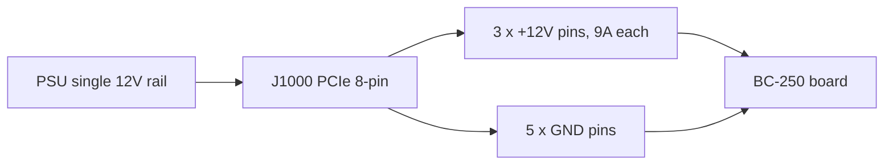

> 🌐 社区翻译。英文版为权威来源，可能更新更及时。发现错误？请提交 issue：[English](../en/03-power-supply.md) · https://github.com/lildebil0/awesome-bc250/issues

# 供电

> **太长不看** —— BC-250 **没有电源按钮，也没有标准 PC 电源插头**。它通过单个 **PCIe 8-pin（6+2）**接口吃 **12 V** —— 和桌面显卡用的同一个插头 —— 峰值约 **~235 W**（超频更高）。你需要一个能在**单路上提供约 250–300 W** 的 12 V 电源。社区走的三条路：一个便宜的**服务器"Flex"PSU**（HP 500 W，eBay 上约 $12）、一个**工业砖块电源**（Mean Well LOP-300/LOP-500），或一个**普通 ATX PSU**（直接把它的 PCIe 线插上）。要避开的两大杀手：一个**把 12 V 拆到弱电流轨上的旧 PSU**，以及**会过热起火的假铜包钢线**。用真铜，**16 AWG 或更粗**。

给板卡供电是新手必须做对的**第二件事**（在[散热](04-cooling.md)之后）—— 也是在接线上偷工减料时最可能引发火灾的一件事。

---

## 板卡到底需要什么

BC-250 是一颗装在加密货币矿机/服务器板卡上的、精简版 PlayStation 5 die。它本是放在机柜里、被喂 12 V 的 —— 所以它**没有普通 PC 的任何便利设施**：

- **没有 ATX 24-pin** 主板接口。
- **没有电源按钮** —— 12 V 一到它就立刻开机（PSU 自己的开关就是你的电源按钮）。
- **PSU 只有一个任务：以足够的电流提供 12 V。**

**供电数据（已确认）：**

| 规格 | 数值 | 来源 |
|------|-------|--------|
| 输入电压 | 12 V DC | [hardware.md](https://github.com/mothenjoyer69/bc250-documentation/blob/main/hardware.md) |
| 典型峰值功耗 | ~220–235 W | 社区实测（[src](https://t.me/c/2424231195/31076)） |
| 接口 | PCIe 8-pin（6+2） | [hardware.md](https://github.com/mothenjoyer69/bc250-documentation/blob/main/hardware.md) · （[src](https://t.me/c/2424231195/14450)） |
| 12 V 上的峰值电流 | 典型约 ~18–20 A，设计余量到约 40 A | （[src](https://t.me/c/2424231195/31076)） |

> **"PCIe 8-pin（6+2）"** 指的是显卡供电插头：一块里六针，外加一个可拆的 2 针卡扣，所以同一根线既能当 6-pin 也能当 8-pin。**6+2** = 6 个固定 + 2 个可拆。这*不是*你主板上的 CPU/EPS 8-pin —— 见下面的警告。

按 PCIe 标准，一个 PCIe 8-pin 的额定值是 **150 W**，而板卡的三个 12 V 触点（Molex Mini-Fit Jr，每个 9 A）可以安全通过**高达约 324 W**（[hardware.md](https://github.com/mothenjoyer69/bc250-documentation/blob/main/hardware.md)）。所以单个 8-pin 在默频下绰绰有余；只有当你推一个激进超频时，那点余量才重要。

**该买多大功率的 PSU：** 目标是 **12 V 电流轨上 300 W 或更多**。一个 300 W 的电源相对约 235 W 的峰值留有健康余量，还能让 PSU 风扇保持安静；有人报告一个 500 W Flex 服务器 PSU 在这个负载下几乎无声（[src](https://t.me/c/2424231195/31076)）。别"为省钱"买低于约 250 W 的 —— 你会让它满负荷边缘运行，它会变吵或干脆关机。

> **钳形表功率曲线（一手电流数据）。** 一次拆解把一只直流电流钳夹在 12 V 馈线上，读出了板卡的实际电流：**游戏吃约 ≈17 A / ~190 W**，而**一次完整的合成压力负载在 2000 MHz / 960 mV 下达到 ≈21 A / ~240–250 W**；把电压再往上推会把它推到 **22–23 A 甚至更高**（[Old Lamer — Part VII](https://youtu.be/pxahl9-YgkY) ~9:01）。这些用实测的电流轨安培数把上面社区的墙插功率数据细化了 —— 也印证了为什么 300 W 的目标留有恰当的余量。*（数据从自动字幕读取 —— 确切数字当作近似。）*

> ⚠️ **点名要避开的 PSU：** 便宜的 **Dell D220P-01**（220 W）和 **Dell D250AD-00**（250 W）被点名为对这块板卡**不足且危险** —— 在 220 W / 250 W 下它们低于板卡峰值，据报告会在游戏负载下断电甚至损坏。别只因为它便宜、"看起来够用"就买。（[elektricM: power](https://elektricm.github.io/amd-bc250-docs/hardware/power/)）

---

## 物理：伏特、安培、瓦特 —— 以及为什么细线会烧

本章的每一条规则都从三个方程里推导而来。学会这些，那些线规表和"绝不用 SATA"的警告就不再是凭空规定。

**功率 = 伏特 × 安培（`P = U·I`）。** 板卡在 **12 V** 下需要 **~235 W**，所以它吃 `235 ÷ 12 ≈ 19.6 A`。这正是为什么钳形表读出 **~17 A 游戏 / ~21 A 压力**（[上文](#板卡到底需要什么)）：瓦数由硅片固定，所以*安培*就是 12 V 被迫给出的那个数。把频率/电压往上推，安培就随瓦数一起爬。

**为什么是 12 V —— 以及为什么 24 V 会要它的命。** 12 V 是这块板卡为之设计的数据中心机柜标准；它板载的 VRM 把它降到 APU 核心运行所需的约 1 V。板卡是**硬连线为 12 V、没有过压保护**的，所以喂它 24 V（例如一个 [LOP-300-**24**](#选项-b--mean-well-工业砖块电源)）会在每个 12 V 部件上加倍电压并瞬间摧毁它。和电流不同，电压没有商量余地。

**载流量 —— 为什么一根线有安培上限。** 一根线就是一个电阻，电流流过电阻会发热：`P_loss = I²·R`。更粗的铜 = 更大的横截面 = **更低的 R** = 同样安培下更少的热。这就是上面那张 AWG 表的全部含义 —— **AWG 数字越小 = 线越粗 = 在更大安培下越安全**。在约 20 A 下，**16 AWG 铜线**保持凉爽；再细，`I²·R` 就会熔化绝缘层。注意那个**平方**：电流翻倍，热量*翻四倍*，这就是为什么重度超频需要第二路馈线，而不只是"多一点点线"。

**电压跌落 —— 另一半。** 损耗在线里的热，是板卡永远见不到的电压：`V_drop = I·R`。一根又长又细的线既会**过热**又会**饿着**板卡，所以即便没有任何东西肉眼可见地熔化，它也可能在负载下掉电（brown out）。又短又粗的铜线能同时解决这两点。

**为什么假"铜"是致命的。** 铜包钢的电阻是真铜的 **~6 倍** —— 同样安培、同样 `I²·R`，所以同一根线里的**热量是 6 倍**。下面的磁铁测试不是质量偏好；它抓的是一个**乘在本就被平方的电流项上的 6 倍系数**。

**为什么绝不用 SATA 或 Molex。** 问题出在*接口*上，不是线上。一个 SATA 供电触点的额定值是 **~54 W** → `54 ÷ 12 ≈ 4.5 A`，超过这个小触点就会把自己烤熟；而板卡要约 20 A，**超出那个上限 4 倍**。PCIe 8-pin 则携带三个粗壮的 12 V 触点（**每个 9 A = 27 A / 324 W**）—— 这*正是*它是正确插头、而 SATA/Molex 永远不可能的原因（见[针脚定义](#8-pin-针脚定义j1000)）。

---

## ⚠️ 会毁掉板卡的两个错误

买任何东西之前先读这一节。

### 1. 别把 PCIe 8-pin 和 CPU/EPS 8-pin 搞混

你的 ATX PSU 有**两种不同的 8-pin 插头**：一种给显卡（**PCIe**），一种给 CPU（**EPS/CPU**，有时标着"CPU"或"4+4"）。**它们看起来几乎一模一样，但针脚形状和极性是反的。** 把一个 CPU 插头硬塞进 BC-250，会把 **+12 V 加到本该是地的地方** —— 你能把整块板卡烧掉。

> *"这个已经讨论过千百遍了 —— 我们有的是 PCIe 供电输入。如果末端针脚的形状不一样，那你拿的就是 CPU 插头……它的极性恰好相反，正负互换。你能把一切都烧个精光。"*（[src](https://t.me/c/2424231195/14450)）

板卡**没有任何检测针校验**，所以没有任何东西能阻止你插错。安全习惯：**看接口卡扣的形状，不确定就在通电前用万用表确认 + 和 −。**

### 2. 别用假"铜"线 —— 它是火灾隐患

这是群里被重复最多的单条安全警告。便宜的成品转接线和廉价"PCIe"线常常是**铜包钢（CCS）**或**铜包铝（CCA）** —— 一层薄铜皮包在钢/铝芯外面。钢的电阻是铜的 **~6 倍**，所以线在负载下过热，可能熔化或燃烧。

> *"转接线在负载下严重过热。结果发现它不是铜，而是带一层薄铜镀层的铁（钢）……电阻高，发热严重，可能引发火灾。为了可靠安全地工作，你必须用至少 2.5 mm² 的全铜线。"*（[src](https://t.me/c/2424231195/108733)）

> *"用磁铁测了 🤣 —— 钢丝。这些钢'丝'的电阻是铜的 6 倍。他们说的那 450 W 到底从哪来？"*（[src](https://t.me/c/2424231195/133546)）

> **信任之前先测：** 磁铁吸钢，不吸铜。如果一个接口或一根线有磁性，把这根线扔掉。

这不止是杂牌线的问题。**Apevia Flex/ITX PSU 曾被发现用钢丝** —— 用磁铁测它们，因为钢在负载下会变得很烫，是火灾隐患。**Apevia ITX-PFC400W** Mini-ITX 用一个 **14-pin 接口**（它能配下面的 [LITE 转接](#自动-ps_on--社区转接)使用，但不建议）。（r/BC250Gaming）

> 🔴 **绝不要通过 SATA 或 Molex 转接给 BC-250 供电。** 板卡吃 **220–280 W**，而这些接口物理上无法安全提供那么多：
> - **SATA→PCIe/8-pin 转接是火灾隐患** —— 一个 SATA 供电接口的额定值只有 **~54 W**（[elektricM: power](https://elektricm.github.io/amd-bc250-docs/hardware/power/)）。
> - **一路裸 Molex 馈线最高约 156 W**（两个 Molex 接口合计）—— 仍然不够（[elektricM: power](https://elektricm.github.io/amd-bc250-docs/hardware/power/)）。
>
> 只用一个**真正的 PCIe 8-pin / EPS 级 12 V 电源**给板卡供电。这和上面的铜 vs 钢警告是两码事：即便是一根*全铜*的 SATA 或 Molex 转接，在这里也不安全，因为接口本身对 220–280 W 的负载就是欠额定的。

---

## 线规与接口指引

板卡文档和群里都认同同一条安全基线：

| 使用场景 | 线 | 来源 |
|----------|------|--------|
| 单个 8-pin，默频 / 轻度超频 | **16 AWG** 铜（~1.3 mm²） | [hardware.md](https://github.com/mothenjoyer69/bc250-documentation/blob/main/hardware.md) |
| 手工自制线，想要余量 | **2.5 mm²**（~13 AWG）全铜 | （[src](https://t.me/c/2424231195/108733)） |
| 重度超频 | 更粗 / **双路馈线**（见 J2000/J2001） | [hardware.md](https://github.com/mothenjoyer69/bc250-documentation/blob/main/hardware.md) |

这些数字并不矛盾 —— **16 AWG 是文档规定的最低值**；那个 2.5 mm² 的数字是某位构建者在一次 CCS 线惊魂后选择的额外余量。**不可商量的部分是"真铜"，而不是确切的线规。** AWG 数字越小 = 线越粗 = 越安全。

对于承载全部电流的接口触点，目标是选峰值额定的：构建者在重度构建上瞄准能扛 **~40 A** 的触点/线，并把它们拧紧或正确压接，而不是依赖松垮的插接（[src](https://t.me/c/2424231195/31076)）。

---

## 8-pin 针脚定义（J1000）

看着板卡的主供电接口 —— **上排全是地，下排除一个地之外都是 12 V**。出自 [hardware.md](https://github.com/mothenjoyer69/bc250-documentation/blob/main/hardware.md)：

```
J1000 (PCIe 8-pin), contacts facing you:

  [ GND  GND  GND  GND ]   ← top row: all ground (−)
  [ GND  12V  12V  12V ]   ← bottom row: one ground + three 12 V (+)
```

群里用大白话说明了同样的极性 —— 把针**从 1 数到 3 = +12 V，4 到 8 = 地**：

> *"针脚一到三应该是正，其余从四到八是负……板卡没有检测校验。拿个测试笔，看哪里是 + 哪里是 −。"*（[src](https://t.me/c/2424231195/14450)）

单路 12 V 电流轨如何分到八个触点上 —— 三个携带 +12 V，五个是地：



这和一个标准 PCIe 8-pin 完全一致，这*正是*为什么一个普通 ATX PSU 的 PCIe 线直接就能用。**如果你自制线，首次通电前用万用表核实每一根针** —— 极性错误在这里毫不留情。

板卡还有两个更小的备用供电接口，**J2000** 和 **J2001** —— 只在重度超频时有用，下文完整介绍。

---

## 超过 300 W —— J2000 / J2001 第二供电接口

> ⚠️ **先读这个。** 本节里的一切都是**手工完成的额外 12 V 接线**。板卡在这些针上**没有极性或检测校验**（和 J1000 一样）—— 把 +12 V 和地接反，通电那一刻就烧板。第二路馈线只有在**两路馈线共用同一个 PSU / 同一条等电位的 12 V 电流轨**时才增加余量；把两个不同的电源捆在一起，可能把电流倒推回其中一个。如果你对自己压接和测量接口没把握，到此为止，老老实实用单个 [J1000 8-pin](#8-pin-针脚定义j1000)。

单个 PCIe 8-pin 接进 [J1000](#8-pin-针脚定义j1000) 在默频和轻度超频下很从容 —— 它的三个 12 V 触点能扛 **~324 W**（9 A × 3 × 12 V，用工业级触点最高可达约 468 W）（[hardware.md](https://github.com/mothenjoyer69/bc250-documentation/blob/main/hardware.md)）。本节存在的理由：一块**激进超频下的 40-CU 板卡可能吃超过 300 W**（[src](https://t.me/c/2424231195/143787)），这正好踩在一个 8-pin 舒适区的边缘。板卡本是为机柜设计的，那里有**第二个 PSU** 喂两个额外接口 —— **J2000** 和 **J2001** —— 所以在桌面上获得超频余量的干净办法，是**用 J2000/J2001 补充 J1000**（或直接焊到板卡上），而不是让一个插头过载（[hardware.md](https://github.com/mothenjoyer69/bc250-documentation/blob/main/hardware.md)）。这也是群里最常被请求的示意图（[src](https://t.me/c/2424231195/135741)）。

### 针脚定义（出自板卡文档）

J2000 和 J2001 **并不相同**。它们兼容 **Molex Micro-Fit BMI**（[part 444280801](https://www.molex.com/en-us/products/part-detail/444280801)）。针 1 是白色丝印三角（下面的 `v`）：

```
        J2000                    J2001
   v                        v
[ LED1  12V  12V  12V ]   [ 12V  12V  12V  PGD ]
[ LED2  GND  GND  GND ]   [ GND  GND  GND  GND ]
```

| 针 | 含义 |
|-----|---------|
| `12V` | +12 V 供电输入（每个接口三个） |
| `GND` | 地 |
| `PGD` | **PGOOD** —— 当机柜背板里有第二个 PSU 时读到 5 V；是个信号针，**不是**供电输出 |
| `LED1` / `LED2` | 低电平有效的 LED 输出，镜像绿/红背板 LED |

**为冗余起见，文档说要同时用 J2000 和 J2001**（[hardware.md](https://github.com/mothenjoyer69/bc250-documentation/blob/main/hardware.md#j2000-and-j2001)）。注意两者的**列布局不同** —— J2000 上 LED 针在第一列，三个 12 V 针都在上排；J2001 上 PGD 针在右上，下排全是地。**连接前测量每一根针** —— 别想当然以为一个 Micro-Fit 外壳在两者上以同样方式插入。⚠ 用万用表对照你自己的板卡核实确切的针-1 朝向；LED/PGD 针**绝不能**接到 12 V。

### 社区采用的实操方法

你不需要机柜背板。群里反复出现的配方很简单：**把一个 PCIe 8-pin 接进 J1000，再压接一个 Molex Micro-Fit 3.0 插头，把同样的 12 V 喂进相邻的 J2000**（[src](https://t.me/c/2424231195/142662)，[src](https://t.me/c/2424231195/138371)）。一位构建者把这根具体的线描述为*"一个 PCIe 接口和两个 Micro-Fit 3p 接口"*，从单一电源引出（[src](https://t.me/c/2424231195/143938)）—— 也就是把一根 PCIe 线的 12 V/GND 拆出来，同时喂给 8-pin 和 Micro-Fit。

**要买的接口**（自行组装，Molex Micro-Fit 3.0）：

| 部件 | Molex 编号 | 备注 |
|------|--------------|------|
| 外壳 | **43025-0800**（8 路） | 插头本体（[src](https://t.me/c/2424231195/142659)，[src](https://t.me/c/2424231195/14797)） |
| 压接端子 | **43030** 系列 | 每根线一个（[src](https://t.me/c/2424231195/142659)） |

只填充 **12 V 和 GND** 位置（对照上面的针脚定义表）；让 `PGD` / `LED1` / `LED2` 空着。用和[主 8-pin —— 见线规指引](#线规与接口指引)同样的**真铜、≥16 AWG** 线及压接规范；一根手工压接、会过热的 12 V 馈线，正是本章前面描述的那种火灾风险。

> 🛠 **Micro-Fit 组装的坑（出自一份 Molex 操作指南）。** 压接这些插头的实用笔记（[Molex Micro-Fit video](https://youtu.be/aaDUkPn9ASE)）：
> - **线规：** **建议 18 AWG，可接受 20 AWG** —— 负载在三个 12 V 针上三分，所以每根线承载三分之一。
> - **削掉插头上的塑料卡扣**，让它平贴板卡。
> - **两个接口不可互换** —— 接好线后**给它们做标记**，这样你永远不会把 J2000 和 J2001 的插头互换。
> - **没有压接钳？焊接是有效的替代** —— 把线焊进端子，而不是压接。
> - 做对的话，**横跨两个接口的九条 12 V 线能安全承载 >400 W。**


### 给 40-CU 板卡供电 —— 三路输出线改造

在一次 **40-CU 解锁**之后，板卡在 FurMark 里可能从墙插吃 **~280 W**（用 CPU-X 测得），而**单个 8-pin PCIe 在 FurMark 里峰值约 ~220 W** —— 所以一块大幅解锁的板卡需要不止一路馈线。**[Metalfish 500W](#社区采用的热门-psu-型号)** 有 **3 个共享的 PCIe/CPU 输出**；对 40-CU 构建，把**全部三个**都接到板卡（一次*"三路输出线改造"*）：

- 用 **18 AWG** —— 在 FurMark 下线材保持凉爽；在把负载拆到 3 路馈线之前它们烫得危险。
- **板卡侧** = Micro-Fit 3.0 母座；**PSU 侧** = 4.2 mm Mini-Fit PCIe 母座。**先用万用表把每根线都对应清楚。**
- 来自讨论帖的粗略线规算法：18 AWG ≈ **5 A @ 12 V ≈ 每根线 60 W** × 一个接口里的 3 根 ≈ 180 W，× 2 个接口 ≈ 360 W —— **但并联导体不会均等分流，所以别把它们跑到极限。**

（致谢：**Korayosulu**，r/BC250Gaming，受一个 Oldlamer YouTube 视频启发。）

> **署名：** 上面的 J2000/J2001 针脚定义出自 **elektricM 硬件文档**，其逆向工程建立在 **[mothenjoyer69 的 bc250-documentation](https://github.com/mothenjoyer69/bc250-documentation)** 之上（也致谢 Segfault、neggles、yeyus）。动手压接方法和部件编号出自社区聊天，已在文中引用。

---

## 社区采用的 PSU 选项

有三条实用的路。它们都提供 12 V；区别在价格、体积、噪音，以及你做多少接线活儿。

> 💡 **用一个 PSU 给多块板卡供电？** 本章的一切都是按单块板卡写的。对于由一个大服务器 PSU 供电的多板卡机组，用社区的 **[Needleroozer/bc250-power-board](https://github.com/Needleroozer/bc250-power-board)** —— 一块配电 PCB，把一个 PSU 拆成给每块 BC-250 的干净 12 V 馈线（[elektricM: power](https://elektricm.github.io/amd-bc250-docs/hardware/power/)）。

| 选项 | 它是什么 | 价格 | 优点 | 缺点 |
|--------|-----------|-------|------|------|
| **服务器"Flex Slot"PSU** | HP/Dell 等的 1U 数据中心砖块（例如 HP 500 W 白金） | 二手约 ~$12–25 | 便宜、近乎不可摧毁、单路 12 V 巨大、非常紧凑 | 需要跳线/电阻才能启动；那只 15000 RPM 的小风扇吵得像喷气机，除非更换；8-pin 要你自己接 |
| **工业砖块（Mean Well）** | 封装式 AC→DC 电源，单路 12 V（LOP-300 = 300 W/25 A、LRS-350、LOP-500） | 全新约 ~$25–45 | 全新、干净单路、安静、数据手册有规格 | 8-pin 要你自己接；裸接线柱需要外壳 |
| **普通 ATX / Flex-ATX / SFX PC PSU** | 任何像样的现代 PC 电源 | 不一 | **零改造** —— 它的 PCIe 8-pin 线直接插上；对新手最安全 | 对迷你构建偏大；瓦数过剩；注意下面的单路规则 |

### 选项 A —— 服务器 Flex PSU（最热门的便宜路线）

社区最爱是一个二手 **HP Flex Slot 500 W** 服务器电源 —— *"在 eBay 上以可笑的 $12 买下……这些几乎能跑到天荒地老，余量远超数据中心更换它们的频率，加上白金效率"*（[src](https://t.me/c/2424231195/31076)）。这些没有 PCIe 插头，所以你要适配一个：

1. **启动 PSU：** 用跳线或自锁开关短接两个短的启动针（针 1–2）。
2. **使能 12 V 电流轨：** 在**针 3 和 GND 之间放一个约 500 Ω 电阻**（左边那个宽针）。
3. **取出 12 V：** 要么把一个 PCIe 8-pin 直接焊到 12 V 针上，要么往外壳里装一个接口 —— *"但线材和接口必须扛得住峰值的 40 A"*（[src](https://t.me/c/2424231195/31076)）。

人们用过的其他经过验证的服务器/主机砖块：**PlayStation 3 FAT PSU**（32 A / 12 V —— *"绰绰有余且非常稳定，我推荐它给 BC-250"*（[src](https://t.me/c/2424231195/62332)），[src](https://t.me/c/2424231195/102734)）、Dell D550E、Juniper JPSU-350，以及各种 ASIC 矿机电源。

> **用一个 Xbox 手柄给整块板卡上电 —— [ESP32-BC250-LOP_PSU-PowerON-Xbox](https://github.com/dexikdex/ESP32-BC250-LOP_PSU-PowerON-Xbox)**（[src](https://t.me/c/2424231195/142498)）。这块社区板卡（一个 **ESP32_Relay X2**，型号 **303E32DC210**，双继电器）做**被动 BLE 扫描**：当你配对的 Xbox 手柄开机时，ESP32 看到它的蓝牙广播，触发一个接在板卡 **PWR_SW** 针上的 **GPIO17** 继电器来切换上电。第二个继电器（**GPIO16**）同时把 12 V 切到外设（例如一个风扇控制器）。其他针：**GPIO23** = 物理机箱按钮输入，**GPIO19** = 按钮 LED 输出，**GPIO4** = PC 状态监测。手柄照常与 PC 保持配对 —— 扫描不会抢走它的系统配对。许可证 GPL-3.0，作者 dexikdex。

> **关于风扇的提醒：** 这些砖块里的原装 40 mm 风扇能转到约 15000 RPM，*"听起来像喷气机起飞"*。实际上，在 BC-250 这点不大的负载下它保持安静，多名用户确认它*"配我们这块小板卡一点也不吵"*（[src](https://t.me/c/2424231195/33455)）。如果它困扰你，换一个气流足够的、更安静的 40 mm 风扇。

> 💡 **最佳预算之选 = 一个二手服务器 PSU。** 一个二手约 500 W 的服务器电源，**$10–30**，是获得一条大的单路 12 V 最便宜的途径，单瓦价格难以击败（[Old Lamer — Part VII](https://youtu.be/pxahl9-YgkY) ~10:12）。**一个 12 V LED 灯条 / 监控摄像头的电源砖也能跑这块板卡**，但要小心：这些常常**缺少 PC PSU 才有的保护电路**（过流、过温、短路切断），所以一旦出故障没有任何东西能跳闸。优先选真正的 PC/服务器 PSU；只在万不得已时用 LED 灯条电源，并让它远在额定值之内运行。*（字幕来源 —— 数字为近似。）*

### 选项 B —— Mean Well 工业砖块电源

一个全新的 **Mean Well LOP-300-12**（300 W、12 V、25 A）或 **LRS-350** 是整洁可靠之选：直接出自数据手册的单路 12 V、没有拆轨的游戏、且安静。更大的 **LOP-500** 也有，如果你想要最大超频余量。你仍然要自己把 PCIe 8-pin 接到它的螺丝接线柱上，而且因为接线柱裸露，你应该把它装进盒子里。群里流传的产品页：[ChipDip 上的 LOP-300-12](https://www.chipdip.ru/product/lop-300-12-blok-pitaniya-12v-25a-300vt-mean-well-9001511866) · [LRS-350-12](https://www.chipdip.ru/product/lrs-350-12-blok-pitaniya-12v-29a-348vt-mean-well-9000334417)。

> 🔴 **买 `-12`，不是 `-24` —— 后缀就是输出电压。** Mean Well 以多种电压销售 LOP-300，而 **[LOP-300-24](https://www.meanwell.com/webapp/product/search.aspx?prod=LOP-300) 输出 24 V** —— 是这块板卡能承受的**两倍**。BC-250 **仅 12 V**（见[板卡需要什么](#板卡到底需要什么)）；喂它 24 V 会**瞬间摧毁它**。你**必须**用 **LOP-300-_12_**（12 V / 25 A）版本。同样的规则适用于这一族的每个型号 —— 接线前**永远确认末尾数字是 `-12`**（LOP-300-12、LRS-350-12、LOP-500-12 …）。这块板卡没有过压保护。

> **给 LOP-300 自制 8-pin 的物料清单（俄罗斯构建）。** 一位构建者记录了压接板卡侧接口所需的确切 JST 部件，全部来自 ChipDip（[4pda — sftk](https://4pda.to/forum/index.php?showtopic=1104980)）：

| 部件 | JST 编号 | 作用 |
|------|-----------|------|
| 6-pin 外壳 | **VHR-6N** | +12 V / GND 插头本体 |
| 压接端子 | **SVH-21T-P1.1** | 每根线一个 |
| 3-pin 外壳 | **VHR-3N**（又名 **PHU2-03**） | 次级馈线 |

6-pin 上的针脚定义：位置 **1-2-3 = +12 V（黄线）**，位置 **4-5-6 = GND（黑线）**。用 **16 AWG** 铜线接（**18 AWG 最低**仍然够用；**22 AWG 不在考虑之列** —— 对这个电流太细）。和上面[线规指引](#线规与接口指引)同样的真铜规则。

### 选项 C —— 一个普通 PC PSU（对新手最简单、最安全）

如果你已经有一个像样的 **ATX、Flex-ATX、SFX 或 TFX** 电源，那你就搞定了：**把它的 PCIe 8-pin 线插进板卡。** 不用跳线、不用焊接、不用电阻。这是给一个昨天才开箱的人风险最低的选项。要在没有主板的情况下给它上电，把 24-pin 上的**绿色 PS_ON 线短接到任意黑色地**（标准的"回形针"小技巧）。紧凑的 **Flex-ATX 400 W** 电源在小机箱里很受欢迎。

---

## 开关 PSU（板卡没有电源按钮）

板卡**没有原生的 ATX 电源控制** —— 12 V 一出现它就开机（见上面的[无便利设施清单](#板卡到底需要什么)），所以你的开关必须放在 **PSU 一侧**。r/linux_gaming 社区讨论帖记录了实用、经确认的方法：

- **给 PS_ON 加一个真正的电源开关。** 用一个**翘板/自锁开关**把 PSU 的 **PS_ON → GND** 桥接起来，而不是固定的回形针 —— 拨动它就让整套东西上下电。在 24-pin 接口上，PS_ON 通常是**绿线 / 针 16**，任意黑线是地。把这一条和下一条配合，板卡才会在电流轨起来时真正开机。
- **把板卡的 `AUTO_PWRON` 跳线设为通电即自动开机。** 跳线在自动开机位置时，PSU 一提供 12 V，BC-250 就开机 —— 于是 PSU 的 PS_ON 开关成了整个系统真正的单一电源按钮。
- **在模块化 PSU 上桥接 PS_ON 之前先找到它 —— 针位因型号而异。** 在标准 24-pin 接线上是绿线，但模块化电源各不相同：一个 **TFSkywind 350 W** 用**每排的两个中间针（4 + 11）**，而一个 **Apevia 400/500 W** 用**同一排上的两个针（8 + 13）**。核对你自己的（万用表 / PSU 自己的针脚定义），别想当然以为是绿线/针 16。
- **把一个便宜 PSU 精简成一束干净的线。** 板卡只需要 **1 根绿（PS_ON）+ 3 根黄（12 V）+ 6 根黑（GND）**；其余那一大束可以剪掉，做出整洁的构建。
- **在睡眠时让 PSU 风扇停转（社区变通办法）。** 因为板卡睡眠时 PSU 还在运行，有些机主把 **PSU 风扇菊花链接到 BC-250 的风扇排针**上，让它随板卡一起降速。针对这点更干净、工程上更正确的修法是下面的**[社区转接](#自动-ps_on--社区转接)**和**[真 ATX 硬件改造](#真-atx-硬件改造iamdarkyoshi)** —— 两者都让 PSU 在板卡关闭时完全断电，而不是让它空转。
- **用一个微型 MCU 自己搞定。** 如果你宁可自己搭建自动 PS_ON 逻辑而不是买[社区转接](#自动-ps_on--社区转接)，任何小型微控制器都能保持 PS_ON 并监视板卡的 `system_on`/风扇排针信号。人们会用的两个便宜、真实的选项：一个 **ESP32**（被上面那块 [Xbox 手柄上电板](#选项-a--服务器-flex-psu最热门的便宜路线)使用），或者为了最简物料，**[WCH CH32V003](https://www.wch-ic.com/products/CH32V003.html)** —— 一颗不到 $0.15 的 RISC-V MCU，带 **3.3 V/5 V I/O**，很适合用来门控一条 PS_ON 线。这是 DIY 路线（你写固件并安全接线）；现成的 [mosfet.party 转接](#自动-ps_on--社区转接)和下面的 [iamdarkyoshi 硬件改造](#真-atx-硬件改造iamdarkyoshi)是免编码的替代品。

### 自动 PS_ON —— 社区转接

上面的方法要么让 PS_ON 永久桥接（PSU 从不完全关断），要么放在一个你手动拨的开关上。**u/pilim_**（r/BC250Gaming）卖一个**"BC250 ATX PSU Control Adapter"**，它能**自动**保持 PS_ON，于是你可以用一个普通 PC PSU，**而无需**短接绿色 PS_ON 线或接一个自锁按钮。商店：https://mosfet.party/products/adapter-1

它如何自动触发：

1. 你按一个按钮 → 转接器拉高 **PS_ON**。
2. BC-250（在 **BIOS 里设为自动开机**）开机并拉起一个 **`system_on`** 信号。
3. 只要那个信号存在，转接器就**保持 PS_ON**。
4. 系统关机时信号掉落 → 转接器再保持 PS_ON **约 3 秒**，让外设干净地断电 → 然后 **PSU 完全关断**。

`system_on` 信号从**板卡的风扇排针**读取，所以安装它**无需焊接**（而且它还留出一个口给第二个风扇）。因为 **5VSB 在空闲时几乎不吃电流**，PSU 完全关断 —— 这修复了上面列为未解小技巧的那个常见的*"板卡关了 PSU 风扇还在转"*问题。

**三个版本：**

| 版本 | 它是什么 | 大致价格 |
|---------|-----------|-------------|
| **FSP500 即插即用** | 免焊接；用 FSP500-30AS 的 10-pin 线 | ~$35–45 |
| **通用"LITE"** | 带焊盘的裸 PCB | ~$25 |
| **24-pin 即插即用** | 给标准 24-pin PSU | — |

**兼容性：**

- **FSP500 即插即用**配 **FSP500-30AS**（和一些其他 10-pin PSU）能用，但**不**配标准 24-pin（例如 Corsair CV750）—— 那些用 **LITE** 或 **24-pin** 版本。
- **LITE / 24-pin** 版本配 **Metalfish 500W** 能用。
- 它**不能**驱动 **Mean Well LOP** —— LOP 没有使能针，所以需要一个外部继电器。

**按钮 / LED I/O：** 接受任何**常开**按钮（甚至两根裸线碰一下）；板载一个按钮，并有给 **6×6 mm** 按钮和一个机械键盘轴的焊位。一个可选的 **`BTN_OUT`** 可以焊到 BC-250 内部电源按钮（1 根线）以便用按钮关机。

**开源：** 制作者把接线图和 3D 模型发布在他们的 **GitHub / GitLab** 上，从 [mosfet.party](https://mosfet.party/products/adapter-1) 链接过去。还有一个现成的机箱卡槽 —— **NexGen3D "Redux" 机箱（v4.1）**有一个给 LITE PCB 的安装位：https://www.printables.com/model/1614131

### 真 ATX 硬件改造（iamdarkyoshi）

> ⚠️ **进阶、风险自负的硬件改造。** 这会改接板卡的供电电路 —— 一失手就烧板。[上面的转接](#自动-ps_on--社区转接)能让你免焊接获得同样的便利。

**iamdarkyoshi**（r/BC250Gaming）逆向了 BC-250 的供电电路并改造它实现**真 ATX 行为**：给 BC-250 上电 → PSU 唤醒；关机 → PSU 关断；待机功能（例如 USB 口供电）仍然有效。

用到的 ATX 标准接线：

| 线色 | 信号 |
|-------------|--------|
| **绿** | PS_ON（Power On） |
| **紫** | +5VSB |
| **灰** | PG（Power Good） |

在一个 **Corsair SFX450** / SFX450 级电源上确认可用。该改造**移除一个电感**；注意 **`PLD5`** 是改造移除的那个电感正上方的电感，**其左侧携带 5 V** —— 用来取待机 5 V 很方便。

写作记录：YouTube https://youtube.com/watch?v=jIhgyB8x3fQ · BC-250 Discord https://discord.gg/8eZfFWhczz

---

## 社区采用的热门 PSU 型号

这些是群里人们真正拿来构建的确切型号 —— **社区分享之选，不是背书。** 无论什么外形，记住板卡需要**一条单路 12 V 接到一个 PCIe 8-pin（6+2）** —— 见上面的[针脚定义（J1000）](#8-pin-针脚定义j1000)和[线规指引](#线规与接口指引)。任何非封装式的（Mean Well、服务器砖块、回收的主机 PSU）你都要自己接 8-pin。

> **按地区之选（r/BC250Gaming）：** 在**美国以外**，**Metalfish 500W Flex ATX** 是社区之选；在**美国境内**是 **FSP500-30AS**。**Metalfish 600W** 版本据报告**不**可靠 —— 据社区说法它配 BC-250 **根本不启动**，因为其**约 5 V 最小负载要求得不到满足**（板卡在 5 V 上几乎不吃电，所以 PSU 永远见不到足够的负载来启动）。坚持用 500W，NexGen3D 即便在极限超频下也测过它，而且它是 [bc250 文档](https://github.com/mothenjoyer69/bc250-documentation)里的推荐型号。它唯一的缺点是风扇噪音 —— 换一个 Noctua。

| 型号 | 外形 | 大致瓦数 | 备注 |
|-------|-------------|---------------|------|
| **Mean Well LOP-300(-12)** | 工业开放式/封装砖块 | 12 V 上 300 W / 25 A | 最热门的紧凑之选；能塞进最小的机箱。用于若干整洁的构建（[src](https://t.me/c/2424231195/80841)，[src](https://t.me/c/2424231195/78870)，[src](https://t.me/c/2424231195/134585)）并以全新转卖（[src](https://t.me/c/2424231195/74703)）。🔴 **买 `-12`（12 V）；`-24` 输出 24 V，会要板卡的命** —— 见[选项 B](#选项-b--mean-well-工业砖块电源)。 |
| **Mean Well LRS-350-12** | 工业开放式 | 12 V 上 350 W / 29 A | 同一族里的开放式 350 W 12 V 选项（[src](https://t.me/c/2424231195/41013)）。 |
| **Mean Well LOP-500 / LOP-600** | 工业砖块 | 500–600 W | 给最大超频余量的更大兄弟；一位用户订了 LOP-500-12（[src](https://t.me/c/2424231195/111161)）。⚠ 在数据手册上核实确切规格。 |
| ★ **Mean Well GST280A12-C6P** | 封装式桌面适配器 | 12 V 上 280 W（约 252 W 可用） | **免焊接之选。** 出厂自带一个**工厂 PCIe 6-pin 输出** —— 通过一个 **8-pin-180° 转接**接上就搞定，无需重新排针。在 Ozon 上买（[4pda — sairius](https://4pda.to/forum/index.php?showtopic=1104980)）。 |
| **Flex ATX**（例如 Seasonic flex、SSP-250SUB） | Flex-ATX 服务器砖块 | ~250–400 W | 常见的紧凑服务器外形。一个 Seasonic flex 给一台改造的一体机供电（[src](https://t.me/c/2424231195/30914)）；另一个构建用了一个通用 flex-ATX（[src](https://t.me/c/2424231195/84001)）。 |
| **TFX**（例如 Vinga 400W / TFX-400） | TFX | ~400 W | 用于若干构建 —— 例如一个 Vinga 400 W（TFX-400）跑 3750/2000 超频（[src](https://t.me/c/2424231195/118771)）。 |
| **SFX** | SFX | 不一（~250–600 W） | 紧凑 PC 外形，直接插入 —— 例如一个 SFX 电源用在 MasterBox NR200P 构建里（[src](https://t.me/c/2424231195/81149)）。 |
| **PS3 FAT（"phat"）PSU** | 回收的主机砖块 | 12 V 上约 32 A（约 380 W 级） | 便宜的回收选项，*"绰绰有余且非常稳定"*（[src](https://t.me/c/2424231195/62332)）；长期使用已确认（[src](https://t.me/c/2424231195/78829)，[src](https://t.me/c/2424231195/78821)）。接线取电：焊到 12 V / 12 V-RTN 焊盘，桥接 STBY+5V 以启动（[src](https://t.me/c/2424231195/102734)）。**首版机型输出瓦数最高**（早期 FAT 配的是约 400 W 的 PSU（[src](https://t.me/c/2424231195/9254)））—— ⚠ 核实你手里是哪一版，后期的会降额。 |
| **Huntkey 360W**（ASIC PSU） | ASIC 矿机砖块 | 360 W，每条线 180 W | 一个回收的 ASIC 电源，*"每条线 180 W"*（[src](https://t.me/c/2424231195/37009)）。 |
| **Pico-PSU** 风格 | Pico（12 V DC-DC） | 低 —— 供给电流轨，而非 APU | 因超紧凑 / 更低空闲功耗被提及（[src](https://t.me/c/2424231195/66387)，[src](https://t.me/c/2424231195/123545)）。⚠ 核实 —— 群里 Pico-PSU 是给主板用的 12 V→5/3.3 V 转换器，搭配一个干真正活儿的外部 12 V 砖块（[src](https://t.me/c/2424231195/66064)）；它**不是**给 8-pin 的独立 12 V 电源。 |
| **Metalfish 500W** Flex ATX | Flex ATX | 500 W | **非美国社区之选**（见上面的地区说明）。NexGen3D 即便在极限超频下也测过它；唯一缺点是风扇噪音（换一个 Noctua）。有 **3 个共享的 PCIe/CPU 输出** —— 见下面的 [40-CU 三路输出馈线](#给-40-cu-板卡供电--三路输出线改造)。（r/BC250Gaming） |
| **FSP500-30AS** | Flex ATX（10-pin） | 500 W | **美国社区之选**（见上面的地区说明）。原本为 NUC 系统打造，所以**短接主引线强制开机**，就像 24-pin ATX。eBay 上约 $10–30。配 [FSP500 即插即用转接](#自动-ps_on--社区转接)能用。重排针提示见下。 |

> **FSP500-30AS 免压接重排针小技巧（r/BC250Gaming）。** RTX 30 系 Founders Edition 配了一根**双母 PCIe → 12-pin Micro-Fit 转接线**；买一根副厂的（Amazon 上约 $12–18），加上空白 Micro-Fit 外壳和一个**约 $6 的 Micro-Fit 退针工具**，然后**取出工厂压接的针，把它们重新插进**匹配 BC-250 针脚定义的新外壳 —— **无需剪线、压接或焊接**。

> ★ **唯一完全省去接线的 PSU —— Mean Well GST280A12-C6P。** 这里其他每个选项（LOP / LRS / Metalfish / FSP）都要你自己**焊接或重排一个 8-pin**。**GST280A12-C6P** 是例外：它出厂时就**已经接好一个 6-pin PCIe 插头**，所以你只要通过一个 **8-pin-180° 转接**喂进去 —— **不用焊接、不用重排针**。让板卡 8-pin 的两个内侧针空着（6-pin 只填外侧位置，匹配 [J1000 针脚定义](#8-pin-针脚定义j1000)）。额定 280 W ≈ 12 V 上 **252 W 可用** —— 够默频和轻度超频。在 Ozon 上购得（[4pda — sairius](https://4pda.to/forum/index.php?showtopic=1104980)）。

---

## ⚠️ 那个坑住所有人的 PSU 规格：单路 vs 多路 12 V

一个旧的品牌 PSU 可以有很高的总瓦数却**依然失败**，因为它**把 12 V 拆成几路弱电流轨**，每一路单独都低于板卡所需：

> *"给所有想买旧品牌 FSP 之类的人一条重要提醒。这里要紧的是 12 V 的电流输出能力。在旧 PSU 里 12 V 被拆到两路上，每一路单独都供不上足够的功率。要么买一个余量很大的，要么搞一个现代 DC-DC PSU，那里 12 V 是单路，能输出全部瓦数。"*（[src](https://t.me/c/2424231195/7561)）

**规则：** 优先选**单路 12 V** 的 PSU（任何现代 DC-DC 设计、服务器 Flex 或 Mean Well 都符合）。如果你必须用一个旧的多路电源，确保**单独一路**就覆盖约 250 W，或买一个余量很大的。

---

## 一个真实的构建是什么样

- **机箱内即插即用：** 一块装在小铝制机箱里的板卡，由一根普通的 **ATX PCIe 8-pin 线**（套管标着 *PCI-E 16AWG*）供电 —— 正是那条免改造路线（[src](https://t.me/c/2424231195/41666)）。
- **接口区域：** 板卡特写，显示白色的**风扇排针**和黑色的**供电接口**（J2000/J2001 区域），你要往那儿接线（[src](https://t.me/c/2424231195/39395)）。
- **一台能用的桌面整机：** 板卡立在它的 I/O 挡板上，LED 亮着，靠一个外部 12 V 砖块运行（[src](https://t.me/c/2424231195/27556)）。
- **仅限专家：** 一个 **Molex Micro-Fit 接口用粗铜和厚焊料直接焊到板卡的 12 V 焊盘上** —— 那个"绕过原装插头"的超频改造。有效但毫不留情；只在你懂 ГОСТ 级焊接时才尝试（[src](https://t.me/c/2424231195/135782)，以及 [Jack Fisher 的拆解笔记](https://t.me/c/2424231195/92185)）。
- **一个扛不住的 PSU：** 一位机主跑了一个 **Corsair VS450**，看到它的**线材升温到 40–60 °C**，随后电源在负载下**关机**；换成 **Aerocool W550** 解决了问题，再无麻烦（[4pda — IlopGG](https://4pda.to/forum/index.php?showtopic=1104980)）。这是下面[单路 vs 多路 / 余量规则](#那个坑住所有人的-psu-规格单路-vs-多路-12-v)的教科书案例 —— 12 V 余量太少表现为线材发烫和关机。

<p align="center">
  <br>
  <sub>Photo: Maxim · <a href="https://t.me/c/2424231195/39231">source</a></sub>
</p>

---

## 推荐的入门配置

| 档位 | 这样做 | 为什么 |
|------|---------|-----|
| **最简单 / 最安全** | 任何现代**单路 ATX/SFX PSU**，插上它的 PCIe 8-pin，用回形针短接 PS_ON | 零改造，极性保证正确 |
| **最便宜 / 紧凑** | 二手 **HP Flex 500 W**，短接针 1–2，针 3→GND 接 500 Ω，真铜 16 AWG 8-pin | 约 $12，小巧，单路 12 V 巨大 |
| **最干净的新构建** | 装进外壳的 **Mean Well LOP-300-12**，压接的 16 AWG 8-pin | 全新、安静、单路、数据手册有规格 |

无论你选哪个：**单路 12 V、≥300 W、真铜线 ≥16 AWG、PCIe（而非 CPU）极性、用磁铁测你的线。**

---

## 来源

- 硬件参考（接口、针脚定义、AWG、J2000/J2001）—— [mothenjoyer69/bc250-documentation `hardware.md`](https://github.com/mothenjoyer69/bc250-documentation/blob/main/hardware.md) · [J2000/J2001 章节](https://github.com/mothenjoyer69/bc250-documentation/blob/main/hardware.md#j2000-and-j2001)
- PCIe-vs-CPU 极性与针脚定义警告 —— https://t.me/c/2424231195/14450
- 单路 vs 多路 12 V —— https://t.me/c/2424231195/7561
- 假铜包钢线火灾隐患 —— https://t.me/c/2424231195/108733 · https://t.me/c/2424231195/133546 · Apevia 钢丝 / ITX-PFC400W 14-pin 警告 —— r/BC250Gaming
- 不安全的 SATA/Molex 转接（SATA ~54 W，两个 Molex 合计 ~156 W）、点名危险的 Dell D220P-01 / D250AD-00、多板卡配电 PCB（[Needleroozer/bc250-power-board](https://github.com/Needleroozer/bc250-power-board)）—— [elektricM: power](https://elektricm.github.io/amd-bc250-docs/hardware/power/)
- 自动 PS_ON 转接（u/pilim_，"BC250 ATX PSU Control Adapter"）—— 商店 https://mosfet.party/products/adapter-1 · NexGen3D "Redux" v4.1 LITE 安装位 https://www.printables.com/model/1614131 · r/BC250Gaming
- 真 ATX 硬件改造（iamdarkyoshi）—— YouTube https://youtube.com/watch?v=jIhgyB8x3fQ · BC-250 Discord https://discord.gg/8eZfFWhczz · r/BC250Gaming
- Metalfish 500W（非美国之选）/ FSP500-30AS（美国之选）、600W 不可靠、40-CU 三路输出线改造（Korayosulu，受一个 Oldlamer YouTube 视频启发）、FSP500-30AS 免压接重排针小技巧 —— r/BC250Gaming
- HP Flex 500 W 完整指南（启动流程、风扇、40 A 接线）—— https://t.me/c/2424231195/31076 · 风扇噪音后续 —— https://t.me/c/2424231195/33455
- PS3 FAT PSU 作为 12 V 电源 —— https://t.me/c/2424231195/62332 · 取电/启动方法 https://t.me/c/2424231195/102734 · 长期使用 https://t.me/c/2424231195/78829 · https://t.me/c/2424231195/78821 · 首版约 400 W PSU https://t.me/c/2424231195/9254
- 热门社区 PSU 型号 —— Mean Well LOP-300 构建 https://t.me/c/2424231195/80841 · https://t.me/c/2424231195/78870 · https://t.me/c/2424231195/134585 · https://t.me/c/2424231195/74703 · LRS-350-12 https://t.me/c/2424231195/41013 · LOP-500-12 https://t.me/c/2424231195/111161 · Seasonic/flex-ATX https://t.me/c/2424231195/30914 · https://t.me/c/2424231195/84001 · TFX Vinga 400W https://t.me/c/2424231195/118771 · SFX in NR200P https://t.me/c/2424231195/81149 · Huntkey 360W ASIC https://t.me/c/2424231195/37009 · Pico-PSU https://t.me/c/2424231195/66387 · https://t.me/c/2424231195/66064 · https://t.me/c/2424231195/123545
- 自己剪/焊 8-pin —— https://t.me/c/2424231195/41646 · 直焊接口拆解 —— https://t.me/c/2424231195/92185
- 通过 J2000/J2001 超过 300 W（第二接口）—— 实用的 PCIe 进 J1000 + Micro-Fit 进 J2000 方法 https://t.me/c/2424231195/142662 · https://t.me/c/2424231195/138371 · 一 PCIe 两 Micro-Fit 线 https://t.me/c/2424231195/143938 · Micro-Fit 3.0 部件（43025-0800 外壳 + 43030 端子）https://t.me/c/2424231195/142659 · https://t.me/c/2424231195/14797 · 40-CU 超频吃 >300 W https://t.me/c/2424231195/143787 · 请求第二接口示意图 https://t.me/c/2424231195/135741
- 构建照片 —— 机箱内 8-pin https://t.me/c/2424231195/41666 · 接口区域 https://t.me/c/2424231195/39395 · 能用整机 https://t.me/c/2424231195/27556 · 焊接的 Micro-Fit https://t.me/c/2424231195/135782
- ESP32 给 Flex/LOP PSU 自动上电 —— [dexikdex/ESP32-BC250-LOP_PSU-PowerON-Xbox](https://github.com/dexikdex/ESP32-BC250-LOP_PSU-PowerON-Xbox)（[src](https://t.me/c/2424231195/142498)）
- PSU 开关控制（PS_ON → GND 翘板开关 + AUTO_PWRON 跳线；模块化 PS_ON 针位 —— TFSkywind 4+11、Apevia 8+13；1 绿 + 3 黄 + 6 黑 线束；PSU 风扇接板卡排针的变通）—— r/linux_gaming 社区讨论帖 https://www.reddit.com/r/linux_gaming/comments/1nvsgji/
- Mean Well 产品页 —— [LOP-300-12](https://www.chipdip.ru/product/lop-300-12-blok-pitaniya-12v-25a-300vt-mean-well-9001511866) · [LRS-350-12](https://www.chipdip.ru/product/lrs-350-12-blok-pitaniya-12v-29a-348vt-mean-well-9000334417)
- 🔴 LOP-300-**24** 输出 24 V（会要 12 V-only 板卡的命）—— 改用 LOP-300-**12** —— [Mean Well LOP-300 系列](https://www.meanwell.com/webapp/product/search.aspx?prod=LOP-300) · [LOP-300-24（24 V/12.5 A）数据手册条目，DigiKey](https://www.digikey.com/en/products/detail/mean-well-usa-inc/LOP-300-24/22040910)
- CH32V003（WCH RISC-V MCU，3.3/5 V I/O，约 $0.10）作为 DIY PS_ON 控制器，替代 ESP32 / mosfet.party 转接 / iamdarkyoshi 改造 —— [WCH CH32V003](https://www.wch-ic.com/products/CH32V003.html)
- Metalfish 600 W 不启动（5 V 最小负载不满足）—— 社区报告（r/BC250Gaming）
- 钳形表功率曲线（游戏 ≈17 A/190 W，压力 ≈21 A/240–250 W @2000 MHz/960 mV）、12 V LED 灯条 PSU 警示、二手服务器 PSU 作为最佳预算之选 —— [Old Lamer — Part VII](https://youtu.be/pxahl9-YgkY)（自动字幕 / ASR —— 确切数字为近似）
- Mean Well GST280A12-C6P（工厂 6-pin，免焊接，通过 8-pin-180° 转接，Ozon）、俄罗斯 LOP-300 自制物料（JST VHR-6N / SVH-21T-P1.1 / VHR-3N 又名 PHU2-03，来自 ChipDip；1-2-3=+12 V 黄，4-5-6=GND 黑；16 AWG，18 AWG 最低，22 AWG 不在考虑之列）、Corsair VS450 过热/关机 → Aerocool W550 —— [4pda 讨论帖](https://4pda.to/forum/index.php?showtopic=1104980)（sairius、sftk、IlopGG）
- Molex Micro-Fit 组装（18 AWG 建议 / 20 AWG 可接受，削掉卡扣，给两个不可互换的接口做标记，焊接作为免压接替代，9 条 12 V 线 >400 W）—— [Molex Micro-Fit video](https://youtu.be/aaDUkPn9ASE)

> 把 PSU 的气流引向板卡散热片在 [04-cooling.md](04-cooling.md) 中介绍。集成 PSU 的机箱构建在 [05-case.md](05-case.md)。
