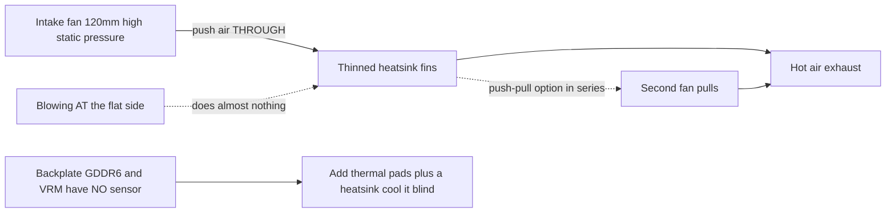

> 🌐 社区翻译。英文版为权威来源，可能更新更及时。发现错误？请提交 issue：[English](../en/04-cooling.md) · https://github.com/lildebil0/awesome-bc250/issues

# 散热

> **太长不看** —— BC-250 的原装散热片是为服务器机柜的强制风道设计的，不是为桌面。开箱即降频。社区的修法：**把密集的原装鳍片减薄**（锉/砂磨），再用一个**高静压 120 mm 风扇**（**Arctic P12 Max/Pro** 是参考；Noctua NF-P12 redux 是安静的高端替代）透过它们*往里吹*。仅此一招就能让一块改造过的板卡达到 **Furmark 约 73 °C、游戏 63–65 °C**。一体式水冷和全定制机箱是更高的档位。

散热是**新手最容易搞错的第一件事**，所以在追求超频之前先做这个。

---

## 为什么原装散热器不够

BC-250 是一块矿机/服务器板卡。它的散热片是**被动式**的，设计前提是放在一个机箱里、由吵闹的风扇把空气从前往后强制吹过它。放在没有气流的桌面上它会积热，GPU 会降频。对着平的那一面吹风几乎没用 —— 空气必须**穿过鳍片通道**，并掠过背板（背面的 GDDR6 **没有温度传感器**，所以你是盲冷它）。

社区实测的极限：约 **85 °C** 开始降频，约 **90 °C** 硬崩溃/重置。让负载温度保持在约 80 °C 以下并留有余量。

> **存在三种散热片变体**（8 排和 9 排鳍片）。快速辨识：**PCIe 8-pin 接口旁的一个二维码**标记 9 排变体。**鳍片更少、更厚实**的那个变体在默认状态下也许冷得略好一点。（[elektricM Cooling](https://elektricm.github.io/amd-bc250-docs/hardware/cooling/)）

**逐部件温度目标**（elektricM 测过的数字，比上面的降频/崩溃极限更细）：

| 部件 | 空闲 | 轻负载 | 游戏 | 最高 |
|-----------|------|-----------|--------|-----|
| GPU/APU 边缘 | 40–50 °C | 50–60 °C | 65–80 °C | 90 °C |
| CPU（Tctl） | 45–55 °C | 55–65 °C | 70–85 °C | 95 °C |
| 内存（底面） | 40–55 °C | 50–65 °C | 55–70 °C | 80 °C |
| NVMe/SSD | 40–55 °C | 50–65 °C | 60–75 °C | 80 °C（临界 81.8 °C） |

游戏中目标 **GPU 70–80 °C**。NVMe 上限在这里重要，因为 **GDDR6 和 M.2 SSD 共用板卡那个高温的背面** —— SSD 处在最糟的散热位置，可能被烤熟，所以盯着它（按硬盘规格 `80 °C` 最高、`81.8 °C` 临界）。（[elektricM: sensors](https://elektricm.github.io/amd-bc250-docs/system/sensors/)）

> **CPU Tctl 阶梯。** elektricM 把 **90 °C Tctl** 标为建议的回退点；表里的 **95 °C** 是你在重度游戏下仍会看到的上沿；**TJmax = 100 °C** 是绝对的硅片极限（下面的封装功率表显示 CPU 在一次持续压力测试下正好顶到这个值）。所以：**90 °C = "现在收手"，95 °C = "进入红区"，100 °C = "顶到墙了"。**（[elektricM: sensors](https://elektricm.github.io/amd-bc250-docs/system/sensors/)）

> **按热状态划分的封装功率**（elektricM 把每个状态和一个板卡功耗配对）：空闲 **50–70 W**、轻 **100–150 W**、重 **150–200 W**、压力 **200–235 W**。对选 PSU 大小、以及从墙插读出板卡实际有多卖力都有用。（[elektricM: sensors](https://elektricm.github.io/amd-bc250-docs/system/sensors/)）

> **游戏时出现像素瑕疵 = 显存过热。** 因为背面 GDDR6 没有传感器，那个视觉故障就是你的警示信号 —— 加背板气流/导热垫（见下文）。（[elektricM Cooling](https://elektricm.github.io/amd-bc250-docs/hardware/cooling/)）

> **体质彩票 —— 给每颗芯片预留散热余量。** 两块物理上完全相同的板卡，相同机箱、相同超频配置，温度可能相差 **5–10 °C**，而且更热的那块即便重新涂硅脂/换导热垫后依旧更热。别想当然以为别人的温度能套到你身上。（[r/BC250Gaming](https://www.reddit.com/r/BC250Gaming/)）



---

## 持续计算是另一种工况（不只是游戏的突发负载）

上面的目标假设的是**游戏**，那里负载是突发的。**持续**计算 —— 一个循环的 `llama-bench`、长时间的 Stable-Diffusion 运行、任何把 GPU 钉住几十分钟的任务，**尤其是配合 [40 CU 解锁](09-overclock-undervolt.md)** —— 是严苛得多的负载，可能超出一个游戏级散热器所能维持的。

elektricM 测过一个原装散热片 + **双 Arctic P12 Max 串联（push–pull）**，在 **40 CU / 2 GHz** 下做 10 分钟持续 `llama-bench`：

| 指标 | 平均 | 峰值 |
|--------|---------|------|
| GPU 边缘 | 89.6 °C | 107 °C |
| 封装功率 | 136 W | 223 W |
| CPU | 96.7 °C | 100 °C（TJmax） |
| VRM MOSFET | 57 °C | 58.5 °C |
| 风扇转速 | ~2950 RPM | 2977 RPM（上限） |

运行期间吞吐量随封装降频下降了**约 10%**。结论：**原装散热片 + 双 P12 Max 对持续 40 CU @ 2 GHz 的余量不够** —— 并且注意 **VRM 离它们的极限还远得很**（57 °C），所以瓶颈是*散热片散不出热*，不是风扇或供电级。两个修法：**把 GPU governor 封顶在 1500 MHz**（40 CU 仍然把计算性能放大约 1.5 倍，温度保持约 83 °C —— 在双 P12 Max 上可无限期持续），或**升级散热片**（更多鳍片面积）。对于 **24 CU 默频游戏**，双 P12 Max 很从容；只有在持续满 CU 计算下那堵墙才出现。（[elektricM Cooling](https://elektricm.github.io/amd-bc250-docs/hardware/cooling/)）

---

## 路径 A —— 风冷改造（最热门、最便宜）

这是群里大多数人在用的。

### 1. 减薄/清理原装鳍片
原装鳍片太密，且常常不均匀。人们把通道打开，让空气能通过：

- **轨道式（偏心）砂磨机** —— 最快，几分钟搞定，效果最好。（[src](https://t.me/c/2424231195/31571)）
- **手工砂纸** —— 先 60 目再 240 目，两天里约 3–4 h + 2 h。能行但慢。（[src](https://t.me/c/2424231195/50330)）
- **剪刀 / 钳剪** —— 粗暴的"чекрыжить"法，最后手段；效果最差。（[src](https://t.me/c/2424231195/41252)）
- **剪刀 + 直尺导向（干净的变体）** —— 把工艺/理发剪刀滑进鳍片缝里，**用一把斜抵着刀刃的直尺作导向**；一把折叠刀的"开罐器"也同样好用。注意：有些板卡变体**没有缝可以下刀** —— 用螺丝刀/镊子撬开一条，或用一个**小 Dremel 切割轮**切出一个入口槽。比鳍片缝宽的刀片会损坏散热片。（[r/BC250Gaming](https://www.reddit.com/r/BC250Gaming/)）
- 用**平头镊子 + 钳子**把弯掉的鳍片掰直。（[src](https://t.me/c/2424231195/30670)）
- **徒手把鳍片拔下来** —— elektricM 指出那些软铝鳍片可以**徒手干净地撕/掰开**（散热片从板卡上取下后），避免切割工具产生的金属屑。慢一些但无碎屑。（[elektricM Cooling](https://elektricm.github.io/amd-bc250-docs/hardware/cooling/)）
- **"Scooper by Justin"** —— 一个**专门为撑开/打开 BC-250 散热片鳍片而做的 3D 可打印工具**（[Printables 1282906](https://www.printables.com/model/1282906-bc-250-scooper)）。比裸用螺丝刀更安全：它能阻止你用力过猛、刨伤鳍片之间的散热片**基座**。（[r/linux_gaming 社区讨论帖](https://www.reddit.com/r/linux_gaming/comments/1nvsgji/)）摆正预期：一位机主报告打印的**"梳子/scooper"工具在第二次使用时就断了**，还把手弄得抽筋。（[r/BC250Gaming](https://www.reddit.com/r/BC250Gaming/)）
- **小手工钳 —— "剥离"法** —— 用小手工钳夹住鳍片的**顶部**把它们剥下来，**利用金属自身的记忆作为断点**，让它们在折弯处干净地折断而不是把基座撕坏。一个少碎屑的切割替代方案。（[r/linux_gaming 社区讨论帖](https://www.reddit.com/r/linux_gaming/comments/1nvsgji/)）

大致的温度收益（elektricM）：**掰直弯掉的鳍片约 5–10 °C**、**移除中央鳍片约 10–15 °C**（不可逆 —— 一个好的导风罩不用切就能获得类似收益）、**新硅脂约 5–10 °C**（如果旧硅脂已干）。（[elektricM Cooling](https://elektricm.github.io/amd-bc250-docs/hardware/cooling/)）

> ⚠ **先把散热片从板卡上取下**（或彻底遮挡/保护好板卡和 die）再砂磨/锉，并在重新装配前**清掉每一点金属粉尘**。落在板卡上的导电金属屑能把它短路并**烧掉板卡** —— 这在群里已经发生过。

<p align="center">
  <br>
  <sub>Photo: AMD BC-250 community · <a href="https://t.me/c/2424231195/31571">source</a></sub>
</p>

### 2. 拧上一个真正的风扇
装一个 **120 mm 高静压风扇**把空气推过鳍片。参考之选是 **Arctic P12 Max（或 P12 Pro）** —— 最高静压（约 6.9 mm H₂O），社区 + elektricM 给这个密集散热片的选择。**Noctua NF-P12 redux** 是安静的高端替代，并贴出过 **Furmark 最高 73 °C、游戏 63–65 °C** 的参考成绩（[src](https://t.me/c/2424231195/42843)）。

**带规格的具体风扇之选**（elektricM —— 按*静压*而非风量来挑）：

| 风扇 | 尺寸 | 最高 RPM | 静压 | 风量 | 噪音 | 游戏温度 |
|-----|------|---------|----------------|---------|-------|--------------|
| **Arctic P12 Max** | 120 mm | 3300 | **6.9 mm H₂O** | 73.3 CFM | 52.5 dB(A) | 65–75 °C |
| **Arctic P12 Pro** | 120 mm | 2100 | **6.9 mm H₂O** | 68.9 CFM | 37.8 dB(A) | 65–75 °C |
| Arctic P14 PWM | 140 mm | 1700 | 2.40 mm H₂O | 72.8 CFM | 38 dB(A) | 70–80 °C |
| Noctua NF-A12x25 | 120 mm | 2000 | 2.34 mm H₂O | 60.1 CFM | 22.6 dB(A) | 70–85 °C |

elektricM **最推荐的是 Arctic P12 Max / P12 Pro** —— 它约 6.9 mm H₂O 的静压让 Noctua 的 2.34 mm 相形见绌，且便宜得多；P12 Pro 是更安静、更普遍有货的那个。高端 Noctua 更安静，但只有在更高 RPM 下温度才追平 Arctic。（[elektricM Cooling](https://elektricm.github.io/amd-bc250-docs/hardware/cooling/)）

**来自社区构建的其他点名风扇**（人们装过的具体型号，超出 Arctic/Noctua-P12 参考之外）：

- **Noctua NF-A12x25 G2**（PWM）作为 **120 mm die 散热风扇** —— A12x25 的较新 G2 版本，用作主风扇（[TiredDadTech](https://youtu.be/zi7sldeRd2w)）。（上面的风扇表只列了*原版* NF-A12x25。）
- **Noctua NF-A6x15 PWM**（约 3500 rpm）作为 **60 mm PSU 风扇替换** —— 给尖叫的服务器砖块风扇的安静替代（[TiredDadTech](https://youtu.be/zi7sldeRd2w)）。
- **Thermalright 120 mm 1550 rpm ARGB** 作为预算 die 风扇，以及给背板用的 **6.0 W/mK 导热垫** —— 都出自一份 **TMG HD 构建物料清单**（[build overview](https://youtu.be/OEO0r01zcfU)）。

> **参考 vs 安静替代。** **Arctic P12 Max/Pro** 是这里的参考风扇 —— 最高静压（约 6.9 mm H₂O）、最便宜、社区 + elektricM 给这个密集散热片的选择。**Noctua NF-P12 redux** 是安静的高端替代（群里那个 73 °C Furmark 成绩），只有在更高 RPM 下温度才追平 Arctic。要最佳性价比选 Arctic，安静最重要就选 Noctua。

用一个**打印的导风罩/转接**让风扇密封贴住散热片，而不是漏气绕过去。社区 STL：
- `Fan_Shroud_Single_120mm.stl`、`Fan_Shroud_Dual_120mm.stl`、`Fan_Shroud_Single_140mm.stl`、`Twin_120mm_Fan_Shroud.stl`
- `BC250_FanAdapter_120mm.step`、`bc250 cooler mount.stl`、`cooler adapter v3.0.stl`

> **为什么看静压，而不是风量评级？** 密集鳍片是高阻力负载。高风量"机箱风扇"撞上它们会失速；高静压风扇（≥3 mm H₂O；Noctua P12、Arctic P12）才真正把空气*推过去*。对非常密集的鳍片，用两个风扇**串联（push–pull）**来翻倍静压 —— 这才是这里正确的做法，而不是两个风扇并排。

**安装：** 打印的导风罩最好，但**用扎带把**风扇绑到散热片上也能行，而在风扇和鳍片之间贴一个**纸板/泡沫板风道**是一个有效的免费退路（丑、不耐用，但密封了气流通道）。（[elektricM Cooling](https://elektricm.github.io/amd-bc250-docs/hardware/cooling/)）

> ⚠ **别把风扇直接钻/拧进鳍片。** 铝很软、鳍片很薄 —— 拧进它们会损坏鳍片堆并损害散热。用扎带或打印的导风罩。（[elektricM Cooling](https://elektricm.github.io/amd-bc250-docs/hardware/cooling/)）

> ### 🛠 气流工程 —— 什么真正起作用
>
> 关于空气*怎么*被推动（而不只是用哪个风扇）的社区发现：
>
> - **静压胜过纯 CFM**，对穿过密集鳍片堆而言 —— 这就是为什么高静压的 **Arctic P12 Max（6.9 mm H₂O）**在这个散热片上胜过更安静的高风量/低压风扇。
> - **一个居中的风扇可能胜过两个并排的**，在一个被完全切开的鳍片平面上：单个中央风扇直接给**4 根中央热管**加载，而两个风扇会在中央留下一道塑料的死"缝"。最先把鳍片切到满平面的构建者测得，单个中央风扇比两个低了几 °C（[src](https://t.me/c/2424231195/46175)）。一次拆解从气流角度得出相同结论：**两个风扇并排不比一个好**，因为在两个进风口相遇的**高温 die 中央正上方会形成一个死区** —— **在它们之间留一道缝，或改用 push-pull**（[Old Lamer — Part VII](https://youtu.be/pxahl9-YgkY) ~19:55）。*（字幕来源 —— 当作定性，不当作精确。）*
> - **120 mm 风扇转速下限约 1800 RPM**，才能真正把空气推过这个密集鳍片堆；**Arctic P12 Pro**（$8–10，**600–3000 rpm** 范围）是个轻松之选，空闲时安静却仍有余量（[Old Lamer — Part VII](https://youtu.be/pxahl9-YgkY)）。*（ASR 数字 —— 近似。）*
> - **加一个排气扇 = −3 到 −5 °C。** 仅进气 **73 °C** → 加排气 **67–68 °C**（[src](https://t.me/c/2424231195/68183)，[src](https://t.me/c/2424231195/31553)）。所以最优的简单配置是 **1 个中央进气 + 1 个后部排气**，而不是两个进气并排。
> - **背板是盲区且高温。** VRM MOSFET 在不散热时达到**约 100 °C**（[src](https://t.me/c/2424231195/110955)）—— 它**必须**配上导热垫 + 散热片 + 专门气流；配后部散热片后它在负载下*"凉飕飕的"*（[src](https://t.me/c/2424231195/93056)）。
> - **免费的物理学。** 热空气上升，所以哪怕一个**倾斜/烟囱**朝向也有帮助 —— 一个几乎没通风的背板单靠对流就测得 **47 °C**（[src](https://t.me/c/2424231195/76962)）。而一个**黑色阳极氧化的散热器辐射量约为抛光件的 1.8 倍**，让你在被动/半被动紧凑构建里把鳍片面积缩小**约 45%**（[src](https://t.me/c/2424231195/86878)）。
> - **让进气 > 排气**（轻微**正压**），好让没传感器的 VRM/VRAM 始终沐浴在新鲜空气里。

### 替代方案：保留原装鳍片（免切割的 push-pull 机箱）
切鳍片不是强制的。**penzoiders** 设计了一个机箱（[MakerWorld，FreeCAD 源文件](https://makerworld.com/models/2505974)），它**不**切散热片：它用**push-pull 高静压风扇**把空气强制吹过**未改动的原装鳍片**，外加一个**双腔压差**结构同时冷却背板（5 mm 散热片 + 导热垫；复用的 NVMe 散热片也行）。一个能保持凉爽的调校：**CPU 3800 MHz / 1050 mV，GPU 2100 MHz / 950 mV** → 并行 Furmark + `stress-ng` 保持在 **85 °C 以下**；游戏 **约 75 °C，风扇约 50% 占空比**（CoolerControl 曲线），"几乎听不见"。（[r/BC250Gaming](https://www.reddit.com/r/BC250Gaming/)）

## 路径 B —— 一体式（AIO）水冷

一个 120 mm AIO 通过转接支架装到 die 上。安静且凉，但部件和成本更多。热门构建用便宜的 AIO（例如 aigo）。（[example src](https://t.me/c/2424231195/19336)）

<p align="center">
  <br>
  <sub>Photo: AMD BC-250 community · <a href="https://t.me/c/2424231195/19336">source</a></sub>
</p>

**点名的、可下载的 AIO 支架 —— NexGen3D**（[Printables 1554003](https://www.printables.com/model/1554003)，用 ABS-GF 或 PETG 打印）。用一个 **Thermalright 240 mm AIO** 验证过：GPU **约 50 °C @ 2000 MHz**，CPU **最高 60 °C**。（[r/BC250Gaming](https://www.reddit.com/r/BC250Gaming/)）

### 水冷超频档案
有了 AIO 你能推得猛得多。**NexGen3D** 的墙插实测（Furmark Vulkan + `stress-ng --matrix 0 -t 60m` 作为烤机组合）：

| 档案 | CPU | GPU | 最高烤机温度 | 墙插功率 | 备注 |
|---------|-----|-----|---------------|------------|------|
| 1 | 4000 MHz | 2400 MHz | ~65 °C | >350 W | "死一般安静" |
| 2 | 4100 MHz | 2450 MHz | ~75 °C | <400 W | 更热、更吵 |

正常 1080p 游戏比这些烤机温度**低 10–15 °C**，在档案 1 上**低于 250 W**。**值得照搬的气流方案：** 120 mm 风扇**透过散热排往外排气**，这会把新鲜的外部空气拉进来掠过 **VRM / PSU / VRAM 背板**；一个单独的 **80 mm 风扇（Arctic P8 Max）**冷却 GPU VRM —— 这回应了上面"没传感器的 VRM/VRAM 仍需气流"的警告。（[r/BC250Gaming](https://www.reddit.com/r/BC250Gaming/)）

## 定制水冷循环（进阶）

在封闭 AIO 之外，少数人跑一个**完整定制循环**。这是个真实但**DIY/专家**的圈子：构建者**CNC 铣削或焊接一个定制水冷头**，在一块头里同时覆盖 **die *和* VRM**（[src](https://t.me/c/2424231195/131065)，[src](https://t.me/c/2424231195/131844)，[src](https://t.me/c/2424231195/118582)）。接头不关键 —— *"几乎任何接头你都能买、车或粘"*（[src](https://t.me/c/2424231195/132007)）。

**它给你带来什么：** 一个粗糙的定制循环在**风扇仅 30% 时负载下达到约 50 °C，外部泵几乎无声**（[src](https://t.me/c/2424231195/133040)）。（一位构建者随后注意到在默认 cyan-skillfish governor 配置下，VRM 扼流圈在负载下有线圈啸叫 —— 这是个*独立*问题，不是散热。）你也**不需要 Corsair Commander**：BC-250 自己的[风扇控制](#控制风扇转速软件)就能驱动水泵外加**约 5 个风扇**（[src](https://t.me/c/2424231195/140123)）。

> ⚠ **为什么这是"进阶"：BC-250 经不起一次冷却液泄漏。** 来自社区的真实故障：一根软管**在 90° 处打折、爆裂，淹了 GPU 和 PSU**（[src](https://t.me/c/2424231195/81158)）；一个**卡死的 Corsair AIO 泵把 CPU 烤了**（[src](https://t.me/c/2424231195/133147)，[src](https://t.me/c/2424231195/126053)）。还要留意**泵速超过约 50% 时的泵气蚀/噪音**（[src](https://t.me/c/2424231195/7034)）。**首次带液上电前，把整个循环从板卡上拆下来做 24 小时漏水测试。**

**结论：** 任何方案里最低的温度、最安静的 —— 而且它使持续 40-CU 成为可能 —— 但风险和工作量最高。**不是第一次构建该上的。**

## 路径 C —— 鼓风机（"улитка"）—— 不推荐

回收的 GPU 鼓风机扇是早期的实验。相对效果太吵；人们转向了路径 A。（[src](https://t.me/c/2424231195/100086)）

## 路径 D —— 塔式散热器改装（进阶）

有些用户把一个 **AM4 塔式散热器**（例如 **Thermalright Peerless Assassin**，或其他 AM4/AM5 塔）拧到 die 上，用现成硬件获得优异、安静的散热。代价是：你必须**通过支架安装它**，而且高塔可能**挡住 M.2 插槽或其他元件**。不是新手改造。你不再需要从零做一个 —— 已存在两个发布的 3D 打印支架：

- **AM4/AM5 桌面散热器转接**（[MakerWorld 2596083](https://makerworld.com/en/models/2596083)，含 FreeCAD 源文件）。把一个标准桌面 AM4/AM5 散热器装到 BC-250 上。紧固：**M5 螺栓 + 螺母，无支柱**（作者指出 M4 本来理想但 M5 是紧配）。用 **ABS、PETG 或 ASA** 打印。在 **CPU 3.95 GHz / 1.150 V，GPU 2200 MHz / 1000 mV，温度不超过 80 °C** 下验证过。用过的散热器：一个低矮的 **AXP90 级**（一位评论者用了 **AXP120**），甚至一个 **AMD Wraith Spire** 也胜过原装散热片。（[r/BC250Gaming](https://www.reddit.com/r/BC250Gaming/)）
- **Thermalright AXP90-X53 安装**（[Printables 1694793](https://www.printables.com/model/1694793)）。螺纹嵌件**焊进打印支架的底面**，于是你**复用原装散热片的弹簧螺丝**；圆头螺栓从底部上来并埋头，支架在**支撑下方有 0.5 mm 间隙**以避开板卡元件。用 Fusion 360 设计，**用 PETG 打印**（PLA 在这个温度下会软化）。结果：**满负载 @ 2150 MHz、1080p 下 65–67 °C**，非常安静（铜散热器，搭配一个 120 mm Arctic P12 Pro）。实测堆叠高度 **从 PCB 到 15 mm 风扇顶 54 mm** —— 对机箱配合有用。还存在一个**3 种厚度的变体套**和一个 **AXP120-X67** 版本。（[r/BC250Gaming](https://www.reddit.com/r/BC250Gaming/)）

---

## 控制风扇转速（软件）

装好风扇后，你通过板卡的 **Nuvoton NCT6686D** Super I/O 芯片控制它的 PWM —— 但**你加载哪个驱动很重要**（[elektricM 硬件规格](https://elektricm.github.io/amd-bc250-docs/)）：

- **只读传感器**（风扇 RPM、温度）：内核自带的 **`nct6683`** 模块，以 `force=true` 加载。它报告读数但**不能写 PWM**，所以风扇停在 BIOS/固件设定的转速。
- **读 + 写 PWM**（真正设定风扇转速）：用来自 **[Fred78290/nct6687d](https://github.com/Fred78290/nct6687d)** 的树外 **`nct6687`** 模块，同样带 `force=true`。如果你想要风扇曲线 / 手动调速而不只是监控，就编译这个。

```bash
# monitoring only (in-kernel):
echo 'options nct6683 force=true' | sudo tee /etc/modprobe.d/nct6683.conf
# PWM control (DKMS from Fred78290/nct6687d):
echo 'options nct6687 force=true' | sudo tee /etc/modprobe.d/nct6687.conf
```

> 别两个都加载 —— 只读传感器选 `nct6683`，读+写选 `nct6687`。传感器接线（`CPU_FAN1` / `J4003`）和 BIOS↔Linux 风扇编号在 [06-linux.md](06-linux.md) 的验证步骤里。

**哪个排针是主风扇？** elektricM 报告散热风扇通常在 **Pump Fan** 排针上 = sysfs 里的 **`fan2` / `pwm2`**；`CPU Fan`（`fan1`）和 `System Fan` 排针（`fan3`+）通常不用。写 PWM 前先启用手动模式（`echo 1 > .../pwm2_enable`，然后给 `.../pwm2` 一个 0–255 的值）。hwmon 编号在重启间可能变 —— 用 `cat /sys/class/hwmon/hwmon*/name` 确认。（[elektricM Cooling](https://elektricm.github.io/amd-bc250-docs/hardware/cooling/)）

**用 GUI 做风扇曲线 —— CoolerControl。** `nct6687` 加载后，**CoolerControl** 提供图形化风扇曲线：选 **nct6686** 设备，在 **pwm2** 上用 **k10temp Tctl** 作为源构建一条曲线。安装：`ujust install-coolercontrol`（Bazzite）、`codifryed/CoolerControl` copr（Fedora），或从 AUR 装 `coolercontrol`（Arch）；Web UI 在 `https://localhost:11987`。（[elektricM Cooling](https://elektricm.github.io/amd-bc250-docs/hardware/cooling/)）

**BIOS 风扇模式**（如果你不跑系统侧控制）：**Default** 把风扇维持在 **40% 最低**（太低 —— 不推荐），**Full Speed** 把它们钉在 100%（吵但安全），**Customize** 按阈值设转速。（[elektricM Cooling](https://elektricm.github.io/amd-bc250-docs/hardware/cooling/)）

> ⚠ **别同时跑 BIOS Customize 模式和 CoolerControl** —— 它们会争夺 PWM 控制权。二选一。（[elektricM Cooling](https://elektricm.github.io/amd-bc250-docs/hardware/cooling/)）

---

## 热界面（硅脂、导热垫、相变、液金）

无论你跑什么风扇/散热片，die 与散热片之间 —— 以及板卡背面与任何背板散热器之间 —— 的**热界面材料（TIM）**都值得做对。BC-250 的 die **热密度很高**，所以好的 TIM 是免费的几度。

> **光是换原装硅脂就有帮助。** 一位机主在用了一年后换掉工厂硅脂，负载温度降了**约 4–5 °C**，其他一切不变。（[src](https://t.me/c/2424231195/88565)）

### 好用的硅脂
- **Arctic MX-6** —— 一款常规高端硅脂。在一个带机箱的构建里它在 **Furmark 中保持 87–88 °C**；同一位机主指出 PTM7950 会在此基础上再削约 4 °C。（[src](https://t.me/c/2424231195/30211)）
- **原装硅脂 + 原装导热垫**是文档记录的基线：负载 10 分钟后约 **76 °C**，空闲约 **55 °C**（在鳍片/风扇改造之前）。（[src](https://t.me/c/2424231195/22992)）
- elektricM 列为在这里也可以的其他硅脂：**Arctic MX-4**（性价比）、**Thermal Grizzly Kryonaut**（高端）、**Noctua NT-H1**（可靠）、**Thermalright TFX**（预算）。二手板卡的硅脂**常常已干** —— 光是重新涂就值**约 5–10 °C**。在 die 上点一个豌豆大小的点，均匀安装，按 **X 形**拧紧螺丝。（[elektricM Cooling](https://elektricm.github.io/amd-bc250-docs/hardware/cooling/)）

### PTM7950 —— 社区最爱（推荐）
**PTM7950** 是一种**相变垫**（Honeywell 石墨/相变膜）。室温下它是一片薄固体；在负载下（约 45–55 °C）它软化并流成微米级薄层，然后定住。它**不会泵出**或像硅脂那样变干，这正是你想要的、放在一颗高温、热循环的 die 下面的东西 —— 所以你涂一次就忘了它。群里直白的总结：*"PTM7950，别想太多"*（[src](https://t.me/c/2424231195/101582)）；相变是普遍的推荐（[src](https://t.me/c/2424231195/61511)）。

**怎么涂：**
1. 清洁 die 和散热片基座（异丙醇），晾干。
2. 把一块 PTM7950 剪成 die 大小 —— 一块**约 26×30 mm** 的覆盖 BC-250 die（[src](https://t.me/c/2424231195/125748)）。
3. 揭一层保护膜，把垫放在 die 上，揭第二层膜。
4. 安装散热片并均匀拧紧。**不要涂抹** —— 第一次热循环会完成这事。预计在几次负载/空闲循环（"煲机"）后达到最佳温度。

一个在 PTM7950（Honeywell，26×30）上、外加背板散热器的带机箱构建，在 CPU 3850 MHz / GPU 2100 MHz 下**一小时内峰值约 84 °C，游戏 66–71 °C**。（[src](https://t.me/c/2424231195/125748)）

> **点名搭配：散热片下用 Upsiren 膏 + die 上用 PTM7950。** 一个构建视频把 **Upsiren UTP-6 / UTP-8 导热膏**（**UTP-8** 等级额定约 **14.8 W/mK**）用于填缝处，搭配一片**剪成 40×80×0.25 mm 的 PTM7950** 铺在 die 上（[PTM7950 + Upsiren video](https://youtu.be/FJapqZSdt6I)）。膏用于把不平的缝隙填到散热片/板上；相变膜放在 die 本身上。
>
> - **便宜的 AliExpress PTM7950 也行。** 一片约 **$13** 的 AliExpress 片被验证有效 —— 你不需要名牌 Honeywell 切片（[PTM7950 + Upsiren video](https://youtu.be/FJapqZSdt6I)）。
> - **PTM7950 需要煲机。** 它只有在**几次冷热循环**后才达到最佳温度 —— 别凭第一次运行就下判断（[laptop TIM demo](https://youtu.be/U4Zm8msXJHM)）。
>
> *（两个来源都是自动字幕 —— 把确切的 W/mK 和尺寸当作近似。）*

### 背板与 GDDR6 导热垫（盲冷背面）
**板卡背面的 GDDR6 和 VRM 没有温度传感器** —— 你盲冷它们。在**背板上加一个散热片/散热器**，搭配**导热垫**，好让背面的热有地方去。（[src](https://t.me/c/2424231195/125748)）一位俄罗斯构建者直接从 **Yandex.Market** 抓了一个**散热片**贴在背板上，它把**底板冷得很好** —— 任何尺寸合理的铝散热片在这里都能胜任（[4pda — mananoid1](https://4pda.to/forum/index.php?showtopic=1104980)）。

报告的导热垫厚度（社区分享，"我存了这个"反应）：
- **VRM：1 mm**
- **GDDR6：2 mm**（[src](https://t.me/c/2424231195/121181)）

> ⚠ **核实** —— 这些厚度取决于到*你自己*那块背板/散热器的间隙。买一堆导热垫之前用间隙测量（或一个膏/黏土测试）确认。

elektricM 给出一个**略有不同的导热垫方案**来冷却内存本身：**板卡*正面*用 1.5 mm 垫，*背面*用 2.0 mm**，然后在底面放一块铝板/散热片。在板卡附近**只用非导电**垫（绝不用可能短路元件的导电膏/垫）。它列出的导热垫品牌：**Thermalright Odyssey**（高性能）、**Arctic Thermal Pad**（性价比）、**Gelid GP-Ultimate**（高端）。（[elektricM Cooling](https://elektricm.github.io/amd-bc250-docs/hardware/cooling/)）

> ⚠ **核实（不同来源的导热垫厚度不同）** —— 我们群里来源的数字是 **VRM 1 mm / GDDR6 2 mm（背面）**；elektricM 给内存芯片定的是 **正面 1.5 mm / 背面 2.0 mm**。不同构建、不同间隙 —— **量你自己的间隙**，而不是盲信任一数字。

> **游戏 30–60 分钟后崩溃/不稳定**（常伴像素瑕疵）是经典的**内存过热**特征。修法：加导热垫 + 一块底板、加一个背板风扇、改善机箱气流，或临时**降低显存划分**（例如 4 GB → 512 MB）以减少内存发热。（[elektricM Cooling](https://elektricm.github.io/amd-bc250-docs/hardware/cooling/)）

### 液金 —— 在这里一般不推荐
液金（LM）被提起，是因为 PS5（同族 APU）用它（[src](https://t.me/c/2424231195/18105)），而且在纯性能上它略胜硅脂/PTM（[src](https://t.me/c/2424231195/124112)）。人们问过也在 BC-250 上试过（[src](https://t.me/c/2424231195/18098)，[src](https://t.me/c/2424231195/77180)）。

**但在这块板卡上这是错误的选择：**
- LM **导电**。BC-250 的 die 紧挨着**密集的 GDDR6 和 VRM**；一滴逃出 die 就会短路板卡（和上面金属屑警告里"导电物靠近内存就要命"是同一种风险）。
- 它会**泵出 / 大约每年要重做一次**，而且它侵蚀裸铝 —— 连那位 PTM7950 的拥护者也因为正是这个麻烦在自己的硬件上放弃了 LM，转用 PTM7950 / KryoSheet。（[src](https://t.me/c/2424231195/69688)）
- "不是每个人都肯接这个跟液金打交道的活儿。"（[src](https://t.me/c/2424231195/106787)）

**底线：** **PTM7950 是更安全的高性能选择** —— 约 99% 的收益，没有任何短路/维护风险。把 LM 留给那些已经确切知道自己在干什么的人。

---

## 怎么测试你的散热（社区方法，置顶）

出自置顶流程（[src](https://t.me/c/2424231195/108407)）：

1. **GPU 加压：** Furmark（Vulkan / "Furmark VK"）。
2. **同时给 CPU 加压：** 加一个 CPU 跑分（cpu-x）或基于 `stress`/`pipx` 的负载 —— APU 共用一个散热片，所以两者一起测。
   - 这些工具（Furmark、OCCT、cpu-x、`stress`）在一台全新的 Linux 机器上**不是预装的** —— 先通过你的包管理器或 Flatpak 安装它们。
3. **在你的超频下测试**，而不是默频 —— 1500 MHz 偏弱；**2000 MHz 约 +30% FPS**，是你实际会跑的，所以按那个去冷。
4. 盯着温度；如果你越过约 85 °C，就是在降频 —— 加风扇/导风罩/做鳍片活儿。

> ℹ️ **别把两个不同的"+30%"声明混为一谈。** 这里的 **GPU 频率 +30%**（1500 → 2000 MHz 让 FPS 涨大约三分之一）是超频带来的*性能*增益。它和一个单独的笔记本 TIM 演示里给**重新涂硅脂**报的**约 +30% 热改善**（[laptop TIM demo](https://youtu.be/U4Zm8msXJHM)）**不是**一回事 —— 那个是在不同硬件上的*温度*结果。同一个数字，毫不相干的两件事。

话题里还有一个最简方法的简短视频演示置顶。（[src](https://t.me/c/2424231195/100024)）

---

## 推荐的入门配置

| 档位 | 这样做 | 预期 |
|------|---------|--------|
| 最低 | 砂磨鳍片（轨道式砂磨机）+ 1× Arctic P12 Max/Pro（或 Noctua NF-P12）+ 打印导风罩 | Furmark 约 73 °C |
| 更好 | 透过导风罩 push–pull（2× P12） | 同温度下更低、更安静 |
| 最高 | 转接上的 120 mm AIO | 最凉，构建工作量更大 |

---

## 来源

- 置顶测试方法 —— https://t.me/c/2424231195/108407 · 视频 —— https://t.me/c/2424231195/100024
- 鳍片工具 —— https://t.me/c/2424231195/31571 · https://t.me/c/2424231195/30670 · https://t.me/c/2424231195/50330 · "Scooper by Justin" 鳍片工具（[Printables 1282906](https://www.printables.com/model/1282906-bc-250-scooper)）+ 手工钳剥离法 —— [r/linux_gaming thread](https://www.reddit.com/r/linux_gaming/comments/1nvsgji/)
- Noctua P12 成绩 —— https://t.me/c/2424231195/42843
- AIO 示例 —— https://t.me/c/2424231195/19336
- 热界面 —— 重新涂硅脂 −4–5 °C https://t.me/c/2424231195/88565 · MX-6 https://t.me/c/2424231195/30211 · 原装基线 https://t.me/c/2424231195/22992 · PTM7950 https://t.me/c/2424231195/101582 · https://t.me/c/2424231195/61511 · PTM7950 构建 + 背板 https://t.me/c/2424231195/125748 · 导热垫厚度 https://t.me/c/2424231195/121181 · 液金 https://t.me/c/2424231195/18098 · https://t.me/c/2424231195/69688
- elektricM 散热指南（散热片变体、逐部件温度表、持续负载数据、风扇规格、CoolerControl/BIOS 风扇模式、塔式散热器、导热垫方案）—— https://elektricm.github.io/amd-bc250-docs/hardware/cooling/
- [elektricM: sensors](https://elektricm.github.io/amd-bc250-docs/system/sensors/)（热阈值：CPU Tctl 90 °C 最高 / TJmax 100 °C，NVMe/SSD 80 °C 最高 / 81.8 °C 临界，按热状态划分的封装功率）
- r/BC250Gaming（社区报告：体质彩票差异、剪刀+直尺鳍片法、梳子工具断裂、免切割 push-pull 机箱、AIO 支架 + 240 mm 成绩、水冷超频档案、AM4/AM5 + AXP90-X53 支架）—— https://www.reddit.com/r/BC250Gaming/ · AM4/AM5 散热器转接 [MakerWorld 2596083](https://makerworld.com/en/models/2596083) · AXP90-X53 安装 [Printables 1694793](https://www.printables.com/model/1694793) · NexGen3D AIO 支架 [Printables 1554003](https://www.printables.com/model/1554003) · 免切割 push-pull 机箱 [MakerWorld 2505974](https://makerworld.com/models/2505974)
- 硬件参考 —— [mothenjoyer69/bc250-documentation `hardware.md`](https://github.com/mothenjoyer69/bc250-documentation/blob/main/hardware.md)
- 带散热的机箱/转接 —— [onemorecap/bc-250-sleeve-adapter](https://github.com/onemorecap/bc-250-sleeve-adapter)
- 两风扇并排在 die 上方形成死区 / 留缝或 push-pull、120 mm 约 1800 RPM 下限、Arctic P12 Pro（$8–10，600–3000 rpm）—— [Old Lamer — Part VII](https://youtu.be/pxahl9-YgkY)（自动字幕 / ASR —— 数字为近似）
- Upsiren UTP-6 / UTP-8 膏（UTP-8 约 14.8 W/mK）+ 剪成 40×80×0.25 mm 的 PTM7950 铺在 die 上、便宜 AliExpress PTM7950（约 $13）已验证 —— [PTM7950 + Upsiren video](https://youtu.be/FJapqZSdt6I) · PTM7950 需要几次冷热煲机循环 + 那个单独的重新涂硅脂"+30%"（笔记本，非 GPU 频率 +30%）—— [laptop TIM demo](https://youtu.be/U4Zm8msXJHM)
- 点名风扇：Noctua NF-A12x25 G2（120 mm die 散热风扇）+ NF-A6x15 PWM 3500 rpm（60 mm PSU 风扇替换）—— [TiredDadTech](https://youtu.be/zi7sldeRd2w) · Thermalright 120 mm 1550 rpm ARGB + 6.0 W/mK 导热垫（TMG HD 构建物料）—— [build overview](https://youtu.be/OEO0r01zcfU)
- 俄罗斯背板散热器（Yandex.Market 散热片把底板冷下来了）—— [4pda — mananoid1](https://4pda.to/forum/index.php?showtopic=1104980)

> 导风罩和转接 STL 在 [05-case.md](05-case.md) 里编目，并镜像在 `assets/stl/` 下。
