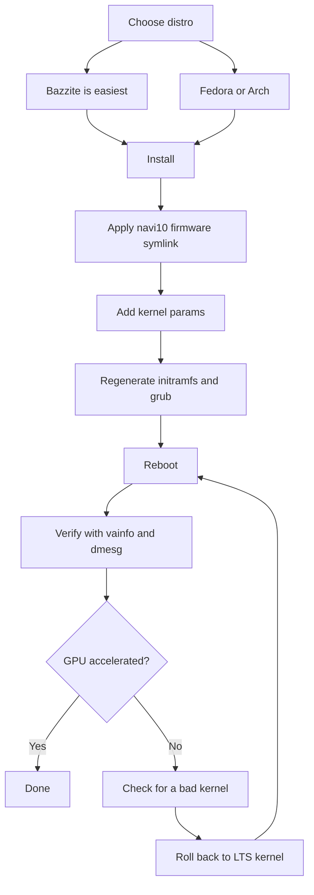

> 🌐 社区翻译。英文版为权威来源，可能更新更及时。发现错误？请提交 issue：[English](../en/06-linux.md) · https://github.com/lildebil0/awesome-bc250/issues

# Linux 驱动与配置

> **太长不看** —— 大多数人在 Linux 上跑 BC-250，而且*一旦修好 GPU* 它就很好用。开箱时 `amdgpu` 不认这颗芯片，你会得到 CPU 渲染、个位数 FPS。两件事让它变真：一个**现代内核 + 新版 Mesa（25.1+）**，以及那个 **`amdgpu` 修复** —— 一个固件符号链接让驱动能加载（`navi10_gpu_info.bin` → `cyan_skillfish_gpu_info.bin`）外加内核参数（`amdgpu.sg_display=0`、`mitigations=off`，以及在新内核上 `amdgpu.bc250_cc_write_mode=3`）。新手最简单的路径：刷 **[Bazzite](https://bazzite.gg/)** 并 rebase 到专用的 **`bazzite-bc250`** 镜像 —— 修复已内置。想了解这台机器：**Fedora** 或 **CachyOS/EndeavourOS（Arch）**，配一个一次性配置脚本。

这是把"一块装在盒子里的板卡"变成一台能用桌面的章节。先做[散热](04-cooling.md)和[供电](03-power-supply.md) —— 然后才是这个。

> **从没用过 Linux？60 秒生存包。**
> - **打开一个终端：** 在菜单里找一个叫 *Terminal* / *Konsole*（KDE）/ *Console* 的应用，或按 `Ctrl-Alt-T`。
> - **`sudo`** 放在命令前面以管理员身份运行它。它会问你密码 —— 而**你输入时屏幕上什么都不显示**（没有点，没有星号）。这是正常的；输完按 Enter。
> - **`nano /etc/...`** 在终端里打开一个纯文本编辑器。保存并退出：**Ctrl-O**，然后 **Enter**，然后 **Ctrl-X**。
> - **粘贴**到终端通常是 **Ctrl-Shift-V**（不是 Ctrl-V）。
> - 许多步骤只有在**重启**（`systemctl reboot`）后才生效。当一步说"重启"时，在判断它是否生效之前真的去重启。

---

## 你必须理解的那一件事

BC-250 的 GPU 是 **Cyan Skillfish / Oberon**（一个源自 PlayStation 5 的 RDNA2 部件）。主线 `amdgpu` 历史上**没有以它命名的固件 blob**，所以在一个原版安装上，内核无法初始化 GPU，桌面回退到软件（LLVMpipe）渲染 —— 一切都慢，而且 `vulkaninfo` 显示不出真实设备。一位用户在"坏掉的驱动"上耗了好几天，才意识到他的发行版只是启动了一个加载不了 GPU 固件的内核（[src](https://t.me/c/2424231195/98466)）。

所以每一个可用配置都以某种形式做同样三件事：

1. **跑一个足够新的内核 + Mesa。** 上游 Mesa 在 **25.1** 获得了 BC-250 支持（此后无需打补丁；**25.3.x** 是当前推荐的稳定版）—— （[Mesa MR !33116](https://gitlab.freedesktop.org/mesa/mesa/-/merge_requests/33116)，[src](https://t.me/c/2424231195/20891)）。温度传感器在**内核 6.15** 落地（[src](https://t.me/c/2424231195/23542)）；内核 **6.18.18 LTS** 是当前的甜点。
2. **把它想要的固件给 `amdgpu`** —— 在当前配置上，一个最新的 **`linux-firmware`** 已经自带 `cyan_skillfish_gpu_info.bin`；较老的系统仍需要 **navi10 符号链接**（或一个打过补丁的 mesa/内核包）。见路径 C。
3. **传入正确的内核参数**并重新生成 initramfs + 引导加载器。（并安装 **GPU governor**，这样频率不会被钉在 1500 MHz。）

下面的一切只是*每个发行版如何*做这三件事。



---

## 哪个发行版？（社区投票最爱）

群里反复回到四个。没有唯一"正确"答案 —— 这是*零工夫*和*了解你的机器*之间的取舍。elektricM 文档测了更广的范围；这里把它们一览（[elektricM: distributions](https://elektricm.github.io/amd-bc250-docs/linux/distributions/)）：

| 发行版 | 基础 | 工夫 | GPU 修复 | 最适合 |
|--------|------|--------|---------|----------|
| **Bazzite**（`bazzite-bc250` 镜像） | Fedora atomic | **最低** —— 修复已内置 | 在镜像里预先应用 | 新手，"就玩游戏" |
| **Fedora 43**（Workstation / KDE） | Fedora | 低 | 主线仓库里的 Mesa 25.x + governor COPR | 学 Linux，贴近上游 |
| **CachyOS** | Arch | 中 | 仓库里的 Mesa 25.1+ + governor（AUR） | 最大流畅度（BORE 调度器）、HDR+VRR |
| **EndeavourOS / Arch** | Arch | 中 | 仓库里的 Mesa 25.1+ + governor | 没有安装痛苦的 Arch |
| **Debian（Testing/Sid）/ PikaOS** | Debian | 中–高 | 从 `experimental` 装 Mesa（Debian）/ 开箱即用（PikaOS） | 稳定性，**最低空闲功耗（~50–60 W）** |
| **Manjaro** | Arch | 中 | 仓库里的 Mesa 25.1+；刷 BIOS 后开箱即启 | 简单 Arch；GNOME 最稳 |
| **Alpine** | Alpine（OpenRC） | 高 | 手动 mesa + 固件 + governor | 极简/无头，约 150 MB RAM / 约 35 W |
| **Fedora CoreOS** | Fedora atomic | 高 | 容器宿主；装后定制 | 无头容器/LLM 服务器 |
| **SteamOS**（Valve） | Arch（不可变） | 中 | 从 **main 分支**镜像装 Mesa（非稳定）+ governor | 真正的 Steam Machine 感觉；沙发/游戏模式 |
| **Batocera** | Linux（模拟发行版） | 低–中 | 捆绑的 Mesa + 配置 | 一台主机式**模拟**盒子（[15-emulation.md](15-emulation.md)） |

来自群里和 [elektricM](https://elektricm.github.io/amd-bc250-docs/linux/distributions/) 的笔记：
- **Bazzite 最简单**，并有一个**专用 BC-250 镜像**，固件修复、内核参数、GPU governor 和 40-CU/频率补丁都已应用。在 artifacthub 上找它：[`bazzite-bc250`](https://artifacthub.io/packages/container/bazzite-bc250/bazzite_bc250)。好几个用户正是为了不再手动打补丁才转向它（[src](https://t.me/c/2424231195/121246)）。
- **自 Fedora 43 起，Mesa 25.x 在主线仓库里** —— 仅为 Mesa 已不再需要 `mixaill/amd-bc-250` COPR。Fedora 42 **已停止支持**；升级到 43。安装时若黑屏，用 *Troubleshooting → Install in Basic Graphics Mode*（[elektricM: Fedora](https://elektricm.github.io/amd-bc250-docs/linux/fedora/)）。
- **别盲目去抓"玩家向"发行版。** 一份详尽的看法主张，一个朴素的 **Fedora（Workstation/KDE）**或 **配 LTS 内核 + 新版 Mesa 的原版 Arch** 才是无痛的中间地带，而重度调校的分支有时会*破坏* Steam/FSR/vsync 而非帮忙（[src](https://t.me/c/2424231195/102834)）。把这当作"截至 2025 年末"的建议 —— Bazzite 镜像此后已经成熟。
- **若你追求最大流畅度，选 CachyOS 而非 Bazzite。** 一份详尽的 r/BC250Gaming（Reddit）社区报告从 Bazzite 换到 **CachyOS**，发现不论来源游戏都明显更流畅，卡顿/微冻结更少（例如 *Mortal Kombat 1*）、随机崩溃和 Steam 模式重启更少，而且在**默认 Btrfs** 布局上手感非常跟手。它还把 **HDR + VRR 正确跑起来了**，而 Bazzite 做不到（HDR 故障、VRR 从未工作）—— 见 [14-display.md](14-display.md)。把它当作一份记录详尽的体验，而非普适结论，但如果 Bazzite 给你留下卡顿或不稳定，它是个有力的选项。配置由 **[`redbeard1083/bc250-toolkit`](https://github.com/redbeard1083/bc250-toolkit)** 脚本自动化（CachyOS 上的 BC-250）。⚠ 另一个社区数据点加了一个散热/FPS 角度：在*相同*超频下，据报告 CachyOS 比 Bazzite **凉约 10 °C**，并在受 CPU 限制的游戏里给出更高 FPS（例如 *Elden Ring* 在 CachyOS 上约 60–75 vs Bazzite 上约 45–60）（[+14]，r/BC250Gaming —— 社区报告，因情况而异；未经独立证实）。
- **内核版本比发行版更重要。** 避开已知坏内核（见下面的警告框）。拿不准时，一个 **LTS 内核**（推荐 6.18.18 LTS）是安全之选 —— 多名用户在太新的内核上撞墙，靠换到 LTS 获救（[src](https://t.me/c/2424231195/56529)，[src](https://t.me/c/2424231195/59839)）。
- **桌面环境：** **GNOME 在 BC-250 上记录最好**。KDE Plasma 有过 Qt RDRAND/RDSEED 崩溃 —— 在近期 Qt（2025 年中）里修了，但 GNOME 仍是安全默认；Cinnamon（X11）是一个稳定的轻量选项（[elektricM: distributions](https://elektricm.github.io/amd-bc250-docs/linux/distributions/)）。
- **另有两个发行版被社区确认可启动**（[r/linux_gaming 社区讨论帖](https://www.reddit.com/r/linux_gaming/comments/1nvsgji/)）：**SteamOS** 能在 BC-250 上跑 —— 但用 **main 分支** SteamOS 镜像，**不是**稳定通道（稳定版带的是不支持 BC-250 的旧 Mesa）。而 **Batocera**，那个专用模拟发行版，也能启动并运行 —— 一个把板卡变成主机式模拟盒子的方便途径（见 [15-emulation.md](15-emulation.md)）。两者都遵循上面一切的同样三条规则（新版 Mesa + `amdgpu` 固件修复 + 内核参数/governor）。

> 一位老兵在 Linux 上日常使用 BC-250 三个月后总结道：游戏一键启动，RTX 能用，VR 能用，"绝对无缝" —— 而且他因此把自己的主桌面换成了 Linux（[src](https://t.me/c/2424231195/61870)）。

---

## 路径 A —— Bazzite（推荐给新手）

Bazzite 是一个基于 Fedora 的不可变游戏系统（类 SteamOS）。社区维护一个 **BC-250 专用镜像**，这样你不用自己碰固件或内核参数。

### A1. 先装常规 Bazzite
1. 从 **[bazzite.gg](https://bazzite.gg/#image-picker)** 下载（挑桌面或 "Deck"/游戏模式变体）。
2. 刷到 USB（Ventoy、Rufus 或 balenaEtcher）并正常安装。**创建一个非 root 用户** —— Steam 拒绝以 root 启动（[src](https://t.me/c/2424231195/121246)）。

> **挑对 Bazzite 镜像（一步步）。** 在 [bazzite.gg](https://bazzite.gg/) 走选择器 **Desktop PC → AMD (modern) → KDE → 游戏模式镜像** —— 抓**游戏模式**构建，而非朴素的 live ISO：live ISO 能正常安装但**实际上跑不了游戏**。用 **Balena Etcher** 把它刷到一个 **≥16 GB** 的 USB 棒上。安装**目标**可以是 M.2 NVMe、用 M.2-转-SATA 转接的 SATA SSD，甚至一个**外部 USB** 驱动器。2025 年 11 月中旬的一个镜像开箱自带 **Mesa 25.2.4**（[Old Lamer — Part IV](https://youtu.be/YuBmGF536II)）。

> **U 盘太小？** Bazzite ISO >9 GB。你可以在一个小棒上装朴素 **Fedora**（约 3 GB ISO，例如 Kinoite/KDE），然后从终端 *rebase* 到 Bazzite（[src](https://t.me/c/2424231195/121246)）：
> ```bash
> # KDE desktop:
> rpm-ostree rebase ostree-image-signed:docker://ghcr.io/ublue-os/bazzite:stable
> # or with Gaming Mode (SteamOS-like):
> rpm-ostree rebase ostree-image-signed:docker://ghcr.io/ublue-os/bazzite-deck:stable
> ```
> 重启，你就进了 Bazzite。

### A2. 安装 GPU governor（当前最简单的路径）
截至 2026 年初，**Bazzite 原装内核已经包含 GPU 频率范围补丁** —— 所以你通常**根本不需要自定义镜像**。只要在常规 Bazzite 之上装 governor（[elektricM: Bazzite](https://elektricm.github.io/amd-bc250-docs/linux/bazzite/)）：
```bash
sudo dnf copr enable filippor/bazzite
rpm-ostree install cyan-skillfish-governor-smu   # SMU variant — no kernel patch needed
systemctl reboot
sudo systemctl enable --now cyan-skillfish-governor-smu.service
# Pin the known-good deployment so an update can't silently break you:
rpm-ostree pin 0
```
**`cyan-skillfish-governor-smu`** 通过 SMU 固件调用驱动频率，取代了较老的 `oberon-governor`（见*[电源 governor](#b3-电源-governorcyan-skillfish-governor)*）。还存在一个 `cyan-skillfish-governor-tt` 变体，但它需要内核频率补丁（Bazzite 里已有）。⚠ governor 可能瞄准了错误的卡（card0 vs card1）—— 如果调频没生效就核实。

### A2-alt.（可选）Rebase 到 BC-250 镜像
只有当你想要额外的预先内置优化时：切到一个维护的 BC-250 镜像 —— **`vietsman` "Bazzite on Steroids"** 构建（固件修复、内核参数、governor、扩展的 350–2230 MHz 频率补丁都内置）。挑你装的桌面 —— **GNOME 是推荐默认** —— 然后运行：
```bash
# GNOME (recommended):
rpm-ostree rebase ostree-image-signed:docker://ghcr.io/vietsman/bazzite-gnome-patched:latest
# KDE:
rpm-ostree rebase ostree-image-signed:docker://ghcr.io/vietsman/bazzite-kde-patched:latest
# Deck / Gaming-Mode (SteamOS-like):
rpm-ostree rebase ostree-image-signed:docker://ghcr.io/vietsman/bazzite-deck-patched:latest
systemctl reboot
```
⚠ 运行前核实当前镜像/标签 —— 镜像路径会变。最新命令在 [BC-250 文档 Bazzite 页](https://elektricm.github.io/amd-bc250-docs/linux/bazzite/)（也列在 artifacthub 上为 [`bazzite-bc250`](https://artifacthub.io/packages/container/bazzite-bc250/bazzite_bc250)）。

> ⚠ **Rebase 到打过补丁的镜像可能搞坏你的 USB WiFi（elektricM Issue #10）。** 自定义内核可能不包含你 USB WiFi/蓝牙适配器的驱动（BC-250 没有内置无线）。准备好以太网，rebase 后用 `lsmod | grep <your_driver>` 检查，缺了就 `rpm-ostree install <driver-package>`，或 `rpm-ostree rollback && systemctl reboot`。

> **如果 40-CU 解锁搞坏了风扇控制或你的 Xbox 手柄，换一个自定义内核镜像。** Bazzite 内置的 40-CU 解锁（"Old-Lamer"法）在某些配置上被社区报告会破坏**风扇控制和 Xbox 手柄支持**（[+ r/BC250Gaming —— 社区报告，因情况而异]）。**[`hafriedlander/kernel-bazzite`](https://github.com/hafriedlander/kernel-bazzite)** 镜像是一个修复了那个问题的自定义内核 —— 已验证为*"带 BC250 板卡 40CU 解锁补丁的（旧版）Bazzite 内核"*，直接从 Fedora 的 kernel-ark 用通常那套掌机/性能补丁集构建（也在 AUR 上打包为 `linux-bazzite-bin`）。⚠ 它是否解决你具体的风扇/手柄回归是一个社区数据点，不是保证 —— 保持一个已知好用的部署被 pin 住，这样你能 `rpm-ostree rollback`。

重启后，往后用 Bazzite 助手更新：
```bash
ujust update          # update everything (or: rpm-ostree upgrade && flatpak update)
rpm-ostree rollback   # if an update breaks something, roll back and reboot
```

> **两个值得知道的 Bazzite 坑**（[elektricM: Bazzite](https://elektricm.github.io/amd-bc250-docs/linux/bazzite/)）：连轻度 2D 游戏都持续**微卡顿**，通常是 Handheld Daemon 在循环里失败 —— 用 `sudo systemctl mask --now hhd` 禁用它。而刷 BIOS 后**加载关卡时冻结**通常意味着 **CMOS 没清** —— 清除 CMOS，重新应用 VRAM 设置。

> ⚠ **Bazzite 的不可变性会挡住底层网络工具。** 只读的 `/usr` 意味着安装系统服务或内核部件的流量整形/反限速工具（例如 `zapret` 一类）装不干净。如果你依赖某个 —— 对某些限速 Steam 的运营商常见 —— 一个可变发行版（Fedora/Arch）是更省事的宿主（俄罗斯特定细节在俄文版里）。

### A3. 完成 —— 验证
跳到下面的 **[验证 GPU 加速](#验证-gpu-加速)**。在 BC-250 镜像上（或在 A2 之后），固件符号链接、内核参数和 governor 都已就位。

---

## 路径 B —— Fedora（Workstation / KDE）

Fedora 是记录最完善的非 atomic 路径，且贴近上游。**在 Fedora 43 上图形栈不需要额外仓库 —— Mesa 25.x 已经在主线仓库里**（[elektricM: Fedora](https://elektricm.github.io/amd-bc250-docs/linux/fedora/)）。较老的 `mixaill/amd-bc-250` COPR（下文）只在 43 之前的版本上需要。

### B1. 安装 Fedora
下载 **Fedora 43 Workstation 或 KDE**（[fedoraproject.org](https://fedoraproject.org/workstation/download)）并正常安装 —— **Fedora 42 已停止支持**，升级到 43。如果安装器显示黑屏，选 *Troubleshooting → Install Fedora in basic graphics mode*（这会设 `nomodeset`；装好驱动后移除它）。群里报告的良好基线：内核 6.14、GNOME 48、Mesa 25.0.2+ —— "飞快"（[src](https://t.me/c/2424231195/29150)）。配 Cinnamon 的 Fedora 41 被称为"稳如磐石"，跑 Cyberpunk、Witcher 3 等（[src](https://t.me/c/2424231195/12756)）。在 43 上优先内核 **6.18.18 LTS** 或 **6.17.11+**，避开坏掉的范围（警告框）。

### B2. 配置脚本（替你干活）
权威的 Fedora 配置由 `mothenjoyer69/bc250-documentation` 的 **`fedora-setup.sh`** 自动化。它启用 COPR、装打过补丁的 mesa、配置 `amdgpu`、构建 governor 并修复引导加载器。它运行的确切步骤（对照脚本核对过）：

```bash
# 1. Patched mesa from COPR
sudo dnf copr enable mixaill/amd-bc-250 -y
sudo dnf upgrade --refresh -y

# 2. amdgpu module option + sensor module
echo 'options amdgpu sg_display=0'    | sudo tee /etc/modprobe.d/options-amdgpu.conf
echo 'nct6683'                        | sudo tee /etc/modules-load.d/99-sensors.conf
echo 'options nct6683 force=true'     | sudo tee /etc/modprobe.d/options-sensors.conf

# 3. Regenerate initramfs (Fedora uses dracut)
sudo dracut --regenerate-all --force

# 4. Bootloader: drop nomodeset, add kernel params
sudo sed -i 's/nomodeset//g' /etc/default/grub
sudo grub2-mkconfig -o /etc/grub2.cfg
sudo grubby --update-kernel=ALL --args="amdgpu.sg_display=0"
sudo grubby --update-kernel=ALL --args="mitigations=off"

# 5. OpenCL (optional, for compute/AI)
sudo dnf install mesa-libOpenCL --allowerasing
```
*（来源：[mothenjoyer69/bc250-documentation](https://github.com/mothenjoyer69/bc250-documentation) 里的 `fedora-setup.sh`，逐字确认。）*

若想直接跑脚本而不是逐条输入，见该仓库 README 的 **"Simple setup script"** 部分（它指向 [`fedora-setup.sh`](https://raw.githubusercontent.com/mothenjoyer69/bc250-documentation/refs/heads/main/fedora-setup.sh)）。⚠ 把配置脚本管道喂给 shell 之前先读它。

### B3. 电源 governor（cyan-skillfish-governor）
板卡开箱跑一个平的 1500 MHz / 1000 mV；一个 **governor** 缩放频率（空闲 ↔ ~2000 MHz）并让你降压。当前推荐的是 **`cyan-skillfish-governor-smu`**，来自 `filippor/bazzite` COPR（[elektricM: Fedora](https://elektricm.github.io/amd-bc250-docs/linux/fedora/)，2026 年 3 月确认）：
```bash
sudo dnf copr enable filippor/bazzite
sudo dnf install cyan-skillfish-governor-smu
sudo systemctl enable --now cyan-skillfish-governor-smu
systemctl status cyan-skillfish-governor-smu        # check it's running
```
配置在 `/etc/cyan-skillfish-governor-smu/config.toml`。完整调校见 **[09-overclock-undervolt.md](09-overclock-undervolt.md)**。

> **SMU vs 较老的 oberon-governor。** `cyan-skillfish-governor-smu` 通过 SMU 固件调用驱动频率，**在任何发行版上都不需要内核频率补丁** —— 在 elektricM 文档里它已经实际取代了较老的 `oberon-governor`（[elektricM: kernel](https://elektricm.github.io/amd-bc250-docs/linux/kernel/)）。同一个 COPR 也提供一个 `cyan-skillfish-governor-tt` 变体，那个*确实*需要内核补丁。如果你已经在跑 `oberon-governor`，在装 SMU 那个之前先停止/禁用/移除它（`sudo systemctl disable --now oberon-governor`，移除 `/etc/oberon-config.yaml`）。

### B4. 重启并验证
重启，然后跳到 **[验证 GPU 加速](#验证-gpu-加速)**。

---

## 路径 C —— Arch 家族（CachyOS / EndeavourOS）

基于 Arch 的安装历史上需要**手动做固件符号链接**外加新版 Mesa。这是最"手动"的路径，但同样三个想法适用。

> **提醒 —— 这个符号链接对你也许已经过时了。** elektricM 针对 [Arch](https://elektricm.github.io/amd-bc250-docs/linux/arch/)、[CachyOS](https://elektricm.github.io/amd-bc250-docs/linux/cachyos/) 等的逐发行版指南**已完全不再创建 navi10 符号链接** —— 在当前内核配上最新 `linux-firmware`（Arch）/ `linux-firmware-amdgpu`（Alpine）包时，`cyan_skillfish_gpu_info.bin` blob 现在已自带，Mesa 25.1+ 完成其余。先**不带**符号链接试；只有当 `dmesg` 显示 `amdgpu: Failed to get gpu_info firmware`（即你的固件包太老不含它）时才退回 C1。

### C1. amdgpu 固件修复（关键的符号链接）—— 仅当固件缺失时
`amdgpu` 找 `cyan_skillfish_gpu_info.bin`；**navi10** blob 可顶替它。这是群里被重复最多的命令（5 次）（[src](https://t.me/c/2424231195/45453)），如果你发行版的 `linux-firmware` 早于这个 blob，它仍是修复办法：

```bash
sudo ln -s /lib/firmware/amdgpu/navi10_gpu_info.bin.zst \
           /lib/firmware/amdgpu/cyan_skillfish_gpu_info.bin.zst
```

> ⚠ **在你的系统上核实路径。** 在自带**未压缩**固件的发行版上，两个名字都去掉 `.zst`：
> ```bash
> sudo ln -s /lib/firmware/amdgpu/navi10_gpu_info.bin \
>            /lib/firmware/amdgpu/cyan_skillfish_gpu_info.bin
> ```
> **你是哪种？** 运行 `ls /lib/firmware/amdgpu/ | grep -i navi10` 看源文件名：若以 `.zst` 结尾用第一条（`.zst`）命令，否则用第二条 —— 链接名必须匹配实际存在的文件。创建链接后你**必须**重新生成 initramfs（下一步），好让固件在启动时被取用。

### C2. 新版 Mesa
在 EndeavourOS/CachyOS 上社区路线是 **chaotic-aur** + `mesa-tkg-git`。浓缩自一份置顶的 EndeavourOS 小指南（[src](https://t.me/c/2424231195/50399)）和一份 SteamOS 指南（[src](https://t.me/c/2424231195/52411)）：

```bash
# Add the chaotic-aur key + mirrorlist (see https://aur.chaotic.cx/docs for the current keys)
sudo pacman-key --recv-key 3056513887B78AEB --keyserver keyserver.ubuntu.com
sudo pacman-key --lsign-key 3056513887B78AEB
sudo pacman -U 'https://cdn-mirror.chaotic.cx/chaotic-aur/chaotic-keyring.pkg.tar.zst'
sudo pacman -U 'https://cdn-mirror.chaotic.cx/chaotic-aur/chaotic-mirrorlist.pkg.tar.zst'

# Append to /etc/pacman.conf:
#   [chaotic-aur]
#   Include = /etc/pacman.d/chaotic-mirrorlist
sudo nano /etc/pacman.conf

sudo pacman -Syu
sudo pacman -Sy mesa-tkg-git lib32-mesa-tkg-git   # (or: yay -S mesa-tkg-git lib32-mesa-tkg-git)
sudo pacman -S vulkan-tools                        # for vulkaninfo
```
也有预构建的 AUR 包：[`amdonly-gaming-mesa-git`](https://aur.archlinux.org/packages/amdonly-gaming-mesa-git) 和 [`mesa-amd-bc250`](https://aur.archlinux.org/packages/mesa-amd-bc250)。⚠ chaotic-aur 签名密钥可能轮换 —— 总是从 [aur.chaotic.cx/docs](https://aur.chaotic.cx/docs) 复制当前密钥。

> **当前 Arch/CachyOS 上最简单的路径：** Mesa **25.1+ 现在在官方 `extra` 仓库里** —— `sudo pacman -S mesa vulkan-radeon lib32-vulkan-radeon` 就够了，不需要 chaotic-aur 或 `mesa-tkg-git`。`-tkg`/AUR 构建只在较老发行版上才重要（[elektricM: Arch](https://elektricm.github.io/amd-bc250-docs/linux/arch/)，[src](https://t.me/c/2424231195/20891)）。Mesa **26**（git）已确认能在 Debian sid / Ubuntu 26.04 daily 上工作。
>
> 要完全跳过手动步骤，elektricM Arch 指南指向 **`eabarriosTGC/BC250--ARCH`** 配置脚本（`Arch-setup.sh`，或 Manjaro 用 `bc520-manjaro.sh`），它装 governor、配置传感器、写入带 `RADV_DEBUG=nohiz` 的 `/etc/environment.d/99-radv-bc250.conf` 并重新生成 initramfs（[elektricM: Arch](https://elektricm.github.io/amd-bc250-docs/linux/arch/)）。具体到 **CachyOS**，那份 r/BC250Gaming（Reddit）社区报告用 **[`redbeard1083/bc250-toolkit`](https://github.com/redbeard1083/bc250-toolkit)**，一个为 CachyOS 上 BC-250 量身定做的配置脚本。⚠ 运行任何配置脚本前先读它。

### C3. 内核参数 + 重新生成
加上 BC-250 内核参数，然后重建 initramfs 和 grub。编辑 `/etc/default/grub`，把这些放进 `GRUB_CMDLINE_LINUX_DEFAULT`（按 [elektricm BC-250 文档](https://elektricm.github.io/amd-bc250-docs/linux/kernel/)的权威集）：

```
amdgpu.sg_display=0 mitigations=off amdgpu.bc250_cc_write_mode=3 ttm.pages_limit=3959290 ttm.page_pool_size=3959290
```

然后重新生成（Arch 用 **mkinitcpio**，然后 grub）：
```bash
sudo mkinitcpio -P
sudo grub-mkconfig -o /boot/grub/grub.cfg
```
在用 `update-grub` 的发行版上（Debian/Ubuntu/SteamOS），那个包装脚本替代 `grub-mkconfig` 那行（[src](https://t.me/c/2424231195/52411)）。

### C4. Governor + 重启
从 AUR 装 **`cyan-skillfish-governor-smu`**（`oberon-governor` 的现代替代 —— 不需要内核补丁），启用服务，重启，并验证（[elektricM: CachyOS](https://elektricm.github.io/amd-bc250-docs/linux/cachyos/)）：
```bash
yay -S cyan-skillfish-governor-smu
sudo systemctl enable --now cyan-skillfish-governor-smu.service
cat /sys/class/drm/card0/device/pp_dpm_sclk   # the * should move between clocks under load
```
有一个 `cyan-skillfish-governor-tt` 变体给偏好内核补丁路线的人。较老的 `oberon-governor`（[gitlab.com/mothenjoyer69/oberon-governor](https://gitlab.com/mothenjoyer69/oberon-governor)，`cmake . && make && sudo make install`）仍然能用但正在被淘汰。

> ⚠ **已知 Arch/Manjaro/CachyOS 怪癖：** governor 经常**在启动时不开始调频** —— GPU 停在 1500 MHz，直到你启动任何游戏/跑分一次，之后它就正常了。Fedora/Bazzite 不受影响。变通：启动后 `sudo systemctl restart cyan-skillfish-governor-smu`（[elektricM: Arch](https://elektricm.github.io/amd-bc250-docs/linux/arch/)）。

---

## 小众发行版差异（Alpine / CoreOS / Debian / CachyOS）

上面四条路径覆盖了大多数人。下面的发行版需要*同样三件事*，只是包名和机制各有不同 —— 这些是 BC-250 的差异，不是完整安装指南。

### CachyOS —— 选对微架构级别
CachyOS 在安装时要你选一个 x86-64 **微架构级别**。**选 `x86-64-v3`** —— 对 **Zen 2** 是兼容性最好的选择（[elektricM: CachyOS](https://elektricm.github.io/amd-bc250-docs/linux/cachyos/)）。⚠ **别**选 `x86-64-v4`：那个级别需要 AVX-512，而 BC-250 的 Zen 2 核心没有，所以 v4 安装跑不起来。用 LTS 内核 —— `sudo pacman -S linux-cachyos-lts linux-cachyos-lts-headers`。要把一个**现有 Arch** 机器迁移到 CachyOS 仓库而不重装：
```bash
wget https://mirror.cachyos.org/cachyos-repo.tar.xz
tar xvf cachyos-repo.tar.xz
cd cachyos-repo
sudo ./cachyos-repo.sh   # choose x86-64-v3 when prompted
```
其余一切（固件、Mesa 25.1+、governor、内核参数）遵循上面的**路径 C**。

### Debian —— 把 Mesa 钉到 `experimental`
Stable/Testing 的 Mesa 太老；你只想从 `experimental` 拿 Mesa 而不把系统其余部分也拖过去（[elektricM: Debian](https://elektricm.github.io/amd-bc250-docs/linux/debian/)）。加仓库：
```
deb http://deb.debian.org/debian experimental main contrib non-free non-free-firmware
```
然后用 **APT-pin** 让只有 Mesa 包跟踪 experimental —— `/etc/apt/preferences.d/experimental`：
```
Package: mesa-vulkan-drivers libgl1-mesa-dri
Pin: release a=experimental
Pin-Priority: 500
```
装 Mesa 和一个更新的内核：
```bash
sudo apt install -t experimental mesa-vulkan-drivers libgl1-mesa-dri
sudo apt install linux-xanmod-lts-x64v3       # Xanmod LTS, v3 build
```
governor 在 Debian 上**没有 COPR/AUR** —— 从上游发布的 tarball 安装：
```bash
tar -xf cyan-skillfish-governor-smu-*-x86_64-linux.tar.gz
cd cyan-skillfish-governor-smu-*/
sudo ./scripts/install.sh
sudo systemctl enable --now cyan-skillfish-governor-smu.service
```

### Alpine —— 唯一无 systemd 的 governor 配方
Alpine 用 **OpenRC**，不是 systemd，所以 governor 需要手工接线（[elektricM: Alpine](https://elektricm.github.io/amd-bc250-docs/linux/alpine/)）。固件包是 **`linux-firmware-amdgpu`**（它自带 `cyan_skillfish_gpu_info.bin`）—— 本文其他地方用的通用 `linux-firmware` 名字**在 Alpine 上不适用**。装这套栈（默认没有 `sudo` —— 用 **`doas`**，或 `apk add sudo`）：
```sh
doas apk add linux-lts linux-firmware-amdgpu \
  mesa-vulkan-ati vulkan-loader vulkan-tools mesa-dri-gallium
```
内核参数放进 **`/etc/update-extlinux.conf`**（Alpine 用 extlinux，**不是** grub/dracut）；编辑后重建：
```sh
doas mkinitfs
doas update-extlinux
```
governor 从 **`smu`** 分支用 `cargo build --release` 构建，而且因为它通过 D-Bus 通信，它需要**同时**一个 D-Bus 策略文件和一个 OpenRC 服务：
- **D-Bus 策略** `/etc/dbus-1/system.d/com.cyan.skillfishgovernor.conf`（让它拥有总线名 `com.cyan.SkillFishGovernor`）；
- **OpenRC 服务** `/etc/init.d/cyan-skillfish-governor-smu`，其中声明 `need dbus`。

启用 D-Bus 并重启：
```sh
doas rc-update add dbus default
doas rc-service dbus start
```

### Fedora CoreOS —— 不可变宿主的 40-CU 解锁与 ACPI 修复
在不可变的 CoreOS 宿主上你没法以简单方式传 `amdgpu.bc250_cc_write_mode=3`，所以 40-CU 解锁作为一个**通过 `umr` 的启动服务**完成，每次启动写一次 GPU 寄存器（[elektricM: CoreOS](https://elektricm.github.io/amd-bc250-docs/linux/fedora-coreos/)）：
```bash
rpm-ostree install umr
# then a oneshot /etc/systemd/system/gpu-unlock.service that runs the umr
# register writes (mmRLC_PG_ALWAYS_ON_WGP_MASK / mmCC_GC_SHADER_ARRAY_CONFIG /
# mmSPI_PG_ENABLE_STATIC_WGP_MASK on *.gfx1013) after a short boot delay,
# then: systemctl enable gpu-unlock.service
```
**ACPI cpufreq 修复**（`bc250-acpi-fix` SSDT 表）以 rpm-ostree 方式应用 —— 把 `.aml` 文件放进 `/etc/dracut.conf.d/acpi/`，加上 `/etc/dracut.conf.d/99-acpi-override.conf`：
```
acpi_override="yes"
acpi_table_dir="/etc/dracut.conf.d/acpi"
```
然后用 `rpm-ostree initramfs --enable` 把它们烤进 initramfs 并重启。（非 atomic 的 dracut 路线见下面的*已知坏内核与坑*。）

---

## 每个内核参数做什么

对照 [elektricm BC-250 文档](https://elektricm.github.io/amd-bc250-docs/linux/kernel/) 和 AMD-BC-250 / mothenjoyer69 配置脚本核对过：

| 参数 | 它做什么 |
|-----------|--------------|
| `amdgpu.sg_display=0` | 禁用 scatter-gather 显示。在**内核 < 6.10** 上需要它以避免黑屏；保留无害。群里被引用最多的单条启动修复（[src](https://t.me/c/2424231195/52411)）。 |
| `mitigations=off` | 关闭 CPU 漏洞缓解。elektricM 实测 **Cyberpunk 2077 +18 FPS**（1080p high 下 60 → 78），整体约 5–10% CPU 增益 —— 代价是安全性。可选；仅游戏系统。 |
| `amdgpu.bc250_cc_write_mode=3` | 新内核的可选 **40-CU 解锁**：写两个硬件寄存器以重新启用全部 40 个计算单元（默认关）。由 PCI ID `0x13FE` 守护，不做永久硬件改动。功耗猛涨（例如 llama-bench 里 56 W → 181 W）—— 仅计算时值得。见 [09-overclock-undervolt.md](09-overclock-undervolt.md)。 |
| `amdgpu.gttsize=14750` **+** `ttm.pages_limit=3959290` `ttm.page_pool_size=3959290` | 让 GPU 映射更多系统内存（约 14.5–14.75 GB）。elektricM **三个一起用**，不是当作替代 —— `gttsize` 设 GTT 大小，两个 `ttm` 值抬高页限制。和一个 512 MB 动态 BIOS VRAM 划分配套（[elektricM: kernel](https://elektricm.github.io/amd-bc250-docs/linux/kernel/)）。 |

> ⚠ **别传 `amd_iommu=on`** 来让内存参数生效 —— 它们在*没有* IOMMU 时也工作，而 IOMMU 必须保持关闭（下一节）。上面的值也可以放进 `/etc/modprobe.d/` 而非内核命令行：`options ttm pages_limit=3959290 page_pool_size=3959290` / `options amdgpu gttsize=14750`，然后重建 initramfs。

> **关于 VRAM/缓冲区大小的说明：** APU 在 GPU 帧缓冲划出**最小**（例如 512 MB）时表现最好，这样它能动态共享 16 GB 池 —— 但改这个需要一个**改版 BIOS**，在 [08-bios.md](08-bios.md) 里介绍（[src](https://t.me/c/2424231195/38599)）。

> 📋 **一位老兵的权威日用配置（快速参考）：** **CPU 4 GHz / GPU 2 GHz 40 CU / VRAM BIOS 512 MB / `mitigations=off` / zswap + 32 GB swap。** 那就是整套调好的配置一行讲完 —— GPU 频率 + 40-CU 解锁 + 一个小小的 512 MB BIOS 划分 + 关闭缓解 + 下面的 zswap swap 修复（[Old Lamer](https://youtu.be/bXlKcFPeSoU)）。每一块在 [09-overclock-undervolt.md](09-overclock-undervolt.md) 和这附近的框里都有详述。

> 💥 **游戏因缺内存崩溃（RDR2、Company of Heroes 3）？用 zswap + 一个大的 Btrfs swapfile。** 只有 16 GB 在 CPU 和 GPU 之间共享，吃内存的游戏会耗尽并崩溃 —— 而 systemd 的 **ZRAM** swap 在 512 MB 动态划分上让情况更糟（它会让分配器在内存还有空闲时就误判 OOM）。能站住的修法：**禁用 systemd ZRAM，启用 zswap，并加一个 32 GB Btrfs swapfile**（在 Btrfs 上用 `btrfs filesystem mkswapfile`）。它不增加真实内存，但能止住缺内存崩溃（[Old Lamer — Part XIV](https://youtu.be/A6juAoY70aU)）。完整一步步（zswap `lz4`、swapfile、`vm.swappiness=180`、Bazzite/`rpm-ostree` 变体）在 [09-overclock-undervolt.md](09-overclock-undervolt.md)。

---

## ⚠ 在 BIOS 里禁用 IOMMU（做这一次）

**IOMMU 在 BC-250 上是坏的，必须禁用。** 保持启用会导致**显示故障、黑屏和随机崩溃**，而且无论如何 GPU 直通到虚拟机都不可能。这是一个 BIOS 设置，不是发行版选择 —— 无论你走上面哪条路径，都在首次启动时做。在 BIOS 设置里找 **IOMMU** 选项（通常在 *Advanced → AMD CBS / NBIO* 或 *North Bridge* 下）设为 **Disabled**，然后保存重启（[elektricM 硬件文档](https://elektricm.github.io/amd-bc250-docs/)，逆向工程由 mothenjoyer69 / Segfault / neggles / yeyus 完成）。

> ⚠ 核实 —— elektricM 来源只记录了 **BIOS** 禁用。有些内核也接受 `iommu=off` / `amd_iommu=off` 作为内核参数，但那在 BC-250 上**未**被确认；当作未经证实，优先用 BIOS 设置。

---

## 验证 GPU 加速

首次重启后，确认 GPU 真的在被使用（不是软件渲染）。

**1. 设备对 Vulkan 可见吗？** 你应该看到 BC-250 / AMD 设备，而不只是 LLVMpipe：
```bash
vulkaninfo | grep deviceName
```
一个正确的配置显示**两个设备**（这块板卡上 iGPU 出现两次）（[src](https://t.me/c/2424231195/50399)）。

**2. Vulkan 驱动是 RADV**（不是 AMDVLK 或 llvmpipe）：
```bash
vulkaninfo | grep driverName     # expect: driverName = radv
```
设备名应读作 **`AMD Radeon Graphics (RADV GFX1013)`**。

> ⚠ **别指望 `vainfo` 能用 —— BC-250 上硬件视频解码/编码是死的。** VCN 模块的固件被 **Sony 封锁**，所以 `vainfo` 失败（`vaInitialize failed ... -1`），没有 GPU H.264/H.265 加速。这不是你配置里的 bug —— 用**软件解码**（mpv/VLC 自动回退）和 OBS 的 **x264**。基本不会改变（[elektricM: RADV](https://elektricm.github.io/amd-bc250-docs/drivers/radv/)）。

**3. OpenGL renderer 字符串**（应命名 AMD/`gfx1013`，而非 `llvmpipe`）：
```bash
glxinfo | grep -i "OpenGL renderer"
# e.g. AMD Radeon Graphics (radv gfx1013 ...) — llvmpipe here means the GPU is NOT working
```

**4. 计算单元已激活** —— 确认 `amdgpu` 初始化了 GPU 以及有多少 CU 在线：
```bash
sudo dmesg | grep -i active_cu_number
```
这是检查固件是否加载、以及（若你设了 `bc250_cc_write_mode=3`）全部 40 个 CU 是否上线的最快方法。⚠ 核实 —— 确切的 `dmesg` 字段名因内核而异；若它为空，也试 `dmesg | grep -i amdgpu`，找成功的固件加载，而不是 `cyan_skillfish_gpu_info` *加载失败*错误。

> **`dmesg`/CU 检查作为普通用户什么都不显示？** 许多发行版限制内核日志访问，所以 CU 读数和像 **`cu_map.sh`** 这样的辅助脚本会打印空白。为本次会话解除限制，让检查正确显示（[4pda — das504](https://4pda.to/forum/index.php?showtopic=1104980)）：
> ```bash
> sudo sysctl kernel.dmesg_restrict=0
> ```

**5. 检查温度/频率是否正常**（[src](https://t.me/c/2424231195/23542)；elektricM 指出该模块需要内核 **6.11+**）：
```bash
sudo modprobe nct6683 force=true   # force=true is ALWAYS required — the chip isn't auto-detected
sensors                            # reports as nct6686-isa-0a20
```
一个健康的空闲读约 1500 MHz SCLK / 约 47 °C；Furmark 下约 1900 MHz / 约 78 °C（[src](https://t.me/c/2424231195/89232)）。要做 PWM **风扇控制**（不只是监控），你需要树外的 `nct6687` 驱动 —— 见下面的 **[传感器与风扇控制](#传感器与风扇控制)**。

如果 `vulkaninfo` 只显示 `llvmpipe` 且 `dmesg` 显示 amdgpu 固件加载错误，你几乎肯定**启动了一个坏内核**，或者**固件符号链接/initramfs** 那步没生效 —— 见下文。

---

## RADV 环境变量（修复故障与游戏）

BC-250 的 Vulkan 驱动是 **RADV**（它是*唯一*可用的驱动 —— AMDVLK 和 AMDGPU-PRO 不支持 GFX1013）。几个环境变量修复人们最常遇到的瑕疵。完整列表见 [elektricM: environment](https://elektricm.github.io/amd-bc250-docs/drivers/environment/) 和 [elektricM: RADV](https://elektricm.github.io/amd-bc250-docs/drivers/radv/)。

> ⚠ **`RADV_DEBUG` 是一个环境变量，不是内核参数。** 绝不要把它放进 `/etc/default/grub`。在 Steam 里逐游戏设、在你的 shell 里设，或在 `/etc/environment` 里系统级设。

| 变量 | 它修复什么 | 在哪 |
|----------|---------------|------|
| `RADV_DEBUG=nohiz` | 视觉瑕疵 / 黑方块 —— 禁用分层 Z。Mesa 25.1+ 上的**推荐默认**。 | Steam：`RADV_DEBUG=nohiz %command%` |
| `RADV_DEBUG=nocompute` | 坏掉的纯计算队列。**Mesa 25.1+ 上已弃用** —— 现在自动禁用；只在 Mesa ≤ 25.0 上需要。 | `/etc/environment` |
| `RADV_DEBUG=aco AMD_DEBUG=aco` | 自定义/打过补丁内核上持续的**黑方块**，当 `nohiz` 单独无济于事时 —— 强制 ACO 着色器后端。 | 逐游戏 |
| `AMD_VULKAN_ICD=RADV` | 若 AMDVLK 居然加载了，强制 RADV。 | `/etc/environment` |
| `MESA_LOADER_DRIVER_OVERRIDE=zink` | 把 **OpenGL 路由到 Vulkan 上**（Zink）—— 对某些 GL 游戏有帮助。 | 逐游戏 |
| `VK_ICD_FILENAMES=…/radeon_icd.x86_64.json` | Steam Big Picture / 找不到 Vulkan 驱动的应用。 | 逐游戏/会话 |

一条好的默认 Steam 启动行：`RADV_DEBUG=nohiz mangohud %command%`。对游戏里的**内存错误**，往 `/etc/drirc` 里加 `radv_enable_unified_heap_on_apu`：
```xml
<driconf><device><application name="Default">
  <option name="radv_enable_unified_heap_on_apu" value="true" />
</application></device></driconf>
```

> **计算 / LLM 说明：** GFX1013 上的 ROCm 勉强能用（rocBLAS 不提供 `gfx1013` 内核）—— 改用 **Vulkan** 后端。`llama.cpp` Vulkan 跑一个 4-bit 8B 模型约 60 tok/s；设 `GGML_VK_FORCE_MAX_ALLOCATION_SIZE=2000000000` 以避免 OOM。Vulkan 在一个 12 GB 划分里只看到约 10 GB。要在 Podman 下暴露容器的 GPU：`--device /dev/dri --device /dev/kfd`（[elektricM: RADV](https://elektricm.github.io/amd-bc250-docs/drivers/radv/)，[elektricM: CoreOS](https://elektricm.github.io/amd-bc250-docs/linux/fedora-coreos/)）。

> ⚠ **Mesa 升级后，一个陈旧的着色器缓存可能引发新的崩溃/瑕疵。** 用 `MESA_SHADER_CACHE_DISABLE=1` 启动来二分排查 —— 若问题消失，清缓存让它重建（[elektricM: RADV](https://elektricm.github.io/amd-bc250-docs/drivers/radv/)）：
> ```bash
> rm -rf ~/.cache/mesa_shader_cache
> rm -rf ~/.local/share/Steam/steamapps/shadercache   # Steam keeps its own
> ```

> **"GPU 到底加载了没？"的权威检查**是 debugfs 的 `amdgpu_pm_info` —— 它打印实时 SCLK/MCLK 和功耗，所以负载下一个移动的频率就证明是 GPU（而非 LLVMpipe）在干活；它补充上面 governor 检查里的 `pp_dpm_sclk`：
> ```bash
> sudo cat /sys/kernel/debug/dri/0/amdgpu_pm_info
> ```
> ⚠ 核实 —— 这个路径是标准的 amdgpu **debugfs** 节点（DRI 索引可能是 `0` 或 `1`；两个都试）。elektricM RADV 页本身记录 `pp_dpm_sclk` + `nvtop` 来做这事；把 `amdgpu_pm_info` 当作内核级的补充。

---

## 传感器与风扇控制

BC-250 的 Super-I/O 芯片是一颗 **Nuvoton NCT6686D**。存在两个驱动 —— 按你需要什么来选（[elektricM: sensors](https://elektricm.github.io/amd-bc250-docs/system/sensors/)）：

- **`nct6683`**（内核自带）—— **只读**监控（温度、电压、风扇 RPM）。无风扇控制。
- **`nct6687`**（树外，[Fred78290/nct6687d](https://github.com/Fred78290/nct6687d)）—— **读 + 写，包括 PWM 风扇控制。** CoolerControl/手动曲线需要。

两者都需要 **`force=true`**（芯片不自动检测），且都报告为 `nct6686-isa-0a20`。**别两个都加载** —— 它们冲突。

> **先装 `lm-sensors` —— 包名是分裂的。** 在 **Fedora/Bazzite**（`sudo dnf install lm_sensors`）和 **Arch**（`sudo pacman -S lm_sensors`）上是 **`lm_sensors`**（下划线），但在 **Debian/Ubuntu**（`sudo apt install lm-sensors`）上是 **`lm-sensors`**（连字符）。然后运行 `sudo sensors-detect`（所有提示都答 **YES**）（[elektricM: sensors](https://elektricm.github.io/amd-bc250-docs/system/sensors/)）。

> **两个驱动给字段的标注也不同**（[elektricM: sensors](https://elektricm.github.io/amd-bc250-docs/system/sensors/)）。`nct6683`（只读）显示**通用**标注 —— `VIN0`–`VIN16`、`fan1`–`fan5`，以及像 `AMD TSI Addr 98h` / `Thermistor 14/15` 这样的温度。`nct6687`（可写 PWM）显示**友好**标注 —— `+12V`、`+5V`、`+3.3V`、`CPU Soc`、`CPU Vcore`、`VRM MOS`、`CPU Fan`、`Pump Fan`、`System Fan #1`–`#6`。在 Nuvoton 芯片之外，CPU 温度本身来自 **`k10temp`**（适配器 `k10temp-pci-00c3`，字段 `Tctl`）—— 那是 Zen 2 die 传感器，与 `nct6686` 分开。

**只读（nct6683）：**
```bash
echo 'options nct6683 force=true' | sudo tee /etc/modprobe.d/sensors.conf
echo 'nct6683'                    | sudo tee /etc/modules-load.d/99-sensors.conf
# then regenerate initramfs: dracut --force (Fedora) / mkinitcpio -P (Arch) / update-initramfs -u (Debian), reboot
```

**PWM 风扇控制（nct6687 —— 从源码构建，黑名单 nct6683）：**
```bash
git clone https://github.com/Fred78290/nct6687d.git && cd nct6687d && make && sudo make install
echo 'blacklist nct6683'          | sudo tee    /etc/modprobe.d/sensors.conf
echo 'options nct6687 force=true' | sudo tee -a /etc/modprobe.d/sensors.conf
echo 'nct6687'                    | sudo tee    /etc/modules-load.d/99-sensors.conf
# regenerate initramfs + reboot (as above)
```

> ⚠ **用 `nct6687` 时 PWM 值不跨重启持久化** —— 用 **CoolerControl**（Bazzite 上 `ujust install-coolercontrol`；Fedora 上从 Terra COPR 装 `dnf install coolercontrol`；Arch 上 `yay -S coolercontrol`）或一条 systemd/udev 规则在启动时设它们。

板卡有两个风扇排针（**J1** 主、**J4003** 次）；主风扇通常显示为 **Pump Fan** / `fan2`。有用的直接读取 —— 原始 sysfs 文件以毫/微单位给出，所以管道过 `awk` 得到人类可读值（[elektricM: sensors](https://elektricm.github.io/amd-bc250-docs/system/sensors/)）：
```bash
# GPU temp: temp1_input is milli-°C → °C
cat /sys/class/drm/card0/device/hwmon/hwmon*/temp1_input    | awk '{print $1/1000 "°C"}'
# GPU power: power1_average is µW → W
cat /sys/class/drm/card0/device/hwmon/hwmon*/power1_average | awk '{print $1/1000000 "W"}'
```
终端监视器：`nvtop`、`radeontop`、游戏内 `MangoHud`。BIOS 也有 **Default / Full Speed / Customize** 风扇模式 —— 验证散热时用 **Full Speed**（[elektricM: sensors](https://elektricm.github.io/amd-bc250-docs/system/sensors/)）。

### 游戏内叠加 —— 一份现成的 MangoHud 配置
`MangoHud` 把 GPU/CPU 温度、功耗、显存/内存和帧时间直接显示在游戏之上（Steam 启动行 `mangohud %command%`，或 `mangohud <app>`）。把这个放进 `~/.config/MangoHud/MangoHud.conf` 得到一个适合 BC-250 的读数（[elektricM: sensors](https://elektricm.github.io/amd-bc250-docs/system/sensors/)）：
```ini
gpu_temp
cpu_temp
gpu_power
cpu_power
vram
ram
fps_limit=60
frame_timing=1
position=top-left
font_size=24
```
`gpu_power`/`cpu_power` 读取和上面同样的 hwmon 传感器；`fps_limit=60` 把帧率封顶（BC-250 喂一个固定目标比拼命飙帧更舒服），`frame_timing=1` 画出暴露卡顿的帧时间图。

> **不想手动编辑配置？** 装 **`goverlay`**（Fedora 上 `dnf install goverlay`，也为 Arch/Bazzite 打包）—— 一个替你写 `MangoHud.conf` 的 GUI 前端。要一个在游戏之外、始终常开的**桌面**监视器，**GKrellM** 是一个轻量的温度/频率小部件（[4pda](https://4pda.to/forum/index.php?showtopic=1104980)）。

---

## ⚠ 已知坏内核与坑

驱动的故事在群的 17 个月里变了很多。elektricM 内核矩阵是权威的逐版本清单（[elektricM: kernel](https://elektricm.github.io/amd-bc250-docs/linux/kernel/)）—— 精炼版（截至 2026 年 3 月）：

| 内核 | 状态 | 备注 |
|--------|--------|------|
| 6.12 / 6.14 LTS | ✅ 良好 | 可靠的稳定退路 |
| **6.15.0 – 6.15.6** | ❌ **坏** | GPU 初始化失败，内核 panic |
| 6.15.7 – 6.17.7 | ✅ 良好 | 完整支持 |
| **6.17.8 – 6.17.10** | ❌ **坏** | GPU 驱动坏 —— **在 6.17.11 修复** |
| 6.17.11+ | ✅ 良好 | 修复已应用（Fedora，2025 年 12 月起） |
| **6.18.18 LTS** | ✅ **最佳 / 推荐** | 当前 LTS，比 6.17 快约 5–10% |
| 6.19.x | ✅ 良好 | 当前稳定（6.19.8 已确认） |
| 7.0-rc | 🔬 主线 | BC-250 上未测，不宜日用 |

- **是两个坏窗口，不是一个。** 早期群里标过 `6.14.7`（[Fedora 警告帖](https://www.reddit.com/r/Fedora/comments/1kqyhyf/warning_for_amdgpu_users_dont_update_to_6147_or/)）；要避开的持久范围是 **6.15.0–6.15.6** 和 **6.17.8–6.17.10**。一位用户的 Fedora 悄悄启动了一个坏的 6.17，amdgpu 无法加载固件（`amdgpu: Failed to get gpu_info firmware` / `Fatal error during GPU init`），一切回落到 CPU。修法：启动一个可用内核，然后**移除并锁版本**那个坏的（[src](https://t.me/c/2424231195/98466)）—— `dnf versionlock add kernel`（Fedora）、`/etc/pacman.conf` 里 `IgnorePkg = linux`（Arch）、`apt-mark hold`（Debian）。
  - **Arch —— 具体降级配方。** 退回到一个已知好用的内核然后锁住它（[4pda — InfernalWolf666](https://4pda.to/forum/index.php?showtopic=1104980)）：
    ```bash
    yay -S downgrade
    sudo downgrade linux          # in the list, pick e.g. 6.17.7 arch 1-2
    sudo grub-mkconfig -o /boot/grub/grub.cfg
    # then skip it on future upgrades:
    sudo pacman -Syu --ignore linux,linux-headers,linux-zen
    ```
- **卡住时用 LTS。** 好几个新手在尖端内核上构建开发库/驱动时撞墙，靠换到 **LTS 内核**解套（[src](https://t.me/c/2424231195/56529)）。
- **在 Arch 上，每次更新前做快照。** 因为一次内核/Mesa 升级能搞坏 GPU，把根放在 **Btrfs** 上，并在 `pacman -Syu` 前做一个 **snapper** 或 **timeshift** 快照 —— 这样坏更新就是一条命令的回滚，而不是重装（[4pda](https://4pda.to/forum/index.php?showtopic=1104980)）。（像 Bazzite 这样的 atomic 发行版通过 `rpm-ostree rollback` 免费获得这点。）
- **未打补丁的内核把 GPU 频率封在 1000–2000 MHz。** 扩展的 **350–2230 MHz** 范围需要内核频率补丁（Bazzite/PikaOS 预先应用）**或** SMU governor，后者不打补丁就解锁它（[elektricM: kernel](https://elektricm.github.io/amd-bc250-docs/linux/kernel/)）。
- **内核 6.17+ 上的 HDMI 音频**需要一个变通（用 `CONFIG_SND_HDA_CODEC_HDMI_ATI=m` / `snd-hda-codec-atihdmi.ko` 重新构建）—— DisplayPort 是更安全的输出（[src](https://t.me/c/2424231195/68051)）。BC-250 上的 DisplayPort 音频也可能**降调/变慢** —— 一个无源 DP→HDMI 或 USB 音频转接是修法（[elektricM: Arch](https://elektricm.github.io/amd-bc250-docs/linux/arch/)）。
- **CPU 频率缩放需要 ACPI 修复。** 开箱时 BC-250 **没有可用的 `cpufreq`** —— CPU 卡住。安装 [`bc250-acpi-fix`](https://github.com/bc250-collective/bc250-acpi-fix) SSDT-PST/CST 表（通过 dracut/initramfs 放入 `.aml` 文件）会启用 8 个 P-state（800–3200 MHz）；然后 `schedutil` 是推荐的 governor（[elektricM: Fedora](https://elektricm.github.io/amd-bc250-docs/linux/fedora/)，[elektricM: CoreOS](https://elektricm.github.io/amd-bc250-docs/linux/fedora-coreos/)）。
- **`amdgpu.sg_display=0` 是给旧内核（< 6.10）的。** 它仍在大多数指南里因为它无害，但在当前内核上它什么也没做。
- **Mesa 里程碑：** 25.0.1 修了一个 Avowed 挂起（[src](https://t.me/c/2424231195/22019)）；25.1 带来上游 BC-250 支持，默认 ACO + Rusticl（[src](https://t.me/c/2424231195/48588)）；**25.3.x 是当前推荐稳定版**（例如 Fedora 43 上 25.3.6），而 **Mesa 26** 已在 Debian sid / Ubuntu 26.04 上发布。如果你的 Mesa 老于 25.1，在排查任何别的东西之前先更新。

- **硬件视频解码 (VA-API) 据报告已损坏。** `ffmpeg -hwaccel vaapi` 失败并提示 `libva error: …/radeonsi_drv_video.so init failed`，因此浏览器和播放器会回退到 CPU 解码。使用以下命令测试您的设置：`ffmpeg -v verbose -hwaccel vaapi -hwaccel_output_format vaapi -i clip.h264.mp4 -vf hwdownload,format=nv12 -f null -`。([bc250-documentation #21](https://github.com/mothenjoyer69/bc250-documentation/issues/21))
- **KDE/GNOME：应用无法再次启动。** 在 Fedora 41 KDE 和 Arch + KDE 上，从任务栏或菜单多次启动同一个应用会失败并提示 `kf.kio.gui: Failed to launch process as service` —— 这一问题在 GNOME 上也会出现，甚至在无需安装的 Live ISO 中也是如此。([bc250-documentation #13](https://github.com/mothenjoyer69/bc250-documentation/issues/13)) 一位成员发现，在 Fedora 42 beta 上切换到 GNOME 可以规避此问题 ([src](https://t.me/c/2424231195/29693))。

---

## 社区构建的 BC-250 盒子

一个典型的成品结果 —— 一块装在自定义机箱里的 BC-250，带一块小状态 LCD（GPU/CPU 频率、温度、内存）和一个 "From E-Waste to Steam Machine" 徽章，在 Linux 上跑 Steam（[src](https://t.me/c/2424231195/58037)）：

> 那个构建上的空闲读数：`GPU: 1000 MHz 41 °C` · `CPU: 2036 MHz 41 °C` · `RAM: 2.8 GB` —— 安静、凉爽，且能玩游戏。

---

## 来源

- **主要文档：** [mothenjoyer69/bc250-documentation](https://github.com/mothenjoyer69/bc250-documentation) · [`fedora-setup.sh`](https://raw.githubusercontent.com/mothenjoyer69/bc250-documentation/refs/heads/main/fedora-setup.sh)
- **elektricM BC-250 文档：** [distributions](https://elektricm.github.io/amd-bc250-docs/linux/distributions/) · [Arch](https://elektricm.github.io/amd-bc250-docs/linux/arch/) · [Fedora](https://elektricm.github.io/amd-bc250-docs/linux/fedora/) · [Bazzite](https://elektricm.github.io/amd-bc250-docs/linux/bazzite/) · [CachyOS](https://elektricm.github.io/amd-bc250-docs/linux/cachyos/) · [Debian/PikaOS](https://elektricm.github.io/amd-bc250-docs/linux/debian/) · [Alpine](https://elektricm.github.io/amd-bc250-docs/linux/alpine/) · [Fedora CoreOS](https://elektricm.github.io/amd-bc250-docs/linux/fedora-coreos/) · [kernel](https://elektricm.github.io/amd-bc250-docs/linux/kernel/) · [Mesa](https://elektricm.github.io/amd-bc250-docs/linux/mesa/) · [RADV](https://elektricm.github.io/amd-bc250-docs/drivers/radv/) · [environment](https://elektricm.github.io/amd-bc250-docs/drivers/environment/) · [sensors](https://elektricm.github.io/amd-bc250-docs/system/sensors/)
- **AMD-BC-250 组织：** [installation_fedora.md](https://github.com/AMD-BC-250/documentation/blob/main/installation_fedora.md) · [installation_opensuse_tumbleweed.md](https://github.com/AMD-BC-250/documentation/blob/main/installation_opensuse_tumbleweed.md) · [issues.md](https://github.com/AMD-BC-250/documentation/blob/main/issues.md)
- **Bazzite：** [bazzite.gg](https://bazzite.gg/) · [`bazzite-bc250` 镜像](https://artifacthub.io/packages/container/bazzite-bc250/bazzite_bc250) · [vietsman/bazzite-patched](https://github.com/vietsman/bazzite-patched) · [buoyantbeaver bazzite-setup.sh](https://github.com/buoyantbeaver/bc250-documentation/blob/main/bazzite-setup.sh) · [hafriedlander/kernel-bazzite](https://github.com/hafriedlander/kernel-bazzite)（旧版 Bazzite 内核 + 40-CU 解锁补丁；风扇/手柄修复是社区报告的）
- **Arch：** [eabarriosTGC/BC250--ARCH](https://github.com/eabarriosTGC/BC250--ARCH) · [pnbarbeito/bc250-arch](https://github.com/pnbarbeito/bc250-arch) · [aur.chaotic.cx/docs](https://aur.chaotic.cx/docs) · AUR [`amdonly-gaming-mesa-git`](https://aur.archlinux.org/packages/amdonly-gaming-mesa-git)
- **CachyOS：** [redbeard1083/bc250-toolkit](https://github.com/redbeard1083/bc250-toolkit)（CachyOS 配置脚本）· CachyOS 比 Bazzite 更流畅 + HDR/VRR，以及凉约 10 °C / 受 CPU 限制时更高 FPS 的数据点 —— r/BC250Gaming（Reddit）社区报告（社区报告，因情况而异）
- **Fedora COPR（打过补丁的 mesa，仅 43 之前）：** [mixaill/amd-bc-250](https://copr.fedorainfracloud.org/coprs/mixaill/amd-bc-250/package/mesa/)
- **Governor：** [filippor/cyan-skillfish-governor](https://github.com/filippor/cyan-skillfish-governor)（SMU 分支，COPR `filippor/bazzite`）· [mothenjoyer69/oberon-governor](https://gitlab.com/mothenjoyer69/oberon-governor)（旧版）
- **传感器 / 风扇 PWM：** [Fred78290/nct6687d](https://github.com/Fred78290/nct6687d) · **CPU cpufreq：** [bc250-collective/bc250-acpi-fix](https://github.com/bc250-collective/bc250-acpi-fix) · **40-CU 解锁：** [duggasco/bc250-40cu-unlock](https://github.com/duggasco/bc250-40cu-unlock)
- **Mesa 上游：** [MR !33116](https://gitlab.freedesktop.org/mesa/mesa/-/merge_requests/33116) · [MR !33962](https://gitlab.freedesktop.org/mesa/mesa/-/merge_requests/33962)
- **社区报告：** SteamOS（main 分支镜像）+ Batocera 已确认在 BC-250 上启动 —— [r/linux_gaming thread](https://www.reddit.com/r/linux_gaming/comments/1nvsgji/)
- **Old Lamer（YouTube）BC-250 系列：** [Part IV — Bazzite 安装](https://youtu.be/YuBmGF536II) · [Part XIV — zswap + 32 GB Btrfs swap](https://youtu.be/A6juAoY70aU) · [Part XV — `install_gpu_usage_fix.sh`（655% MangoHud）](https://youtu.be/lSipaWjU6D4) · [日用配置](https://youtu.be/bXlKcFPeSoU)
- **4pda BC-250 讨论帖**（[forum topic 1104980](https://4pda.to/forum/index.php?showtopic=1104980)）：Arch 内核降级（InfernalWolf666）· CU 检查的 `kernel.dmesg_restrict=0`（das504）· goverlay/GKrellM/snapper-timeshift 提示
- **群内要点：** 固件符号链接 —— https://t.me/c/2424231195/45453 · EndeavourOS 指南 —— https://t.me/c/2424231195/50399 · SteamOS 指南 —— https://t.me/c/2424231195/52411 · Fedora→Bazzite rebase —— https://t.me/c/2424231195/121246 · 坏内核救援 —— https://t.me/c/2424231195/98466 · Mesa 25.1 上游 —— https://t.me/c/2424231195/20891

> 超频/降压和 40-CU 解锁在 [09-overclock-undervolt.md](09-overclock-undervolt.md)。WiFi/BT 适配器驱动在 [10-wifi-bt.md](10-wifi-bt.md)。
