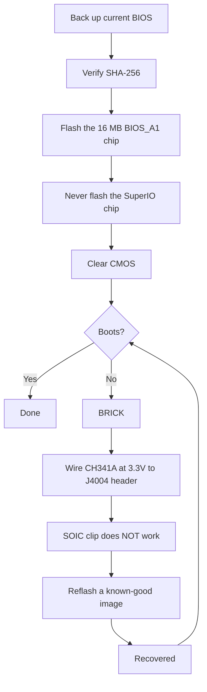

> 🌐 社区翻译。英文版为权威来源，可能更新更及时。发现错误？请提交 issue：[English](../en/08-bios.md) · https://github.com/lildebil0/awesome-bc250/issues

# BIOS 与变砖恢复

> **太长不看** —— 一个错误的 BIOS 设置能**把 BC-250 彻底变砖**，而在这块板卡上清除 CMOS *并不总能*救回它（[src](https://t.me/c/2424231195/54971)）。在你刷写*任何东西*之前，先理解这一点：你需要手边备好一套**硬件恢复套件**（一个 **CH341A 级 SPI 编程器 + 母对母杜邦线**），因为唯一可靠的解砖办法是通过板卡的 **J4004 排针**从外部重刷那颗芯片。流行的社区改版（"death" 的 BIOS，最新基于原版 **5.00**）解锁超频、GDDR6 时序和 iGPU 内存分配 —— 有用，但**不是所有设置都安全，有些会瞬间把板卡变砖**（[src](https://t.me/c/2424231195/78922)）。先核对每个镜像的 **SHA-256**，并阅读 [`assets/firmware/DISCLAIMER.md`](../../assets/firmware/DISCLAIMER.md)。**不要随意刷写。**

⚠️ **这是本手册里最危险的一章。** 刷写是破坏性的，没有恢复硬件就不可逆。如果你不准备好焊接/夹到一颗 SPI 芯片上来复活一块砖，**到此为止，跑原版 BIOS。**

---

## BC-250 上的 BIOS 是什么

BC-250 是一块 AsRock 制造的矿机/服务器板卡，载着一颗精简版 PS5 "Oberon" APU。它的 UEFI 固件住在一颗 **16 MB SPI 闪存芯片**上（一颗 Winbond **W25Q128** / Macronix MX25L128，8-pin SOIC 封装）。原版固件被大幅锁定：Setup 里几乎没有有用的东西暴露。群里见过的已知原版版本是 **3.00** 和 **5.00**；改版 BIOS 由这些重建（版本号是你的锚点 —— 永远记下一个改版是基于哪个底版构建的）。

> 原厂 **4.00** 也存在。原厂 **v4.0** 与 **v5.0** 之间唯一的功能差异是 v5.0 默认启用了 **network boot**。([来源](https://discord.com/channels/1315924807128449065/1316030225338863636/1326825429595848816))

人们重刷的两个理由：

1. **装一个改版 BIOS**，解锁隐藏菜单（超频、降压、内存、iGPU VRAM）。
2. **恢复一块砖** —— 在一个坏设置或一次失败的刷写后恢复一个已知好用的镜像。

> 💡 **你也许根本不需要刷写。** 如果你*唯一*的目标是改 VRAM/UMA 划分，你可以在**原版** P3.00 / P5.00 BIOS 上、从一个运行中的 Linux 用 **[fanoush/bc250_memcfg](https://github.com/fanoush/bc250_memcfg)** 做到 —— 无需刷写、无需编程器、无变砖风险（[elektricM: BIOS flashing](https://elektricm.github.io/amd-bc250-docs/bios/flashing/)，[elektricM: VRAM](https://elektricm.github.io/amd-bc250-docs/bios/vram/)）。只有为了那些*解锁的芯片组菜单*和 VRAM 划分之外的功能，才需要刷一个改版 BIOS（`bc250_memcfg` 命令见 [09-overclock-undervolt.md](09-overclock-undervolt.md)）。

---

## 改版 BIOS（"death" 改版）—— 它改了什么以及为什么

参考社区改版由群里的 **death** 维护。它*不是*一个从零开始的固件 —— 它重新启用（取消隐藏）了原版 BIOS 出厂隐藏的 AMD/AMI Setup 选项。要跟踪版本，因为建议随时间变了：

| 改版版本 | 底版 | 发布 | 它暴露/改了什么 | 状态 |
|---|---|---|---|---|
| **1.0**（首发） | 原版 **3.00** | 2025-06-28 | GDDR6 频率、GDDR6 时序、iGPU UMA 内存大小、核心频率、电压 | ⚠️ 坏值会把板卡变砖，**清除 CMOS 没用**（[src](https://t.me/c/2424231195/54971)） |
| 3.0 变体 | 3.00 | 2025-07 → 10 | 同样的解锁；其中一个构建加了一个**自定义 Steam 启动 logo** | logo 装饰构建镜像为 `bc250-Steam.rom`（[src](https://t.me/c/2424231195/86420)） |
| **5.00 改版**（当前） | 原版 **5.00** | 2025-10-05 | 标签页重新分组；**开放了更多设置**；**RAM/GDDR6 时序设置现在在这块板卡上真正生效** | 最新；"不是所有设置都有用，但有总比没有强"（[src](https://t.me/c/2424231195/78922)） |

用它实际能调什么（来自首发说明，[src](https://t.me/c/2424231195/54971)）：

- **GDDR6 频率** —— 据报告对一位用户（`@Haswellb`）在 **1800** 下可用，但*同样类型的改动把另一块板卡变砖了* —— 值是板卡特定的，不通用。
- **GDDR6 时序** —— 它们生效，但**太低/太紧的时序会变砖**板卡。
- **iGPU 内存（UMA）大小** —— 有效且带来真实提升。如果你的改动没生效，设 **IGC: Forces** 和 **UMA Mode: UMA_SPECIFIED**（[src](https://t.me/c/2424231195/54971)；同样的组合被社区文档确认）。
- **核心频率 / 电压** —— 暴露但作者**"未测试"**。

> ❗ **两条作者警告，仍然有效：**（1）**不要禁用集成显卡** —— 它是唯一的显示输出。（2）在这些改版的任何一个上，**一个错误设置都能把板卡变砖，而 CMOS 复位可能救不回来** —— 这正是你需要编程器的原因。（挑底版见下面的"哪个版本？"阶梯。）

> ### 哪个版本？（决策阶梯）
>
> 1. **改版 P3.00（芯片组菜单 ROM）—— 安全默认。** 这是确立的**"社区标准……最稳定、最经过测试"**，公开可验证、有已知 SHA-256，并且已经涵盖 **VRAM 解锁 + 芯片组设置**。除非你有具体理由，否则从这里开始（[elektricM: BIOS flashing](https://elektricm.github.io/amd-bc250-docs/bios/flashing/)）。
> 2. **改版 5.00 —— 当前；想要内存调校就选它。** 它是最新的底版，也是 **RAM/GDDR6 时序设置真正生效**的那个（[src](https://t.me/c/2424231195/78922)）。当你想调内存时序时，选它而非 P3.00。
> 3. **`P5.00_clv` —— 仅限专家。** 它"解锁**一切**"（每个隐藏菜单，包括实验性的 **ReBAR / Resizable BAR** 和调试/芯片组设置），这让它*"只要你改错一个东西就很容易把板卡变砖……除非你是高级用户，否则坚持用 P3.00。"* 更糟的是，**`P5.00_clv` 不在任何公开仓库里**（指南找不到），它只作为一个 Discord 附件流传，所以**没有权威哈希**；如果你必须用它，从**两个**独立运行它的人那里拿副本，并在刷写前确认两者有**相同的 SHA-256**（[elektricM: BIOS flashing](https://elektricm.github.io/amd-bc250-docs/bios/flashing/)）。

> **修改版 5.00 值得了解的怪癖。** 它的 Setup 界面显示了**默认 CPU 频率为 3600** — 这只是一个 UI 显示值，而非实际应用的频率 ([src](https://discord.com/channels/1315924807128449065/1452152658168381593/1452406964780007515))。它还在芯片组设置中提供了一个 **`x1x1x1x1` PCIe 通道拆分** 选项 ([src](https://discord.com/channels/1315924807128449065/1452152658168381593/1474231812598534351))。在此版本基础上调整内存时序时要格外小心：**极端的时序值可能会导致主板变砖，直到进行外部重新刷写，而这在 P5.00 上影响更甚** ([src](https://discord.com/channels/1315924807128449065/1371527281947971604/1468745940994101372))。另外，与任何刷写操作一样，过渡到修改版 5.00 可能会导致**在清除 CMOS 之前无显示** ([src](https://discord.com/channels/1315924807128449065/1315933088668454942/1508568321346502892))。

还有一个独立的**芯片组菜单改版**（`BC250_3.00_CHIPSETMENU.ROM`），出自最被引用的 BIOS 仓库 **[TuxThePenguin0/bc250-bios](https://gitlab.com/TuxThePenguin0/bc250-bios/)**，它在原版 3.00 之上暴露**芯片组菜单 / NBIO Common Options**。那个仓库自己的 README 直白地说：*"本仓库中没有任何东西受支持或带有任何保修 —— 做好备份。"*

> 🚫 **避开 `Smokeless_UMAF`。** 社区超频指南把这个 UEFI 编辑工具标为**不要在 BC-250 上运行 —— 它可能对板卡造成永久损坏**（[elektricM: BIOS overclocking](https://elektricm.github.io/amd-bc250-docs/bios/overclocking/)）。坚持用上面那些已知好用的 ROM。

---

## 刷写之前 —— 安全检查清单

1. **先备份你当前的 BIOS**（用你将要刷写的同一个工具把它读出来 —— 见路径 B/恢复）。一个备份就是你免费的撤销。
2. **核对 SHA-256**，把镜像和 `assets/PROVENANCE.md` / 来源帖子对照。社区刷写指南公布的芯片组菜单 ROM 哈希是
   `48fbe5d366e6a56e2fdffdca848426216ba1f083610dab63db89d2f4e6c940b5`（[elektricm docs](https://elektricm.github.io/amd-bc250-docs/bios/flashing/)）。
3. **确认芯片大小**，而不只是标记。那颗 16 MB BIOS 芯片是目标；**不要**刷那颗小的 SuperIO 芯片（见恢复一节）。不同板卡版本可能带略有不同的芯片型号 —— 要紧的是**容量（16 MB）**，标记的末尾字母可能不同（[src](https://t.me/c/2424231195/67880)）。
4. **在第一次刷写*之前*备好恢复硬件**，而不是在你变砖之后。
5. 刷写后，**清除 CMOS** 让新设置（尤其是 VRAM 分配）生效（见"每次刷写后"）。



### 刷写前核对校验和

上面的第 2 步说要核对 SHA-256 —— 这里是怎么做。计算你即将刷写的文件的哈希，逐字符与 [`assets/PROVENANCE.md`](../../assets/PROVENANCE.md) 里为该文件列出的值对照。

```bash
# Linux:
sha256sum BC250_3.00_CHIPSETMENU.ROM
```

```powershell
# Windows (PowerShell):
Get-FileHash BC250_3.00_CHIPSETMENU.ROM -Algorithm SHA256
```

`PROVENANCE.md` 可能只列**前 16 个十六进制字符**作为短指纹。若如此，检查你计算出的哈希是否**以**那 16 个字符**开头** —— 完全匹配那个前缀已经是一个强校验（维护者可应请求公布完整哈希）。

公开托管镜像的**经核实的完整 SHA-256 哈希**（跨多个社区仓库交叉核对 —— 每个已知好用的 BC-250 BIOS 文件都**正好是 16 MB / 16777216 字节**；大小不同就意味着它损坏了、是个工具/补丁，或是无关文件）（[elektricM: BIOS flashing](https://elektricm.github.io/amd-bc250-docs/bios/flashing/)）：

| 文件 | 类型 | SHA-256 |
|---|---|---|
| `BC250_3.00_CHIPSETMENU.ROM`（又名 `Robin3.00`、`BC250CHIPSETMENU.ROM`） | **改版 P3.00** —— VRAM + 芯片组解锁，*推荐* | `48fbe5d366e6a56e2fdffdca848426216ba1f083610dab63db89d2f4e6c940b5` |
| `Robin5.00` | **原版** P5.00（不是改版 `P5.00_clv`） | `0d6f136cb120cf3b2de26d5c4d7f255604fdbf4b9442af5ba55419b95b89aa82` |
| `BC250_3.00.ROM` | 原版 P3.00 | `07595ca3aecf8a4caa28a397b5298f3946a1b769f87b16f67adc369c3f69045c` |
| `BC250_2.00.bin` | 原版 P2.00 | `ee6150dfed33bd05ea46063a352549416fdf3f45fa0e5edac2a68ef78d71083c` |
| `P5.00_clv` | 改版 P5.00（解锁一切） | **无公开哈希** —— 仅 Discord，核实两个独立副本一致 |

> 改版 P3.00 在各仓库里以好几个文件名出现（`BC250_3.00_CHIPSETMENU.ROM`、`BC250CHIPSETMENU.ROM`、`Robin3.00`）—— 它们都哈希成上面那个值，所以名字无所谓。`Robin5.00` 是**原版** P5.00，是和改版 `P5.00_clv` 不同的文件。每个的公开来源（TuxThePenguin0 GitLab、forgenam、tipitochen、csabakecskemeti、scrakcho、dannybastos、kenavru、MrrZed0）列在 [elektricM 刷写指南](https://elektricm.github.io/amd-bc250-docs/bios/flashing/)里。

> 🔴 **如果校验和不匹配，不要刷写。** 不匹配意味着一个损坏或错误的文件 —— 刷它正是你把板卡变砖的方式。重新下载镜像并再次核对。

---

## 路径 A —— 软件刷写（从板卡，无需编程器）

这是板卡仍能启动时安装/升级 BIOS 的常规方式。用一个 **FAT32 USB 棒**和 AMI 固件更新工具。

**EFI / AFU 方法**（[src](https://t.me/c/2424231195/54979)）：

1. 把一个 USB 棒格式化为 **FAT32**。
2. 把 AFU 压缩包（例如 `AfuEfi64_5.16.zip`）的内容**和那个 BIOS 文件**复制到上面。
3. 重启 BC-250 并从 USB 棒**启动**进 EFI shell。
4. 运行：
   ```
   afuefix64.efi <filename>.<ext> /P /N
   ```
   - `/P` = 编程主 BIOS。
   - `/N` = 也编程 **NVRAM**。这能避免在版本*之间*迁移时（例如从另一个版本到 3.00）的错误 —— **但它会抹掉你保存的设置。** 你可以去掉 `/N`，但那时要预期可能的错误。（[src](https://t.me/c/2424231195/54979)）
5. 如果工具看不到文件，试 `fs0:`、`fs1:` …… 找出哪个是 U 盘（[src](https://t.me/c/2424231195/54979)）。

有些社区构建附带一个现成的 `Flash.nsh` 脚本和一个改名的 ROM（例如把改版 ROM 改名以匹配脚本），这样你只需启动到 EFI shell 并运行脚本（[elektricm docs](https://elektricm.github.io/amd-bc250-docs/bios/flashing/)）。Linux 上也有一个 **`afulnx`** 构建（`afulnx-5.05.04Z.tar.gz`），用于从运行中的系统刷写（[src](https://t.me/c/2424231195/54507)）。

#### 权威的 EFI-shell 配方（`Flash.nsh` / `Robin5.00` 方法）

社区刷写指南标准化为一个自包含套件和一个固定文件名 —— 这是最被复刻的 USB 路径（[elektricM: BIOS flashing](https://elektricm.github.io/amd-bc250-docs/bios/flashing/)）：

1. **拿到 EFI 套件：** `4U12G BIOS Update.zip`（出自 [kenavru/BC-250](https://github.com/kenavru/BC-250) 仓库）—— 它包含 `AfuEfix64.efi`、`Flash.nsh` 和 `amdvbflash.efi`。*它还捆绑了一个名为 `Robin5.00` 的原版 P5.00 BIOS —— 把它移走，免得你不小心刷了它。*
2. **准备一个 FAT32 U 盘（建议 ≤ 32 GB）。** 把套件 `BIOS EFI` 文件夹的内容复制到**根目录**。
3. **把你的改版 ROM 改名为 `Robin5.00`**（去掉 `.ROM` 扩展名）—— 那是 `Flash.nsh` 查找的确切名字。*（或者改 `Flash.nsh` 去匹配你的文件名。）* 根目录随后应有：`AfuEfix64.efi`、`Flash.nsh`、`amdvbflash.efi`、`Robin5.00`（你改名的改版）和 `EFI` 文件夹。
4. **用一根直连 DisplayPort 显示器。** 有源/无源 **HDMI 转接可能把 BIOS 菜单变成黑屏** —— 这块板卡上一个已知的显示坑。
5. **拔掉所有 SSD/驱动器**，让板卡自动落到 EFI shell，插入 U 盘，上电。你会落在一个黄色的 `Shell>` 提示符。
6. 在提示符处输入 **`blk0:`** 然后回车 —— **注意冒号后的空格**（这会选中 USB 卷；`blk0:` 是 elektricM 记录的选择器，区别于上面 `fs0:`/`fs1:` 的试探）。然后输入 **`Flash.nsh`** 并回车。
7. **等待。别碰键盘，别断电。** 如果它在写入时*看似*卡住，**至少等 15 分钟** —— 写入途中断电会把板卡变砖。完成时它会重启（或要求你重启）。
8. **立即断电并取下 U 盘**，免得它又循环回刷写器。

> 🔴 **上电刷写之前：检查 8-pin PCIe 供电接线**，对照你 PSU 的 12 V/GND 图。**反向极性可能永久损坏板卡**（[elektricM: BIOS flashing](https://elektricm.github.io/amd-bc250-docs/bios/flashing/)）。

#### 刷写后必需的 BIOS 设置（在清除 CMOS 之后立刻做）

刷写**并**清除 CMOS（下一节）之后，进 Setup（连按 **Del**）设这些 —— 在它们正确之前 VRAM 划分不会正常工作（[elektricM: BIOS flashing](https://elektricm.github.io/amd-bc250-docs/bios/flashing/)，[elektricM: BIOS VRAM](https://elektricm.github.io/amd-bc250-docs/bios/vram/)）：

| 设置 | 路径 | 值 |
|---|---|---|
| Integrated Graphics Controller | Chipset → GFX Configuration | **Forces** |
| UMA Mode | Chipset → GFX Configuration | **UMA_SPECIFIED** |
| UMA Frame Buffer Size | Chipset → GFX Configuration | **512MB**（推荐）或一个固定大小 |
| IOMMU | Advanced → CPU Configuration | **Disabled** |
| Boot Mode | Boot → Boot Mode | **UEFI** |

先核实 CMOS 清除真的生效了 —— **时钟应该显示错误**；若它仍正确，重复清除。然后 F10 保存。`512MB` 这个选择是*动态*分配，不是 512 MB 上限（见 [09-overclock-undervolt.md](09-overclock-undervolt.md)）。

> ★ **为什么 512 MB UMA *增加* FPS（机制）。** 把 UMA 缓冲区设为 **512 MB** 并不会饿着 GPU —— 它让系统能**动态平衡 RAM 与 VRAM**，而不是把一大块固定切片锁起来，而单是这种再平衡就被归功于一次真实的 FPS 提升：Cyberpunk 2077 在 FSR 3.0 *balanced*、1080p、Steam-Deck 预设下，从 **60 → 66 fps（在 2 GHz 超频下）→ 76 fps**（[Old Lamer — Part I](https://youtu.be/ohpEY2XQ_lo) ~11:21；⚠ 近似 —— 数字从视频转录，当作一个构建的结果）。所以"512 MB 最好"不只是安全的大小 —— 那个小动态缓冲区是性能故事的*一部分*，不是一种妥协。

**flashrom 退路**（若 AFU 报错）（[src](https://t.me/c/2424231195/54979)，由 `@mrartemsid` 建议并测试）：

```bash
# Read (back up):
sudo flashrom -p internal:boardmismatch=force -r <name>.bin
# Write:
sudo flashrom -p internal:boardmismatch=force -w <name>.bin
```

> ⚠️ 软件刷写只在**板卡仍能 POST** 时有用。一个坏设置把它变砖的那一刻，路径 A 就没了，你只能走下面的硬件路径。

---

## 路径 B —— 硬件刷写 / 解砖（CH341A SPI 编程器）

这是**恢复**路径，也是置顶的"刷一块砖最方便的方式"（[src](https://t.me/c/2424231195/67880)）。你用一个 USB SPI 编程器，从另一台 PC 直接重写那颗 16 MB SPI 芯片。用到的软件：**NeoProgrammer**（Windows）或 **flashrom**（Linux）。

> 🔴 **SOIC-8 夹子在这块板卡上不管用。** death 说得很直白：*"夹子在我们这块板卡上……基本上根本不行。"*（[src](https://t.me/c/2424231195/67880)）。注意：`assets/firmware/DISCLAIMER.md` 笼统地提到一个 "SOIC clip" —— 实际上你必须**改为接到板载 J4004 排针。** 这是本章里最重要的单条恢复事实。

### J4004 排针针脚定义（接这里）

板卡暴露了一个 **2.54 mm 间距的 J4004 排针**，专门用于重刷 SPI/BIOS 芯片。针脚定义（来自置顶接线截图，[src](https://t.me/c/2424231195/67880)）：

```
J4004
[ GND  SCLK  MOSI  UNK ]
[ VCC  CS    MISO      ]
   ^  (pin-1 marker)
```

| J4004 针 | 信号 | CH341A 焊盘 |
|---|---|---|
| VCC | 3.3 V 电源 | VDD / 3.3V |
| GND | 地 | GND |
| CS | 片选 | CS / SS |
| SCLK | 时钟 | CLK / SCK |
| MOSI | 数据输入（到芯片） | MOSI |
| MISO | 数据输出（从芯片） | MISO |

对应的 **W25Q128 SOIC-8 / CH341A 颜色映射**在同一张置顶截图里 —— 把 `/CS, DO(MISO), CLK, DI(MOSI), VCC, GND` 对到 CH341A 的 `CS, MISO, CLK, MOSI, VDD, GND` 焊盘。上电前**三重检查 VCC 和 GND**；接反会要芯片的命（[src](https://t.me/c/2424231195/67880)）。

> **J4004 针编号与那两个未知针。** elektricM 指南给排针编号 VCC=1、GND=2、CS=3、SCLK=4、MISO=5、MOSI=6，其中**针 7 和 8 在刷写时不用 —— 它们通过 10 kΩ 电阻接地。** 针 1（VCC）由 PCB 上一个**箭头 `>` 或一个方形焊盘**标记（[elektricM: BIOS flashing](https://elektricm.github.io/amd-bc250-docs/bios/flashing/)）。

> **确切的目标芯片与那个密度笔误。** 那颗 16 MB 部件是一颗 Winbond **W25Q128JVSQ**（128 Mbit / 16 MB），或在某些批次上是一颗 Macronix **MX25L12835F**。有些社区文档把它笔误成 **"25Q168" —— 那是错的**；正确的 16 MB 密度代码是 **128**（[elektricM: BIOS flashing](https://elektricm.github.io/amd-bc250-docs/bios/flashing/)）。如果你用一个裸 **SOIC-8 夹子**而非 J4004 刷写，芯片自己的引脚顺序是标准 SPI 布局：`1 CS · 2 DO · 3 WP · 4 GND · 5 DI · 6 CLK · 7 HOLD · 8 VCC`（[elektricM: BIOS recovery](https://elektricm.github.io/amd-bc250-docs/bios/recovery/)）—— 但记住 death 的发现：**夹子在这块板卡上几乎不管用**，所以优先用 J4004。

> 🙏 致谢：J4004 针脚定义、逆向工程和改版固件镜像仓库主要是 **Segfault** 的工作（P3.00 芯片组菜单 ROM 即"Segfault 改版"）（[elektricM: BIOS flashing](https://elektricm.github.io/amd-bc250-docs/bios/flashing/)）。

### NeoProgrammer 流程（置顶）（[src](https://t.me/c/2424231195/67880)）

1. 用母对母线按针脚定义把编程器接到 **J4004**。**把接线检查约 10 次，尤其是 VCC 和 GND。**（PSU 已拔。）
2. 打开 **NeoProgrammer**。
3. 运行芯片**自动检测**，也读一下芯片本身上的标记。
4. **对比标记。** 如果末尾字母和清单不同但**容量匹配（16 MB）**，那没问题。
5. **擦除**芯片。
6. 在软件里**打开 BIOS 文件**（拖放也行）。
7. **写入**芯片。
8. **把线从 J4004 断开。**
9. 给板卡上电。

### flashrom 等价（Linux），与社区文档交叉核对

社区刷写指南用一个 **CH347** 编程器，并警告别用便宜的黑 PCB CH341A 板（下一节）。识别正确的芯片 —— 目标是那颗 **16 MB BIOS 芯片**（`BIOS_A1`），**绝不要**那颗 512 KB SuperIO（`SIO1_R`），刷它会把 SuperIO 变砖（[elektricm docs](https://elektricm.github.io/amd-bc250-docs/bios/flashing/)）：

```bash
# Detect / identify the chip:
sudo flashrom -p ch347_spi

# Back up the stock BIOS (twice, then diff to be sure the read is stable):
sudo flashrom -p ch347_spi -r backup_stock.bin
sudo flashrom -p ch347_spi -r backup_verify.bin

# Write the new image, then verify it read back identical:
sudo flashrom -p ch347_spi -w BC250_3.00_CHIPSETMENU.ROM
sudo flashrom -p ch347_spi -v BC250_3.00_CHIPSETMENU.ROM
```

（用 `-p ch341a_spi` 给 CH341A，或 `serprog` 给 Raspberry Pi Pico，替换 `ch347_spi`。）⚠ `ch347_spi` / `serprog` 到*这块*板卡确切接线的映射出自社区指南 —— `⚠ 核实`对照你自己的编程器型号。

> **检测会告诉你你在哪颗芯片上。** 如果 `flashrom -p …` 报告 **`Winbond W25Q128…`** 或 **`Macronix MX25L128…`**，你在正确的那颗 16 MB BIOS 芯片上。如果它报告 **`Macronix MX25L4005…`（512 KB）**，**停 —— 你接到了 SuperIO 芯片**（`SIO1_R`）；刷它会让风扇控制/传感器变砖。换到另一颗芯片（[elektricM: BIOS flashing](https://elektricm.github.io/amd-bc250-docs/bios/flashing/)）。刷写时让 **PSU 从墙插拔掉**并放掉电容电量（按几下电源键）—— 在夹子刷写期间给板卡供电是*不*推荐的（[elektricM: BIOS recovery](https://elektricm.github.io/amd-bc250-docs/bios/recovery/)）。

### CH341A 3.3 V 陷阱（读这个，否则你会烤芯片）

许多便宜的**黑 PCB CH341A** 编程器**即便 VCC 是 3.3 V 也以 5 V 驱动它们的数据线** —— 而 BC-250 的 BIOS 芯片是一颗 **3.3 V** 部件，所以数据线上的 5 V 能损坏它。这在某些板上是已知的、实测过的故障（Fabian 的板和群里一块相同的板，都经电压测量确认）（[src](https://t.me/c/2424231195/100285)）。修法：

- 优先用一个数据线真正是 3.3 V 的编程器（例如 **CH347**），**或**
- 应用**免焊接的 CH341A 5V→3.3V 数据线修复**：切断到芯片的 USB 5 V 电源线，改喂 3.3 V —— 见 [sawyershepherd.org 写作记录](https://sawyershepherd.org/post/solderless-ch341ab-fix-5v-to-33v-data-lines/) 和 [wej.k.vu CH341A 修复](https://wej.k.vu/electronics/ch341a-mini-programmer-fix/)（[src](https://t.me/c/2424231195/100285)）。

---

### 底层排针、调试与板载硅片

在上面 J4004 刷写排针之外，板卡还带有若干其他排针和一套已知的板载芯片。这些在 elektricM 硬件文档里被逆向，对清除 CMOS、调试探测、风扇接线，以及在刷写前确认哪颗芯片是哪颗都有用。针脚值从（[elektricM: pinouts](https://elektricm.github.io/amd-bc250-docs/hardware/pinouts/)）逐字转录。

**CLRCMOS1 —— 清除 CMOS 跳线（3 针）。** 这就是本章里到处提到的"短接 CMOS 跳线"的那个跳线 —— 这是它的映射：

| 位置 | 行为 |
|---|---|
| 针 1–2 | CR2032 给 CMOS 供电（默认） |
| 针 2–3 | 清除 CMOS |

> 💡 当[刷写前检查清单](#刷写之前--安全检查清单)和["每次刷写后"](#每次刷写后--清除-cmos别跳过这步)告诉你"把 CMOS 跳线短接约 20 秒"时，**CLRCMOS1** 就是那个跳线：把它从针 1–2 移到针 2–3，等待，然后移回来。（取下 CR2032 超过 60 秒是替代办法。）

**TPMS1 —— LPC 调试排针（18 针，2.0 mm 间距）：**

| 针 | 信号 | 针 | 信号 |
|---|---|---|---|
| 1 | PCICLK | 2 | GND |
| 3 | FRAME | 4 | SMB_CLK_MAIN |
| 5 | PCIRST# | 6 | SMB_DATA_MAIN |
| 7 | LAD3 | 8 | LAD2 |
| 9 | 3V | 10 | LAD1 |
| 11 | LAD0 | 12 | GND |
| 13 | (empty) | 14 | S_PWRDWN# |
| 15 | 3VSB | 16 | SERIRQ# |
| 17 | GND | 18 | GND |

> 💡 **针 9（3V）只在板卡上电时有电** —— 所以它能用作一个"系统已开机"检测信号。这让它成为自动开机 / 真 ATX 转接构建的一个备选检测点（交叉参考 [03-power-supply.md 里的 `AUTO_PWRON` 跳线](03-power-supply.md)）。

**J2 —— JTAG/HDT 调试排针（20 针，1.27 mm 间距，未焊接，在板卡底面）：**

| 针 | 信号 | 针 | 信号 |
|---|---|---|---|
| 1 | VDDIO | 2 | TCK |
| 3 | GND | 4 | TMS |
| 5 | GND | 6 | TDI |
| 7 | GND | 8 | TDO |
| 9 | TRST_L | 10 | PWROK_BUF |
| 11 | DBRDY3 | 12 | RESET_L |
| 13 | DBRDY2 | 14 | DBRDY0 |
| 15 | DBRDY1 | 16 | DBREQ_L |
| 17 | GND | 18 | TEST19 |
| 19 | VDDIO | 20 | TEST18 |

> TEST18、TEST19 和 DBRDY0 悬空。这是板卡上**唯一**的硬件复位/调试接口。

**I2C_HEADER1（3 针）：** `SCL · SDA · GND`。SCL 是**更靠近供电接口**的那个针。这条总线携带**到 Intersil PMIC 的 PMBUS** —— 一个电源遥测访问点。

**CPU_FAN1（4 针）：** `PWM · Tach · 12V · GND`。

**J4003 —— 多风扇排针（16 针，2×8，2.54 mm）：**

| 行 1 | 1 GND | 2 F1T | 3 F2T | 4 F3T | 5 F4T | 6 F5T | 7 DET | 8 (empty) |
|---|---|---|---|---|---|---|---|---|
| **行 2** | 1 GND | 2 F1P | 3 F2P | 4 F3P | 5 F4P | 6 F5P | 7 GND | 8 GND |

这里 `T` = tach，`P` = PWM，对应风扇 1–5。

> 💡 **DET（行 1，针 7）在板卡坐在一块风扇 / 配电板上时接地** —— 即它检测那块载板。（BIOS↔Linux 风扇编号在 [06-linux.md → 传感器与风扇控制](06-linux.md#传感器与风扇控制)里介绍；这里不重复。）

**板载硅片（BOM）。** 仓库已经在刷写章节里命名了 `SIO1_R` 和 `BIOS_A1`，但从未给出部件号或大小；这张表让刷写者确认哪颗芯片是哪颗（那颗 16 MiB Winbond 是 BIOS，那颗 512 KiB Macronix 是 SuperIO —— 别动它）：

| 标号 | 部件 | 作用 |
|---|---|---|
| PUA1 | Intersil ISL69247 | 主 PMIC |
| PUIO1 | Intersil ISL95712 | 核心供电 PMIC |
| PUA11… | Intersil ISL99360 | 智能功率级（相） |
| M2U2 | NXP CBTL04083B | 2:1 PCIe x4 mux |
| U30 | Realtek RTL8111H | 以太网 NIC（PCIe x1） |
| SU1 | AMD 218-0844029 | A68H "Bolton-D2H" FCH 芯片组 |
| UIO1 | Nuvoton NCT6686D | SuperIO（hwmon 传感器芯片） |
| BIOS_A1 | Winbond 25Q128JVSQ | 16 MiB SPI 闪存 = **BIOS**（刷这颗） |
| SIO1_R | Macronix MX25L4006E | 512 KiB SPI 闪存 = SuperIO 程序（**别刷 —— 会把 SuperIO 变砖**） |

> 这里命名的 SuperIO 传感器芯片（Nuvoton **NCT6686D**）就是 Linux `nct6687`/`nct6683` 驱动绑定的那颗 —— 传感器/风扇配置见 [06-linux.md](06-linux.md)。

**固件工具（高级）。** 在分析镜像时，经常会用到两个工具：

- **`psptool`** 用于检查和提取 BIOS 转储文件中的 AMD 固件 blob。`psptool -E bios.bin` 可以列出所有条目；`psptool -X -d 0 -e 1 -o firmware.bin bios.bin` 可以将 SMU 固件提取出来用于分析。([bc250-collective/amd_smu_reverse_engineering](https://github.com/bc250-collective/amd_smu_reverse_engineering))
- **`Zentool`** 用于修补 CPU 微代码 —— 例如替换 `RDRAND` 指令。([AMD-BC-250/documentation #1](https://github.com/AMD-BC-250/documentation/issues/1))

---

## Secure Boot 与 CSM（启动前提）

把这两个加进 BIOS 设置的前提清单 —— 否则**自定义/打过补丁的内核不会启动**（40-CU 补丁、频率补丁等）：

| 设置 | 值 |
|---|---|
| Secure Boot | **Disabled** |
| CSM（Compatibility Support Module） | **Disabled** |

来源：[elektricM: boot troubleshooting](https://elektricm.github.io/amd-bc250-docs/troubleshooting/boot/)。

---

## "srep" 自动复位想法（实验性 —— 不是成品功能）

因为一个坏设置能把板卡变砖而**清除 CMOS 修不了**，death 试验过把一个 **`srep`** 例程烤进 BIOS 来**在变砖时自动复位设置** —— 想法最初来自 `@Jacky_Fish`（[src](https://t.me/c/2424231195/60552)）。概念是：让 BIOS 把它的 NVRAM/`amdsetup` 变量打回默认值，可选地只在 USB 棒上存在触发文件时（这样它不会每次启动都抹掉你的设置）。截至群里的进展，**这还不工作** —— *"板卡固执地装作一块彻底的砖，什么都没复位"*（[src](https://t.me/c/2424231195/60883)）。把任何"自愈 BIOS"声明当作**未经证实**；你真正的安全网仍是外部编程器。依赖任何 srep 构建之前先 `⚠ 核实`。

---

## 每次刷写后 —— 清除 CMOS（别跳过这步）

刷 BIOS **不会**复位存储的设置，而且若干设置（尤其是 **VRAM/UMA 分配**）在你清除 CMOS 之前不会真正生效。一位用户正撞上了这个：BIOS 显示了新的 VRAM 大小并"保存"了它，但系统（Bazzite）仍报告旧的 4 GB RAM / 12 GB VRAM 划分，直到清除 CMOS（[src](https://t.me/c/2424231195/97290)）。怎么清除：

- **取下 CR2032 纽扣电池超过 60 秒**（推荐），**或**
- **把 CMOS 跳线短接约 20 秒。**（[elektricm docs](https://elektricm.github.io/amd-bc250-docs/bios/flashing/)）

> 注意限度：清除 CMOS 能修复"设置没生效"和*轻微*的坏配置 —— 但在 1.0/3.00 改版一代上，据报告它**不能**恢复一块真正的砖（[src](https://t.me/c/2424231195/54971)）。那种情况见路径 B。

---

## 镜像固件

群里讨论过的 BIOS 镜像镜像在 `assets/firmware/` 下，供**恢复/保存**（见 [`DISCLAIMER.md`](../../assets/firmware/DISCLAIMER.md)，刷写前在 `PROVENANCE.md` 里核实每个文件的 SHA-256）：

| 文件 | 大小 | 它是什么 | 来源 |
|---|---|---|---|
| `BC250_3.00.ROM` | 16 MB | 原版 3.00 转储 | （[src](https://t.me/c/2424231195/5215)） |
| `BC250_3.00_CHIPSETMENU.ROM` | 16 MB | 芯片组菜单改版（TuxThePenguin0） | （[src](https://t.me/c/2424231195/86395)） |
| `dump_5.00.bin` | 16 MB | 原版 5.00 转储 | （[src](https://t.me/c/2424231195/24661)） |
| `BC250_5.00_clv.zip` | 16 MB | **death 的 5.00 改版（当前）** | （[src](https://t.me/c/2424231195/78922)） |
| `bc250_3.00_clv1.zip` | 16 MB | death 的首个 3.00 改版（1.0） | （[src](https://t.me/c/2424231195/54971)） |
| `bc250-Steam.rom` | 16 MB | 带 Steam 启动 logo 的 3.0 改版 | （[src](https://t.me/c/2424231195/86420)） |
| `bc250 modded bios.ROM` | 16 MB | 早期改版镜像 | （[src](https://t.me/c/2424231195/30100)） |
| `my_4.0_MODED.bin` | 16 MB | 过渡的 4.0 改版 | （[src](https://t.me/c/2424231195/45580)） |
| `W25Q128BV@WSON8_…BIN` | 16 MB | 原始芯片读取（W25Q128） | （[src](https://t.me/c/2424231195/5217)） |
| `AfuEfi64_5.16.zip` | — | AMI AFU EFI 刷写器 | （[src](https://t.me/c/2424231195/54979)） |
| `afulnx-5.05.04Z.tar.gz` | — | AMI AFU Linux 刷写器 | （[src](https://t.me/c/2424231195/54507)） |

> 别把 PS5 BIOS（`PS5 Disk Edition … BIOS.bin`，2 MB）或那些 512 KB 芯片刷到 BC-250 的 16 MB BIOS 芯片上 —— 目标错误，见恢复警告。

---

## 来源

- death 的改版 —— 首发（3.00）—— https://t.me/c/2424231195/54971 · 当前（5.00）—— https://t.me/c/2424231195/78922 · Steam-logo 构建 —— https://t.me/c/2424231195/86420
- 软件刷写（AFU `/P /N`、flashrom）—— https://t.me/c/2424231195/54979 · afulnx —— https://t.me/c/2424231195/54507
- 硬件解砖（置顶，NeoProgrammer + J4004 接线截图）—— https://t.me/c/2424231195/67880
- srep 自动复位想法 —— https://t.me/c/2424231195/60552 · 结果（没用）—— https://t.me/c/2424231195/60883
- 刷写后需要清除 CMOS —— https://t.me/c/2424231195/97290
- CH341A 5V→3.3V 数据线陷阱 —— https://t.me/c/2424231195/100285 · 修复写作记录 —— https://sawyershepherd.org/post/solderless-ch341ab-fix-5v-to-33v-data-lines/
- 最被引用的 BIOS 仓库 —— [TuxThePenguin0/bc250-bios](https://gitlab.com/TuxThePenguin0/bc250-bios/)（`BC250_3.00_CHIPSETMENU.ROM`、`CHIPSETMENU.md`）
- 社区刷写/恢复指南（经核实的 SHA-256 表、`Flash.nsh`/`Robin5.00` 配方、`blk0:` 选择器、DisplayPort/HDMI 坑、15 分钟卡住规则、J4004 针脚定义 + 针 7/8、W25Q128JVSQ/"25Q168" 笔误、CH347、刷写后 Setup 值、Segfault 致谢）—— [elektricM: BIOS flashing](https://elektricm.github.io/amd-bc250-docs/bios/flashing/)
- 恢复指南（SPI 8-pin 针脚定义、MX25L4005 = SuperIO 检测、PSU 拔掉后刷写、场景演练）—— [elektricM: BIOS recovery](https://elektricm.github.io/amd-bc250-docs/bios/recovery/)
- 板卡针脚定义与板载硅片（CLRCMOS1、TPMS1 LPC、J2 JTAG/HDT、I2C_HEADER1、CPU_FAN1、J4003 多风扇、Intersil/NXP/Realtek/Nuvoton/Winbond/Macronix BOM）—— [elektricM: pinouts](https://elektricm.github.io/amd-bc250-docs/hardware/pinouts/)
- VRAM 指南（`bc250_memcfg` 免刷写大小设定、UMA Frame Buffer 值、内核参数 VRAM、Vulkan-vs-OpenGL 报告）—— [elektricM: BIOS VRAM](https://elektricm.github.io/amd-bc250-docs/bios/vram/)
- ★ 512 MB UMA → 动态 RAM/VRAM 平衡 → FPS 增益机制（Cyberpunk 60 → 66 @ 2 GHz 超频 → 76 fps，FSR 3.0 balanced，1080p，Steam-Deck 预设）—— [Old Lamer — Part I](https://youtu.be/ohpEY2XQ_lo) ~11:21（⚠ 近似，从视频转录）
- `Smokeless_UMAF` 危险说明 —— [elektricM: BIOS overclocking](https://elektricm.github.io/amd-bc250-docs/bios/overclocking/)
- 免刷写 VRAM 工具 —— [fanoush/bc250_memcfg](https://github.com/fanoush/bc250_memcfg)
- 内存时序工具 —— `Mem_Timing_Utility.zip` https://t.me/c/2424231195/55351
- 固件镜像政策 —— [`assets/firmware/DISCLAIMER.md`](../../assets/firmware/DISCLAIMER.md)

> 用这些解锁设置做超频/降压在 [09-overclock-undervolt.md](09-overclock-undervolt.md) 里介绍。镜像 BIOS 文件住在 `assets/firmware/` 下，每个文件的 SHA-256 在 `PROVENANCE.md` 里。
