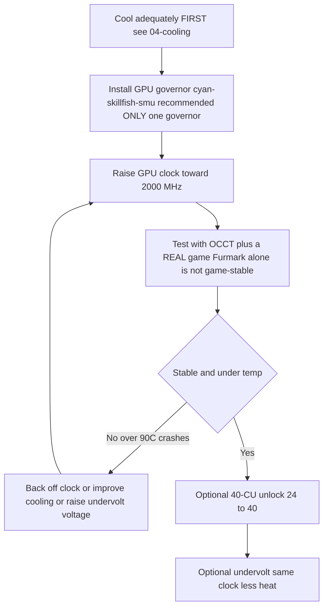

> 🌐 社区翻译。英文版为权威来源，可能更新更及时。发现错误？请提交 issue：[English](../en/09-overclock-undervolt.md) · https://github.com/lildebil0/awesome-bc250/issues

# 超频与降压

> **太长不看** —— 开箱即用时 BC-250 的 GPU 跑得很慢（常被钉死在 **1500 MHz**，性能~很弱）。社区的解决办法是用一个**调速器（governor）**来覆盖时钟/电压：如今推荐的是 **[cyan-skillfish-governor-smu](https://github.com/filippor/cyan-skillfish-governor)**（无需内核补丁，已为 Arch/CachyOS/Bazzite/Fedora 打包）；**[oberon-governor](https://gitlab.com/mothenjoyer69/oberon-governor)** 是最早的那个，至今仍能用。任选其一，编辑它把 GPU 推到 **2000 MHz（~+30% FPS）**。更新的 **[bc250_smu_oc](https://github.com/bc250-collective/bc250_smu_oc)** 工具包还能给 **CPU** 超频（推荐 **4 GHz @ 1275 mV**）。另外，**[40-CU 解锁](https://github.com/duggasco/bc250-40cu-unlock)** 会重新启用 AMD 在固件里禁用的 **24 → 40 个计算单元** —— 这比单纯提时钟的 GPU 收益更大（一次 Superposition 跑分从 **4647 → 6863** 分，([来源](https://t.me/c/2424231195/137035))）。**这一切都是热量。先把板卡冷却好** —— 见 [04-cooling.md](../en/04-cooling.md) —— 因为没有足够散热的超频会在 ~90 °C 以上崩溃并复位板卡。

这是黄金路径的**最后**一步，不是第一步。先让板卡稳定、凉爽地跑起来（[06-linux.md](../en/06-linux.md)、[04-cooling.md](../en/04-cooling.md)），再去碰这里的任何东西。这里的一切都是"风险自负" —— 社区反复这么说（[来源](https://t.me/c/2424231195/106844)）。

---

## 四个调节杆（以及每个值多少）

BC-250 有**四**个可以独立调的东西。它们可以叠加：

| 调节杆 | 工具 | 典型收益 | 热量代价 |
|-------|------|--------------|-----------|
| **GPU 时钟** 1500 → 2000 MHz | 调速器（cyan-skillfish-smu / oberon） | GPU 受限时 **~+30% FPS** | 高 |
| **GPU 降压**（固定时钟） | 同一个调速器 | FPS 不变，**凉得多** | *负*（更少热量） |
| **CPU 时钟** 3.5 → 4.0 GHz | `bc250_smu_oc` | 帮助 CPU 受限的游戏 | 高 |
| **40-CU 解锁** 24 → 40 个 CU | `bc250-40cu-unlock` | GPU 工作量 **最高 ~+48%** | 高 |

开始前，聊天里两个诚实的注意事项：

- **大多数 BC-250 游戏是 CPU 受限，而非 GPU 受限。** 把 GPU 从 2000 → 2229 MHz，在《古墓丽影：暗影》里只给一个测试者带来 *1 fps* 的提升（90 → 91），而功耗和温度却猛涨 —— 所以那个标题党式的"+30%"只在少数几个 GPU 是瓶颈的游戏里才落地（[来源](https://t.me/c/2424231195/67029)）。
- **热量比性能扩展得更糟。** 同一个测试者：2000 MHz @ 960 mV，压力测试 = **75 °C**；2229 MHz @ 1030 mV = **93 °C** —— 他退回去了，因为他的 PSU 和散热器扛不住（[来源](https://t.me/c/2424231195/66972)、[来源](https://t.me/c/2424231195/67029)）。

> ⚠️ **安全下限。** 降频从 **85 °C** 左右开始，板卡在 **90 °C** 左右硬崩溃/复位（见 [04-cooling.md](../en/04-cooling.md)）。如果你在负载下越过 ~85 °C，你已经*超*出了你的散热预算 —— 降时钟或降压，别再往上推。



---

## 第 1 步 —— GPU 时钟与降压：调速器

BC-250 的 amdgpu 驱动不暴露常规的 sysfs 超频。社区方案是一个**调速器** —— 一个直接写入时钟/电压状态的小守护进程。对今天的全新安装，推荐 **cyan-skillfish-governor-smu**；**oberon-governor** 是最早的那个，至今仍能用（作为既有的备选方案保留在下面）。

<p align="center"></p>
<sub>📈 可编辑源文件：<a href="../../assets/diagrams/gpu-clock-tradeoff.drawio">gpu-clock-tradeoff.drawio</a>（用 <a href="https://draw.io">draw.io</a> 打开）。绿色 = 收益，红色 = 代价。</sub>

### cyan-skillfish-governor-smu（推荐）

[filippor/cyan-skillfish-governor](https://github.com/filippor/cyan-skillfish-governor)，SMU 分支 —— 通过 **SMU 固件调用**来驱动时钟/电压，所以它**在任何发行版上都不需要内核频率补丁**，处于活跃维护，并且已为每个主流发行版打包。它还加入了**内存控制器电源配置**控制，把空闲 TDP 降到 **~30–35 W**（空闲时更凉更静）（[来源](https://t.me/c/2424231195/125821)）。

**安装（已为每个主流发行版打包）** —— COPR `filippor/bazzite`（Fedora/Bazzite）或 AUR `cyan-skillfish-governor-smu`（Arch/CachyOS）；Debian/Ubuntu 用发布 tarball + `sudo ./scripts/install.sh`：

```bash
# Fedora / Bazzite (COPR):
sudo dnf copr enable filippor/bazzite
sudo dnf install cyan-skillfish-governor-smu        # rpm-ostree install … on Bazzite
sudo systemctl enable --now cyan-skillfish-governor-smu.service

# Arch / CachyOS (AUR):
paru -S cyan-skillfish-governor-smu                  # or: yay -S …
sudo systemctl enable --now cyan-skillfish-governor-smu.service
```

SMU 分支也能用 `cargo build --release` 从源码构建。在 `/etc/cyan-skillfish-governor-smu/config.toml` 里**设置你的时钟和电压**（schema 见下文） —— 要从孱弱的默认值走到社区的甜点位，把顶部安全点往 **2000 MHz** 提，并把电压往下调到稳定为止（见下面的降压部分）；每次编辑后重启服务。

> **确认它生效了。** 在你给 GPU 加载时，用 `amdgpu_top`、MangoHud 或 LACT 观察实时时钟/温度。如果时钟仍停在 ~1500 MHz，说明服务没在跑或你的配置没被解析 —— `sudo systemctl status cyan-skillfish-governor-smu`。

> 一次只跑**一个**调速器 —— 如果你之前跑过 oberon，在启用 cyan-skillfish 之前先禁用它，否则它们会争抢同一批寄存器。

> 🔇 **为安静的客厅主机调校。** 拉满（2000 MHz GPU / 4000 MHz CPU）在 CPU 受限的游戏里收益甚微，却付出大量热量、风扇噪音和瓦特。一份 r/BC250Gaming（Reddit）社区报告发现，均衡的 **~1600 MHz GPU / ~3500 MHz CPU** 在日常游戏里给出好得多的每噪音每瓦性能 —— 近乎无声且凉爽，而 FPS 撑得住，因为大多数游戏本来就不是 GPU 受限的（见上面 CPU 受限的注意事项）。如果你更在乎一台安静、凉爽的机器而不是登顶的跑分，就把这些设为你调速器的上限，而非最大值。

### oberon-governor（最早的那个 —— 至今仍能用）

[mothenjoyer69/oberon-governor](https://gitlab.com/mothenjoyer69/oberon-governor) —— 一个 C++ 守护进程，是第一个 BC-250 调速器，也是测试最充分的；它至今仍能用，但与 SMU 调速器不同，它依赖扩展频率的内核补丁（或一个自带该补丁的发行版）才能达到最高时钟。按其 README，它依赖 **CMake、C++ 工具链和 libdrm**，并且**只在 ASRock BC-250 上测试过**。许多发行版自带预构建版本（Arch AUR、一个 Fedora COPR、Bazzite 镜像），所以只有当你的发行版没有打包时才需要从源码构建。

**从源码构建**（与聊天里复现的步骤一致，([来源](https://t.me/c/2424231195/54666))，以及仓库标准的 CMake 流程）：

```bash
# Dependencies (Arch example — adjust per distro)
sudo pacman -S --needed base-devel cmake pkgconf make libdrm glibc linux-api-headers

git clone https://gitlab.com/mothenjoyer69/oberon-governor.git && cd oberon-governor
sudo cmake . && sudo make && sudo make install
sudo systemctl enable --now oberon-governor.service
```

> 如果 `cmake` 报错，聊天里的修复就是装上缺失的构建依赖再重跑：`sudo pacman -S pkgconf cmake` 然后重新构建（[来源](https://t.me/c/2424231195/54666)）。

**设置你的时钟和电压。** oberon 读取一个 YAML 配置：

```bash
sudo nano /etc/oberon-config.yaml      # adjust min/max frequency and voltage
sudo systemctl restart oberon-governor # apply
```

这个文件让你为 GPU 状态设定**最大和最小电压与频率**（按仓库 README）。把最大频率往 **2000 MHz** 提，把电压往下调到稳定为止。每次编辑后重启服务。要稍后迁移到 SMU 调速器：停止+禁用+移除 `oberon-governor`，`rm /etc/oberon-config.yaml`，然后安装并启用 SMU 服务。

#### TT vs SMU —— cyan-skillfish 的两个变体

> 上面推荐的 SMU 版本是**两个** cyan-skillfish 变体之一。SMU 是默认；TT 变体是给任何特别想走内核补丁/sysfs 路线的人准备的备选（[elektricM: governor](https://elektricm.github.io/amd-bc250-docs/system/governor/)）：

> **`perf_profile` — 内存控制器 / Infinity Fabric 层级（与 GPU 曲线独立）。** SMU 提供了一个性能配置索引 `0–3`：**3** 是最高的内存控制器 / Infinity-Fabric 性能，而 **1** 是针对最低空闲点推荐的低功耗配置。每当 CPU 负载超过 `cpu-load-target.upper` 时，调节器都会自动将其强制设为 **3**。 ([bc250-collective/cyan-skillfish-governor](https://github.com/bc250-collective/cyan-skillfish-governor))

| 变体 | 服务 | 如何设定时钟 | 内核补丁？ | 发布 / 备注 |
|---|---|---|---|---|
| **SMU** *(推荐)* | `cyan-skillfish-governor-smu` | SMU **固件调用** | **不需要 —— 在任何发行版上无需打补丁即可工作** | 2026-01-18；可达 2300+ MHz；CPU 占用 ~0.9–1.3% |
| **TT**（备选） | `cyan-skillfish-governor-tt` | sysfs | **需要**（Bazzite 已预先包含） | 感知热降频；可达 2175+ MHz |

> **服务重命名（2025-12-13）：** filippor 把 `cyan-skillfish-governor` 重命名为 `cyan-skillfish-governor-tt`，配置目录也从 `/etc/cyan-skillfish-governor/` 移到 `/etc/cyan-skillfish-governor-tt/`。如果升级，把你旧的 `config.toml` 拷过去（[elektricM: governor](https://elektricm.github.io/amd-bc250-docs/system/governor/)）。TT 变体打包在同一个 COPR/AUR（`cyan-skillfish-governor-tt`）里，且在 Bazzite 里预先包含。

> 🔴 **700 mV 是硬下限。** 把调速器的*最小* GPU 电压设到 **700 mV 以下会把 GPU 锁回 1500 MHz** —— 这彻底毁掉了整件事的意义。在任何调速器里保持最小电压 ≥ 700 mV（[elektricM: governor](https://elektricm.github.io/amd-bc250-docs/system/governor/)、[elektricM: BIOS overclocking](https://elektricm.github.io/amd-bc250-docs/bios/overclocking/)）。

> 🔴 **~1100–1129 mV 是上限 —— 与 700 mV 下限对应的另一头。** 别把调速器的*最大* GPU 电压推过原厂 `OD_RANGE` 顶部的 **1129 mV**；超过它就是**硅片退化风险，却没有稳定性收益**。保守的风冷上限大约在 **1100 mV（之上高风险）**，只有液冷才值得用 **1125 mV** 这一最高档（见下表）。如果一条曲线需要超过 ~1129 mV 才稳定，真正的解决办法是*散热或更低的时钟*，而不是更多电压（[elektricM: BIOS overclocking](https://elektricm.github.io/amd-bc250-docs/bios/overclocking/)）。

> **确认目标对准了正确的 GPU。** 取决于你的系统，调速器控制的可能是 `card0` 或 `card1` —— `ls /sys/class/drm/ | grep card`。如果设置不生效，你可能需要把配置指向正确的卡。在 Arch/CachyOS 上，调速器有时要等 GPU 第一次被使用后才激活 —— 开机后先跑一次游戏/跑分（[elektricM: governor](https://elektricm.github.io/amd-bc250-docs/system/governor/)）。

#### cyan-skillfish-smu 配置 schema（基于分节的 TOML）

`smu` 分支用一种**基于分节的** schema，**不是**旧的 `safe-points = [...]` 数组 —— 每个曲线点是它自己的 `[[safe-points]]` 表。关键字段（[elektricM: governor](https://elektricm.github.io/amd-bc250-docs/system/governor/)）：

```toml
# /etc/cyan-skillfish-governor-smu/config.toml
[timing.intervals]
sample = 500          # µs; raise (e.g. 1000) to cut CPU overhead, keep adjust = sample*400
adjust = 200_000
[gpu-usage]
fix-metrics = true    # fixes the MangoHud "655 %" GPU-usage bug on BC-250
method  = "busy-flag"
[gpu]
set-method = "smu"    # "smu" or "kernel"
[load-target]
upper = 0.80          # fractions, not percents
lower = 0.65
[temperature]
throttling = 85       # °C
throttling_recovery = 75

[[safe-points]]
frequency = 1000
voltage   = 800
[[safe-points]]
frequency = 2000
voltage   = 1000      # gaming
[[safe-points]]
frequency = 2200
voltage   = 1000      # many boards hold a flat 1000 mV here; bump per-board only if it crashes
```

> **不稳定时的调校顺序：散热 → 频率 → *然后才是*电压。** 在原厂散热上，真正的原因几乎总是热量（95 °C+）。在加电压之前，先降掉顶部的 `[[safe-points]]` 块来限频；只有当温度没问题但它仍在 2150–2200 MHz 崩溃时，才**只把顶部那个点**加 +15–25 mV。在 2200 MHz 超过 ~1075 mV 后你只是在加热 —— 改成降频（[elektricM: governor](https://elektricm.github.io/amd-bc250-docs/system/governor/)）。

> **GPU 复位黑屏，调速器特有。** 如果 GPU *在调速器正主动写 sysfs 时*崩溃，复位无法完成，你会得到一个永久黑屏（系统通过 SSH 仍然存活），需要硬重启。变通办法：在已知易崩溃的游戏之前 `systemctl stop` 调速器；真正的解决办法是一条稳定的曲线（[elektricM: governor](https://elektricm.github.io/amd-bc250-docs/system/governor/)）。

##### SMU 调速器如何推过 2230 MHz —— 以及它为何默认禁用

因为 SMU 分支直接与 SMU 固件对话，而不是经过 amdgpu `OD_RANGE`，它能**超过 Oberon 的 2230 MHz 硬上限** —— 一篇教程在某块板卡上把它推到了 **≈2700 MHz**（[Old Lamer — Part XII](https://youtu.be/Chzxaryjncs)）。正是这份余量让 filippor 小心翼翼地发布它：

> 🔴 **SMU 调速器的默认配置可能在开机时黑屏 —— 所以它发布时不会自动启动。** filippor 故意在安装后让服务保持禁用，这样一条糟糕的默认曲线就不会在开机时把你锁在外面；你有机会**先调校并测试曲线，等它在你的板卡上稳定后再 `systemctl enable`**。在你验证一条曲线*之前*就启用它，下次开机黑屏就是你自己的责任（[Old Lamer — Part XII](https://youtu.be/Chzxaryjncs)）。*（⚠ 数字为自动字幕生成 —— 把确切的 MHz 当作近似值。）*

与 Oberon 过热时硬性掉频不同，SMU 调速器**朝一个温度目标逐渐爬升**。该教程还暴露了上面 schema 之外的额外 `config.toml` 字段（[Old Lamer — Part XII](https://youtu.be/Chzxaryjncs)）：

```toml
# extra tuning knobs shown in the Part XII walkthrough
[ramp-rates]
normal = 1
burst  = 50
[gpu-usage]
burst-samples = 60
down-events   = 5
[frequency-thresholds]
adjust = 10
[temperature]
throttling_recovery = 80
```

> ⚠️ **作者实验性的 16 点风冷曲线 —— 不推荐，超过了本指南的风冷上限。** Part XII 的作者在风冷下跑了这条曲线，但它的顶部点（2333–2400 MHz @ 1120–1150 mV）**高于第 3 步中记录的保守风冷上限**（风冷 ≈2230 MHz / 1060 mV；1125 mV 是*仅限液冷*的一档）。它仅供参考，不是目标 —— 在风冷下，到第 3 步散热分级表说的地方就停：
>
> ```toml
> # ⚠ author-experimental, air-cooled — DO NOT copy blindly (exceeds the air ceiling)
> # frequency (MHz) @ voltage (mV)
> 1000@800,  1175@850,  1500@900,  1700@920,
> 2000@960,  2100@1000, 2150@1035, 2200@1050,
> 2250@1070, 2300@1090, 2333@1120, 2400@1150
> ```
>
> 在那条曲线的顶端，**2.4 GHz 拉了 ~30 A ≈ 360 W** —— 大到需要**双 Molex / 第二路供电**（[03-power-supply.md](../en/03-power-supply.md)），而不是单个接口。Superposition 从 **≈4200（2.2 GHz）→ ≈4500（2.4 GHz）** 扩展（[Old Lamer — Part XII](https://youtu.be/Chzxaryjncs)）。*（⚠ 所有数值均为自动字幕生成 —— 近似。）*

#### GPU 频率范围内核补丁（仅 TT / 手动 sysfs 需要）

amdgpu 驱动原厂的 GPU 范围是 **1000–2000 MHz**；一个单行驱动补丁（由 **ViRazY** 编写，`linux-6.12-bc250-freq.mypatch`，~**639 字节**，在内核 **6.12 / 6.15 / 6.16.x** 上测试过）把它拓宽到 **350–2230 MHz**（350 MHz 深度空闲省电；高端使能 2230+ 超频）。**Bazzite、PikaOS 和 Arch AUR 内核已预打补丁**，而 **SMU 调速器通过固件调用完全绕过了对它的需求** —— 所以你只有在未打补丁的发行版上想用 TT 调速器或带扩展范围的原始 sysfs 超频时才需要手动打补丁。用 `cat …/pp_od_clk_voltage` 验证（应显示 350–2230）。**不要**用扩展电压（600–1300 mV）补丁 —— 没必要且有风险（[elektricM: BIOS overclocking](https://elektricm.github.io/amd-bc250-docs/bios/overclocking/)）。

> 🔧 **原始 sysfs 降压（一次性探测）。** 想不用调速器快速做一次每点稳定性探测，可以把一个电压曲线点直接写进 sysfs（格式 `vc <level> <MHz> <mV>`）并提交（[elektricM: BIOS overclocking](https://elektricm.github.io/amd-bc250-docs/bios/overclocking/)）：
> ```bash
> echo "vc 0 2100 1025" | sudo tee /sys/class/drm/card0/device/pp_od_clk_voltage   # set point: 2100 MHz @ 1025 mV
> echo "c" | sudo tee /sys/class/drm/card0/device/pp_od_clk_voltage                # commit
> ```
> 这只用于快速探测 —— 它撑不过重启。调速器的 `config.toml` 才是推荐的**持久**路径；用原始 sysfs 找到一个稳定的每点电压，再把它固化进调速器曲线。

#### PS5GPU-BC250 —— 一个 GUI 控制器（无配置文件）

更喜欢 GUI？**[ZEROAESQUERDA/PS5GPU-BC250](https://github.com/ZEROAESQUERDA/PS5GPU-BC250)** 是一个 Qt 应用（KDE/GNOME），它调整最小/最大 GPU 频率与电压、设定温度上限，并提供自动 4 段加速或手动控制 —— MSI-Afterburner 风格，无需内核补丁或编辑 TOML。**先禁用任何正在运行的调速器**（cyan-skillfish-smu/tt 或 oberon），否则它们会冲突（[elektricM: governor](https://elektricm.github.io/amd-bc250-docs/system/governor/)）。

---

## 第 2 步 —— CPU 超频与正确降压：`bc250_smu_oc`

由 bc250-collective 于 **2025-12-30** 发布（逆向了 SMU），[bc250_smu_oc](https://github.com/bc250-collective/bc250_smu_oc) 是终于让你能碰 **CPU** 时钟和电压（Zen 2 核心）而不仅仅是 GPU 的工具。作者推荐 **4 GHz @ 1275 mV** 作为稳定性/热量的最优点，并把它作为仓库里的示例附上（[来源](https://t.me/c/2424231195/106844)）。

**安装与使用**（逐字摘自仓库 README）：

```bash
# Prerequisite: install the `stress` CPU load tool from your package manager
git clone https://github.com/bc250-collective/bc250_smu_oc.git
cd bc250_smu_oc
pip install .        # or: pipx install .

# Detect / test a target (CPU 4 GHz at 1275 mV), keep it applied:
bc250-detect --frequency 4000 --vid 1275 --keep

# Once you've found a stable config, install it and enable at boot:
bc250-apply --install overclock.conf
sudo systemctl enable --now bc250-smu-oc
```

> 🔴 **硬电压上限。** 按仓库：在任何情况下都绝不让 CPU 核心电压（**Vid**）超过 **1.325 V** —— 硅片退化从 ~1.35 V 以上开始（[来源](https://t.me/c/2424231195/115726)）。还有：**在不降压的情况下提高 CPU 频率会让 Vid 无上限地攀升，可能毁掉硬件** —— 总是把提时钟和一个电压目标配对。

为什么 4 GHz 是上限：AMD 认为这块硅片到 ~4 GHz 是安全的；4700S 桌面套件 BIOS 甚至开箱即以 4000 MHz / 1.35 V 启动 turbo。Zen 2 *通常*能到 ~4200，但这些芯片是**挖矿淘汰的次品硅**，所以 4200 只有"运气非常好才行"（[来源](https://t.me/c/2424231195/115726)）。

> ❓ **我能把 CPU 解锁到 8 核吗？** 简短回答：**不能 —— 目前不行，而且也帮不上忙。** BC-250 出厂时 8 个 Zen 2 核心里有 6 个激活；r/BC250Gaming 社区报告把另外两个描述为**通过 SMU 读取的 eFuse 软件锁定**（这种分级很大程度上是人为的 —— 一个挖矿时代的决定），*不是*物理切断。但解锁它们意味着**绕过 PSP 签名校验并修改 SMU 微码**，而社区（在 Discord 上）的尝试**都没成功**。即便有人做到了，对游戏的收益也是**微乎其微**：BC-250 受限于**孱弱的单线程性能、一个又小又碎的 2×4 MB L3 缓存，以及仅支持 AVX2 / 被阉割的 FPU** —— 加核心既不提 FPS，也不解决这颗芯片真正匮乏的东西。别追它（[r/BC250Gaming 社区报告](https://www.reddit.com/r/BC250Gaming/)）。

> 置顶的 `bc250_smu_oc` 帖子也能**替换**你的 GPU 调速器（它有自己的 `bc250-smu-oc` 服务）。别同时跑两个调速器。

**已验证的 CPU 超频扩展**（Fedora 43，内核 6.19.8；自动调校电压；7-zip MIPS；配温度风扇曲线）（[elektricM: governor](https://elektricm.github.io/amd-bc250-docs/system/governor/)）：

| 频率 | 自动 Vid | 7-zip MIPS | 温度（满载） | vs 原厂 |
|---|---|---|---|---|
| 3500（原厂） | 自动 | 26,062 | 60 °C | 基准 |
| 3600 MHz | 1150 mV | 26,518 | 65 °C | +1.7% |
| 3700 MHz | 1199 mV | 27,212 | 68 °C | +4.4% |
| 3800 MHz | 1250 mV | 27,919 | 72 °C | +7.1% |
| 3900 MHz | 1275 mV | 28,410 | 75 °C | +9.0% |
| 4000 MHz | — | 在 PWM 80 降频 | 77 °C | ❌（需要更多散热/风扇） |

工具的参数：`bc250-detect -f <MHz> -v <mV>` 来测试，加 **`-k`** 在工具退出后保留超频，**`-c <path>`** 写一个配置。用 `bc250-apply -a -i /etc/bc250-overclock.conf` 然后 `systemctl enable bc250-smu-oc` 使其永久。作者：**mrfrakes & dantistnfs**（SMU 逆向）（[elektricM: governor](https://elektricm.github.io/amd-bc250-docs/system/governor/)、[elektricM: BIOS overclocking](https://elektricm.github.io/amd-bc250-docs/bios/overclocking/)）。注意 **4000 MHz 在接近原厂的 PWM 80 风扇下降频** —— 上限受散热约束，与上面风冷 vs 水冷的注解一致。

#### `bc250-detect` 实际如何搜索（以及它强制的电压上限）

同一工具的一段视频教程展示了自动搜索机制：它**从 3.5 GHz 以 100 MHz / 25 mV 的步进往上爬**，在每一步跑一个 **~300 秒的压力测试**，只有通过才前进 —— 例如 `bc250-detect -f 3850 -v 1150 -k` 测试 3.85 GHz @ 1150 mV 并保留它。在 Bazzite 上安装是 `sudo rpm-ostree install stress pipx` 然后 `pipx install .`（[Old Lamer — Part VIII](https://youtu.be/ciDpPhoioKM)）。

> ⚠️ **两个电压上限 —— 都记下，它们不一致。** Part VIII 视频给出一个 **1300 mV 硬**上限的 CPU-Vid 上限，这比上面用的仓库记录的 **1.325 V** 限制**更保守**。它们与安全信息并不矛盾（远低于 ~1.35 V），但*确切*数字因来源而异 —— 拿不准时，取较低的（1300 mV）作为你的工作上限，且永远不超过 1.325 V（[Old Lamer — Part VIII](https://youtu.be/ciDpPhoioKM)）。*（⚠ 1300 mV 这个数字为自动字幕生成。）*

在那次运行里，**4 GHz @ 1225 mV 通过了短的快速测试但在游戏里崩了**，所以作者退回到稳定的 **3.85 GHz @ 1150 mV** —— 与 elektricM 表格展示的"4 GHz 快速通过、持续失败"是同一种模式（[Old Lamer — Part VIII](https://youtu.be/ciDpPhoioKM)）。*（⚠ ASR —— 近似值。）*

**端到端 CPU+GPU 扩展（《地平线：零之曙光》，1080p Ultra，原生，1× Arctic P12 Pro ~2200 rpm）。** 一段视频把每个调节杆逐层叠加并测量游戏内结果，这是为什么这块板卡是 **CPU 受限**的最清晰演示：GPU 早在 CPU 能喂饱它之前就乐意渲染 ~88–90 fps（[Old Lamer — Part X](https://youtu.be/1hgSQxf6RXE)）。*（⚠ 所有 fps/°C 为自动字幕生成 —— 当作 ≈。）*

| 步骤（累计） | GPU 时钟 @ mV | CPU 时钟 @ mV | 游戏内 fps | GPU 可达 fps | CPU / GPU 温度 |
|---|---|---|---|---|---|
| 原厂降压 | 1500 @ 850 | 3.5 G @ 1020 | **≈62** | — | 53 / 51 °C |
| + GPU OC | 2000 @ 960 | 3.5 G @ 1020 | **≈69** | 81 | 64 / 63 °C |
| + CPU OC | 2000 @ 960 | 3.85 G @ 1155 | **≈72** | — | 65 / 64 °C |
| + GPU OC | 2200 @ 1030 | 3.85 G @ 1155 | **≈74** | 88 | ~70 °C |
| + CPU OC | 2200 @ 1030 | 4.0 G @ 1270 | **≈76–77** | 88 | 72 / 68 °C |
| + 关闭缓解 | 2200 @ 1030 | 4.0 G @ 1270 | **≈80** | 90 | — |

**净：≈62 → ≈80 fps（~+29%），而且是硬性 CPU 受限** —— GPU 在内部渲染 88–90 fps，而 CPU 把可玩帧率压在 80 左右。同一次运行的笔记（[Old Lamer — Part X](https://youtu.be/1hgSQxf6RXE)）：

- **这里 4 GHz 需要 ~1270 mV**，否则板卡绿屏 —— 把时钟和足够的 Vid 配对是强制的（呼应上面"绝不在不降压时提频率"的规则）。
- **`bc250_smu_oc` 内置了 ~90 °C 自动降频**，所以工具本身会在板卡硬崩溃温度之前退让。
- **mitigations=off 只买到了 ≈+3 fps**（CPU 漏洞内核缓解）；一小点、可选的最后压榨。
- **自定义内存时序在这里没带来收益且带变砖风险** —— 跳过它们（见下面的 GDDR6 部分）。
- **3.85 GHz @ 1155 mV 被称为 CPU 甜点位** —— 与 elektricM 的 7-zip 表格一致，那里 4 GHz 在接近原厂的散热上降频。
- 在最终超频下板卡跑出 **1440p Ultra 原生 @ 60**，以及 **4K + FSR 接近 60**（[Old Lamer — Part X](https://youtu.be/1hgSQxf6RXE)）。

> 📊 **原厂基准 FurMark 理智数字（另一次运行）。** 另一篇教程记录 FurMark 在**原厂 FHD ≈4085 分 / 67 fps**；把 GPU **1500 → 2000 MHz 带来 ~+30%（≈5340 分 / 87 fps）**，而 **2229 MHz 几乎没加什么且跑到 >90 °C**（降频）。那段视频的经验法则：**"FurMark + CPU 压力下 <80 °C ⇒ 游戏里 <70 °C"**，以及 **FurMark Vulkan 比 GL 路径把芯片加热得更厉害**（[Old Lamer — Part IV](https://youtu.be/YuBmGF536II)）。*（⚠ ASR —— 近似。）*

#### CPU 频率调节需要 ACPI 修复（否则根本没有 cpufreq）

> ❗ **开箱即用时 BC-250 不暴露任何 CPU 频率调节** —— *没有* cpufreq 接口，所以 `cpupower`/`schedutil` 什么也不做，CPU 卡在一个固定时钟。**[bc250-collective/bc250-acpi-fix](https://github.com/bc250-collective/bc250-acpi-fix)** 附带两个 SSDT 表（通过 initrd override 加载）来修复这个问题（[elektricM: governor](https://elektricm.github.io/amd-bc250-docs/system/governor/)）：
> - **SSDT-PST** → 启用标准 Linux cpufreq，带 **8 个 P-state，800 MHz → 3200 MHz**（调速器：`schedutil`、`powersave`、`performance`、…）。
> - **SSDT-CST** → 启用 **C1/C2/C3 空闲状态**，让核心在空闲时真正睡眠（更低的空闲功耗）。
>
> 两者都已在内核 6.19.8 上确认可用。安装会把 `SSDT-CST.aml`+`SSDT-PST.aml` 构建成一个 cpio 放进 `/boot`，前置到 initrd 行（Fedora BLS）或经由 `GRUB_EARLY_INITRD_LINUX_CUSTOM`（GRUB）。然后 `echo schedutil | sudo tee /sys/devices/system/cpu/cpu*/cpufreq/scaling_governor`。**注意：** 内核更新不会把这个 override 带进新的启动项 —— 重新加上它，或用 kernel-install 钩子。配合 `bc250_smu_oc`，CPU 随后从 **800 MHz 空闲 → 3900 MHz 负载**调节，而不是钉死运行（[elektricM: governor](https://elektricm.github.io/amd-bc250-docs/system/governor/)、[elektricM: power](https://elektricm.github.io/amd-bc250-docs/system/power/)）。

#### 空闲功耗 —— 为何高，以及调校能走多远

BC-250 默认空闲又热又费电；调校把它分清晰的几档降下来（[elektricM: power](https://elektricm.github.io/amd-bc250-docs/system/power/)）：

- **空闲阶梯：~105 W（无调速器）→ ~85 W（有调速器）→ ~55 W（优化：Debian + 调速器 + 降压）。** 单是调速器就省 ~20 W；**~55 W 是最优情况下的空闲下限**，而你只有叠加发行版 + 调速器 + 降压才能达到。
- **为何空闲高 —— 未优化的分解（~93 W）：** **CPU+GPU ~31 W**、**RAM + 内存控制器 ~35 W**、**板卡其余 ~27 W**。内存子系统是单项最大的空闲消耗，而板卡那部分数字大多是固定的硅片 —— 也就是说，调校能削掉 CPU/GPU，以及（通过调速器的内存控制器配置）一部分 RAM 消耗，但很大一块动不了。

三个具名的调校配置框定了现实包络（空闲功耗 / 持续温度）（[elektricM: power](https://elektricm.github.io/amd-bc250-docs/system/power/)）：

| 配置 | 功耗 | 温度 |
|---|---|---|
| Efficiency | 55–65 W | 60–70 °C |
| Gaming | 70–85 W | 65–75 °C |
| Performance | 85–95 W | 75–85 °C |

---

## 第 3 步 —— 降压（为热量而做，每颗芯片都不同）

降压是这块板卡上价值最高的操作：**同样时钟，少得多的热量**，而且如果你提 CPU 时钟它是*必须*的。但**每颗芯片都不同** —— 硅片彩票在这里是真实的。一位机主跑了三块几乎连号的板卡，只有一块在压力下扛住了 900 mV；相同散热、相同温度，稳定性却不同（[来源](https://t.me/c/2424231195/50568)）。

<p align="center"></p>
<sub>📈 可编辑源文件：<a href="../../assets/diagrams/undervolt-tradeoff.drawio">undervolt-tradeoff.drawio</a>（用 <a href="https://draw.io">draw.io</a> 打开）。绿色 = 收益，红色 = 代价。</sub>

**目标时钟 → 电压，真实社区数字（你的芯片会有差异）：**

| GPU 时钟 | 机主发现*游戏稳定*的电压 | 备注 |
|-----------|------------------------------------------|-------|
| 1500 MHz | ~710 mV | 一个测试者"最稳"的板卡（[来源](https://t.me/c/2424231195/23545)） |
| 2000 MHz | **~955 mV** | 905 mV 时 Furmark 稳定，但游戏里有伪影，直到 955 mV（[来源](https://t.me/c/2424231195/68126)、[来源](https://t.me/c/2424231195/136773)） |
| 2000 MHz | ~960 mV → 压力 **75 °C** | 流行的日常驾驶设定点（[来源](https://t.me/c/2424231195/66972)） |
| 2229 MHz | ~1030–1050 mV → 压力 **93 °C** | "关掉了，我怕了" —— 收益递减（[来源](https://t.me/c/2424231195/66972)） |

**各散热等级实际能扛什么** —— 上表在接近原厂的散热上止步于"2229 MHz @ ~1030–1050 mV → 吓人"。要往上，你需要匹配的散热；这些是 elektricM 的各散热等级上限（[elektricM: BIOS overclocking](https://elektricm.github.io/amd-bc250-docs/bios/overclocking/)）：

| 散热 | GPU 时钟 | 电压 |
|---|---|---|
| 保守风冷（最大） | 2230 MHz | 1060 mV |
| 高静压风冷（Arctic P12 Max） | 2300 MHz | 1075 mV |
| 液冷（按 NexGen3D） | 2400 MHz | 1125 mV |

> 🧪 **社区降压设定点（4pda）。** 来自俄语论坛的另外两条真实曲线，有用的起点（仍因芯片而异）：在一块 **24-CU（Oberon）** 板卡上，一条两点曲线 `1000 MHz @ 0.8 V + 1700 MHz @ 0.85 V`（[4pda — dreamerok](https://4pda.to/forum/index.php?showtopic=1104980)）；在一块 **40-CU** 板卡上，`1500 MHz @ 900 mV`。对一颗高漏电芯片，从低起步 —— `500 MHz / 900 mV` —— 然后**从那里加频率**，而不是追着把电压往下压（[4pda — Lakan](https://4pda.to/forum/index.php?showtopic=1104980)）。

> ⚡ **每瓦性能视角。** 社区测试指出，一个**降压+降频的 40-CU 在相同 FurMark 分数下比 24-CU 少拉 ~100 W** —— 即在相同输出下，更宽但更慢的部件是更高效的工作点，这正是先解锁再*降*频而非把 24 CU 硬推的全部论据。

> **单凭 Furmark 不是稳定性测试。** 它固定的负载掩盖了只在*情境*变化时才出现的不稳定 —— alt-tab、加载纹理、菜单。一块在 Furmark 905 mV "稳定"的板卡，在真实游戏里跑 1–2 小时后抛出纹理伪影，直到电压升到 955 mV。在**真实游戏 + 一次 alt-tab/菜单扫一遍**里验证，并用像 **OCCT** 这样多变的压力工具（它给 VRM 加载，而不仅是着色器），不要只用 Furmark（[来源](https://t.me/c/2424231195/68126)、[来源](https://t.me/c/2424231195/136773)、[来源](https://t.me/c/2424231195/23545)）。

> **顺手的硬件信号：** BC-250 有一个**负载 LED** —— **红 = GPU 空闲，绿 = GPU 加载**。某些"空闲"场景（例如《巫师 3》的诺维格瑞）实际上猛烈拷打 GPU，暴露出 Furmark/赛博朋克错过的降压伪影（[来源](https://t.me/c/2424231195/12285)）。

一个过于激进的降压**并不危险** —— 最坏情况下板卡掉线或禁用 M.2 插槽，这会在五秒内恢复，因为超频没存进 BIOS（[来源](https://t.me/c/2424231195/105998)）。

> 💡 **伪影与降压无关？** 黑色纹理 / 闪烁也可能是驱动 HiZ 问题 —— 在追电压之前，试试在游戏环境里设 **`RADV_DEBUG=nohiz`**。还要注意，原厂内核的 **`OD_RANGE` 电压窗口是 700–1129 mV**；保守的风冷最大约 1085 mV，绝对最大约 1100 mV —— 超过它就是退化风险却没有真正的稳定性收益（[elektricM: BIOS overclocking](https://elektricm.github.io/amd-bc250-docs/bios/overclocking/)）。

---

## 第 4 步 —— 40-CU 解锁（24 → 40 个计算单元）

最大的单项 GPU 收益，也是最新的。BC-250 的 Cyan Skillfish 裸片物理上有 **40 个 CU**，但原厂固件只让 **24 个激活**（16 个被"收割"）。内核参数 **`amdgpu.bc250_cc_write_mode=3`** 加一个打过补丁的 amdgpu 驱动重新启用全部 40 个。实测结果 —— 一次 4K Superposition 跑分从 **4647 → 6863** 分跃升（24/40 → 40/40 CU 激活），`cu_map.sh` 工具显示收割图被填满（[来源](https://t.me/c/2424231195/137035)）：


人们正在跑 **40 CU @ 1850 MHz**（《生化危机 4 重制版》原生 1440p 高画质，60 fps），甚至有人报告 40 CU 下非常低的电压（例如一颗幸运芯片 1400 MHz @ 750 mV）（[来源](https://t.me/c/2424231195/137260)、[来源](https://t.me/c/2424231195/137157)）。

> ⚠️ **这需要给 amdgpu 内核模块打补丁并重新构建** —— 这是本指南里最复杂的任务，并且**仅限 BC-250**（补丁由板卡的 PCI 设备 ID **`0x13FE`** 守护）。补丁是非持久的：没有 modprobe 配置，一次重启就会回到 24 个 CU。

**它实际如何工作（两个寄存器，都必需）。** 解锁在驱动初始化时写**两个**硬件寄存器 —— 单独哪一个都不能扩展计算（[elektricM: 40-CU unlock](https://elektricm.github.io/amd-bc250-docs/system/40cu-unlock/)）：

| 寄存器 | 作用 | 原厂 → 解锁 |
|---|---|---|
| `CC_GC_SHADER_ARRAY_CONFIG` | 告诉驱动有多少个 CU | `0xfff80000` → `0xffe00000` |
| `SPI_PG_ENABLE_STATIC_WGP_MASK` | 告诉 SPI 往哪派发 wave | `0x07`（WGP 0–2）→ `0x1F`（WGP 0–4） |

（下面的运行时工具还会写**第三个** `RLC` 寄存器。）这是一个**计算**解锁，不是游戏解锁：duggasco 受控的 A/B 显示 Vulkan `llama-bench pp512` 跃升 **1.61×**（1500 MHz 时 230 → 372 tok/s），而 `glmark2` 只增 **+4.4%**，因为 3D 受填充率约束，不受 CU 约束（[elektricM: 40-CU unlock](https://elektricm.github.io/amd-bc250-docs/system/40cu-unlock/)）。AI/LLM 细节另见 [akandr/bc250](https://github.com/akandr/bc250)。

> 🎯 **推荐工作点是 1500 MHz，不是 2 GHz。** duggasco 的 A/B 把 **1500 MHz / ~900 mV** 定为甜点位 —— 它在不惹热麻烦的情况下捕获了 ~1.67× 理论扩展的大部分（1500 MHz/874 mV：372 tok/s，125 W，83 °C）。在 2 GHz，同一测试爆到 466 tok/s，但功耗/温度猛涨，封装在几分钟后就热降频（[elektricM: 40-CU unlock](https://elektricm.github.io/amd-bc250-docs/system/40cu-unlock/)）。

> ⚠️ **不是每块板卡都能干净解锁 —— 先检查你的收割模式。** 那 16 个熔断关闭的 CU 不保证硅片健康。收割模式**连续**的板卡（例如 CU 0–5 激活、6–9 熔断，4 个 shader array 都一样）往往能通过；模式**分散**的板卡可能有真正有缺陷的 CU，它们会被枚举出来但在负载下失败。在固化 modprobe 配置*之前*，从仓库跑 **`./scripts/cu_map.sh`**。如果分散，预期要跑每-WGP 健康测试，落在 **24 到 40 个稳定 CU 之间**的某处（[elektricM: 40-CU unlock](https://elektricm.github.io/amd-bc250-docs/system/40cu-unlock/)）。还有：**Secure Boot 必须关闭**（或你自己给重建的模块签名）。

> 🎰 **40 个 CU 是彩票，不是保证 —— 许多板卡止步于 38。** r/BC250Gaming 社区报告在这点上趋于一致：虽然裸片有 40 个，很多芯片只在 **38 个 CU** 时稳定，而最后一两个常常导致**图形伪影（标志性的、横跨画面的一条"线"）或硬崩溃**。报告的稳定数量因芯片而异 —— **36、38 或 40**。更糟的是，"40 稳定"可能是*骗人*的：一块板卡可能第一次启动游戏就崩，却在稍后一次尝试里跑得好好的，所以单次干净的跑分什么也证明不了。**推荐方法 —— 一次解锁一个 CU 并在每次之后测试。** 用 **[WinnieLV/bc250-cu-live-manager](https://github.com/WinnieLV/bc250-cu-live-manager)** 一次启用一个 CU，并在加下一个之前验证（例如每步 FurMark 20+ 分钟外加几个游戏跑分）。一个坏 CU 会**瞬间锁死系统**，所以每次测试恰好告诉你该把哪个 CU 留作屏蔽 —— 比一口气把 16 个全开了碰运气安全得多。把"24 → 40"当作最好情况；按 **38** 来规划（[r/BC250Gaming 社区报告](https://www.reddit.com/r/BC250Gaming/)）。

下面的图表总结了这个调节杆为何值得却棘手：**计算随 CU 强力扩展**（上面的 Superposition / llama-bench 跃升），而**游戏 FPS 几乎不动，因为大多数游戏 CPU 受限**，且越往上功耗和不稳定性越攀升 —— 38 个 CU 是典型的稳定数量，40 是彩票。

<p align="center"></p>
<sub>📈 可编辑源文件：<a href="../../assets/diagrams/cu40-tradeoff.drawio">cu40-tradeoff.drawio</a>（用 <a href="https://draw.io">draw.io</a> 打开）。绿色 = 计算，琥珀色 = 游戏 FPS，红色 = 功耗/不稳定性。</sub>

#### 额外的 CU 值多少（FurMark）

40-CU 视频系列在 FurMark 里量化了计算跃升 —— 一个近乎纯 GPU 的负载，所以它显示了解锁能买到的*上限*（游戏收益少得多，因为 CPU 受限）。在某块板卡上（[Old Lamer — Part I](https://youtu.be/Zvo4UsNocDQ)）：*（⚠ 所有数字为自动字幕生成 —— ≈。）*

| 配置 | FurMark fps | vs 24-CU 原厂 |
|---|---|---|
| 24 CU @ 2000 MHz | ≈91 | 基准 |
| 40 CU @ 1500 MHz（基础） | ≈110 | **~+25%** |
| 40 CU @ 2000 MHz | — | **≈+60%** |

一个**超频的 24-CU 拉的功耗/温度和一个原厂 40-CU 差不多**，而一个**超频的 40-CU 比原厂多拉 ~+40 W**。《黑神话：悟空》在相同频率下 24 → 40 CU 增了 **~+30%**。再往上推，**板卡在 2.4 GHz 配 40 CU 时崩溃** —— 极限是时钟+CU 的合并包络，而非任一单独项（[Old Lamer — Part I](https://youtu.be/Zvo4UsNocDQ)）。

> 🟢 **通过 `bc250-cu-live-manager` 的实时 FurMark 扩展（无需重建内核）。** 在固定 **1500 MHz** 的 Vulkan FurMark 里实时切换 CU，分数被干净地一路推高：**24 CU ≈70 → 32 CU ≈100 → 40 CU ≈127–128 fps**（[Old Lamer — 40CU Part III](https://youtu.be/lAxY2RZcvg0)）。TUI 热键是 **E** = 编辑 WGP 表，**F** = 全派发，**W** = 写表，**I** = 安装 systemd 服务，**Q** = 退出；镜像上默认 sudo 密码是 `bazzite`。它**不需要自定义内核**且**能挺过 Bazzite 更新**，因为它通过 `umr` 在运行时写寄存器而非给 amdgpu 打补丁 —— 写一次表，装一次服务，重启。*（⚠ fps 为自动字幕生成 —— ≈。）*

### 最简单的路径 —— 项目构建脚本

[duggasco/bc250-40cu-unlock](https://github.com/duggasco/bc250-40cu-unlock) 附带一个为你完成构建/启用的脚本（需要 `gcc`、`make`、`zstd` 和内核头文件）：

```bash
git clone https://github.com/duggasco/bc250-40cu-unlock.git
cd bc250-40cu-unlock
sudo ./scripts/bc250-enable-40cu.sh build
sudo ./scripts/bc250-enable-40cu.sh enable    # writes the modprobe config and reboots
# Roll back if anything misbehaves:
sudo ./scripts/bc250-enable-40cu.sh disable   # turn the unlock off
sudo ./scripts/bc250-enable-40cu.sh restore   # restore the original amdgpu module
```

脚本在打补丁前备份原厂模块，存为 `…/amdgpu/amdgpu.ko.*.bc250-backup-*`，所以 `restore` 总有一个原件可回退。**各发行版构建依赖**（[elektricM: 40-CU unlock](https://elektricm.github.io/amd-bc250-docs/system/40cu-unlock/)）：

| 发行版 | 软件包 |
|---|---|
| Debian / Ubuntu | `linux-headers-$(uname -r) build-essential zstd` |
| Fedora | `kernel-devel gcc make zstd curl` |
| Arch / CachyOS | `linux-headers` |

### 手动路径（自己给模块打补丁）

适用于你更想自己来的时候（例如 CachyOS/Arch，聊天里为此最常用的发行版）。复现自置顶的社区指引（[来源](https://t.me/c/2424231195/137241)） —— 把补丁和 `-p` 剥离层级与[仓库](https://github.com/duggasco/bc250-40cu-unlock)交叉核对，仓库用的是 `patch -p5`：

```bash
# 1. Get matching kernel headers (CachyOS example)
sudo pacman -Suy
sudo pacman -S linux-cachyos-headers
sudo reboot

# 2. Patch the amdgpu source, rebuild & install the module
cd /usr/lib/modules/$(uname -r)/build/drivers/gpu/drm/amd/amdgpu
# apply bc250-40cu-amdgpu.patch to gfx_v10_0.c  (patch -p5 < .../patch/bc250-40cu-amdgpu.patch)
sudo make -C /usr/lib/modules/$(uname -r)/build M=$(pwd) modules
sudo make -C /usr/lib/modules/$(uname -r)/build M=$(pwd) modules_install
sudo reboot

# 3. Turn the feature on via kernel param, rebuild initramfs, reboot
echo 'options amdgpu bc250_cc_write_mode=3' | sudo tee /etc/modprobe.d/bc250-40cu.conf
sudo mkinitcpio -P     # Fedora/atomic: dracut --force  (or rpm-ostree kargs, below)
sudo reboot
```

**在 Fedora atomic / Bazzite 上**（rpm-ostree），这个参数改为以内核参数形式加入（[来源](https://t.me/c/2424231195/137916)）：

```bash
sudo rpm-ostree kargs --append-if-missing='amdgpu.bc250_cc_write_mode=3'
sudo systemctl reboot
```

> 📦 **Bazzite 上的预构建 40-CU 解锁内核，以及安全的顺序。** Bazzite 有一个打包好的解锁内核 `6.17.7-ba29.fc43.bc250cu.x86_64`。教程的顺序是：`rpm-ostree update` → **固定当前部署**（这样你能回滚）→ **在解锁*之前*禁用+停止 GPU 调速器**（在 CU 变更期间写时钟的调速器会卡住 GPU）→ 换入解锁内核 → 重启 → 重新检查 CU 图。先停调速器；那个顺序是人们漏掉的部分（[Old Lamer — 40CU Part I](https://youtu.be/Zvo4UsNocDQ)）。*（⚠ 内核字符串按视频 —— 与仓库核对。）*

> 🥾 **在 CachyOS 上解锁用 Limine，不是 GRUB。** 如果你的 CachyOS 安装通过 **Limine** 引导加载器启动，`amdgpu.bc250_cc_write_mode=3` 内核参数要写进 **`/etc/default/limine`**，而不是 GRUB 配置 —— 一份逐步指南在 [psenyukov.ru 指南](https://psenyukov.ru/topics/5564) 里（从 [RU CU-unlock 视频](https://youtu.be/M7PsojWr4KA) 链接）。同一参数，不同的引导加载器文件。

### 验证解锁是否生效

```bash
sudo dmesg | grep active_cu_number     # success = ...active_cu_number 40
sudo dmesg | grep bc250-40cu           # shows the mode=3 register writes

# Non-root check (no sudo needed) — ask the Vulkan driver directly:
RADV_DEBUG=info vulkaninfo --summary 2>&1 | grep num_cu   # expect: num_cu = 40 and num_cu_per_sh = 10
```

如果计数以 **40** 结尾，所有 CU 都活了（[来源](https://t.me/c/2424231195/137241)）。你还应看到像 `bc250-40cu-enable: mode=3 ... CC=0xfff80000->0xffe00000 SPI=0x00000007->0x0000001f` 这样的日志行（[来源](https://t.me/c/2424231195/137889)）。如果 `vulkaninfo` 显示 `num_cu = 24`（或 `active_cu_number` 是 24），说明打过补丁的模块没加载（[elektricM: 40-CU unlock](https://elektricm.github.io/amd-bc250-docs/system/40cu-unlock/)）。

> **不想重新编译内核？** 社区正在做辅助脚本和预构建模块捆绑包。见 [WinnieLV/bc250-cu-live-manager](https://github.com/WinnieLV/bc250-cu-live-manager)（实时切换 CU）和 [gennro/bc250-toolkit](https://github.com/gennro/bc250-toolkit)（`bc250-toolkit.sh` / `bc250-unlock.sh`）。这些更新很快 —— 看仓库了解当前状态。

> **运行时 UMR vs 内核补丁 —— 相同的最终状态，不同的权衡。** `bc250-cu-live-manager` 在驱动启动*之后*，从用户态经由 `umr` 写相同的寄存器（**CC + SPI + RLC**），带一个 TUI 和一个用于持久化的 systemd 单元 —— 它自己安装 `umr`（pacman/dnf/rpm-ostree）。如果你不想每次内核更新都重建 amdgpu，或想实时 A/B WGP 布局（对分散收割的板卡很棒 —— 它拒绝禁用驱动正在用的 WGP，所以每板实验比手动跑 `umr -w` 更安全），**选运行时 UMR**。如果你想从开机第 0 秒就在驱动拓扑里有 `active_cu_number 40`，或你在把它烘进一个发行版镜像，**选内核补丁**（[elektricM: 40-CU unlock](https://elektricm.github.io/amd-bc250-docs/system/40cu-unlock/)）。

#### 选择性 CU 屏蔽（针对分散收割的板卡）

如果 `cu_map.sh` 显示分散模式，duggasco 附带一个每-WGP 健康测试，它逐个重启进入每个 WGP 配置（隔离地）并跑正确性检查，然后屏蔽坏的（[elektricM: 40-CU unlock](https://elektricm.github.io/amd-bc250-docs/system/40cu-unlock/)）：

```bash
sudo ./scripts/bc250-cu-health-test.sh start
./scripts/bc250-cu-mask.sh --results /var/lib/bc250-cu-health-test/results.tsv --install
```

屏蔽使用原厂 **`amdgpu.disable_cu`** 参数，以 **WGP 粒度**进行（禁用 CU 6 也会禁用 CU 7 —— 同一 WGP）。

> 🧩 **按 pair-id 手动屏蔽（手搓路线）。** 另一篇教程是手动做这件事的：先**变基镜像**（`brh → bazzite-deck → stable → tag 20260406`），然后以 **pair-id 记号** `row.col` 屏蔽 CU，其中 row 是 `00 / 01 / 10 / 11`（四个 shader array）之一，col 是 `0–4`（WGP） —— 例如 `011`、`013`。你把这些 id **追加到 `rpm-ostree kargs amdgpu.disable_cu`**。因为 CU 是**成对**禁用的，屏蔽两对让你落在 **36 CU**，屏蔽单个 id 落在 **38 CU**；作者保留了一张 **~210 组合的查找表**来挑选丢哪些 id。（据说 AMD 把裸片造到了一个**与 ASRock 合同约定的 24-CU 规格**，这正是收割存在的根本原因。）（[Old Lamer — 40CU Part II](https://youtu.be/iUVLXmoMyqM)）*（⚠ tag/id 按视频 —— 应用前先验证。）*

#### 热量现实检查 —— 40 CU @ 2 GHz 在原厂散热上会降频

已验证的 10 分钟持续 `llama-bench`（Llama-3.2-1B Q4_K_M，40 CU @ 2 GHz，原厂散热片 + 两个 Arctic P12 Max 推拉）（[elektricM: 40-CU unlock](https://elektricm.github.io/amd-bc250-docs/system/40cu-unlock/)）：

| 指标 | 平均 | 峰值 |
|---|---|---|
| GPU edge | 89.6 °C | **107 °C** |
| 封装功耗（PPT） | 136 W | **223 W** |
| CPU 温度 | 96.7 °C | **100 °C（TJmax）** |
| VRM MOSFET | 57 °C | 58.5 °C |
| 风扇 | ~2950 RPM | 2977 RPM（上限） |

持续吞吐在 10 分钟内随封装降频**下降 ~10%**；瓶颈是**散热片 + CPU 热量，不是 VRM**。解锁*本身*很扎实 —— 25 分钟循环 Vulkan 正确性测试给出零 fp/int 错误、无挂起、无复位。**结论：除非你有认真的散热，否则把调速器在持续 40-CU 工作时封顶到 1500 MHz** —— 约束是热包络，不是硅片（[elektricM: 40-CU unlock](https://elektricm.github.io/amd-bc250-docs/system/40cu-unlock/)）。

> ⚡ **可靠地跑满 40 个需要更多散热*和*更多供电。** r/BC250Gaming 社区报告是一致的：在有用时钟下跑满 40 CU 需要一个 **AIO 或大型风冷**，而不是原厂散热片 —— 一位机主只有在 **AIO 把温度压在 70 °C 以下**时才稳住了 40 CU。它还需要**比单个 8-pin（J1000）能舒适提供的更多电流**：给板卡的 **J2000 / J2001** 接口喂第二路供电（[03-power-supply.md](../en/03-power-supply.md) 里的"超过 300 W"双供电法）。如果你把它留在原厂散热和一个 8-pin 上，预期 40 CU 会降频或跳板 —— 先搞定散热（[04-cooling.md](../en/04-cooling.md)）和供电（[r/BC250Gaming 社区报告](https://www.reddit.com/r/BC250Gaming/)）。

---

## GDDR6 内存：VRAM 分配、超频与时序

> 🔴 **在本节其他任何内容之前先读这条。内存调校是 BC-250 上唯一能永久把板卡变砖的地方。** 与上面的时钟/降压不同 —— 那些存在调速器里、重启即清 —— GDDR6 **时钟和时序被写进 BIOS/CMOS**，一个坏值能让板卡无法 POST。社区正是这样把板卡变过砖的：一位成员把 VRAM 时钟设到 **1950 MHz** 并弄死了板卡（[来源](https://t.me/c/2424231195/55317)）；改版 BIOS 作者自己的发布说明记录了一个 GDDR6 频率**在一块板卡上启动（1800 MHz）却把另一块变了砖**（[来源](https://t.me/c/2424231195/54971)），以及"过低的时序会把板卡变砖，CMOS 重置也救不回"（[来源](https://t.me/c/2424231195/54971)、[来源](https://t.me/c/2424231195/54851)）。恢复属于 BIOS 章节 —— 有时编程器是唯一的回头路。**除非你已读过 [08-bios.md](../en/08-bios.md) 并接受变砖风险，否则不要碰时钟/时序。**

BC-250 上的 16 GB GDDR6 是**统一内存（UMA）** —— 一个由 GPU 和 CPU 共享的池。你可以对它做两件非常不同的事，处于两个非常不同的风险等级：

| 做什么 | 在哪 | 风险 | 谁该做 |
|------|-------|------|------------|
| **VRAM / UMA 分配**（GPU↔CPU 划分） | 一个普通 BIOS 菜单 | **安全** —— 只是一个缓冲区大小 | 所有人，这是例行操作 |
| **GDDR6 时钟与时序** | **仅改版** BIOS | **变砖级** —— 见上面的警告 | 仅限专家 |

### VRAM / UMA 分配 —— 安全，在 BIOS 里做

把 16 GB 里多少交给 GPU、多少留给 CPU 是一个普通的 BIOS 设置（无需改版；即便是精简的改版 BIOS 也暴露"除了缓冲区大小设置什么都没有"（[来源](https://t.me/c/2424231195/94419)））。相关选项的行为如下（[来源](https://t.me/c/2424231195/81203)）：

| BIOS 选项 | 观察到的结果 |
|-------------|-----------------|
| **Auto** | 给 GPU 分配 **8 GB** |
| **UMA_SPECIFIED** → Auto | 同 Auto（8 GB） |
| **UMA_AUTO**（自动） | 只分配 **256 MB** —— **不可靠，避免** |
| **UMA_SPECIFIED** | 你挑一个固定大小（512 MB / 1 / 4 / 6 / 8 GB） |

> 🔴 **不要用自动（`UMA_AUTO`）。** 它只给 GPU ~256 MB，这不够 —— 在那个大小下只有 ~2 GB 最终可用，GPU 可能回退到 **llvmpipe（软件渲染 —— 无 GPU 加速，一切都在 CPU 上跑）**（[来源](https://t.me/c/2424231195/81203)）。改为设一个**固定**缓冲区。

> **挑什么 —— 设一个小的固定 512 MB 缓冲区。** 社区共识很直白：APU 在视频缓冲区设为**最小（512 MB）**时表现最好，因为驱动随后会**动态共享整个 16 GB GDDR6** 池，并按需精确拉取 GPU 需要的量（[来源](https://t.me/c/2424231195/38599)、[来源](https://t.me/c/2424231195/17948)）。一个更大的固定划分*不会*自动更快 —— 在一位成员的游戏跑分里，VRAM 大小几乎不动平均 FPS；它主要影响**最低 / 1% low** 帧，以及一个游戏能不能启动（有几个在 256 MB / 512 MB / 1 GB 挂起，只有从 4 GB 起才跑）（[来源](https://t.me/c/2424231195/81203)）。512 MB 真正的好处是它*产生的划分*：在 512 MB 下一次健康的运行落在 ~**5.8 GB 给视频 / 11.5 GB 给 RAM / ~1.6 GB swap**，而卡在 8 GB 的划分会饿死 OS（[来源](https://t.me/c/2424231195/138294)）。

> **这取决于工作负载。** 有些游戏表现不同，少数**配置错就直接挂起**（[来源](https://t.me/c/2424231195/131105)、[来源](https://t.me/c/2424231195/94993)、[来源](https://t.me/c/2424231195/139016)）。最清晰的例子：《赛博朋克 2077》，如果你给它固定 **4 GB**，它就不再把 8 GB 以上的内存当作可用 RAM，即便有余量也**激进地 swap**；在 **512 MB** 下它仍会抓 ~4–5 GB 给 GPU，但正确地给 OS 留下 12 GB+，只在那耗尽后才 swap —— 所以一位成员的长期建议是 *"512，让它自己理顺"*（[来源](https://t.me/c/2424231195/94993)、[来源](https://t.me/c/2424231195/131105)）。对大多数人：**固定 512 MB，避免自动。** 只为一个有记录偏好它的特定游戏（少数几个）把它提到 **4 GB**，或为吃内存的 GPU 工作负载（见下面的 AI/LLM）。一个注意点：大于 512 MB 的固定 VRAM 分配可能让 **Vulkan 大缓冲区分配**出问题（例如 `llama.cpp`），一个社区内核补丁解决了这个，让动态分配在 512 MB 以上仍然工作（[来源](https://t.me/c/2424231195/20001)、[来源](https://t.me/c/2424231195/20002)）。

> 📋 **来自社区 VRAM 指南的具体游戏行为**（[elektricM: BIOS VRAM](https://elektricm.github.io/amd-bc250-docs/bios/vram/)）：在 512 MB 动态下，**RDR2** 和 **英雄连 3** 在 ZRAM 介入时可能崩溃/出伪影（见下文），而 **远征 33** 和 **黑手党** 可能崩溃，除非**静态分配 4–8 GB**。原厂固定预设映射到 UMA Frame Buffer Size：**6144 MB = 10 GB/6 GB**（适合 AAA），**8192 MB = 8 GB/8 GB**（均衡，适合 AI/计算），**4096 MB = 12 GB/4 GB**（轻度游戏、最大系统 RAM、最低空闲功耗）。

> 🔧 **不刷写就改 VRAM —— `bc250_memcfg`。** 在*原厂* P3.00/P5.00 BIOS 上，你可以从运行中的 Linux 设置划分（[elektricM: BIOS VRAM](https://elektricm.github.io/amd-bc250-docs/bios/vram/)）：
> ```bash
> git clone https://github.com/fanoush/bc250_memcfg && cd bc250_memcfg && make
> sudo ./bc250memcfg UMA_SIZE 512   # values: 512, 4096, 6144, 8192 — then reboot
> ```
> 重启后验证：`cat /sys/class/drm/card0/device/mem_info_vram_total` 和 `free -h`。

> ⚠ **Vulkan vs OpenGL 的 VRAM 报告。** Vulkan 看到整个动态池（~10–12 GB），但 **OpenGL 只看到 BIOS 分配的量**（512 MB） —— 所以一个 OpenGL 游戏可能在"512 MB"上拒绝启动，而 Vulkan/Proton 游戏没问题。如果某个 OpenGL 游戏抱怨，切到一个匹配其要求的固定分配（[elektricM: BIOS VRAM](https://elektricm.github.io/amd-bc250-docs/bios/vram/)）。

> ⚙️ **ZRAM 与 512 MB 动态冲突 —— 改用 zswap。** ZRAM 压缩 swap 会迷惑动态分配器，即便 RAM 有空余也在吃内存的游戏里（RDR2、CoH3）触发 OOM 崩溃。社区的修复是**禁用 ZRAM，启用 zswap（lz4），加一个 16–32 GB swap 文件，并设 `vm.swappiness=180`**（[elektricM: power](https://elektricm.github.io/amd-bc250-docs/system/power/)、[elektricM: BIOS VRAM](https://elektricm.github.io/amd-bc250-docs/bios/vram/)）：
> ```bash
> # Fedora example
> sudo systemctl disable --now zram-swap
> sudo dd if=/dev/zero of=/swapfile bs=1G count=16 && sudo chmod 600 /swapfile
> sudo mkswap /swapfile && sudo swapon /swapfile
> echo '/swapfile none swap defaults 0 0' | sudo tee -a /etc/fstab
> echo 'zswap.enabled=1 zswap.max_pool_percent=25 zswap.compressor=lz4' >> /etc/default/grub
> sudo grub2-mkconfig -o /boot/grub2/grub.cfg
> echo 'vm.swappiness=180' | sudo tee /etc/sysctl.d/99-swap.conf && sudo sysctl -p /etc/sysctl.d/99-swap.conf
> ```
> （Bazzite/rpm-ostree 用 `btrfs filesystem mkswapfile` + `rpm-ostree kargs`；配方在 elektricM 的 power 页面。）有了 zswap，swappiness 180 让应用数据驻留并 swap 冷页而非丢掉文件缓存 —— 对一台低 RAM 机器的正确偏向。

### GDDR6 时钟与时序 —— 改版 BIOS，仅限专家

<p align="center"></p>
<sub>📈 可编辑源文件：<a href="../../assets/diagrams/memory-tradeoff.drawio">memory-tradeoff.drawio</a>（用 <a href="https://draw.io">draw.io</a> 打开）。绿色 = 收益，红色 = 代价。</sub>

默认的 GDDR6 时序很保守；确实有真实带宽可拿，但**这是 BIOS/改版工具的地盘，不是调速器** —— 它直接关联 [08-bios.md](../en/08-bios.md) 里的改版 BIOS。社区参考是置顶的 **"#BC-250 GDDR6 Memory Explained"** 文章（[来源](https://t.me/c/2424231195/126436)）；一篇平行的英文注解说得很直白：*"如果你搞砸这个，你会让芯片崩溃。话虽如此，默认值很烂，有很多性能可拿"*（[来源](https://t.me/c/2424231195/55353)）。

> ❓ **"内存调校实际给我买到什么？" —— 老实说，非常少。** 原厂 GDDR6 时钟是 **1750 MHz**，而一块板卡通常最多能 POST 到 **~1875 MHz**（[来源](https://t.me/c/2424231195/126436)）；调它的成员通常稳定在 **1800 MHz @ 860 mV** 左右，游戏里压在 ~70 °C 以下（[来源](https://t.me/c/2424231195/140223)、[来源](https://t.me/c/2424231195/139654)）。**收益很小。** 内存时钟/时序大多只加一点带宽，只在 GPU 带宽受限的时刻有帮助；BC-250 真正的性能来自 **GPU 核心时钟 + 40-CU 解锁 + 散热**，不是内存。内存调校是给发烧友的"最后几个 %" —— 而它承载着**整块板卡上最高的风险**：一个坏的时钟/时序被写进 CMOS，可能永久变砖（1950 MHz 把板卡变砖；1800 MHz 启动了一块板卡却把另一块变砖）。所以**先调 GPU 核心 + 散热**，只有在你读过 [08-bios.md](../en/08-bios.md) 并接受变砖风险后才碰内存。上面的图表恰好把这点可视化 —— 一条微小的绿色收益线对着一道陡峭的红色变砖风险悬崖。

文章说可调的内容（数值是**一个测试者的**结果，不是普适的 —— ⚠ 与你自己的板卡核对）（[来源](https://t.me/c/2424231195/126436)）：

- **`ClockSpeed`** —— 原厂 **1750**。**~1875 MHz 似乎是仍能 POST 的上限**；超过它板卡不启动。这里的任何改动都与 `tCL` 相互作用。
- **`tCL`**（CAS 延迟） —— 在 1750 MHz 及以下为 **24**；1755 MHz 及以上需要 **26**。
- **`tRAS`** —— 必须等于 `tCL + tRCD + 1`；文章用 write-RCD 值把它降下来以获得一点小收益。
- **`tRCDRD` / `tRCDWR`** —— 最好保持原厂的 27 / 19；测试者发现降它们*损害*性能。
- **`tRCAb`** —— 低于 ~70 不会 POST；最佳在 71–72。
- **`tRFC` / `tREF`**（刷新） —— 更高减少功耗和热量；**12000 是原厂，~13000 不会 POST**。
- 几个字段（`tRPAb`、`tRRDS`、`tRRDL`、`tRTP`、`tFAW`）被认为是厂商特定的，**保持原样未动** —— 测试者对它们没有数据。

> 🔴 **为何这个变砖而别的不会。** 这些值被写进 **CMOS**，而一组在板卡到达 BIOS 设置重置例程*之前*就让它停下的值会产生一个硬砖，**CMOS 清除 / 拔电池都救不回**（[来源](https://t.me/c/2424231195/54971)、[来源](https://t.me/c/2424231195/94419)）。一位成员用一首（字面意义的）歌捕捉了整节的氛围 —— *"перепутал тайминг, не могу загрузиться"* / "搞错了一个时序，没法启动" —— 并担心变砖（[来源](https://t.me/c/2424231195/66381)）。一些机主干脆完全避免 BIOS 持久的内存改动，因为 **GDDR6/CMOS 写周期是有限的**，更偏好仅运行时的方法（[来源](https://t.me/c/2424231195/126437)）。⚠ 验证：一个稳健的运行时内存超频工具尚未确立 —— 把时钟/时序编辑当作 BIOS 刷写操作，并**先备好恢复计划**（[08-bios.md](../en/08-bios.md)）。

### 为何内存对 AI / LLM 重要 —— 以及它必须被冷却

在这里关心 GDDR6 的首要原因是 **AI/LLM 工作的带宽和容量**：成员们在 BC-250 上跑本地 LLM，把 **UMA 分配当作模型缓冲区**（[来源](https://t.me/c/2424231195/57659)） —— 一位报告一个 14B 模型 **~24 tok/s** 且能用的多模态模型，在给内核打补丁让 `llama.cpp` 能看到更多共享内存之后（[来源](https://t.me/c/2424231195/57767)）。对这些工作负载，一个**更大的 VRAM 划分**（上文）是远比有风险的时序编辑更重要的调节杆。

> 🧠 **通过内核参数为推理达到 ~14.75 GB（而非一个大的固定划分）。** 与其静态预留 VRAM，高级 AI 用户保持 **512 MB 动态**并提高 GTT/TTM 限制，让 GPU 能借用几乎整个池（[elektricM: BIOS VRAM](https://elektricm.github.io/amd-bc250-docs/bios/vram/)）：
> ```bash
> # GRUB_CMDLINE_LINUX_DEFAULT:
> amdgpu.gttsize=14750 ttm.pages_limit=3959290 ttm.page_pool_size=3959290
> ```
> 然后把模型分配封顶到刚好在限制之下（例如 `llama.cpp --mem 14500`）以避免 OOM。这是给计算/推理用的，不是游戏。akandr/bc250 指南（[由 elektricM 引用](https://elektricm.github.io/amd-bc250-docs/system/40cu-unlock/)）在模型选择、量化、KV 缓存大小，以及 ROCm-vs-Vulkan 上讲得更深。

> 🌡️ **冷却内存，不只是裸片。** GDDR6 芯片坐在板卡**背面**，需要它们自己的散热路径 —— 社区的背板/散热垫改造正是为了冷却内存而存在。在不冷却芯片的情况下推 GDDR6 时钟（或只是跑重的 AI 工作负载）是在招致不稳定 —— 背板垫见 [04-cooling.md](../en/04-cooling.md)。

---

## 推荐进阶

| 层级 | 这么做 | 预期 |
|------|---------|--------|
| **开始** | cyan-skillfish-governor-smu → GPU **2000 MHz**，降压到 **~955 mV** 游戏稳定 | GPU 受限处 ~+30% FPS，~75 °C，~30–35 W 空闲 |
| **+ CPU** | `bc250_smu_oc` → **4 GHz @ 1275 mV**（Vid 绝不 > 1.325 V） | 帮助 CPU 受限的游戏 |
| **GPU 拉满** | 40-CU 解锁 + 在 40 CU 下调时钟/电压 | GPU 工作量最高 ~+48% |

在**任何**改动之后：把 GPU **和** CPU 一起加载（它们共享一块裸片和一个散热片），看温度，把负载保持在 ~85 °C 以下。如果做不到，答案是**更多散热，而不是更多追时钟** —— 回到 [04-cooling.md](../en/04-cooling.md)。水冷才是解锁顶端的东西（例如水冷 4.0 GHz CPU vs 风冷 3.85 GHz）（[来源](https://t.me/c/2424231195/135417)）。

---

## ⏳ 已过时 / 演进中 —— 信任旧聊天前先读

这套工具在 2025–2026 间变化很快。留意日期：

- **~2025 年 12 月之前：** 唯一的调速器是 **oberon-governor**（仅 GPU 时钟/电压）。说"你不能给 CPU 超频"的旧帖子早于 `bc250_smu_oc`（**2025-12-30** 发布）（[来源](https://t.me/c/2424231195/106844)）。
- **40-CU 解锁是新的（~2026 年 5 月）**，仍在成熟中。早期消息称它"内幕消息 / 有前途但不可靠"（[来源](https://t.me/c/2424231195/137022)）；到 5 月中它已是一个可用的置顶流程（[来源](https://t.me/c/2424231195/137241)）。方法、补丁和预构建捆绑包仍在变 —— 优先用[仓库](https://github.com/duggasco/bc250-40cu-unlock)而非任何单条聊天消息。⚠ 构建前与仓库核对补丁剥离层级（`-p5`）和内核版本。
- **调速器在 2025 年 12 月 – 2026 年 1 月间演进。** 最早的 **oberon-governor**（仅 GPU 时钟/电压）在 **~2026 年 3 月**迎来 **cyan-skillfish-governor**（[来源](https://t.me/c/2424231195/125821)）；**服务在 2025-12-13** 从 `cyan-skillfish-governor` 重命名为 `-tt`，**SMU 分支在 2026-01-18 发布**。对今天的全新安装，**cyan-skillfish-governor-smu** 是推荐的调速器 —— 它**不需要内核补丁**且已为 Arch/CachyOS/Bazzite/Fedora 打包 —— 而 **oberon-governor** 仍是最早的那个且至今能用（[elektricM: governor](https://elektricm.github.io/amd-bc250-docs/system/governor/)）。
- **CPU 频率调节受制于 `bc250-acpi-fix`。** 没有它的 SSDT-PST 表，BC-250 根本没有 cpufreq 接口 —— 假设 `schedutil`"自动就行"的旧建议早于这个发现（[elektricM: governor](https://elektricm.github.io/amd-bc250-docs/system/governor/)）。
- 一篇实时**内存时序**文章也为真正勇敢的人存在（GDDR6 tCL/tRAS 等），但它属于 BIOS/改版工具的地盘，不是调速器 —— 见 [08-bios.md](../en/08-bios.md) 和那篇时序帖子（[来源](https://t.me/c/2424231195/126436)）。

---

## 🔎 在 Reddit 上深挖

Telegram 聊天和 **BC-250 Discord** 是最前沿工作发生的地方，但 Reddit 有关于超频 / CU 解锁历程的最好的可搜索、长篇文章。两个 subreddit：

- **[r/BC250Gaming](https://www.reddit.com/r/BC250Gaming/)** —— 主要的 BC-250 枢纽（超频、CU 解锁、散热、发行版选择）。
- **[r/linux_gaming](https://www.reddit.com/r/linux_gaming/)** —— 更广的 Linux 游戏背景，以及诚实的"我到底该不该买"帖子。

**有用的搜索词：** `BC-250 40CU unlock` · `BC-250 overclock` · `BC-250 undervolt governor` · `BC-250 GDDR6 memory timings` · `BC-250 idle power` · `BC-250 2575mhz limit` · `BC-250 cooling fins` · `BC-250 SteamOS Batocera`。

**值得一读的著名帖子：**
- "GPU CU cores unlock" —— 最初的 40-CU 发现帖。
- "BC-250 8-Core Unlock possible?" —— 为何那两个锁定的 CPU 核心保持锁定（以及为何解锁也帮不上忙）。
- "The 40 CU unlock and BC250 original purpose" —— 关于挖矿时代分级的背景。
- "i think i found the limit of my bc250 (2575mhz)" —— 真实世界的 GPU 时钟上限。
- "My BC250 Journey: From Bazzite to CachyOS" —— 一次完整的设置/调校教程。
- "What are the main downsides of the BC-250 board?"（在 r/linux_gaming 上） —— 入手前诚实的缺点。

> 💬 大多数**活跃的超频 / CU 解锁 / 电源状态开发**发生在 **BC-250 Discord**，这些帖子链接到它 —— Reddit 是找到那个邀请和每种技术背后故事的最好地方。

---

## 来源

- cyan-skillfish-governor-smu（推荐 GPU 调速器 —— 无内核补丁，空闲功耗） —— https://github.com/filippor/cyan-skillfish-governor · 空闲 TDP —— https://t.me/c/2424231195/125821 · swap 配方 —— https://t.me/c/2424231195/118249
- oberon-governor（最早的 GPU 调速器，仍能用） —— https://gitlab.com/mothenjoyer69/oberon-governor · 构建序列 & cmake 修复 —— https://t.me/c/2424231195/54666
- bc250_smu_oc（CPU 超频，4 GHz @ 1275 mV） —— https://github.com/bc250-collective/bc250_smu_oc · 发布/公告 —— https://t.me/c/2424231195/106844
- 40-CU 解锁 —— https://github.com/duggasco/bc250-40cu-unlock · 置顶手动指南 —— https://t.me/c/2424231195/137241 · Fedora atomic —— https://t.me/c/2424231195/137916 · dmesg 确认 —— https://t.me/c/2424231195/137889
- 实时 CU 管理器 / 工具包 —— https://github.com/WinnieLV/bc250-cu-live-manager · https://github.com/gennro/bc250-toolkit
- 时钟/电压/热量数据 —— https://t.me/c/2424231195/66972 · https://t.me/c/2424231195/67029 · 降压稳定性 —— https://t.me/c/2424231195/68126 · https://t.me/c/2424231195/136773 · https://t.me/c/2424231195/23545
- 硅片彩票 & 安全上限 —— https://t.me/c/2424231195/50568 · https://t.me/c/2424231195/115726
- 安静/高效甜点位（~1600 MHz GPU / ~3500 MHz CPU 以获最佳每噪音每瓦性能） —— r/BC250Gaming（Reddit）社区报告
- Superposition 24-vs-40-CU 结果 —— https://t.me/c/2424231195/137035
- **Old Lamer YouTube 系列（⚠ 自动字幕 / ASR —— 确切数字近似）** —— CPU+GPU 端到端扩展、地平线零之曙光、3.85 GHz @1155 甜点位、4 GHz 需 ~1270 mV、缓解 ≈+3 fps、1440p@60 / 4K+FSR —— [Part X](https://youtu.be/1hgSQxf6RXE) · `bc250-detect` 100 MHz/25 mV 步进、300 秒压力测试、1300 mV 上限（vs 仓库 1.325 V）、4 GHz@1225 崩溃 → 3.85 GHz@1150 —— [Part VIII](https://youtu.be/ciDpPhoioKM) · FurMark 原厂 4085 分/67 fps、1500→2000 = +30%、2229 极小 >90 °C、Vulkan 比 GL 更热 —— [Part IV](https://youtu.be/YuBmGF536II) · SMU 调速器超过 Oberon 2230 上限（≈2700）、发布时不自动启动、爬升字段、实验性 16 点风冷曲线（不推荐）、2.4 GHz ≈30 A/360 W、Superposition 2.2 GHz≈4200 / 2.4≈4500 —— [Part XII](https://youtu.be/Chzxaryjncs) · FurMark 24/40-CU 扩展（91→110→+60%）、悟空 +30%、2.4 GHz+40CU 崩溃、预构建解锁内核 `6.17.7-ba29.fc43.bc250cu`、解锁前禁用调速器 —— [40CU Part I](https://youtu.be/Zvo4UsNocDQ) · 按 pair-id 选择性屏蔽、变基 tag 20260406、成对→36/38、~210 组合表、24-CU ASRock 规格 —— [40CU Part II](https://youtu.be/iUVLXmoMyqM) · 经 bc250-cu-live-manager 的实时 FurMark @1500 MHz（70→100→127–128）、TUI 热键 E/F/W/I/Q、默认密码 `bazzite`、无自定义内核 —— [40CU Part III](https://youtu.be/lAxY2RZcvg0) · CachyOS 解锁的 Limine 引导加载器路径 —— [RU CU-unlock 视频](https://youtu.be/M7PsojWr4KA) + [psenyukov.ru 指南](https://psenyukov.ru/topics/5564)
- 社区降压设定点（4pda） —— 24-CU Oberon `1000@0.8V + 1700@0.85V` / 40-CU `1500@900mV` / 高漏电芯片起步 `500 MHz/900 mV` —— [4pda — dreamerok / Lakan](https://4pda.to/forum/index.php?showtopic=1104980)；每瓦性能：降压 40-CU 在相同 FurMark 分数下比 24-CU 少 ~100 W（社区视角）
- **[r/BC250Gaming（Reddit）社区报告](https://www.reddit.com/r/BC250Gaming/)** —— 40-CU 解锁是彩票（许多板卡只在 38 稳定、最后几个 CU 出"线"伪影 / 崩溃，用 `bc250-cu-live-manager` 增量测试）；跑满 40 CU 需要 AIO/大型风冷 + J2000/J2001 上的额外供电；8 核 CPU 解锁目前不可能（eFuse/SMU 锁定）且对游戏边际收益甚微
- **在 Reddit 上深挖** —— [r/BC250Gaming](https://www.reddit.com/r/BC250Gaming/)（主枢纽） · [r/linux_gaming](https://www.reddit.com/r/linux_gaming/)（缺点 / 背景）；搜索 `BC-250 40CU unlock`、`BC-250 overclock`、`BC-250 undervolt governor`、`BC-250 GDDR6 memory timings`、`BC-250 2575mhz limit`；帖子 "GPU CU cores unlock"、"BC-250 8-Core Unlock possible?"、"My BC250 Journey: From Bazzite to CachyOS"、"What are the main downsides of the BC-250 board?" —— 最活跃的超频/CU 开发发生在从这些帖子链接的 **BC-250 Discord**
- GDDR6 内存 —— VRAM/UMA 分配：行为 & llvmpipe 回退 —— https://t.me/c/2424231195/81203 · 设 512 MB 固定（驱动共享整个 16 GB） —— https://t.me/c/2424231195/38599 · https://t.me/c/2424231195/17948 · 512 MB 下正确的 5.8/11.5/1.6 划分 —— https://t.me/c/2424231195/138294 · 取决于工作负载 / 赛博朋克 swap & 挂起 —— https://t.me/c/2424231195/131105 · https://t.me/c/2424231195/94993 · https://t.me/c/2424231195/139016 · "GDDR6 Memory Explained" 时序 & 原厂 1750 / ~1875 POST 上限 —— https://t.me/c/2424231195/126436 · 英文时序注解 —— https://t.me/c/2424231195/55353 · CMOS 写周期注意 —— https://t.me/c/2424231195/126437 · 调校的 1800 MHz @ 860 mV 设定点 —— https://t.me/c/2424231195/140223 · https://t.me/c/2424231195/139654
- GDDR6 变砖风险 —— 1950 MHz 变砖 —— https://t.me/c/2424231195/55317 · 频率在一块板卡启动、把另一块变砖 / CMOS 重置救不回 —— https://t.me/c/2424231195/54971 · 时序变砖 —— https://t.me/c/2424231195/54851 · 仅编程器恢复 —— https://t.me/c/2424231195/94419 · "перепутал тайминг" —— https://t.me/c/2424231195/66381
- AI/LLM 的内存 —— UMA 作为模型缓冲区 —— https://t.me/c/2424231195/57659 · 14B @ ~24 tok/s + 内核补丁 —— https://t.me/c/2424231195/57767 · 大 VRAM Vulkan / 512 以上动态分配补丁 —— https://t.me/c/2424231195/20001 · https://t.me/c/2424231195/20002
- 监控工具 —— [LACT](https://github.com/ilya-zlobintsev/LACT) · [MangoHud](https://github.com/flightlessmango/MangoHud) · [amdgpu_top](https://github.com/Umio-Yasuno/amdgpu_top)
- elektricM 调速器指南（TT vs SMU 变体、服务重命名、TOML schema、700 mV 下限、GPU 复位黑屏、CPU 超频表、ACPI 修复、PS5GPU-BC250） —— [elektricM: governor](https://elektricm.github.io/amd-bc250-docs/system/governor/)
- elektricM BIOS 超频（GPU 频率内核补丁 / ViRazY、OD_RANGE 700–1129 mV、RADV_DEBUG=nohiz、Smokeless_UMAF 警告、风冷/液冷上限） —— [elektricM: BIOS overclocking](https://elektricm.github.io/amd-bc250-docs/bios/overclocking/)
- elektricM 40-CU 解锁（双/三寄存器图、PCI ID 0x13FE、收割连续 vs 分散、cu_map.sh、选择性 CU 屏蔽、运行时 UMR、热量现实 107 °C） —— [elektricM: 40-CU unlock](https://elektricm.github.io/amd-bc250-docs/system/40cu-unlock/)
- elektricM VRAM（`bc250_memcfg` 免刷写、UMA Frame Buffer 预设、内核参数 ~14.75 GB、Vulkan-vs-OpenGL 报告、ZRAM→zswap） —— [elektricM: BIOS VRAM](https://elektricm.github.io/amd-bc250-docs/bios/vram/)
- elektricM power（空闲功耗分档、zswap/swappiness 180 配方、PSU/12 V 轨、无动态内存时钟注解） —— [elektricM: power](https://elektricm.github.io/amd-bc250-docs/system/power/)
- bc250-acpi-fix（CPU C-state + P-state 800–3200 MHz） —— https://github.com/bc250-collective/bc250-acpi-fix · 免刷写 VRAM 工具 —— [fanoush/bc250_memcfg](https://github.com/fanoush/bc250_memcfg) · GUI 控制器 —— [PS5GPU-BC250](https://github.com/ZEROAESQUERDA/PS5GPU-BC250)

> **先冷却。** 没有 [04-cooling.md](../en/04-cooling.md) 里的散热片/风扇工作，这些时钟没有一个是安全的。超过 ~90 °C 板卡会复位。
