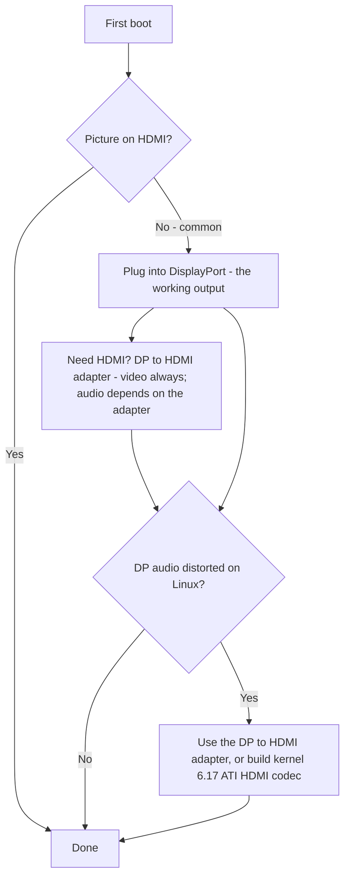

> 🌐 社区翻译。英文版为权威来源，可能更新更及时。发现错误？请提交 issue：[English](../en/14-display.md) · https://github.com/lildebil0/awesome-bc250/issues

# 显示与输出

> **太长不看** —— BC-250 通过 **DisplayPort** 驱动你的显示器。那是要插的接口。如果你的板卡还有一个 HDMI 口，它**经常什么都不显示** —— 所以那里的黑屏*不是*一块坏板，你只是接在了错误的输出上。需要 HDMI？用一个 **DP→HDMI 适配器** —— **视频总能通过，无延迟**；有些适配器也带**音频**（一个测试过的就带，[来源](https://t.me/c/2424231195/9148)），但音频取决于具体适配器，所以别指望它（见音频部分）。一个真实的怪癖：**DisplayPort 音频在 Linux 上出来失真/变慢**；同一个 DP→HDMI 适配器能绕开它，而一个正经的内核侧修复大约在**内核 6.17** 落地（[来源](https://t.me/c/2424231195/17953)、[来源](https://t.me/c/2424231195/68051)）。

"首次启动没画面"是**新手头号恐慌**。在你判定任何东西坏了之前，先读下面的框。

---

## 没画面？这么做

1. **插 DisplayPort，不是 HDMI。** BC-250 工作的视频输出是 DisplayPort（[来源](https://t.me/c/2424231195/104784)）。HDMI 口（在有的地方）是那个通常空白的 —— 别用它来评判板卡。
2. **重新插拔卡再试一次。** 板卡经常在第一次尝试时不初始化 —— 完全断电再上电（彻底关/开），并物理重插。一位机主：*"我的到货时也是第一次没上电……有时按钮重启时它没完全初始化 —— 关/开就修好了"*（[来源](https://t.me/c/2424231195/15701)）。
3. **在怀疑板卡之前先怀疑线缆/适配器。** 只有一张卡时，一根坏线或适配器是首要嫌疑（[来源](https://t.me/c/2424231195/15699)）。有些适配器在固件里能用，但 OS 加载后就黑了 —— *"GRUB 之前画面正常，进系统黑屏"*（[来源](https://t.me/c/2424231195/38184)）。
4. **重置 BIOS / 重刷一个已知好用的镜像**，如果一批里的好几张卡都没画面 —— 那指向固件，而非你的显示器（[来源](https://t.me/c/2424231195/15697)、[来源](https://t.me/c/2424231195/15705)）。

如果你把四条都排除了仍然什么都没有，去 [troubleshooting.md](../en/troubleshooting.md)。



---

## 输出一览

| 输出 | 能用？ | 备注 |
|--------|--------|-------|
| **DisplayPort** | **能 —— 这就是那个输出** | 主要/唯一的显示接口；承载音频。仓库 I/O 规格列出 `1x DisplayPort`（[仓库](https://github.com/mothenjoyer69/bc250-documentation)）。它是 **DisplayPort 1.4**，上限 **4K@120 Hz**，带 HDR10（[elektricM](https://github.com/elektricM/amd-bc250-docs/blob/main/docs/hardware/display.md)）。 |
| **HDMI 口**（如果配了） | **经常空白** | 新手以为板卡坏了；通常没坏 —— 切到 DP。（[来源](https://t.me/c/2424231195/104784)） |
| **经适配器的 DP → HDMI** | **视频：能。音频：取决于适配器** | 视频无延迟通过（[来源](https://t.me/c/2424231195/9148)）；音频取决于芯片组 —— 测试它（见音频部分）。也是 DP 音频失真的标准修复（下文）。 |
| **第二视频输出** | **开箱即不行** | 电气上存在但**未贴片**；强行接第二台显示器需要折腾，而其他人说芯片没有真正的第二输出头 —— 把单输出当作安全假设。（[来源](https://t.me/c/2424231195/92978)、[来源](https://t.me/c/2424231195/104682)） |
| **通过网络的第二屏幕** | **能** | 把 BC-250 的输出流到 LAN 上另一台机器（Steam/Sunshine）。（[来源](https://t.me/c/2424231195/23660)） |

---

## 分辨率、刷新率与线缆

elektricM 的参考钉死了单条 DP 链路实际能做什么 —— 挑显示器或适配器时有用（[elektricM](https://github.com/elektricM/amd-bc250-docs/blob/main/docs/hardware/display.md)）：

| 分辨率 | 刷新率 | 路径 |
|------------|---------|------|
| 1920×1080 (1080p) | 144 Hz+ | 原生 DP，或任何适配器 |
| 2560×1440 (1440p) | 144 Hz+ | 原生 DP（被动适配器常封顶在 1440p@60 / DP 1.2） |
| 3840×2160 (4K) | 60 Hz | 原生 DP，或**主动** DP→HDMI 2.0 适配器 |
| 3840×2160 (4K) | 120 Hz | **仅原生 DP** —— 经 HDMI 做 4K@120 需要一个主动 DP 1.4→HDMI 2.1 适配器，且不稳定 |

- **线缆：** 用一根 **VESA 认证的 DisplayPort 1.4** 线缆，**1–2 m**；更长的线缆导致同步/掉线问题（[elektricM](https://github.com/elektricM/amd-bc250-docs/blob/main/docs/hardware/display.md)）。
- **卡在低分辨率**（例如仅 1024×768/1080p、60 Hz）通常意味着 GPU 驱动没加载 —— 查 `glxinfo | grep "OpenGL renderer"`；`llvmpipe` = 软件渲染，装 Mesa 25.1+ 并移除 `nomodeset`（[elektricM](https://github.com/elektricM/amd-bc250-docs/blob/main/docs/troubleshooting/display.md)）。见 [06-linux.md](../en/06-linux.md)。
- **HDR (HDR10) & VRR** 能用但在 Linux 上是实验性的 —— **KDE Plasma 6+** 有最好的支持，且通常需要一个 Wayland 会话（[elektricM](https://github.com/elektricM/amd-bc250-docs/blob/main/docs/hardware/display.md)）。**这里发行版有讲究：** 一份 r/BC250Gaming（Reddit）社区报告**只在 CachyOS 上**（Plasma 6 + Wayland）让 **HDR + VRR 正常工作**，而在 **Bazzite 上 HDR 导致图形故障，VRR 从未工作过**。他们的例子：*极限竞速：地平线 6* 在 **1440p 高画质、HDR + VRR 开、60–80 FPS**，经一个 **UGREEN DP→HDMI 2.1** 适配器。如果 HDR/VRR 是优先项，见 [06-linux.md](../en/06-linux.md) 里的 CachyOS 注解。
  - **如果你在 Bazzite KDE 上想要经 HDMI 的 VRR/FreeSync**，有一个社区 remix 换入了 AMD 的 HDMI 2.1 / FRL 内核工作：**[`dyllan500/bazzite-amd-hdmi-kde`](https://github.com/dyllan500/bazzite-amd-hdmi-kde)** —— 一个在带 AMD 官方 HDMI-2.1 VRR 补丁（来自 `amd-staging-drm-next`）的内核上重建的 Bazzite KDE 镜像。⚠ **重重对冲：** 它是第三方镜像，作者只在一张 **Radeon 9070 XT**（不是 BC-250）上测试了 VRR，而且它本意是在补丁进入原厂 Bazzite 内核后就过时。它*不是*一个确认过的 BC-250 修复 —— 把它当作一条可以试的实验路径，而非保证。

> **登录*之后*黑屏（GRUB 和登录界面都正常）**是一个桌面会话问题，通常是 **Wayland** —— 在登录齿轮处选"GNOME on Xorg"/"Plasma (X11)"，或在 `/etc/gdm/custom.conf` 里设 `WaylandEnable=false`（[elektricM](https://github.com/elektricM/amd-bc250-docs/blob/main/docs/hardware/display.md)）。登录*之前*的黑屏是上面的驱动/`nomodeset` 问题，不是这个。

---

## DisplayPort 音频失真 —— 适配器修复

在 Linux 上，**直接从 DisplayPort 送出**的音频在 BC-250 上出来不对 —— 被描述为失真、*"被拉长，像是慢放到半速"*，带噼啪声（[来源](https://t.me/c/2424231195/9895)）。这是一个 **Linux/DP 协议问题，不是板卡缺陷** —— 它在非 BC-250 硬件上也见过（[来源](https://t.me/c/2424231195/15983)）。

聊天最终定下的直白、可靠的变通：**让信号过一个 DP→HDMI 适配器。** 转成 HDMI 后，音频伪影消失（[来源](https://t.me/c/2424231195/17953)、[来源](https://t.me/c/2424231195/51763)）。一位用户直接验证了它：*"我测试了经一个 DisplayPort→HDMI 适配器的音频输出。全部正常，无延迟"*（[来源](https://t.me/c/2424231195/9148)）。

**最干净的路径是一根直接的 DP→HDMI *线缆* —— 一端 DP 插头，另一端 HDMI 插头，两端都没有适配器转接头或盒子。** r/linux_gaming 社区帖上多名用户独立报告这给出最可靠的音频：一根普通线缆（例如一根 Amazon Basics DP-to-HDMI 线，~$10）"就能用"，而转接头风格的适配器时好时坏。偶尔短暂的音频静音仍可能发生，但一根一体式线缆移除了让转接头路线成为赌博的那个额外适配器芯片组（[r/linux_gaming](https://www.reddit.com/r/linux_gaming/comments/1nvsgji/)）。如果你反正要买，**优先线缆而非转接头。**

**如果你手头没有适配器，** 改用**蓝牙**走音频 —— 大多数音箱/耳机都支持，且它完全避开 DP 路径（[来源](https://t.me/c/2424231195/89769)）。BT dongle 见 [10-wifi-bt.md](../en/10-wifi-bt.md)。

### 适配器备注（社区）
- **4K@60+ 你需要一个*主动*适配器/线缆**（被动封顶 ~1440p@60）。一个工作、测试过的例子：**UGREEN DP125（DP→HDMI 4K 线）** —— 标称 4K@30 但在一台电视上协商出 4K@60（[来源](https://t.me/c/2424231195/52398)）。主动 vs 被动决定分辨率上限 —— 它**不**决定音频是否通过（见下文）。
- **不是所有适配器都带音频。** 一位机主的 Belsis 适配器在 4K@60 下*带*声音通过，而几个更贵的 Ugreen 单元在设备列表里显示 "HDMI digital audio" 却没声音输出 —— 还有一个把人声降了一个八度（[来源](https://t.me/c/2424231195/106617)）。如果你得到视频但没音频，适配器就是那个变量 —— 换一个试。
- **要 HDMI *音频*，先伸手拿一个*被动*适配器。** r/linux_gaming 帖上的一个社区规律：**被动** DP→HDMI 适配器倾向于干净地传音频，而**主动**适配器常常**完全丢掉音频或变调**（人声据报告下滑约 20% / 大约一个五度）。陷阱：你只在真正的 **HDR**（以及 4K@60+）时才*需要*一个主动适配器，所以这是一个真正的权衡 —— 被动求可靠声音，主动求 HDR。社区确认工作的*被动*选项：**Silver Monkey**、**BENFEI (ASIN B017Q8ZVWK)**，以及 **AmazonBasics DP-to-HDMI *线缆***（那根一体式线缆 —— *不是*它们转接头风格的适配器）（[r/linux_gaming](https://www.reddit.com/r/linux_gaming/comments/1nvsgji/)）。⚠ 具体 SKU 是社区报告的，未在此实验室验证 —— 且一个被动适配器仍封顶在 ~**1440p@60**。
- 既传视频又传音频的便宜 **4K@60 DP→HDMI** 适配器确实存在并被报告工作（[来源](https://t.me/c/2424231195/133977)）。
- 有些适配器专门在 **4K 显示器**上出问题（[来源](https://t.me/c/2424231195/1988)）。
- **经 DP→HDMI 适配器的音频不一致，取决于适配器的芯片组 —— 而不简单地取决于主动 vs 被动。** 视频总能通过；**音频是变量。** 我们的社区报告是逐适配器的（UGREEN/Belsis 单元报告带声音，某些其他单元静音），而 elektricM 的指南报告了*相反*的划分（被动带音频，某些主动单元静音 —— 例如 Cable Matters/StarTech） —— 这正是为什么主动/被动标签预测不了它（[elektricM](https://github.com/elektricM/amd-bc250-docs/blob/main/docs/troubleshooting/display.md)）。要**可靠的**音频，别赌一个适配器：优先一个 **DisplayPort 原生显示器/AV 接收器**，或经 **USB（一个 USB DAC/声音设备）** 输出声音。如果你确实用一个适配器，**在依赖它之前测试音频** —— 并记住一个**被动**适配器封顶在 ~**1440p@60**。

### 内核 6.17 修复（DP 直出音频，无适配器）

如果你想要**直接经 DisplayPort** 的干净音频而不用适配器，原因和修复已在聊天里被查明。Fedora 的原厂内核配置构建了 `snd-hda-codec-hdmi.ko` + `snd-hdmi-lpe-audio.ko`；**内核 6.17 改了 HDMI 音频路径**，在那个默认配置上弄坏了声音。修复是也构建 **ATI HDMI 编解码器** —— 把内核配置从 `# CONFIG_SND_HDA_CODEC_HDMI_ATI is not set` 翻到 `CONFIG_SND_HDA_CODEC_HDMI_ATI=m`，这会打包 `snd-hda-codec-atihdmi.ko`；声音随后**无需补丁**就能工作（[来源](https://t.me/c/2424231195/68051)、[来源](https://t.me/c/2424231195/68061)）。

```text
# Fedora kernel config change for DP/HDMI audio on kernel 6.17+
# from:
# CONFIG_SND_HDA_CODEC_HDMI_ATI is not set
# to:
CONFIG_SND_HDA_CODEC_HDMI_ATI=m
```

有了那第三个编解码器（`snd-hda-codec-atihdmi.ko`）在场，ALSA 暴露板卡的音频输出（例如 `pcm=3` 和 `pcm=7` 作为两个 HDMI 设备）（[来源](https://t.me/c/2424231195/68062)、[来源](https://t.me/c/2424231195/67569)）。⚠ 验证 —— 这需要构建一个自定义内核；对大多数用户把 DP→HDMI 适配器当作免构建路径。内核/驱动设置见 [06-linux.md](../en/06-linux.md)。

### 环绕声 (5.1) —— 用 USB 声卡，不是 HDMI

**经 HDMI 的 5.1 环绕声在 BC-250 上*不*工作。** AMD 在 Linux 上给这颗无头/挖矿裸片的 HDMI 固件不暴露多声道 LPCM，所以无论接收器支持什么，HDMI 输出都回退到普通立体声（[r/linux_gaming](https://www.reddit.com/r/linux_gaming/comments/1nvsgji/)）。要真正的多声道，改从一个 **USB 声卡 / USB DAC** 输出音频 —— 在 `pavucontrol` 里把它设为默认 sink，然后用以下命令确认全部六个声道：

```bash
speaker-test -D pipewire -c 6 -t wav
```

当适配器出问题时（上文），同一条 USB-DAC 路线也是立体声音频的可靠修复。

---

## 第二输出（初始不激活）

板卡上有一个**开箱即不激活的第二视频输出。** 社区解读分歧，两半都值得知道：

- 它**电气上存在但未贴片/未焊接**，而*"用折腾你能让第二台显示器工作"*（[来源](https://t.me/c/2424231195/92978)）。
- 其他人报告芯片干脆**没有可用的第二输出头** —— *"问题在芯片里，第二输出物理上不存在"*（[来源](https://t.me/c/2424231195/104682)）。

实际上：**假设一个 DisplayPort 输出。** 一个用于两块独立屏幕的 DP **MST 分配器被问到过但未在我们聊天里确认工作**（[来源](https://t.me/c/2424231195/92109)）。

**来自 elektricM 的更新 —— MST 能用对的 hub 驱动两块屏幕。** elektricM 的测试报告经一个 DP MST hub 最多 **2 块显示器**（带宽共享，每显示器分辨率受限），带逐 hub 的结果（[elektricM](https://github.com/elektricM/amd-bc250-docs/blob/main/docs/hardware/display.md)）：

| MST hub | 输出 | DP 版本 | 独立显示？ | 音频 | 备注 |
|---------|-----|--------|-----------------------|-------|-------|
| StarTech MST14DP122DP | 2× DP | 1.4 | **是** | 是 | 跨显示器/线缆一致工作 |
| Monoprice 21972 | 2× DP | 1.2 | **仅镜像** | 是 | 只能镜像 |
| ENBUER | 2× DP | 1.2 | **仅镜像** | 是 | 只能镜像 |
| 通用 HDMI MST | 2× HDMI | — | **否** | 否 | 无视频或音频 |

所以原生双显示器**确实**可能经一个 DP 1.4 hub 的 MST（StarTech 已确认）；更便宜的 DP 1.2 hub 可能只镜像，而 HDMI MST hub 失败。⚠ 验证 —— 单个已确认的 hub 型号；结果因 hub 而异。

**另一条多显示器路线 —— USB DisplayLink 适配器。** 加一个 USB→HDMI/DP DisplayLink 适配器获得一块额外的**桌面**屏幕（开机*之后*插入效果最好）。**不适合游戏** —— 它在 CPU 上压缩，而那是 BC-250 的瓶颈，所以延迟高；它在 Steam Deck **游戏模式**里也不工作（[elektricM](https://github.com/elektricM/amd-bc250-docs/blob/main/docs/hardware/display.md)）。

---

## 通过网络的第二屏幕（简单的"第二显示器"）

如果你真的想把 BC-250 画面弄到第二台设备上，被验证的路线不是第二根线缆 —— 而是**通过 LAN 流式传输。** 一位用户：*"我在 BC-250（Fedora）上启动一个 Steam 游戏，通过网络流到我的工作笔记本，从笔记本控制它。一切都正常"*（[来源](https://t.me/c/2424231195/23660)）。

- **Sunshine**（主机编码器）在这里能用，因为它不是仅 NVIDIA —— 它做编码，客户端只解码（[来源](https://t.me/c/2424231195/25091)）。在千兆 LAN 上据报告近乎完美（[来源](https://t.me/c/2424231195/25563)）。
- **Moonlight 作为主机**不合适 —— 它期待一个 NVIDIA 编码器，会卡顿/抱怨缺少硬件解码器（[来源](https://t.me/c/2424231195/25050)）。用 Sunshine 作主机，Moonlight 只作客户端。

这也是不用上面那个未贴片的第二输出就获得"双显示器"感觉的实用方法。

---

## 来源

- DP→HDMI 适配器传视频+音频，无延迟 —— https://t.me/c/2424231195/9148
- DP 音频失真是 Linux 问题；适配器修复它 —— https://t.me/c/2424231195/17953 · https://t.me/c/2424231195/9895 · https://t.me/c/2424231195/51763 · https://t.me/c/2424231195/15983
- 内核 6.17 音频修复（`CONFIG_SND_HDA_CODEC_HDMI_ATI=m`） —— https://t.me/c/2424231195/68051 · https://t.me/c/2424231195/68061 · https://t.me/c/2424231195/68062 · https://t.me/c/2424231195/67569
- 工作的适配器 —— UGREEN DP125 https://t.me/c/2424231195/52398 · Belsis vs 其他（音频不一） https://t.me/c/2424231195/106617 · 便宜 4K@60 https://t.me/c/2424231195/133977
- DP 是工作的输出；把钱花在一个好的 DP→HDMI 适配器上 —— https://t.me/c/2424231195/104784
- 首次启动无画面 / 重插 / 重刷 —— https://t.me/c/2424231195/15697 · https://t.me/c/2424231195/15699 · https://t.me/c/2424231195/15701 · https://t.me/c/2424231195/38184
- 第二输出存在但未贴片 / 有争议 —— https://t.me/c/2424231195/92978 · https://t.me/c/2424231195/104682 · MST 被问到 https://t.me/c/2424231195/92109
- 网络第二屏幕（Sunshine/Steam 经 LAN） —— https://t.me/c/2424231195/23660 · https://t.me/c/2424231195/25091 · https://t.me/c/2424231195/25050 · https://t.me/c/2424231195/25563
- 蓝牙音频作为替代 —— https://t.me/c/2424231195/89769
- 直接 DP→HDMI **线缆**（无适配器）是最可靠的音频；经 HDMI 的 5.1 不工作（无多声道 LPCM），用 USB 声卡 / DAC —— r/linux_gaming 社区帖 https://www.reddit.com/r/linux_gaming/comments/1nvsgji/
- 硬件 I/O 参考（`1x DisplayPort`） —— [mothenjoyer69/bc250-documentation](https://github.com/mothenjoyer69/bc250-documentation) · [`hardware.md`](https://github.com/mothenjoyer69/bc250-documentation/blob/main/hardware.md)
- DP 1.4 / 4K@120 / HDR10、分辨率+线缆限制、MST hub（最多 2）、DisplayLink、Wayland 登录黑屏 —— elektricM [`hardware/display.md`](https://github.com/elektricM/amd-bc250-docs/blob/main/docs/hardware/display.md)
- HDR + VRR 在 CachyOS 上工作（Plasma 6 + Wayland）vs 在 Bazzite 上损坏；极限竞速地平线 6 1440p 高画质 HDR+VRR 经 UGREEN DP→HDMI 2.1 —— r/BC250Gaming（Reddit）社区报告（见 [06-linux.md](../en/06-linux.md)）
- 被动 DP→HDMI 传音频 / 主动丢掉或变调；被动但 HDR 需要；确认的被动 Silver Monkey / BENFEI B017Q8ZVWK / AmazonBasics DP-to-HDMI 线缆 —— [r/linux_gaming 社区帖](https://www.reddit.com/r/linux_gaming/comments/1nvsgji/)
- Bazzite KDE 经 HDMI 的 VRR/FreeSync remix（AMD HDMI 2.1 内核；在 9070 XT 上测试，非 BC-250） —— [`dyllan500/bazzite-amd-hdmi-kde`](https://github.com/dyllan500/bazzite-amd-hdmi-kde)
- 适配器音频取决于芯片组（elektricM 看到被动带它 / 某些主动静音；社区看到相反 —— 所以优先 DP 原生或一个 USB DAC），低分辨率 llvmpipe 检查 —— elektricM [`troubleshooting/display.md`](https://github.com/elektricM/amd-bc250-docs/blob/main/docs/troubleshooting/display.md)

> 驱动/内核设置在 [06-linux.md](../en/06-linux.md) 里；音频/输出陷阱也在 [troubleshooting.md](../en/troubleshooting.md) 和 [faq.md](../en/faq.md) 里建有索引。
