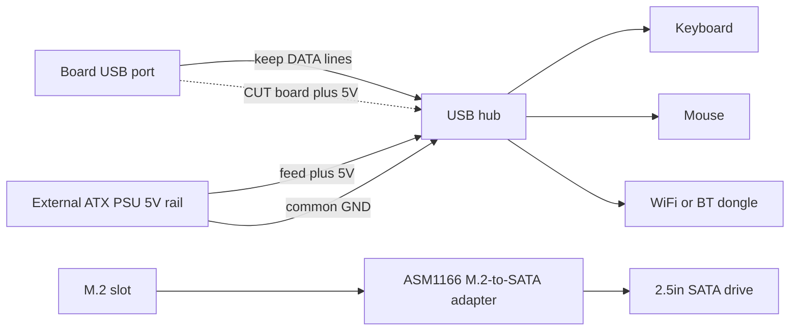

# USB、集线器与外设

> 🌐 社区翻译。英文版为权威来源，可能更新更及时。发现错误？请提交 issue：[English](../en/16-usb-peripherals.md) · https://github.com/lildebil0/awesome-bc250/issues

> **太长不看** —— 板卡给你 **4 个后置 USB 口（2× USB 2.0 + 2× USB 3.0）**，仅此而已 —— 默认没有接线的内部排针。一个 WiFi/BT dongle、USB 转 SSD、键盘、鼠标和一个手柄很快就把这些口吃光，所以几乎人人都加一个 **USB 集线器**。陷阱在于：板卡的 **5 V USB 供电轨很弱**，负载下会塌陷，所以廉价的总线供电集线器（甚至直连的闪存盘）会掉线。可靠的修法，按优先级：一个**有源（active）集线器**，或社区的 **5 V 注入改造** —— 切断集线器从板卡取的那路 5 V，改由你的 ATX PSU 给它喂 5 V。（[来源](https://t.me/c/2424231195/119741)）

这是一页讲**配件**的。把集线器搞对，剩下的（音频、USB 转以太网、扩展坞）自然就好。

---

## 你实际能拿到多少个 USB 口

根据硬件参考，后置 I/O 是 **1× DisplayPort、1× GbE 以太网、2× USB 2.0、2× USB 3.0**。所以是四个物理 USB 口。（[hardware.md](https://github.com/mothenjoyer69/bc250-documentation/blob/main/README.md)）

实践中，两个 **USB 3.0** 口是大家争抢的（更快，用于 SSD/扩展坞），而它们在电气上接得**窄** —— 一位机主把这个接口描述为实际上的 "x2"，并警告别在它上面挂分线器。⚠ 核实确切的通道宽度。（[来源](https://t.me/c/2424231195/75561)）

一旦你列出什么东西想要一个口，挤兑就很真实：**插上一个 SSD —— 没了一个口；再加一个 USB WiFi dongle、一个摇杆、一个外置硬盘 —— 你就需要一个集线器，否则你冒着烧口的风险。**（[来源](https://t.me/c/2424231195/75558)）人们经常报告"USB 3.0 全占了，键鼠走集线器"。（[来源](https://t.me/c/2424231195/110875)）

出厂时**没有接好的前面板 USB 排针** —— 但机箱/板卡上有一处明显是为把集线器的线缆引到前面而设的位置，若干装机的人用了它。（[来源](https://t.me/c/2424231195/91322)）·（[来源](https://t.me/c/2424231195/100249)）

---

## 真正的问题：5 V USB 供电轨很弱

BC-250 **在板卡自身上生成 USB 用的 5 V**（[来源](https://t.me/c/2424231195/57920)），而那路轨供不了多少电。聊天里最清楚的一次测量，是在一块无法枚举设备的板卡上：

> "我的 BC-250 在 USB 上给不出正常的 5 V…… 只有键盘能用；如果我插上鼠标，键盘就关掉。只接键盘时约 **4.3 V**，键盘 + 鼠标时 **2.3 V–3.2 V**，两个都拔掉时 **5.1 V**。"（[来源](https://t.me/c/2424231195/119071)）

那种电压塌陷正是为什么症状都围着**负载**扎堆：闪存盘和麦克风**直连时一插就掉、走集线器却好好的**，键盘丢失它的 LED，两个东西同时取电的那一刻设备就掉线。（[来源](https://t.me/c/2424231195/53939)）这跟让 WiFi dongle 不稳的是同一种供电敏感性 —— 见 **[10-wifi-bt.md](10-wifi-bt.md)**，那里棒子空闲时能跑，下载飙升时掉线。

> ⚠ 不是每块板卡都这么糟。一位机主用板卡的 USB 带着一个 **WiFi dongle + 有线键盘 + 经无源集线器的鼠标 + 一个 14″ 显示器 + 一个 3.5″ 辅助屏**，报告一切正常。（[来源](https://t.me/c/2424231195/119231)）在你把自己的板卡加满负载之前，都把它当成未知。

---

## 选集线器：有源 vs 无源

| 集线器类型 | 何时管用 | 结论 |
|----------|---------------|------|
| **无源（总线供电）** | 轻负载 —— 键盘、鼠标、一个 dongle。有些板卡这么用能撑出意外多的设备。（[来源](https://t.me/c/2424231195/119231)） | 可以先试；一旦你加上硬盘或负载飙升，**预期会掉线**。 |
| **有源（外接 5 V 电源砖）** | 任何带硬盘、多个 dongle 或在负载下的场景。社区对 BC-250 的常备推荐。（[来源](https://t.me/c/2424231195/75558)）·（[来源](https://t.me/c/2424231195/119229)） | **买这个。**不碰板卡就解决塌陷。（[来源](https://t.me/c/2424231195/140091)） |
| **5 V 注入改造**（见下文） | 当你想要一台干净、完全由 ATX PSU 供电的入箱装机，又不想多一个墙插电源时。 | 集成度最好，需要焊接。（[来源](https://t.me/c/2424231195/119741)） |

当某人的 USB 设备闹脾气时，反复给出的建议很简单：**搞一个带电源适配器输入的有源 USB 集线器。**（[来源](https://t.me/c/2424231195/119229)）多位机主在跟掉线斗争后都走到了这一步 —— "用一个外接供电的集线器就解决了"。（[来源](https://t.me/c/2424231195/123789)）

> 聊天里提出的一个告诫：依赖一个外接供电的集线器可能是**永久的** —— 一旦你把 USB 供电外移出去，别惊讶你就此被这个集线器拴住了。（[来源](https://t.me/c/2424231195/123924)）对一台桌面装机来说，这是个划算的取舍。

---

## 5 V 注入改造（让一个普通集线器乖乖听话）

对于一台**已经由 ATX/SFX PSU 供电的入箱装机**，这是优雅的修法：与其买一个自带墙插适配器的有源集线器，你拿一个普通集线器，**把它的 5 V 来源换掉**。

一位用户做了什么，而且它管用（[来源](https://t.me/c/2424231195/119741)）：

> "我改造了一个普通 USB 集线器，它就管用了。我**切断了来自主板的 5 V，从 PSU 给了 5 V**。我不需要接地线，因为我用同一个 ATX PSU 给我的 BC-250 供电。"

它如何工作：

1. 打开集线器；在**上行**一侧（插进板卡的那根线缆）找到 **5 V（VBUS）**走线/导线。
2. **切断那路 5 V**，这样集线器就不再从板卡那弱供电轨取电。
3. 从你的 ATX PSU 给集线器喂 **+5 V**（一条多余的 SATA/Molex 5 V 线）。
4. **地线自动共用**，因为同一个 PSU 已经在给板卡供电 —— 不需要额外的地线。（如果你哪天用一个*独立*电源给集线器供电，你**必须**把地线共起来。）

数据线保持不动 —— 你只是在改供电来源。板卡看到的是一个不再加载它 5 V 轨的集线器，而设备从 PSU 得到干净、充足的电。



> ⚠ 切错走线会让集线器变砖（便宜）—— 但务必确保你切的是 **VBUS，不是数据线**。焊接前用万用表再三确认。

---

## 该避开的垃圾

- **Hoco 集线器** —— 被点名为不可靠；一位机主**把同一个 Hoco 集线器重焊了两次**。（[来源](https://t.me/c/2424231195/74531)）
- **名不副实的 "USB 3.0" 集线器** —— 一个 160 ₽ 的 AliExpress "USB 3.0 集线器/扩展坞"被指出在那个价位**绝对不是真 3.0**。（[来源](https://t.me/c/2424231195/8761)）·（[来源](https://t.me/c/2424231195/8764)）
- **菊花链串接集线器**来扩口 —— 作为一个想法被提出（[来源](https://t.me/c/2424231195/104653)），但它把供电问题叠加起来；一路弱供电轨现在要喂两个集线器。改用一个好的有源集线器。
- **挂在 M.2 槽上的 SATA 分线"集线器"** —— 一个反复出现的混淆。M.2 上只有 **2 条 PCIe 通道**，你没法合理地挂一个 SATA 控制器还指望它扇出；"那些一进多出的 SATA 集线器都是垃圾。"（[来源](https://t.me/c/2424231195/22539)）这不是 USB 话题 —— 别把它和 USB 扩展搞混。
- ★ **M.2→SATA 控制器 PH516（6 口）—— 确认不工作。** 端口能枚举但硬盘挂不上，而且**第二个人复现**了同样的失败（[4pda —— Strange999](https://4pda.to/forum/index.php?showtopic=1104980)）。改买社区推荐的 **ASM1166**（见存储一节）—— PH516 在这块板卡上是已知的死路。

一个**内置音频编解码器**的集线器对入箱装机是个利落的省空间之选（一个设备既给你额外的口*又*给你一个 3.5 mm 插孔），人们确实在用。（[来源](https://t.me/c/2424231195/8751)）音质参差 —— 它是个廉价编解码器。（[来源](https://t.me/c/2424231195/39708)）

---

## USB 3.0 内部排针（Type-E）

如果你的机箱有一个**前置 USB 3.0 插头**（那个 20-pin 的 "Key-A/Type-E" 接口），你会想从板卡的 USB 3.0 给它供线。这里**没有原生的 20-pin 排针**，所以人们去适配：

- 一根来自 AliExpress 的 **USB 3.1 Type-E → USB 3.0（Type-A）线缆**是干净的路子。聊天里分享了 AXONUS 50 cm。（[来源](https://t.me/c/2424231195/133182)）也有人贴了一个 Xiwai Type-E → 20-pin 的款式。（[来源](https://t.me/c/2424231195/125127)）
- 或者把机箱的原装线缆**拼接**到一个普通 USB 3.1 插头上 —— 没有适配器合适时的"把蛇接到刺猬"方法。（[来源](https://t.me/c/2424231195/135957)）

**状态：** **USB 2.0 已确认能用；USB 3.0 还有待充分测试**，报告它的那位机主是这么说的（入箱装机之后测试待定）。把经适配器的 3.0 当作 ⚠ 在你自己的硬件上验证。（[来源](https://t.me/c/2424231195/136215)）

---

## 存储（M.2 槽与 SATA 硬盘）

板卡唯一的内部存储接口是一个**单 M.2 槽**，它接的是 **PCIe 2.0 ×2** —— 所以实际上限是**约 1 GB/s**（[来源](https://t.me/c/2424231195/66275)）·（[来源](https://t.me/c/2424231195/135506)）。一块快的 Gen3/Gen4 NVMe *能*工作，但在这儿达不到它的标称速度，所以没必要为一块高端盘付钱。**一块普通的 NVMe M.2 SSD 是最简单的引导盘** —— 丢进槽里，把 Linux 装上去（安装见 **[06-linux.md](06-linux.md)**）。

### 接 2.5″ SATA 机械盘/固态盘

板卡上没有 SATA 口，所以要挂一块 **2.5″ SATA 硬盘**（或几块），你得往 M.2 槽里放一张 **M.2 → SATA 适配卡**。社区确认的选择是 **ASM1166（M.2 PCIe → SATA）**扩展卡（[来源](https://t.me/c/2424231195/135180)）。人们走的另一条路是把一块普通 **M.2 SATA SSD 直接插板卡** —— 不用适配器，就是一根走 SATA 协议的 M.2 棒。（[来源](https://t.me/c/2424231195/87411)）

这是**最常见的新人问题**之一 —— *"这是我把硬盘接到板卡需要的适配器吗？"* 以及 *"还有什么别的方式接硬盘？"*（[来源](https://t.me/c/2424231195/135164)）·（[来源](https://t.me/c/2424231195/135165)）—— 所以如果你正在问它，你不孤单。

> ⚠ 验证 —— ASM1166 卡是一个社区推荐，不是在 BC-250 上被多人测试过的结果。在依赖它之前，确认你选的适配器能枚举并引导。还要注意 M.2 的 **2 条 PCIe 通道**没法合理地喂一个一进多出的*分线器* —— 见上面的**该避开的垃圾**。（[来源](https://t.me/c/2424231195/22539)）

#### ★ 给一块 2.5″ SATA 硬盘供电（板卡只有 12 V）

上面那张适配卡处理**数据**，但一块 2.5″ SATA 硬盘还需要在它的 SATA 电源接口上有 **5 V 供电** —— 而 BC-250 板卡只输出 **12 V**，没有 SATA 电源排针可以引出。来自一次装机的实用修法：一个 **USB→SATA 电源适配器给硬盘喂 5 V**，配一个 **12 V→5 V 降压（buck）转换器**从板卡的 12 V 产出那 5 V（[TMG HD 装机](https://youtu.be/OEO0r01zcfU)；⚠ 近似 —— 转述自视频演练）。换句话说：ASM1166（或一根 M.2 SATA 棒）承载 SATA *数据*；降压转换器 + USB→SATA 电源适配器承载 SATA *供电*。一个自供电的 2.5″ 硬盘盒或一个有源扩展坞自带 5 V 轨，绕过整个问题。

#### ★ SteamOS 用 M.2 SATA 棒时报 "no nvme drive detected"

如果你用一根 **M.2 SATA SSD**（例如 **Kingston SNS41**）而不是 NVMe 来引导 SteamOS，安装/修复流程可能以 **"no nvme drive detected"** 失败 —— SteamOS 假定硬盘是 NVMe 设备（`nvme…`），但一根 SATA 棒枚举为 `sda`。修法是编辑修复脚本，把它指向正确的设备名（[4pda —— pornocrat](https://4pda.to/forum/index.php?showtopic=1104980)）：

```bash
# Edit the SteamOS repair script and replace the device name nvme -> sda
nano ~/tools/repair_device.sh
# change every "nvme" reference to "sda", save, then re-run the install/repair
```

这纯粹是一个设备命名不匹配 —— 一旦告诉 SteamOS 去看 `sda` 而不是一个 `nvme` 节点，那根 SATA 棒就工作正常。

### 老的 SATA 硬盘也没问题

因为 M.2 链路反正把一切都封在约 1 GB/s，一块老的 **2.5″ SATA 机械盘/固态盘**对一个**游戏库或老游戏**完全够用 —— 你会损失的速度本来就是板卡给不出的速度。（[来源](https://t.me/c/2424231195/132739)）如果你宁可让 M.2 槽空着，一个 **USB-NVMe 硬盘盒**是另一个选项，但真正能跑 NVMe（而非 SATA）的硬盘盒起步更贵 —— 对一根小引导棒不值。（[来源](https://t.me/c/2424231195/111022)）

### Intel Optane 16 GB 作缓存/swap —— 社区想法，反响平平

把一个小的 **Intel Optane 16 GB NVMe** 模块当缓存或 swap 设备用，作为一个想法被提出，给出了一个冷静的结论（[4pda](https://4pda.to/forum/index.php?showtopic=1104980)）：Ozon 上卖的那些 **16 GB "Optane" 模块经成员自测原来不是真 Optane**，板卡的 **M.2 槽很慢**（PCIe 2.0 ×2，约 1 GB/s），所以延迟优势被削弱，而虽然 **swap 文件理论上可行**，但在这里并非明显的赢。把它当个稀奇，不是推荐的升级。

---

## 扩展坞与底座

一个 USB-C / Thunderbolt 风格的**扩展坞**可以当作一个肥集线器（USB + 以太网 + 有时还有视频），机主们用过它们：

- 一位成员在用一个 **Wavlink WL-UG69DK1 USB-C 双 4K 扩展坞**。（[来源](https://t.me/c/2424231195/68141)）
- 一个 **DisplayLink 扩展坞**作为 **USB 集线器 + USB 声卡**运行；该成员**没能**从它弄出视频（撞上了 TPM/BIOS 墙），所以把扩展坞的*视频*当作不可靠。（[来源](https://t.me/c/2424231195/104776)）
- 专门要更多**显示器**的话，一个扩展坞绕不开 GPU 自身的输出上限 —— 在指望它之前先看 **[14-display.md](14-display.md)**。

底线：扩展坞作为**有源集线器**没问题（它们自带电源，正好绕过 5 V 问题）。别指望它的**视频**输出能用而去买一个。

---

## 手柄与输入

手柄骑的是和其他一切一样的弱 USB 供电轨、一样不稳的蓝牙故事（BT dongle 见 **[10-wifi-bt.md](10-wifi-bt.md)**）。几个具体发现：

- **DualSense 在 Linux 上经 DS5Dongle（Raspberry Pi Pico 2W）。** 这个开源 dongle 在 Linux 上给 DualSense 它的 **HD 触觉 + 扬声器**，并有一个调轮询率/音量的 **web UI** —— 但游戏音频有个陷阱：Wine/Proton 标题只在 **Direct 模式**下拿到手柄的音频（手柄显示为一个**4 声道音频卡**），而**不是每个发行版都暴露那个模式**（[4pda —— korotyshev](https://4pda.to/forum/index.php?showtopic=1104980)）。另外，内核的 **`hid-playstation`** 驱动（原生 DualSense 支持）需要适配器上有 **蓝牙 ≥ 5.0**（[4pda —— xDarkman](https://4pda.to/forum/index.php?showtopic=1104980)）。
- **GameSir T4 Kaleid + 它的 2.4 GHz dongle** 是一条可用的手柄/输入路子，完全绕过蓝牙 —— 经一个 2.4 GHz USB 接收器获得有线手感的输入，而不用跟 BT 配对斗争（[TiredDadTech](https://youtu.be/zi7sldeRd2w)；⚠ 近似 —— 转述自视频）。
- **BT dongle 的口很重要：UGREEN 蓝牙 dongle 只在 USB 2.0 口工作，USB 3.0 口不行。** 3.0 口的射频噪声/电气接线把它弄坏；把它挪到两个 **USB 2.0** 口之一就能用（[4pda —— InfernalWolf666](https://4pda.to/forum/index.php?showtopic=1104980)）。（和折磨 WiFi/BT 棒子的是同一种 USB-3.0-噪声效应 —— 见 [10-wifi-bt.md](10-wifi-bt.md)。）

---

## 推荐的入门配置

| 档位 | 这么做 | 为什么 |
|------|---------|-----|
| 最低 | 给键盘/鼠标/dongle 用一个总线供电集线器 | 你有现成的就免费；轻负载没问题（[来源](https://t.me/c/2424231195/119231)） |
| **推荐** | 自带 5 V 电源砖的**有源 USB 集线器** | 解决塌陷，免焊接，硬盘 + dongle 稳住（[来源](https://t.me/c/2424231195/75558)） |
| 入箱装机 | 普通集线器 + 从 ATX/SFX PSU 来的 **5 V 注入改造** | 集成最干净，少一个墙插电源（[来源](https://t.me/c/2424231195/119741)） |

一个流行的入箱参考装机正是这个：**Cooler Master MasterBox NR200P + 一个 USB 集线器 + 一个 SFX PSU** —— 集线器被当作装机的默认部件，不是事后想起的添头。（[来源](https://t.me/c/2424231195/81149)）机箱那一侧见 **[05-case.md](05-case.md)**；一个现成可打印的机箱甚至捆绑了一套 HDD + USB 集线器的布局。（[printables](https://www.printables.com/model/1580750-bc250-amd-case-v3-hp-server-psu-hdd-usb-hub)）

---

## 来源

- 5 V 注入改造（切断板卡 5 V，从 PSU 喂）—— https://t.me/c/2424231195/119741 · 怎么做的提问 —— https://t.me/c/2424231195/119795
- 实测 USB 电压塌陷（4.3 V → 2.3 V）—— https://t.me/c/2424231195/119071 · 板卡板载生成 5 V —— https://t.me/c/2424231195/57920
- 口的预算 / "你需要一个有源集线器，否则冒着烧口的风险" —— https://t.me/c/2424231195/75558 · USB 是 x2 —— https://t.me/c/2424231195/75561 · 3.0 全占了 —— https://t.me/c/2424231195/110875
- 有源集线器是修法 —— https://t.me/c/2424231195/119229 · https://t.me/c/2424231195/123789 · https://t.me/c/2424231195/140091 · 可能是永久的 —— https://t.me/c/2424231195/123924
- 无源集线器在某些板卡上能用 —— https://t.me/c/2424231195/119231 · 直连掉线，集线器修好它 —— https://t.me/c/2424231195/53939
- Hoco 集线器不可靠 / 重焊两次 —— https://t.me/c/2424231195/74531 · 假 "3.0" 廉价集线器 —— https://t.me/c/2424231195/8761 · https://t.me/c/2424231195/8764
- SATA 分线器的混淆 —— https://t.me/c/2424231195/22539 · 菊花链串接集线器 —— https://t.me/c/2424231195/104653
- 存储：M.2 是 PCIe 2.0 ×2 / 约 1 GB/s —— https://t.me/c/2424231195/66275 · 改插 M.2 SATA SSD —— https://t.me/c/2424231195/135506 · ASM1166 M.2→SATA 卡 —— https://t.me/c/2424231195/135180 · M.2 SATA 直插板卡 —— https://t.me/c/2424231195/87411 · "用什么适配器接硬盘？" —— https://t.me/c/2424231195/135164 · https://t.me/c/2424231195/135165 · 老 2.5″ SATA 对游戏库没问题 —— https://t.me/c/2424231195/132739 · USB-NVMe 硬盘盒更贵 —— https://t.me/c/2424231195/111022
- ★ 在只有 12 V 的板卡上给一块 2.5″ SATA 硬盘供电（USB→SATA 电源 + 12 V→5 V 降压）—— [TMG HD 装机](https://youtu.be/OEO0r01zcfU)（⚠ 近似，转述）
- ★ M.2→SATA PH516（6 口）确认不工作，被第二个人复现 —— [4pda —— Strange999](https://4pda.to/forum/index.php?showtopic=1104980)
- ★ SteamOS 用 M.2 SATA 棒（Kingston SNS41）报 "no nvme drive detected"，修法 = 编辑 `~/tools/repair_device.sh`，把 `nvme`→`sda` —— [4pda —— pornocrat](https://4pda.to/forum/index.php?showtopic=1104980)
- Intel Optane 16 GB 作缓存/swap（Ozon 那些不是真 Optane、M.2 慢、swap 文件理论上可行）—— [4pda](https://4pda.to/forum/index.php?showtopic=1104980)
- DS5Dongle（RPi Pico 2W）给 Linux 上的 DualSense —— HD 触觉/扬声器/web-UI，Wine/Proton 音频仅在 Direct 模式（单个 4 声道卡）—— [4pda —— korotyshev](https://4pda.to/forum/index.php?showtopic=1104980) · `hid-playstation` 需要 BT ≥5.0 —— [4pda —— xDarkman](https://4pda.to/forum/index.php?showtopic=1104980)
- GameSir T4 Kaleid + 2.4 GHz dongle 作为越过蓝牙的手柄/输入修法 —— [TiredDadTech](https://youtu.be/zi7sldeRd2w)（⚠ 近似，转述）
- UGREEN BT dongle 只在 USB 2.0 口工作，3.0 不行 —— [4pda —— InfernalWolf666](https://4pda.to/forum/index.php?showtopic=1104980)
- 内置音频的集线器 —— https://t.me/c/2424231195/8751 · https://t.me/c/2424231195/39708
- USB 3.1 Type-E → USB 3.0 线缆（AXONUS）—— https://t.me/c/2424231195/133182 · Xiwai Type-E 20-pin —— https://t.me/c/2424231195/125127 · 拼接原装线缆 —— https://t.me/c/2424231195/135957
- USB 2.0 已确认，3.0 待测 —— https://t.me/c/2424231195/136215
- 给集线器用的前面板孔 —— https://t.me/c/2424231195/91322 · https://t.me/c/2424231195/100249
- 扩展坞：Wavlink 扩展坞 —— https://t.me/c/2424231195/68141 · DisplayLink 扩展坞作集线器+音频，无视频 —— https://t.me/c/2424231195/104776
- 入箱装机 NR200P + USB 集线器 + SFX —— https://t.me/c/2424231195/81149 · 带 USB 集线器的可打印机箱 —— https://www.printables.com/model/1580750-bc250-amd-case-v3-hp-server-psu-hdd-usb-hub
- 硬件参考（后置 I/O 列表）—— [mothenjoyer69/bc250-documentation `README.md`](https://github.com/mothenjoyer69/bc250-documentation/blob/main/README.md)

> 相关：WiFi/BT dongle 供电敏感性 → [10-wifi-bt.md](10-wifi-bt.md) · 机箱与前面板走线 → [05-case.md](05-case.md) · 显示器数量限制 → [14-display.md](14-display.md)
