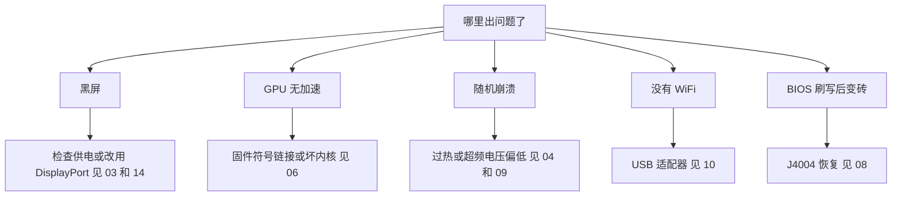

> 🌐 社区翻译。英文版为权威来源，可能更新更及时。发现错误？请提交 issue：[English](../en/troubleshooting.md) · https://github.com/lildebil0/awesome-bc250/issues

# 故障排查

> **太长不看** —— BC-250 的故障模式众所周知：大多数是**供电**、**散热**、**内核/固件**，或**一次失败的刷写**。在下面找到你的症状，应用修复，并跟随链接到完整章节。拿不准时，原因通常是*坏内核*、*缺少 amdgpu 固件符号链接*，或*散热不足*。

本页是一个 症状 → 原因 → 修复 的索引，提炼自社区反复出现的问题。它不替代各章 —— 它能快速把你指向正确的那一章。

---

## 启动 / 显示

| 症状 | 可能原因 | 修复 |
|---------|--------------|-----|
| 黑屏 / 不 POST | 供电接线或针脚错误 | 重新检查 8-pin 接线和针脚；用足够线规的纯铜线 → [03 —— 供电](../en/03-power-supply.md) |
| 原本能用，之后黑屏 / 崩溃 | **IOMMU 仍启用**（在这块板卡上是坏的） | 在 BIOS 里禁用 IOMMU（elektricM）；`iommu=off`/`amd_iommu=off` 内核参数 ⚠ 待核实 → [06 —— Linux](../en/06-linux.md) |
| 启动**安装器**/ live USB 时黑屏 | 安装器没有 BC-250 GPU 驱动；KMS 失败 | 在 GRUB 处加 `nomodeset`（Fedora：Troubleshooting → Basic Graphics Mode）；**Mesa 装好后移除它**（[elektricM](https://github.com/elektricM/amd-bc250-docs/blob/main/docs/troubleshooting/boot.md)）→ [06 —— Linux](../en/06-linux.md) |
| **登录后**黑屏（GRUB + 登录界面都正常） | 桌面会话，通常是 **Wayland** | 在登录处选 X11（"GNOME on Xorg"/"Plasma X11"），或设 `WaylandEnable=false`（[elektricM](https://github.com/elektricM/amd-bc250-docs/blob/main/docs/troubleshooting/display.md)）→ [14 —— 显示](../en/14-display.md) |
| 能启动但 GPU 无加速（全在 CPU 上） | 缺少 amdgpu 固件符号链接，或坏内核 | 应用 `navi10_gpu_info.bin` 符号链接 + 内核参数；避开已知坏内核（见下）→ [06 —— Linux](../en/06-linux.md) |
| `glxinfo` 显示 **llvmpipe**，游戏 5–10 FPS | Mesa 太旧，或 amdgpu 未加载 | 安装 **Mesa 25.1.3+**，移除 `nomodeset`，确认 `Kernel driver in use: amdgpu`（[elektricM](https://github.com/elektricM/amd-bc250-docs/blob/main/docs/troubleshooting/performance.md)）→ [06 —— Linux](../en/06-linux.md) |
| 原本能用，内核更新后坏了 | 那个内核里的回归 | 回滚到 LTS 内核；据报告 **6.14.7**、**6.15.0–6.15.6** 和 **6.17.8–6.17.10** 会破坏 amdgpu（CPU 回退 / GPU 崩溃）；elektricM 推荐 **6.18.x LTS 或 6.17.11+** ⚠ 确切范围待核实 → [06 —— Linux](../en/06-linux.md) |
| 没有 HDMI 音频 | 内核 6.17+ 回归 | 用 LTS 内核，或把音频走 USB/DisplayPort → [06 —— Linux](../en/06-linux.md) |
| 只有一个显示输出能用 | 这块板卡的驱动限制 | 原生双屏的已知限制；**MST 集线器可给到 2 屏**（DP 1.4 集线器）（[elektricM](https://github.com/elektricM/amd-bc250-docs/blob/main/docs/hardware/display.md)）→ [14 —— 显示](../en/14-display.md) |
| 没有显示、不 POST，**仅当装了 NVMe 时** | SSD 上仍有 **Windows** EFI/恢复分区 | 拔下 SSD，在另一台 PC 上抹掉所有分区（`wipefs -a`），重装（[elektricM](https://github.com/elektricM/amd-bc250-docs/blob/main/docs/troubleshooting/boot.md)）→ [06 —— Linux](../en/06-linux.md) |
| 根本不 POST（没有 BIOS） | 有些板卡**没有 CMOS 电池就不 POST** | 装一颗全新的 CR2032 再试（[elektricM](https://github.com/elektricM/amd-bc250-docs/blob/main/docs/troubleshooting/boot.md)）→ [08 —— BIOS](../en/08-bios.md) |
| 启动**卡住约 90 秒**后继续 | systemd 服务失败 / 网络超时 | `systemctl --failed`；禁用卡住的单元（[elektricM](https://github.com/elektricM/amd-bc250-docs/blob/main/docs/troubleshooting/boot.md)）→ [06 —— Linux](../en/06-linux.md) |
| 内核 panic "**unable to mount root**" / "No init found" | 错误的内核**或**损坏的 initramfs | 启动一个旧的/LTS 内核；若仍失败，chroot 并重新生成 initramfs（`dracut -f` / `update-initramfs -u -k all` / `mkinitcpio -P`）（[elektricM](https://github.com/elektricM/amd-bc250-docs/blob/main/docs/troubleshooting/boot.md)）→ [06 —— Linux](../en/06-linux.md) |
| 掉到 `grub>` / `grub rescue>` | GRUB 找不到它的配置/启动文件 | 设置 `root`/`prefix`，`insmod normal`，引导；然后重装 GRUB（[elektricM](https://github.com/elektricM/amd-bc250-docs/blob/main/docs/troubleshooting/boot.md)）→ [06 —— Linux](../en/06-linux.md) |
| 进不了 BIOS（Del/F2 无反应） | 转接初始化慢，或键盘接在 USB 3.0 上 | 立即连按 Del；试一个 **USB 2.0** 口和一根原生 DP 线（[elektricM](https://github.com/elektricM/amd-bc250-docs/blob/main/docs/troubleshooting/display.md)）→ [08 —— BIOS](../en/08-bios.md) |

## 散热 / 稳定性

| 症状 | 可能原因 | 修复 |
|---------|--------------|-----|
| 负载下降频 / FPS 暴跌 | 原装散热片在桌面上冷不住 | 减薄鳍片 + 高静压 120 mm 风扇/导风罩；保持 <80 °C → [04 —— 散热](../en/04-cooling.md) |
| 负载下随机崩溃 / 重启 | 过热（>90 °C）**或**超频电压太低 | 先改善散热；再提高降压电压 —— Furmark 稳定 ≠ 游戏稳定（游戏需要更高）→ [04](../en/04-cooling.md) · [09](../en/09-overclock-undervolt.md) |
| Furmark 稳定，游戏崩溃 | 电压是按 Furmark 设的，而它压力不足 | 用 OCCT + 真实游戏测试；电压加约 50 mV → [09 —— 超频](../en/09-overclock-undervolt.md) |
| 两个 governor 打架 | 同时跑了 oberon-governor *和* smu_oc/cyan-skillfish | 只跑一个 governor；禁用其余的 → [09 —— 超频](../en/09-overclock-undervolt.md) |
| GPU 崩溃时**整个系统**都挂（不只是应用） | APU：CPU+GPU 共用一颗硅片，所以 GPU 重置无法恢复 —— 它会把系统拖垮 | 这种架构下属正常；与其指望恢复，不如预防 GPU 崩溃（稳定电压 + 良好散热 + 好内核）（[elektricM](https://github.com/elektricM/amd-bc250-docs/blob/main/docs/troubleshooting/stability.md)）→ [09 —— 超频](../en/09-overclock-undervolt.md) |
| 有 governor 在跑时 GPU 崩溃 → **黑屏，再也不恢复** | governor 在重置期间持续写 sysfs → 卡在重置循环 | 玩易崩溃的游戏前先 `systemctl stop cyan-skillfish-governor-smu`；之后再启用（[elektricM](https://github.com/elektricM/amd-bc250-docs/blob/main/docs/troubleshooting/stability.md)）→ [09 —— 超频](../en/09-overclock-undervolt.md) |
| **仅在 60–65 °C** 就死机 / 白屏 | 有些板卡对温度异常敏感 | 改善散热，重装散热片，重新涂硅脂（PTM7950）；体质有差异（[elektricM](https://github.com/elektricM/amd-bc250-docs/blob/main/docs/troubleshooting/stability.md)）→ [04 —— 散热](../en/04-cooling.md) |
| GPU **卡在 1500 MHz**，无法继续降压 | 最小电压设到了 **700 mV 以下** —— 那是个会重新锁住 GPU 的硬底线 | 把最小电压保持在 **≥ 700 mV**（[elektricM](https://github.com/elektricM/amd-bc250-docs/blob/main/docs/troubleshooting/stability.md)）→ [09 —— 超频](../en/09-overclock-undervolt.md) |
| 加电压也修不好的花屏 / 崩溃 | 负载下**电压跌落**（实际电压低于所设值） | 把基准电压调高约 25 mV 以覆盖跌落，或用一个带 loadline/droop 调整的 BIOS（[elektricM](https://github.com/elektricM/amd-bc250-docs/blob/main/docs/troubleshooting/stability.md)）→ [09 —— 超频](../en/09-overclock-undervolt.md) |
| 启动后崩溃并伴 **ACPI 错误**（黑屏/绿屏） | BIOS/ACPI 怪癖或损坏 | 清除 CMOS / 恢复 BIOS 默认值；试 `acpi=off noapic`；若持续就重刷（[elektricM](https://github.com/elektricM/amd-bc250-docs/blob/main/docs/troubleshooting/stability.md)）→ [08 —— BIOS](../en/08-bios.md) |
| 睡眠/挂起 = **假死**（黑屏，看似卡死） | 板卡没有正常的 GPU 睡眠状态；SMU 不支持 Linux 挂起 | 按电源键唤醒（别长按）；更好的办法是**禁用挂起**并改用熄屏。无论如何空闲都保持在约 65–85 W（[elektricM](https://github.com/elektricM/amd-bc250-docs/blob/main/docs/troubleshooting/stability.md)）→ [09 —— 超频](../en/09-overclock-undervolt.md) |

## 性能

| 症状 | 可能原因 | 修复 |
|---------|--------------|-----|
| FPS 低于预期，GPU 没跑满 | **受 CPU 限制**（很多游戏里 Zen 2 是瓶颈） | 正常；调低吃 CPU 的设置，接受它 —— 给 GPU 超频在这里帮不上忙 → [11 —— 游戏](../en/11-gaming.md) |
| 只有 24 个 CU 激活，期望 40 | 默认只放出较少的 CU | 应用 40-CU 解锁（`amdgpu.bc250_cc_write_mode=3` + 脚本）→ [09 —— 超频](../en/09-overclock-undervolt.md) |
| Steam / FSR / vsync 坏了 | "玩家向"发行版分支在干扰 | 有些调过的分支会破坏这些；纯 Fedora/Bazzite-bc250 更稳 → [06 —— Linux](../en/06-linux.md) |
| GPU 不论负载都**锁在 1500 MHz** | 没有用户态 governor（默认被 BIOS 锁定） | 装一个 GPU governor（cyan-skillfish-governor-smu）来调频（[elektricM](https://github.com/elektricM/amd-bc250-docs/blob/main/docs/troubleshooting/performance.md)）→ [09 —— 超频](../en/09-overclock-undervolt.md) |
| governor 在跑但 GPU **超不过 2000 MHz** | 内核缺少频率范围补丁（默认上限 1000–2000） | 用一个打过补丁的内核（Bazzite/CachyOS 已预打补丁）或应用 `amdgpu-frequency-range.patch`（[elektricM](https://github.com/elektricM/amd-bc250-docs/blob/main/docs/troubleshooting/performance.md)）→ [09 —— 超频](../en/09-overclock-undervolt.md) |
| MangoHud 显示 **655 %** GPU 占用 | amdgpu 把活动指标停在 `0xFFFF`；MangoHud 读成 65535/100 | 跑 cyan-skillfish-governor-smu（smu 分支）—— 它会修补 `gpu_metrics`；无需改 MangoHud（[elektricM](https://github.com/elektricM/amd-bc250-docs/blob/main/docs/troubleshooting/performance.md)）→ [09 —— 超频](../en/09-overclock-undervolt.md) |
| 负载测试中**无显示头**时"GPU 什么都不干" | 没有显示时 `glmark2 --off-screen` 会悄悄回退到 **llvmpipe**（CPU） | 用 `clpeak` / `vkmark` / `llama-bench -ngl 99` 测试；确认 SCLK 与功耗爬升（[elektricM](https://github.com/elektricM/amd-bc250-docs/blob/main/docs/troubleshooting/performance.md)）→ [06 —— Linux](../en/06-linux.md) |
| 60+ FPS 但**卡顿** / 帧时间不均 | 帧节奏（X11 合成器，或与音频绑定的节奏） | 通过 **gamescope** 运行（`-W 1920 -H 1080 -f`），或关闭合成器 / 试 Wayland（[elektricM](https://github.com/elektricM/amd-bc250-docs/blob/main/docs/troubleshooting/performance.md)）→ [11 —— 游戏](../en/11-gaming.md) |
| 游戏 **OOM 崩溃 / 花屏后挂掉**（RDR2、CoH3） | **512 MB 动态 VRAM + ZRAM** 冲突 | 把 BIOS 切到**固定 VRAM**（例如 10 GB 内存 / 6 GB VRAM）或禁用 ZRAM（[elektricM](https://github.com/elektricM/amd-bc250-docs/blob/main/docs/troubleshooting/stability.md)）→ [08 —— BIOS](../en/08-bios.md) |
| 特定游戏（如 **RDR2**）在 CPU/llvmpipe 上渲染 | 游戏默认选了错误的显示适配器 | 在游戏内把适配器设为 AMD GPU；RDR2：以 `-useMaximumSettings` 启动（[elektricM](https://github.com/elektricM/amd-bc250-docs/blob/main/docs/troubleshooting/performance.md)）→ [11 —— 游戏](../en/11-gaming.md) |

## 网络

| 症状 | 可能原因 | 修复 |
|---------|--------------|-----|
| 完全没有 WiFi | 没有板载 WiFi；适配器需要驱动 | 用一个已知好用的适配器（aic8800d80）+ 编译它的驱动 → [10 —— WiFi/BT](../en/10-wifi-bt.md) |
| WiFi 每隔几分钟掉线 | Realtek 芯片组 + 负载下 USB 供电 | 某些 RTL882x 适配器的已知问题；换成 aic8800d80 或一个确认好用的型号 → [10 —— WiFi/BT](../en/10-wifi-bt.md) |
| 重启后驱动没了 | 用裸 `make` 编译的，没打包 | 用仓库的 RPM/DKMS 路径，好让它扛过内核更新 → [10 —— WiFi/BT](../en/10-wifi-bt.md) |

## Windows

| 症状 | 可能原因 | 修复 |
|---------|--------------|-----|
| GPU = Code 43 / 无加速 | 没有可用的 Windows GPU 驱动（截至 2026 年初） | 属正常。用 Linux。Windows 驱动仍是实验性的开发中状态 → [07 —— Windows](../en/07-windows.md) |

## BIOS / 变砖

> ⚠ **任何刷写前请通读 [08 —— BIOS](../en/08-bios.md)。** 一次糟糕的刷写会让板卡变砖，而清除 CMOS **救不回** 1.0/3.00 改版。

| 症状 | 可能原因 | 修复 |
|---------|--------------|-----|
| BIOS 刷写后死机/黑屏 | 镜像有误或设置错误 | 外部恢复：把 CH341A 接到 **J4004 排针**（SOIC-8 夹子在这块板卡上**不管用**）并重刷一个已知好用的镜像 → [08 —— BIOS](../en/08-bios.md) |
| 编程器读不出芯片 | 5 V 数据线 / 选错了芯片 | 用 3.3 V；刷那颗 16 MB 的 `BIOS_A1`，绝不要刷 512 KB 的 SuperIO → [08 —— BIOS](../en/08-bios.md) |
| 设置不保存 | 旧的改版 | 用 5.00 改版，那里 RAM/GDDR6 时序才真正生效 → [08 —— BIOS](../en/08-bios.md) |
| 改了 **RAM 时序/频率**后无法启动 | 不稳定的内存设置**损坏了 BIOS**（P3.00 看门狗；俄语 BC-250 聊天报告过这个） | 清除 CMOS 可能不够 —— 用**硬件重刷**（CH341A / Pi Pico）一个已知好用的镜像。调 RAM *之前*备份可用的 BIOS；一次只调一项时序（tREF 收益最大）（[elektricM](https://github.com/elektricM/amd-bc250-docs/blob/main/docs/troubleshooting/stability.md)）→ [08 —— BIOS](../en/08-bios.md) |
| BIOS 设置不保存 → 黑屏 / 内存偏低 | USB 刷写后没清除 CMOS（可能需要清 2–3 次） | 清除 CMOS，重新配置，重启**进 BIOS** 确认 512 MB 仍然设着；用 `free -h` 验证显示约 15.5 GB（[elektricM](https://github.com/elektricM/amd-bc250-docs/blob/main/docs/troubleshooting/stability.md)）→ [08 —— BIOS](../en/08-bios.md) |

---

## 还是卡住了？
- 查看 **[FAQ](faq.md)**。
- 按主题搜索社区聊天（每章的 **Sources** 都链接到真实讨论）。
- 求助时，说明你的**发行版 + 内核版本**、**频率/governor** 和**散热** —— 这三样能解释大多数问题。

### 上述各行的来源
- elektricM 故障排查指南 —— [`boot.md`](https://github.com/elektricM/amd-bc250-docs/blob/main/docs/troubleshooting/boot.md) · [`display.md`](https://github.com/elektricM/amd-bc250-docs/blob/main/docs/troubleshooting/display.md) · [`performance.md`](https://github.com/elektricM/amd-bc250-docs/blob/main/docs/troubleshooting/performance.md) · [`stability.md`](https://github.com/elektricM/amd-bc250-docs/blob/main/docs/troubleshooting/stability.md) · [`hardware/display.md`](https://github.com/elektricM/amd-bc250-docs/blob/main/docs/hardware/display.md)
- 各章的社区聊天引用见每个所链接章节的 **Sources**。
